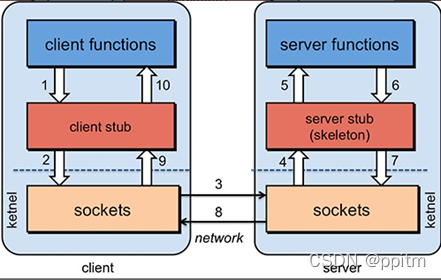

# 一、分布式系统概念
````
分布式系统是若干独立 计算机的集合，这些计算机对于用户来说就像单个相关系统。

老式系统(单一应用架构)就是把一个系统，统一放到一个服务器当中然后每一个服务器上放一个系统，如果说要更新代码的话，每一个服务器上的系统都要重新去部署十分的麻烦。

而分布式系统就是将一个完整的系统拆分成多个不同的服务，然后在将每一个服务单独的放到一个服务器当中。
````
# 二、发展演变
````
单一应用架构 >>>> 垂直应用架构 >>>> 分布式服务架构 >>>> 流动计算架构
````

* 1、ORM
````
单一应用架构：一个项目装到一个服务器当中，也可以运行多个服务器每一个服务器当中都装一个项目。
缺点：1.如果要添加某一个功能的话就要把一个项目重新打包，在分别部署到每一个服务器当中去。2.如果后期项目越来越大的话单台服务器跑一个项目压力会很大的。会不利于维护，开发和程序的性能。
````
* 2、MVC
````
垂直应用架构：将应用切割成几个互不相干的小应用，在将每个小应用独立放到一个服务器上，如果哪一个应用的访问数量多就多加几台服务器。
````
* 3、分布式服务架构

# 三、RPC简介
````
分布式应用架构(远程过程调用)：当垂直应用越来越多，应用之间交互不可避免，将核心业务抽取出来，作为独立的服务，逐渐形成稳定的服务中心，使前端应用能更快速的响应多变的市场需求。

RPC [ Remote Procedure Call]是指远程过程调用，是一种进程问通信方式，他是一种技术的思想，而不是规范。它允许程序调用另一个地址空间(通常是共享网络的另一台机器上)的过程或函数，而不用程序员显式编码这个远程调用的细节。即程序员无论是调用本地的还是远程的函数，本质上编写的调用代码基本相同。
RPC（Remote Procedure Call）—远程过程调用，它是一种通过网络从远程计算机程序上请求服务，而不需要了解底层网络技术的协议。也就是说两台服务器A，B，一个应用部署在A服务器上，想要调用B服务器上应用提供的方法，由于不在一个内存空间，不能直接调用，需要通过网络来表达调用的语义和传达调用的数据。
````
* 1、基本原理

````
1、Client像调用本地服务似的调用远程服务；
2、Client stub接收到调用后，将方法、参数序列化
3、客户端通过sockets将消息发送到服务端
4、Server stub 收到消息后进行解码（将消息对象反序列化）
5、Server stub 根据解码结果调用本地的服务
6、本地服务执行(对于服务端来说是本地执行)并将结果返回给Server stub
7、Server stub将返回结果打包成消息（将结果消息对象序列化）
8、服务端通过sockets将消息发送到客户端
9、Client stub接收到结果消息，并进行解码（将结果消息发序列化）
10、客户端得到最终结果。
````
* 2、RPC 调用分以下两种：
````
同步调用：客户方等待调用执行完成并返回结果。
异步调用：客户方调用后不用等待执行结果返回，但依然可以通过回调通知等方式获取返回结果。若客户方不关心调用返回结果，则变成单向异步调用，单向调用不用返回结果。
````
* 3、RPC步骤解析

* 4、SOA
````
流动计算架构：在分布式应用架构的基础上增加了一个调度、治理中心基于访问压力实时管理集群容量、提高集群的利用率，用于提高机器利用率的 资源调度和治理中心(SOA) 是关键 (不浪费计算机资源)
````
# 四、dubbo简介
````
Dubbo 是一款高性能、轻量级的开源Java RPC框架，它提供了三大核心能力：面向接口的远程方法调用，智能容错和负载均衡，服务自动注册和发现。分布式系统是将一个系统拆分为多个不同的服务
````
* 1、Dubbo特性一览

* 2、dubbo设计架构

````
服务提供者（Provider）：暴露服务的服务提供方，服务提供者在启动时，向注册中心注册自己提供的服务。
服务消费者（Consumer）: 调用远程服务的服务消费方，服务消费者在启动时，向注册中心订阅自己所需的服务，服务消费者，从提供者地址列表中，基于软负载均衡算法，选一台提供者进行调用，如果调用失败，再选另一台调用。
注册中心（Registry）：注册中心返回服务提供者地址列表给消费者，如果有变更，注册中心将基于长连接推送变更数据给消费者。
监控中心（Monitor）：服务消费者和提供者，在内存中累计调用次数和调用时间，定时每分钟发送一次统计数据到监控中心。
````
# 五、Dubbo的特性
* 1、服务注册中心
````
1、相比Hessian类RPC框架，Dubbo有自己的服务中心， 写好的服务可以注册到服务中心， 客户端从服务中心寻找服务，然后再到相应的服务提供者机器获取服务。通过服务中心可以实现集群、负载均衡、高可用(容错) 等重要功能。
2、服务中心一般使用zookeeper实现，也有redis和其他一些方式。以使用zookeeper作为服务中心为例，服务提供者启动后会在zookeeper的/dubbo节点下创建提供的服务节点，包含服务提供者ip、port等信息。服务提供者关闭时会从zookeeper中移除对应的服务。
3、服务使用者会从注册中心zookeeper中寻找服务，同一个服务可能会有多个提供者，Dubbo会帮我们找到合适的服务提供者，也就是针对服务提供者的负载均衡。
````
* 2、负载均衡
````
当同一个服务有多个提供者在提供服务时，客户端如何正确的选择提供者实 现负载均衡呢？dubbo也给我们提供了几种方案：
    1、random 随机选提供者，并可以给提供者设置权重
    2、roundrobin 轮询选择提供者
    3、leastactive 最少活跃调用数，相同活跃数的随机，活跃数：指调用前后计数差。使慢的提供者收到更少请求，因为越慢的提供者的调用前后计数差会越大。
    4、consistenthash 一致性hash，相同参数的请求发到同一台机器上。
````
* 3、简化测试，允许直连提供者
````
在开发阶段为了方便测试，通常系统客户端能指定调用某个服务提供者，那么可以在引用服务时加一个url参数去指定服务提供者。 配置如下：

<dubbo:reference id="xxxService"interface="com.alibaba.xxx.XxxService"url="dubbo://localhost:20890"/>
````
* 4、服务版本，服务分组
````
在Dubbo配置文件中可以通过制定版本实现连接制定提供者，也就是通过服务版本可以控制服务的不兼容升级；当同一个服务有多种实现时，可以使用服务分组进行区分。
````
# 六、dubbo环境搭建 ZooKeeper注册中心
* 1、搭建zookeeper注册中心环境
````
1、在zookeeper官网下载zookeeper
https://www.apache.org/dyn/closer.lua/zookeeper/zookeeper-3.7.2/apache-zookeeper-3.7.2-bin.tar.gz
2、将conf下的zoo_sample.cfg文件复制一份，将名字改为zoo.cfg
3、配置完毕后，在bin下启动zkServer服务端
zkServer
4、在另一cmd启动zkCli客户端
zkCli
````
* 2、zookeeper监控中心的配置
````
1、下载dubbo-admin
https://github.com/apache/dubbo-admin
2、前端构建
进入dubbo-admin-ui目录下
npm install
npm run dev
3、后端构建
进入dubbo-admin-server目录下
mvn  package -DskipTests
java -jar .\dubbo-admin-server-0.7.0-SNAPSHOT.jar
4、访问前端页面
http://localhost:38082
账号密码 在dubbo-admin-server\src\main\resources目录，找到 application.properties 配置文件
5、此时，我们zookeeper监控中心的配置完成。注意，要访问到监控中心，一定要启动zookeeper注册中心的启动类
````
# 七、Dubbo环境搭建，创建提供者、消费者项目
````
订单服务web模块 创建订单
用户服务service模块 查询用户地址

订单服务调用用户服务查询用户的所有收获地址
````
* 1、Dubbo服务提供消费者接口搭建


````
bean和接口放到一个公共的maven模块
````
````
public class UserAddress implements Serializable {
    private Integer id;
    private String userAddress; //用户地址
    private String userId; //用户id
    private String consignee; //收货人
    private String phoneNum; //电话号码
    private String isDefault; //是否为默认地址    Y-是     N-否

    public UserAddress() {
    }

    public UserAddress(Integer id, String userAddress, String userId, String consignee, String phoneNum, String isDefault) {
        this.id = id;
        this.userAddress = userAddress;
        this.userId = userId;
        this.consignee = consignee;
        this.phoneNum = phoneNum;
        this.isDefault = isDefault;
    }

    public Integer getId() {
        return id;
    }

    public void setId(Integer id) {
        this.id = id;
    }

    public String getUserAddress() {
        return userAddress;
    }

    public void setUserAddress(String userAddress) {
        this.userAddress = userAddress;
    }

    public String getUserId() {
        return userId;
    }

    public void setUserId(String userId) {
        this.userId = userId;
    }

    public String getConsignee() {
        return consignee;
    }

    public void setConsignee(String consignee) {
        this.consignee = consignee;
    }

    public String getPhoneNum() {
        return phoneNum;
    }

    public void setPhoneNum(String phoneNum) {
        this.phoneNum = phoneNum;
    }

    public String getIsDefault() {
        return isDefault;
    }

    public void setIsDefault(String isDefault) {
        this.isDefault = isDefault;
    }
}
````
````
public interface UserService {
    /**
     * 按照用户id返回所有的收货地址
     * @param userId
     * @return
     */
    public List<UserAddress> getUserAddressList(String userId);
}
````
````
public interface OrderService {

    /**
     * 初始化订单
     * @param userID
     */
    public void initOrder(String userID);
}
````
````
public class UserServiceImpl implements UserService {
    public List<UserAddress> getUserAddressList(String userId) {

        UserAddress address1 = new UserAddress(1, "河南省郑州巩义市宋陵大厦2F", "1", "安然", "150360313x", "Y");
        UserAddress address2 = new UserAddress(2, "北京市昌平区沙河镇沙阳路", "1", "情话", "1766666395x", "N");

        return Arrays.asList(address1,address2);
    }
}
````
````
public class OrderServiceImpl implements OrderService {
    public UserService userService;
    @Override
    public void initOrder(String userID) {
        // 查询用户的收获地址
        List<UserAddress> userAddressList = userService.getUserAddressList(userID);
        System.out.println(userAddressList);
    }
}
````
* 2、服务提供者配置及测试
````
在 user-service-provider 服务提供者项目中引入依赖
        <!-- dubbo-->
        <dependency>
            <groupId>com.alibaba</groupId>
            <artifactId>dubbo</artifactId>
            <version>2.6.2</version>
        </dependency>
        <!-- 注册中心使用的是zookeeper, 引入操作zookeeper的客户端-->
        <dependency>
            <groupId>org.apache.curator</groupId>
            <artifactId>curator-framework</artifactId>
            <version>2.12.0</version>
        </dependency>
````
````
在 user-service-provider 下的resource文件中创建provider.xml

<?xml version="1.0" encoding="UTF-8"?>
<beans xmlns="http://www.springframework.org/schema/beans"
       xmlns:xsi="http://www.w3.org/2001/XMLSchema-instance"
       xmlns:dubbo="http://code.alibabatech.com/schema/dubbo"
       xsi:schemaLocation="http://www.springframework.org/schema/beans http://www.springframework.org/schema/beans/spring-beans.xsd
		http://dubbo.apache.org/schema/dubbo http://dubbo.apache.org/schema/dubbo/dubbo.xsd
		http://code.alibabatech.com/schema/dubbo http://code.alibabatech.com/schema/dubbo/dubbo.xsd">
    <!-- 1、指定当前服务/应用的名字(同样的服务名, 不要和别的服务同名) -->
    <dubbo:application name="user-service-provider"></dubbo:application>
    <!-- 2、指定注册中心的位置-->
<!--    <dubbo:registry address="zookeeper://127.0.0.1:2181"></dubbo:registry>-->
    <dubbo:registry protocol="zookeeper" address="127.0.0.1:2181"></dubbo:registry>
    <!-- 3、指定通信规则(通信协议/通信端口)-->
    <dubbo:protocol name="dubbo" port="20880"></dubbo:protocol>
    <!-- 4、暴露服务, ref指向服务的真正的实现对象-->
    <dubbo:service interface="com.jch.gmall.service.UserService" ref="userServiceImpl"></dubbo:service>

    <!-- 服务的实现-->
    <bean id="userServiceImpl" class="com.jch.gmall.service.impl.UserServiceImpl"></bean>
</beans>
````
````
编写一个MainApplication启动类程序，运行测试配置
public class MainApplication {
    public static void main(String[] args) throws IOException {
        ClassPathXmlApplicationContext ioc = new ClassPathXmlApplicationContext("provider.xml");
        ioc.start();

        System.in.read();
    }
}
````
````
启动zookeeper注册中心的的zkServer.cmd、和zkCli.cmd服务
启动监控中心前后端
可以查看到 com.jch.gmall.service.UserService 已注册
````
* 3、服务消费者配置及测试
````
在 order-service-consumer 服务提供者项目中引入依赖
<!-- dubbo-->
<dependency>
    <groupId>com.alibaba</groupId>
    <artifactId>dubbo</artifactId>
    <version>2.6.2</version>
</dependency>
<!-- 注册中心使用的是zookeeper, 引入操作zookeeper的客户端-->
<dependency>
    <groupId>org.apache.curator</groupId>
    <artifactId>curator-framework</artifactId>
    <version>2.12.0</version>
</dependency>
````
````
在 order-service-consumer 下的resource文件中创建consumer.xml

<?xml version="1.0" encoding="UTF-8"?>
<beans xmlns="http://www.springframework.org/schema/beans"
       xmlns:xsi="http://www.w3.org/2001/XMLSchema-instance"
       xmlns:dubbo="http://code.alibabatech.com/schema/dubbo"
       xmlns:context="http://www.springframework.org/schema/context"
       xsi:schemaLocation="http://www.springframework.org/schema/beans http://www.springframework.org/schema/beans/spring-beans.xsd
		http://dubbo.apache.org/schema/dubbo http://dubbo.apache.org/schema/dubbo/dubbo.xsd
		http://code.alibabatech.com/schema/dubbo http://code.alibabatech.com/schema/dubbo/dubbo.xsd
		http://www.springframework.org/schema/context http://www.springframework.org/schema/context/spring-context-4.3.xsd">
    <context:component-scan base-package="com.jch.gmall.service.impl"></context:component-scan>

    <dubbo:application name="order-service-consumer"></dubbo:application>

    <dubbo:registry address="zookeeper://127.0.0.1:2181"></dubbo:registry>

    <!-- 声明需要调用的远程服务的接口, 生成远程服务代理-->
    <dubbo:reference interface="com.jch.gmall.service.UserService" id="userService"></dubbo:reference>
</beans>
````
````
编写一个MainApplication启动类程序，运行测试配置
public class MainApplication {
    public static void main(String[] args) throws IOException {
        ClassPathXmlApplicationContext applicationContext = new ClassPathXmlApplicationContext("consumer.xml");
        OrderService orderService = applicationContext.getBean(OrderService.class);
        orderService.initOrder("1");
        System.out.println("调用完成");
        System.in.read();
    }
}
````
````
启动服务提供者、消费者。及zookeeper的和dubbo-admin，查看监控信息。
````
# 八、与SpringBoot整合
* 1、boot-user-service-provider 服务提供者
````
导入依赖
    <parent>
        <groupId>org.springframework.boot</groupId>
        <artifactId>spring-boot-starter-parent</artifactId>
        <version>2.3.3.RELEASE</version>
        <relativePath/> <!-- lookup parent from repository -->
    </parent>

    <dependencies>
        <dependency>
            <groupId>org.springframework.boot</groupId>
            <artifactId>spring-boot-starter</artifactId>
        </dependency>

        <dependency>
            <groupId>com.jch</groupId>
            <artifactId>gmall-interface</artifactId>
            <version>0.0.1-SNAPSHOT</version>
        </dependency>
        <!-- 引入dubbo-starter-->
        <dependency>
            <groupId>com.alibaba.boot</groupId>
            <artifactId>dubbo-spring-boot-starter</artifactId>
            <version>0.2.0</version>
        </dependency>
    </dependencies>
````
````
服务提供者接口
public interface UserService {
    /**
     * 按照用户id返回所有的收货地址
     * @param userId
     * @return
     */
    public List<UserAddress> getUserAddressList(String userId);
}
````
````
服务提供者实现类
@com.alibaba.dubbo.config.annotation.Service //暴露服务
@Component
public class UserServiceImpl implements UserService {
    public List<UserAddress> getUserAddressList(String userId) {

        UserAddress address1 = new UserAddress(1, "河南省郑州巩义市宋陵大厦2F", "1", "安然", "150360313x", "Y");
        UserAddress address2 = new UserAddress(2, "北京市昌平区沙河镇沙阳路", "1", "情话", "1766666395x", "N");

        return Arrays.asList(address1,address2);
    }
}
````
````
配置 application.properties

dubbo.application.name=boot-user-service-provider
dubbo.registry.address=127.0.0.1:2181
dubbo.registry.protocol=zookeeper

dubbo.protocol.name=dubbo
dubbo.protocol.port=20880

dubbo.monitor.protocol=registry
````
````
BootProviderApplication 启动类配置
@EnableDubbo //开启基于注解的dubbo功能
@SpringBootApplication
public class BootProviderApplication {
    public static void main(String[] args) {
        SpringApplication.run(BootProviderApplication.class, args);
    }
}
````
* 2、boot-order-service-consumer 服务消费者
````
导入依赖
    <parent>
        <groupId>org.springframework.boot</groupId>
        <artifactId>spring-boot-starter-parent</artifactId>
        <version>2.3.3.RELEASE</version>
        <relativePath/> <!-- lookup parent from repository -->
    </parent>

    <dependencies>
        <dependency>
            <groupId>org.springframework.boot</groupId>
            <artifactId>spring-boot-starter</artifactId>
        </dependency>

        <dependency>
            <groupId>com.jch</groupId>
            <artifactId>gmall-interface</artifactId>
            <version>0.0.1-SNAPSHOT</version>
        </dependency>
        <!-- 引入dubbo-starter-->
        <dependency>
            <groupId>com.alibaba.boot</groupId>
            <artifactId>dubbo-spring-boot-starter</artifactId>
            <version>0.2.0</version>
        </dependency>
    </dependencies>
````
````
服务消费者接口
public interface OrderService {

    /**
     * 初始化订单
     * @param userID
     */
    public List<UserAddress> initOrder(String userID);
}
````
````
服务消费者实现类
@Service
public class OrderServiceImpl implements OrderService {
//    @Autowired
    @com.alibaba.dubbo.config.annotation.Reference //引用远程提供者服务
    public UserService userService;
    public List<UserAddress> initOrder(String userID) {
        System.out.println("用户id = " + userID);
        //查询用户的收货地址
        List<UserAddress> userAddressList = userService.getUserAddressList(userID);
        return userAddressList;
    }
}
````
````
创建 OrderController 控制器
@Controller
public class OrderController {

    @Autowired
    OrderService orderService;


    @RequestMapping("/initOrder")
    @ResponseBody
    public List<UserAddress> initOrder(@RequestParam("uid") String userId) {
        return orderService.initOrder(userId);
    }
}
````
````
配置 application.properties

server.port=8081 // 避免端口冲突

dubbo.application.name=boot-order-service-consumer

dubbo.registry.address=zookeeper://127.0.0.1:2181

dubbo.monitor.protocol=registry
````
````
BootProviderApplication 启动类配置
@EnableDubbo //开启基于注解的dubbo功能
@SpringBootApplication
public class BootProviderApplication {
    public static void main(String[] args) {
        SpringApplication.run(BootProviderApplication.class, args);
    }
}
````