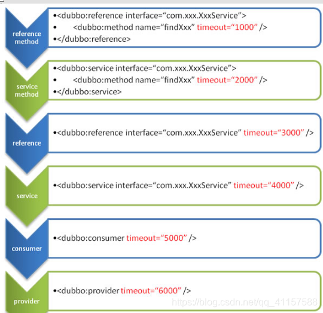

# 一、Dubbo配置
* 1、配置原则
````
JVM 启动 -D 参数优先，这样可以使用户在部署和启动时进行参数重写，比如在启动时需改变协议的端口。
XML 次之，如果在 XML 中有配置，则 dubbo.properties 中的相应配置项无效。
Properties 最后，相当于缺省值，只有 XML 没有配置时，dubbo.properties 的相应配置项才会生效，通常用于共享公共配置，比如应用名。
````
* 2、启动时检查
````
Dubbo 缺省会在启动时检查依赖的服务是否可用，不可用时会抛出异常，阻止 Spring 初始化完成，以便上线时，能及早发现问题，默认 check=“true”。

可以通过 check=“false” 关闭检查，比如，测试时，有些服务不关心，或者出现了循环依赖，必须有一方先启动。

另外，如果你的 Spring 容器是懒加载的，或者通过 API 编程延迟引用服务，请关闭 check，否则服务临时不可用时，会抛出异常，拿到 null 引用，如果 check=“false”，总是会返回引用，当服务恢复时，能自动连上。
````
````
<!--关闭某个服务的启动时检查-->
<dubbo:reference interface="com.jch.gmall.service.UserService" id="userService" check="false"></dubbo:reference>

<!--配置当前消费者的统一规则,当前所有的服务都不启动时检查-->
<dubbo:consumer check="false"></dubbo:consumer>
添加后，即使服务提供者不启动，启动当前的消费者，也不会出现错误。

<!--关闭注册中心启动时检查-->
<dubbo:registry address="zookeeper://127.0.0.1:2181"></dubbo:registry>
````
* 3、全局超时配置
````
指定接口以及特定方法超时配置
<dubbo:reference interface="com.jch.gmall.service.UserService" id="userService" timeout="5000">
    <dubbo:method name="getUserAddressList" timeout="1000" />
</dubbo:reference>

全局超时配置
<dubbo:provider timeout="5000" />
````
* 4、配置的覆盖规则
````
1、方法级配置别优于接口级别，即小Scope优先
2、Consumer端配置 优于 Provider配置 优于 全局配置，
3、最后是Dubbo Hard Code的配置值（见配置文档）
````

* 5、重试次数
````
retries="3" 重试次数为3, 不包含第一次调用
幂等(设置重试次数)[查询、删除、修改] 非幂等(不能设置重试次数)[新增]
````
* 6、多版本控制
````
provider.xml

<dubbo:service interface="com.jch.gmall.service.UserService" ref="userServiceImpl" version="1.0.0"></dubbo:service>
<dubbo:service interface="com.jch.gmall.service.UserService" ref="userServiceImpl" version="2.0.0"></dubbo:service>

<!-- 服务的实现-->
<bean id="userServiceImpl" class="com.jch.gmall.service.impl.UserServiceImpl"></bean>
<bean id="userServiceImpl" class="com.jch.gmall.service.impl.UserServiceImpl2"></bean>
````
````
consumer.xml
<!-- 服务消费者调用时，可自由配置版本-->
<!-- 声明需要调用的远程服务的接口, 生成远程服务代理-->
<dubbo:reference interface="com.jch.gmall.service.UserService" id="userService" version="2.0.0"></dubbo:reference>

<!-- *随机调用版本-->
<dubbo:reference interface="com.jch.gmall.service.UserService" id="userService" version="*"></dubbo:reference>
````
* 7、本地存根
````
public class UserServiceStub implements UserService {

    /**
     * 传入userService远程的代理对象
     */
    private final UserService userService;
    public UserServiceStub(UserService userService) {
        super();
        this.userService = userService;
    }

    @Override
    public List<UserAddress> getUserAddressList(String userId) {
        System.out.println("UserServiceStub");
        if (!StringUtils.isEmpty(userId)) {
            return userService.getUserAddressList(userId);
        }
        return null;
    }
}
````
````
<!-- 声明需要调用的远程服务的接口, 生成远程服务代理-->
<!-- 配置本地存根 stub-->
<dubbo:reference interface="com.jch.gmall.service.UserService" id="userService" stub="com.jch.gmall.service.impl.UserServiceStub"></dubbo:reference>
````
* 8、dubbo与springboot整合的三种方式
````
1、导入dubbo-starter, 与application.properties配置属性, 使用@Service[暴露服务]使用@Reference[消费服务]
2、保留dubbo xml配置文件, 导入dubbo-starter, 使用@ImportResource导入配置文件
3、使用 注解API的方式, 将每一个组件手动配置到容器中,让dubbo来扫描其他的组件
````
