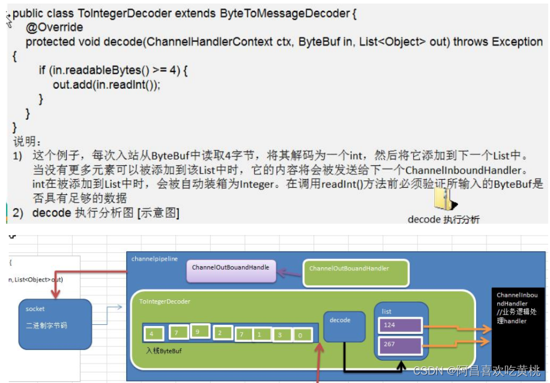

# 一、基本说明
````
1、netty 的组件设计：Netty 的主要组件有
    Channel
    EventLoop
    ChannelFuture
    ChannelHandler
    ChannelPipe 等
2、ChannelHandler 充当了处理入站和出站数据的应用程序逻辑的容器。例如，实现 ChannelInboundHandler 接口（或ChannelInboundHandlerAdapter），你就可以接收入站事件和数据，这些数据会被业务逻辑处理。当要给客户端发 送 响 应 时，也可以从ChannelInboundHandler冲刷数据 。
3、业务逻辑通常写在一个或者多个ChannelInboundHandler中。
4、ChannelOutboundHandler 原理一样，只不过它是用来处理出站数据的
5、ChannelPipeline 提供了 ChannelHandler 链的容器。
6 、以客户端应用程序为例，如果事件的运动方向是从客户端到服务端的，那么我们称这些事件为出站的即客户端发送给服务端的数据会通过 pipeline 中的一系列ChannelOutboundHandler，并被这些 Handler 处理，反之则称为入站的
````

# 二、编码解码器
````
当 Netty 发送或者接受一个消息的时候，就将会发生一次数据转换。
入站消息会被解码：从字节转换为另一种格式（比如 java 对象）；
如果是出站消息，它会被编码成字节。
```` 

````
Netty 提供一系列实用的编解码器，他们都实现了 ChannelInboundHadnler 或者ChannelOutboundHandler 接口。

在这些类中，channelRead 方法已经被重写了。
以入站为例，对于每个从入站 Channel 读取的消息，这个方法会被调用。（解码）
随后，它将调用由解码器所提供的 decode()方法进行解码，并将已经解码的字节转发给 ChannelPipeline中的下一个 ChannelInboundHandler。
````
# 三、解码器-ByteToMessageDecoder

````
由于不可能知道远程节点是否会一次性发送一个完整的信息，tcp 有可能出现粘包拆包的问题，这个类会对入站数据进行缓冲，直到它准备好被处理.
````
````
一个关于 ByteToMessageDecoder 实例分析
````

# 四、Netty 的 handler 链的调用机制
* 1、使用自定义的编码器和解码器来说明 Netty 的 handler 调用机制
````
客户端发送 long -> 服务器
服务端发送 long -> 客户端
````
````
编码器

import io.netty.buffer.ByteBuf;
import io.netty.channel.ChannelHandlerContext;
import io.netty.handler.codec.MessageToByteEncoder;

public class MyLongToByteEncoder extends MessageToByteEncoder<Long> {
    // 编码方法
    @Override
    protected void encode(ChannelHandlerContext ctx, Long msg, ByteBuf out) throws Exception {
        System.out.println("MyLongToByteEncoder 的 encode被调用");
        System.out.println("msg = " + msg);
        out.writeLong(msg);
    }
}
````
````
解码器

public class MyByteToLongDecoder extends ByteToMessageDecoder {

    /**
     * decode 会根据接收的数据, 被调用多次, 直到确定没有新的元素被添加到list,
     * 或者是ByteBuf 没有更多的可读字节为止
     * 如果list out 不为空, 就会将list的内容传给下一个ChannelInboundHandler处理
     * 该处理器的方法也会被调用多次
     * @param ctx 上下文对象
     * @param in 入站的 ByteBuf
     * @param out List, 将解码后的数据传给下一个Handler处理
     * @throws Exception
     */
    @Override
    protected void decode(ChannelHandlerContext ctx, ByteBuf in, List<Object> out) throws Exception {

        System.out.println("MyByteToLongDecoder 被调用");
        // Long 为8个字节, 需要判断有八个字节, 才能读取一个Long
        if (in.readableBytes() >= 8) {
            out.add(in.readLong());
        }
    }
}

````
````
服务端业务处理器

public class MyServerHandler extends SimpleChannelInboundHandler<Long> {
    @Override
    protected void channelRead0(ChannelHandlerContext ctx, Long msg) throws Exception {
        System.out.println("从客户端 " + ctx.channel().remoteAddress() + " 读取到Long " + msg);

        // 给客户端发送一个Long
        ctx.writeAndFlush(98765L);
    }

    @Override
    public void exceptionCaught(ChannelHandlerContext ctx, Throwable cause) throws Exception {
        cause.printStackTrace();
        ctx.close();
    }
}
````
````
服务端初始化方法

public class MyServerInitializer extends ChannelInitializer<SocketChannel> {
    @Override
    protected void initChannel(SocketChannel socketChannel) throws Exception {
        ChannelPipeline pipeline = socketChannel.pipeline();
        // 入站的Handler进行解码 MyByteToLongDecoder
        pipeline.addLast(new MyByteToLongDecoder());
        // 出站的Handler进行编码
        pipeline.addLast(new MyLongToByteEncoder());
        // 自定义Handler处理业务逻辑
        pipeline.addLast(new MyServerHandler());
    }
}
````
````
客户端业务处理器

public class MyClientHandler extends SimpleChannelInboundHandler<Long> {
    @Override
    protected void channelRead0(ChannelHandlerContext ctx, Long msg) throws Exception {
        System.out.println("从服务器 " + ctx.channel().remoteAddress() + " 读取到Long " + msg);
    }

    // 重写channelActive 发送数据
    @Override
    public void channelActive(ChannelHandlerContext ctx) throws Exception {
        System.out.println("MyClientHandler 发送数据");
        ctx.writeAndFlush(123456L); // 发送Long

        /**
         * 1、"abcdabcdabcdabcd" 是 16个字节
         * 2、该处理器的前一个handler 是 MyLongToByteEncoder
         * 3、MyLongToByteEncoder 父类 MessageToByteEncoder
         * 4、父类 MessageToByteEncoder
         *     public void write(ChannelHandlerContext ctx, Object msg, ChannelPromise promise) throws Exception {
         *         ByteBuf buf = null;
         *
         *         try {
         *             if (this.acceptOutboundMessage(msg)) { // 判断当前msg 是不是应该处理的类型
         *                 I cast = msg;
         *                 buf = this.allocateBuffer(ctx, msg, this.preferDirect);
         *
         *                 try {
         *                     this.encode(ctx, cast, buf);
         *                 } finally {
         *                     ReferenceCountUtil.release(msg);
         *                 }
         *
         *                 if (buf.isReadable()) {
         *                     ctx.write(buf, promise);
         *                 } else {
         *                     buf.release();
         *                     ctx.write(Unpooled.EMPTY_BUFFER, promise);
         *                 }
         *
         *                 buf = null;
         *             } else {
         *                 ctx.write(msg, promise);
         *             }
         *         } catch (EncoderException var17) {
         *             throw var17;
         *         } catch (Throwable var18) {
         *             throw new EncoderException(var18);
         *         } finally {
         *             if (buf != null) {
         *                 buf.release();
         *             }
         *
         *         }
         *
         *     }
         * 5、因此在编写 Encoder时 传入的数据类型和处理的数据类型一致
         */
        // ctx.writeAndFlush(Unpooled.copiedBuffer("abcdabcdabcdabcd", CharsetUtil.UTF_8));
    }
}
````
````
客户端初始化方法

public class MyClientInitializer extends ChannelInitializer<SocketChannel> {

    @Override
    protected void initChannel(SocketChannel socketChannel) throws Exception {

        ChannelPipeline pipeline = socketChannel.pipeline();

        // 加入一个出站的handler 对数据进行一个编码
        pipeline.addLast(new MyLongToByteEncoder());
        // 入站的Handler进行解码
        pipeline.addLast(new MyByteToLongDecoder());
        // 加入一个自定义的handler, 处理业务
        pipeline.addLast(new MyClientHandler());
    }
}
````
````
服务端

public class MyServer {
    public static void main(String[] args) throws Exception{

        EventLoopGroup bossGroup = new NioEventLoopGroup(1);
        EventLoopGroup workerGroup = new NioEventLoopGroup();
        try {

            ServerBootstrap serverBootstrap = new ServerBootstrap();
            serverBootstrap.group(bossGroup, workerGroup)
                    .channel(NioServerSocketChannel.class)
                    .childHandler(new MyServerInitializer());//自定义一个初始化类

            ChannelFuture channelFuture = serverBootstrap.bind(7000).sync();
            channelFuture.channel().closeFuture().sync();
        } finally {
            bossGroup.shutdownGracefully();
            workerGroup.shutdownGracefully();
        }
    }
}
````
````
客户端

public class MyClient {
    public static void main(String[] args) throws Exception{
        EventLoopGroup group = new NioEventLoopGroup();

        try {
            Bootstrap bootstrap = new Bootstrap();
            bootstrap.group(group)
                    .channel(NioSocketChannel.class)
                    .handler(new MyClientInitializer()); // 自定义一个初始化类

            ChannelFuture channelFuture = bootstrap.connect("localhost", 7000).sync();
            channelFuture.channel().closeFuture().sync();
        } finally {
            group.shutdownGracefully();
        }
    }
}
````
* 2、客户端发送 UnpooledByteBuf -> 服务器, 服务器用Long接收
````
public class MyClientHandler extends SimpleChannelInboundHandler<Long> {
    @Override
    protected void channelRead0(ChannelHandlerContext ctx, Long msg) throws Exception {

    }

    // 重写channelActive 发送数据
    @Override
    public void channelActive(ChannelHandlerContext ctx) throws Exception {
        System.out.println("MyClientHandler 发送数据");
        // ctx.writeAndFlush(123456L); // 发送Long

        /**
         * 1、"abcdabcdabcdabcd" 是 16个字节
         * 2、该处理器的前一个handler 是 MyLongToByteEncoder
         * 3、MyLongToByteEncoder 父类 MessageToByteEncoder
         * 4、父类 MessageToByteEncoder
         *     public void write(ChannelHandlerContext ctx, Object msg, ChannelPromise promise) throws Exception {
         *         ByteBuf buf = null;
         *
         *         try {
         *             if (this.acceptOutboundMessage(msg)) { // 判断当前msg 是不是应该处理的类型
         *                 I cast = msg;
         *                 buf = this.allocateBuffer(ctx, msg, this.preferDirect);
         *
         *                 try {
         *                     this.encode(ctx, cast, buf);
         *                 } finally {
         *                     ReferenceCountUtil.release(msg);
         *                 }
         *
         *                 if (buf.isReadable()) {
         *                     ctx.write(buf, promise);
         *                 } else {
         *                     buf.release();
         *                     ctx.write(Unpooled.EMPTY_BUFFER, promise);
         *                 }
         *
         *                 buf = null;
         *             } else {
         *                 ctx.write(msg, promise);
         *             }
         *         } catch (EncoderException var17) {
         *             throw var17;
         *         } catch (Throwable var18) {
         *             throw new EncoderException(var18);
         *         } finally {
         *             if (buf != null) {
         *                 buf.release();
         *             }
         *
         *         }
         *
         *     }
         * 5、因此在编写 Encoder时 传入的数据类型和处理的数据类型一致
         */
        ctx.writeAndFlush(Unpooled.copiedBuffer("abcdabcdabcdabcd", CharsetUtil.UTF_8));
    }
}
````
* 3、Netty的handler链的调用机制

````
不论解码器 handler 还是编码器 handler 即接收的消息类型必须与待处理的消息类型一致，否则该 handler 不会被执行
在解码器进行数据解码时，需要判断缓存区(ByteBuf)的数据是否足够，否则接收到的结果会期望结果可能不一致
````
# 五、解码器-ReplayingDecoder
````
public abstract class ReplayingDecoder< S > extends ByteToMessageDecoder
ReplayingDecoder 扩展了 ByteToMessageDecoder 类，使用这个类， 我们不必调用 readableBytes() 方法。
参数 S指定了用户状态管理的类型，其中 Void 代表不需要状态管理
````
````
应用实例

使用 ReplayingDecoder 编写解码器，对前面的案例进行简化
public class MyByteToLongDecoder2 extends ReplayingDecoder<Void> {
    @Override
    protected void decode(ChannelHandlerContext ctx, ByteBuf in, List<Object> out) throws Exception {
        System.out.println("MyByteToLongDecoder2 被调用");
        //在 ReplayingDecoder 不需要判断数据是否足够读取，内部会进行处理判断
        out.add(in.readLong());
    }
}
````
````
ReplayingDecoder 使用方便，但它也有一些局限性：

并不 是 所 有 的 ByteBuf 操 作 都 被 支 持 ， 如 果 调 用 了 一 个 不 被 支 持 的 方 法 ， 将 会 抛 出 一 个UnsupportedOperationException。
ReplayingDecoder 在某些情况下可能稍慢于 ByteToMessageDecoder，例如网络缓慢并且消息格式复杂时，消息会被拆成了多个碎片，速度变慢
````
# 六、其它编解码器
````
1、LineBasedFrameDecoder：这个类在 Netty 内部也有使用，它使用行尾控制字符（\n 或者\r\n）作为分隔符来解析数据。
2、DelimiterBasedFrameDecoder：使用自定义的特殊字符作为消息的分隔符。
3、HttpObjectDecoder：一个 HTTP 数据的解码器
4、LengthFieldBasedFrameDecoder：通过指定长度来标识整包消息，这样就可以自动的处理黏包和半包消息。
````
# 七、Log4j 整合到 Netty
````
<dependency>
    <groupId>log4j</groupId>
    <artifactId>log4j</artifactId>
    <version>1.2.17</version>
</dependency>
<dependency>
    <groupId>org.slf4j</groupId>
    <artifactId>slf4j-api</artifactId>
    <version>1.7.25</version>
</dependency>
<dependency>
    <groupId>org.slf4j</groupId>
    <artifactId>slf4j-log4j12</artifactId>
    <version>1.7.25</version>
    <scope>test</scope>
</dependency>
<dependency>
    <groupId>org.slf4j</groupId>
    <artifactId>slf4j-simple</artifactId>
    <version>1.7.25</version>
    <scope>test</scope>
</dependency>
````
````
log4j.rootLogger=DEBUG, stdout
log4j.appender.stdout=org.apache.log4j.ConsoleAppender
log4j.appender.stdout.layout=org.apache.log4j.PatternLayout
log4j.appender.stdout.layout.ConversionPattern=[%p] %C{1} - %m%n
````