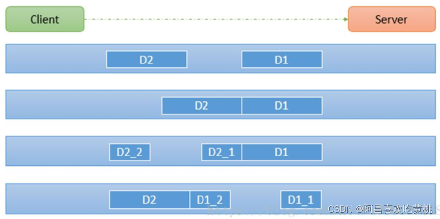

# 一、TCP 粘包和拆包基本介绍
````
1、TCP 是面向连接的，面向流的，提供高可靠性服务。
2、收发两端（客户端和服务器端）都要有一一成对的 socket，因此，发送端为了将多个发给接收端的包，更有效的发给对方，使用了优化方法（Nagle 算法），将多次间隔较小且数据量小的数据，合并成一个大的数据块，然后进行封包。
3、这样做虽然提高了效率，但是接收端就难于分辨出完整的数据包了，因为面向流的通信是无消息保护边界的
4、由于 TCP 无消息保护边界, 需要在接收端处理消息边界问题，也就是我们所说的粘包、拆包问题, 看一张图
5、示意图 TCP 粘包、拆包图解
````

````
对图的说明：

假设客户端分别发送了两个数据包 D1 和 D2 给服务端，由于服务端一次读取到字节数是不确定的，故可能存在以下四种情况：

服务端分两次读取到了两个独立的数据包，分别是 D1 和 D2，没有粘包和拆包
服务端一次接受到了两个数据包，D1 和 D2 粘合在一起，称之为 TCP 粘包
服务端分两次读取到了数据包，第一次读取到了完整的 D1 包和 D2 包的部分内容，第二次读取到了 D2 包的剩余内容，这称之为 TCP 拆包
服务端分两次读取到了数据包，第一次读取到了 D1 包的部分内容 D1_1，第二次读取到了 D1 包的剩余部分内容 D1_2 和完整的 D2 包。
````
# 二、TCP 粘包和拆包现象实例
````
服务端处理器

public class MyServerHandler extends SimpleChannelInboundHandler<ByteBuf> {
    private int count;
    @Override
    protected void channelRead0(ChannelHandlerContext ctx, ByteBuf msg) throws Exception {

        byte[] buffer = new byte[msg.readableBytes()];
        msg.readBytes(buffer);

        // 将buffer转成字符串
        String result = new String(buffer, Charset.forName("utf-8"));

        System.out.println("服务器端接收到数据 " + result);
        System.out.println("服务器端接收到消息量 = " + (++this.count));

        // 服务器回送数据给客户端
        ByteBuf response = Unpooled.copiedBuffer(UUID.randomUUID().toString() + " ", Charset.forName("utf-8"));
        ctx.writeAndFlush(response);
    }

    @Override
    public void exceptionCaught(ChannelHandlerContext ctx, Throwable cause) throws Exception {
        cause.printStackTrace();
        ctx.close();
    }
}
````
````
服务端初始花

public class MyServerInitializer extends ChannelInitializer<SocketChannel> {
    @Override
    protected void initChannel(SocketChannel socketChannel) throws Exception {
        ChannelPipeline pipeline = socketChannel.pipeline();
        pipeline.addLast(new MyServerHandler());
    }
}
````
````
服务端

public class MyServer {
    public static void main(String[] args) throws Exception{

        EventLoopGroup bossGroup = new NioEventLoopGroup(1);
        EventLoopGroup workerGroup = new NioEventLoopGroup();
        try {

            ServerBootstrap serverBootstrap = new ServerBootstrap();
            serverBootstrap.group(bossGroup, workerGroup)
                    .channel(NioServerSocketChannel.class)
                    .childHandler(new MyServerInitializer());//自定义一个初始化类

            ChannelFuture channelFuture = serverBootstrap.bind(7000).sync();
            channelFuture.channel().closeFuture().sync();
        } finally {
            bossGroup.shutdownGracefully();
            workerGroup.shutdownGracefully();
        }
    }
}
````
````
客户端处理器

public class MyClientHandler extends SimpleChannelInboundHandler<ByteBuf> {
    private int count;
    @Override
    public void channelActive(ChannelHandlerContext ctx) throws Exception {
        // 使用客户端发送10条数据 hello, server
        for (int i = 0; i < 10; i++) {
            ByteBuf byteBuf = Unpooled.copiedBuffer("hello, server" + i, Charset.forName("utf-8"));
            ctx.writeAndFlush(byteBuf);
        }
    }

    @Override
    protected void channelRead0(ChannelHandlerContext ctx, ByteBuf msg) throws Exception {
        byte[] buffer = new byte[msg.readableBytes()];
        msg.readBytes(buffer);
        String result = new String(buffer, Charset.forName("utf-8"));
        System.out.println("客户端接收到的消息 = " + result);
        System.out.println("客户端接收到的消息数量 = " + (++this.count));
    }

    @Override
    public void exceptionCaught(ChannelHandlerContext ctx, Throwable cause) throws Exception {
        cause.printStackTrace();
        ctx.close();
    }
}
````
````
客户端初始化

public class MyClientInitializer extends ChannelInitializer<SocketChannel> {
    @Override
    protected void initChannel(SocketChannel socketChannel) throws Exception {
        ChannelPipeline pipeline = socketChannel.pipeline();
        pipeline.addLast(new MyClientHandler());
    }
}
````
````
客户端

public class MyClient {
    public static void main(String[] args) throws Exception{
        EventLoopGroup group = new NioEventLoopGroup();

        try {
            Bootstrap bootstrap = new Bootstrap();
            bootstrap.group(group)
                    .channel(NioSocketChannel.class)
                    .handler(new MyClientInitializer()); // 自定义一个初始化类

            ChannelFuture channelFuture = bootstrap.connect("localhost", 7000).sync();
            channelFuture.channel().closeFuture().sync();
        } finally {
            group.shutdownGracefully();
        }
    }
}
````
# 三、TCP 粘包和拆包解决方案
````
使用自定义协议 + 编解码器 来解决
关键就是要解决 服务器端每次读取数据长度的问题, 这个问题解决，就不会出现服务器多读或少读数据的问题，从而避免的 TCP 粘包、拆包

具体的实例
1、要求客户端发送 5 个 Message 对象, 客户端每次发送一个 Message 对象
2、服务器端每次接收一个 Message, 分 5 次进行解码， 每读取到 一个 Message , 会回复一个 Message 对象 给客户端.
````
````
// 协议包
public class MessageProtocol {
    private int len;
    private byte[] content;

    public int getLen() {
        return len;
    }

    public void setLen(int len) {
        this.len = len;
    }

    public byte[] getContent() {
        return content;
    }

    public void setContent(byte[] content) {
        this.content = content;
    }
}
````
````
编码器
public class MyMessageEndocer extends MessageToByteEncoder<MessageProtocol> {
    @Override
    protected void encode(ChannelHandlerContext channelHandlerContext, MessageProtocol messageProtocol, ByteBuf byteBuf) throws Exception {
        System.out.println("MyMessageEndocer encode被调用");
        byteBuf.writeInt(messageProtocol.getLen());
        byteBuf.writeBytes(messageProtocol.getContent());
    }
}
````
````
解码器
public class MyMessageDecoder extends ReplayingDecoder<Void> {
    @Override
    protected void decode(ChannelHandlerContext ctx, ByteBuf in, List<Object> out) throws Exception {
        System.out.println("MyMessageDecoder decode 被调用");

        // 将得到的二进制字节码 -> MessageProtocol 数据包(对象)
        int length = in.readInt();
        byte[] bytes = new byte[length];
        in.readBytes(bytes);

        // 封装成MessageProtocol 放入out, 传递给下一个handler业务处理
        MessageProtocol messageProtocol = new MessageProtocol();
        messageProtocol.setLen(length);
        messageProtocol.setContent(bytes);

        out.add(messageProtocol);
    }
}
````
````
服务端业务处理handler
public class MyServerHandler extends SimpleChannelInboundHandler<MessageProtocol> {
    private int count;
    @Override
    protected void channelRead0(ChannelHandlerContext ctx, MessageProtocol msg) throws Exception {

        // 接收数据并处理
        int len = msg.getLen();
        byte[] content = msg.getContent();

        System.out.println("服务端接收到信息如下");
        System.out.println("长度 = " + len);
        System.out.println("内容 = " + new String(content, Charset.forName("utf-8")));

        System.out.println("服务器接收到消息包的数量 = " + (++this.count));
        // 回复消息
        String responseContent = UUID.randomUUID().toString();
        int responseLength = responseContent.getBytes("utf-8").length;
        MessageProtocol messageProtocol = new MessageProtocol();
        messageProtocol.setLen(responseLength);
        messageProtocol.setContent(responseContent.getBytes("utf-8"));
        ctx.writeAndFlush(messageProtocol);
    }

    @Override
    public void exceptionCaught(ChannelHandlerContext ctx, Throwable cause) throws Exception {
        cause.printStackTrace();
        ctx.close();
    }
}
````
````
服务端初始化
public class MyServerInitializer extends ChannelInitializer<SocketChannel> {
    @Override
    protected void initChannel(SocketChannel socketChannel) throws Exception {
        ChannelPipeline pipeline = socketChannel.pipeline();
        pipeline.addLast(new MyMessageDecoder()); //解码器
        pipeline.addLast(new MyMessageEndocer()); // 编码器
        pipeline.addLast(new MyServerHandler());
    }
}
````
````
服务端
public class MyServer {
    public static void main(String[] args) throws Exception{

        EventLoopGroup bossGroup = new NioEventLoopGroup(1);
        EventLoopGroup workerGroup = new NioEventLoopGroup();
        try {

            ServerBootstrap serverBootstrap = new ServerBootstrap();
            serverBootstrap.group(bossGroup, workerGroup)
                    .channel(NioServerSocketChannel.class)
                    .childHandler(new MyServerInitializer());//自定义一个初始化类

            ChannelFuture channelFuture = serverBootstrap.bind(7000).sync();
            channelFuture.channel().closeFuture().sync();
        } finally {
            bossGroup.shutdownGracefully();
            workerGroup.shutdownGracefully();
        }
    }
}
````
````
客户端业务处理handler
public class MyClientHandler extends SimpleChannelInboundHandler<MessageProtocol> {
    private int count;
    @Override
    public void channelActive(ChannelHandlerContext ctx) throws Exception {
        // 使用客户端发送10条数据 "今天天气冷, 吃火锅"
        for (int i = 0; i < 5; i++) {
            String msg = "今天天气冷, 吃火锅" + i;
            byte[] content = msg.getBytes(Charset.forName("utf-8"));
            int length = msg.getBytes(Charset.forName("utf-8")).length;

            MessageProtocol messageProtocol = new MessageProtocol();
            messageProtocol.setLen(length);
            messageProtocol.setContent(content);
            ctx.writeAndFlush(messageProtocol);
        }
    }

    @Override
    protected void channelRead0(ChannelHandlerContext ctx, MessageProtocol msg) throws Exception {
        int len = msg.getLen();
        byte[] content = msg.getContent();

        System.out.println("客户端接收到消息如下");
        System.out.println("长度 = " + len);
        System.out.println("内容 = " + new String(content, Charset.forName("utf-8")));

        System.out.println("客户端接收消息的数量 = " + (++this.count));
    }

    @Override
    public void exceptionCaught(ChannelHandlerContext ctx, Throwable cause) throws Exception {
        System.out.println("异常消息 = " + cause.getMessage());
        ctx.close();
    }
}
````
````
客户端初始化
public class MyClientInitializer extends ChannelInitializer<SocketChannel> {
    @Override
    protected void initChannel(SocketChannel socketChannel) throws Exception {
        ChannelPipeline pipeline = socketChannel.pipeline();
        pipeline.addLast(new MyMessageEndocer()); //加入编码器
        pipeline.addLast(new MyMessageDecoder()); //解码器
        pipeline.addLast(new MyClientHandler());
    }
}
````
````
客户端
public class MyClient {
    public static void main(String[] args) throws Exception{
        EventLoopGroup group = new NioEventLoopGroup();

        try {
            Bootstrap bootstrap = new Bootstrap();
            bootstrap.group(group)
                    .channel(NioSocketChannel.class)
                    .handler(new MyClientInitializer()); // 自定义一个初始化类

            ChannelFuture channelFuture = bootstrap.connect("localhost", 7000).sync();
            channelFuture.channel().closeFuture().sync();
        } finally {
            group.shutdownGracefully();
        }
    }
}
````