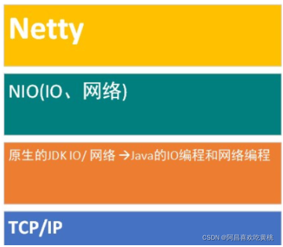

# 一、Netty的介绍
````
Netty 是由 JBOSS 提供的一个 Java 开源框架，现为 Github上的独立项目。

Netty 是一个异步的、基于事件驱动 的网络应用框架，用以快速开发高性能、高可靠性的网络 IO 程序。

Netty主要针对在TCP协议下，面向Clients端的高并发应用，或者Peer-to-Peer场景下的大量数据持续传输的应用。

Netty本质是一个NIO框架，适用于服务器通讯相关的多种应用场景

要透彻理解Netty ， 需要先学习 NIO ， 这样我们才能阅读 Netty 的源码。
````

# 二、Netty的应用场景
* 1、互联网行业
````
互联网行业：在分布式系统中，各个节点之间需要远程服务调用，高性能的 RPC 框架必不可少，Netty 作为异步高性能的通信框架，往往作为基础通信组件被这些 RPC 框架使用。

典型的应用有：阿里分布式服务框架 Dubbo 的 RPC 框架使用 Dubbo 协议进行节点间通信，Dubbo 协议默认使用 Netty 作为基础通信组件，用于实现各进程节点之间的内部通信
````
* 2、游戏行业
````
无论是手游服务端还是大型的网络游戏，Java 语言得到了越来越广泛的应用Netty 作为高性能的基础通信组件，提供了 TCP/UDP 和 HTTP 协议栈，方便定制和开发私有协议栈，账号登录服务器

地图服务器之间可以方便的通过 Netty 进行高性能的通信
````
* 3、大数据领域
````
经典的 Hadoop 的高性能通信和序列化组件 Avro 的 RPC 框架，默认采用 Netty 进行跨界点通信

它的 Netty Service 基于 Netty 框架二次封装实现。
````
# 三、Netty的学习参考资料
````
《Netty 权威指南》 是基于Netty5写的，可以作为参考，了解其思想
````