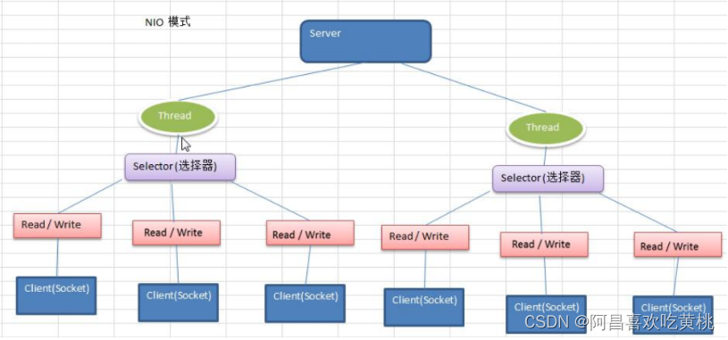

# 一、I/O 模型
* 1、I/O 模型简单的理解：就是用什么样的通道进行数据的发送和接收，很大程度上决定了程序通信的性能
* 2、Java 共支持 3 种网络编程模型/IO 模式：BIO、NIO、AIO
* 3、Java BIO(blocking I/O): 同步并阻塞(传统阻塞型)，服务器实现模式为一个连接一个线程，即客户端有连接请求时服务器端就需要启动一个线程进行处理，如果这个连接不做任何事情会造成不必要的线程开销

* 4、Java NIO(non-blocking I/O): 同步非阻塞，服务器实现模式为一个线程处理多个请求(连接)，即客户端发送的连接请求都会注册到多路复用器上，多路复用器轮询到连接有 I/O 请求就进行处理

* 5、Java AIO(NIO.2)(Asynchronous I/O): 异步非阻塞，AIO 引入异步通道的概念，采用了 Proactor 模式，简化了程序编写，有效的请求才启动线程，它的特点是先由操作系统完成后才通知服务端程序启动线程去处理，一般适用于连接数较多且连接时间较长的应用
# 二、BIO、NIO、AIO 适用场景分析
````
BIO	同步并阻塞  
    特点: 1、一个连接对应一个线程 2、线程开销大	
    适用场景: 连接数目比较小且固定的架构,服务器资源要求比较高,程序简单易理解
NIO	同步非阻塞  
    特点: 1、一个线程处理多个请求(连接) 2、多路复用器轮询到连接有 I/O 请求	
    适用场景: 连接数目多且连接比较短（轻操作）,比如聊天服务器，弹幕系统，服务器间通讯等。编程比较复杂
AIO	异步非阻塞  
    特点: 1、采用了 Proactor 模式	
    适用场景: 连接数较多且连接时间较长,比如相册服务器，充分调用 OS 参与并发操作，编程比较复杂
````
# 三、Java BIO 基本介绍
* 1、Java BIO 就是传统的 java io 编程，其相关的类和接口在 java.io
* 2、BIO(blocking I/O)： 同步阻塞，服务器实现模式为一个连接一个线程，即客户端有连接请求时服务器端就需要启动一个线程进行处理，如果这个连接不做任何事情会造成不必要的线程开销，可以通过线程池机制改善(实现多个客户连接服务器)。
* 3、BIO 方式适用于连接数目比较小且固定的架构，这种方式对服务器资源要求比较高，并发局限于应用中，JDK1.4以前的唯一选择，程序简单易理解
# 四、Java BIO 工作机制
````
对BIO 编程流程的梳理:

1、服务器端启动一个 ServerSocket
2、客户端启动 Socket 对服务器进行通信，默认情况下服务器端需要对每个客户建立一个线程与之通讯
3、客户端发出请求后, 先咨询服务器是否有线程响应，如果没有则会等待，或者被拒绝
4、如果有响应，客户端线程会等待请求结束后，在继续执行
````

# 五、Java BIO 应用实例
````
使用 BIO 模型编写一个服务器端，监听 6666 端口，当有客户端连接时，就启动一个线程与之通讯。
要求使用线程池机制改善，可以连接多个客户端.
服务器端可以接收客户端发送的数据(telnet 方式即可)。
````
````
import java.io.IOException;
import java.io.InputStream;
import java.net.ServerSocket;
import java.net.Socket;
import java.util.concurrent.ExecutorService;
import java.util.concurrent.Executors;

public class BIOServer {
    public static void main(String[] args) throws Exception {
        // 1、创建线程池
        ExecutorService newCachedThreadPool = Executors.newCachedThreadPool();
        // 2、创建ServerSocket
        ServerSocket serverSocket = new ServerSocket(6666);
        System.out.println("服务器启动了");
        // 3、如果有客户端连接, 就创建一个线程, 与之通讯(单独写一个方法)
        while (true) {
            // 监听, 等待客户端连接
            System.out.println("线程信息 id = " + Thread.currentThread().getId() +
                    "线程名字" + Thread.currentThread().getName());
            System.out.println("等待连接");
            final Socket socket = serverSocket.accept();
            System.out.println("连接到一个客户端");

            //创建一个线程
            Runnable command = () -> {
                byte[] bytes = new byte[1024];
                // 通过socket获取输入流
                try {
                    System.out.println("线程信息 id = " + Thread.currentThread().getId() +
                            "线程名字" + Thread.currentThread().getName());
                    InputStream inputStream = socket.getInputStream();
                    int len = -1;
                    System.out.println("read...");
                    while ((len = inputStream.read(bytes)) != -1) {
                        System.out.println("线程信息 id = " + Thread.currentThread().getId() +
                                "线程名字" + Thread.currentThread().getName());
                        String s = new String(bytes, 0, len);
                        System.out.println(s);
                    }
                } catch (IOException e) {
                    e.printStackTrace();
                } finally {
                    System.out.println("关闭和client的连接");

                    try {
                        socket.close();
                    } catch (IOException e) {
                        e.printStackTrace();
                    }
                }
            };
            newCachedThreadPool.execute(command);
        }
    }
}
````
# 六、Java BIO 问题分析
````
1、每个请求都需要创建独立的线程，与对应的客户端进行数据 Read，业务处理，数据 Write 。
2、当并发数较大时，需要创建大量线程来处理连接，系统资源占用较大。
3、连接建立后，如果当前线程暂时没有数据可读，则线程就阻塞在 Read 操作上，造成线程资源浪费
````
