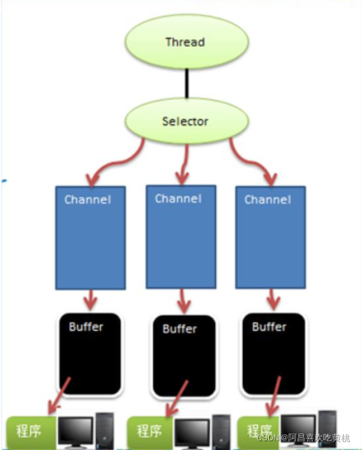
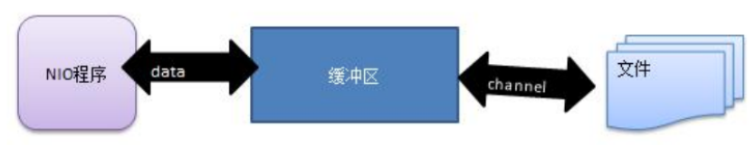
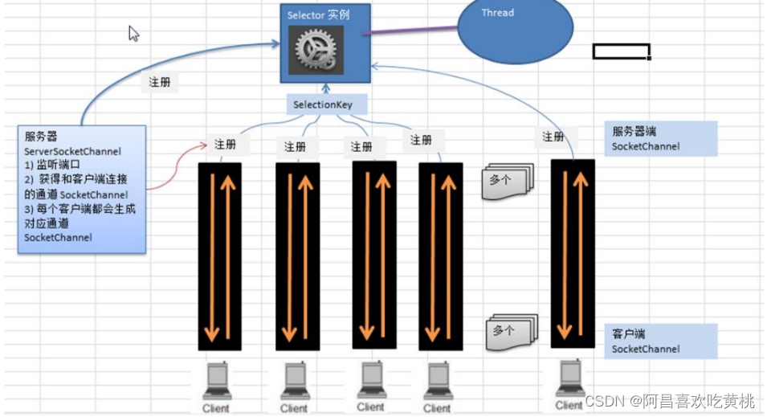
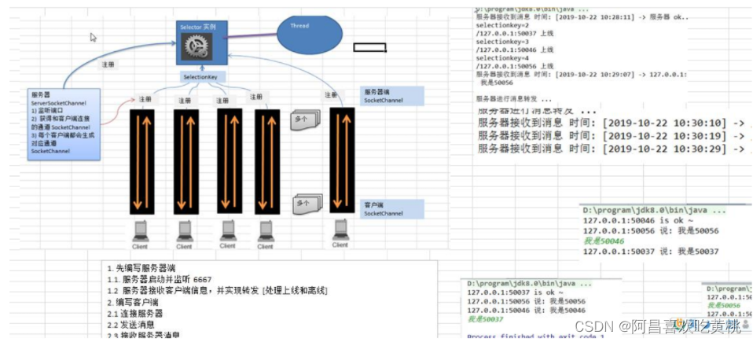

# 一、Java NIO 基本介绍
* 1、Java NIO 全称 java non-blocking IO，是指 JDK 提供的新 API。从 JDK1.4 开始，Java 提供了一系列改进的输入/输出的新特性，被统称为 NIO(即 New IO)，是同步非阻塞的
* 2、NIO 相关类都被放在 java.nio 包及子包下，并且对原 java.io 包中的很多类进行改写。
* 3、NIO 有三大核心部分：Channel( 通道)，Buffer( 缓冲区), Selector( 选择器)
* 4、NIO 是区面向缓冲区，向或者面向块编程的。数据读取到一个它稍后处理的缓冲区，需要时可在缓冲区中前后移动，这就增加了处理过程中的灵活性，使用它可以提供非阻塞式的高伸缩性网络
* 5、Java NIO 的非阻塞模式，使一个线程从某通道发送请求或者读取数据，但是它仅能得到目前可用的数据，如果目前没有数据可用时，就什么都不会获取，而不是保持线程阻塞，所以直至数据变的可以读取之前，该线程可以继续做其他的事情。 非阻塞写也是如此，一个线程请求写入一些数据到某通道，但不需要等待它完全写入，这个线程同时可以去做别的事情。
* 6、通俗理解：NIO 是可以做到用一个线程来处理多个操作的。 假设有 10000 个请求过来,根据实际情况，可以分配50 或者 100 个线程来处理。不像之前的阻塞 IO 那样，非得分配 10000 个。
* 7、HTTP2.0 使用了多路复用的技术，做到同一个连接并发处理多个请求，而且并发请求的数量比 HTTP1.1 大了好几个数量级
* 8、案例说明 NIO 的 Buffer
````
import java.nio.IntBuffer;

public class BasicBuffer {
    public static void main(String[] args) {

        // 举例说明Buffer 的使用(简单说明)
        // 创建一个Buffer, 大小为5, 即可以存放5个int
        IntBuffer intBuffer = IntBuffer.allocate(5);

        // 向Buffer 存放数据
        for (int i = 0; i < intBuffer.capacity(); i++) {
            intBuffer.put(i * 2);
        }

        // 从Buffer 读取数据
        // 将Buffer转换, 读写切换
        // 令 position = 0
        intBuffer.flip();

        while (intBuffer.hasRemaining()) {
            System.out.println(intBuffer.get());
        }
    }
}
````
# 二、NIO 和 BIO 的比较
* 1、BIO 以流的方式处理数据,而 NIO 以块的方式处理数据,块 I/O 的效率比流 I/O 高很多
* 2、BIO 是阻塞的，NIO 则是非阻塞的
* 3、BIO 基于字节流和字符流进行操作，而 NIO 基于 Channel(通道)和 Buffer(缓冲区)进行操作，数据总是从通道读取到缓冲区中，或者从缓冲区写入到通道中。Selector(选择器)用于监听多个通道的事件（比如：连接请求，数据到达等），因此使用单个线程就可以监听多个客户端通道
# 三、NIO 三大核心原理示意图

````
1、每个 channel 都会对应一个 Buffer
2、Selector 对应一个线程, 一个线程对应多个 channel(连接)
3、该图反应了有三个 channel 注册到 该 selector //程序
4、程序切换到哪个 channel 是由事件决定的, Event 就是一个重要的概念
5、Selector 会根据不同的事件, 在各个通道上切换
6、Buffer 就是一个内存块, 底层是有一个数组
7、数据的读取写入是通过 Buffer, 这个和 BIO, BIO 中要么是输入流, 或者是输出流, 不能双向, 但是 NIO 的 Buffer 是可以读也可以写, 需要 flip 方法切换
8、channel 是双向的, 可以返回底层操作系统的情况, 比如 Linux, 底层的操作系统通道就是双向的.
````
# 四、缓冲区(Buffer)
* 1、基本介绍
````
缓冲区(Buffer)本质上是一个可以读写数据的内存块，可以理解成是一个容器对象( 含数组)，该对象提供了一组方法，可以更轻松地使用内存块，，缓冲区对象内置了一些机制，能够跟踪和记录缓冲区的状态变化情况。Channel 提供从文件、网络读取数据的渠道，但是读取或写入的数据都必须经由 Buffer.
````

* 2、Buffer 类及其子类
````
1、在 NIO 中，Buffer 是一个顶层父类，它是一个抽象类, 类的层级关系图:
ShortBuffer (java.nio)
DoubleBuffer (java.nio)
FloatBuffer (java.nio)
CharBuffer (java.nio)
IntBuffer (java.nio)
Buffer (java.nio)
ByteBuffer (java.nio)
LongBuffer (java.nio)
````
````
2、Buffer 类定义了所有的缓冲区都具有的四个属性来提供关于其所包含的数据元素的信息:
private int mark = -1; // 标记
private int position = 0; // 位置, 下一个要被读或写的元素的索引,每次读写缓冲区数据时都会改变值,为下次读写作准备
private int limit; // 标识缓冲区的当前终点, 不能对缓冲区超过极限的位置进行读写操作。且极限是可以修改的。
private int capacity; // 容量, 即可以容纳最大数据量, 在缓冲区创建时被设定并且不能改变。
````
````
3、Buffer 类相关方法一览
// JDK1.4, 引入的api
public final int capacity() // 返回此缓冲区的容量
public final int position() // 返回此缓冲区的位置
public final Buffer position(int newPosition) // 设置此缓冲区的位置
public final int limit() // 返回此缓冲区的限制
public final Buffer limit(int newLimit) // 设置此缓冲区的限制
public final Buffer clear() // 清除此缓冲区, 即将各个标记恢复到初始状态, 但是数据并没有真正擦除
public final Buffer flip() // 反转此缓冲区
public final boolean hasRemaining() // 告知在当前位置和限制之间是否有元素
public abstract boolean isReadOnly() // 告知此缓冲区是否为只读缓冲区
// 以上是常用的
public final Buffer mark() // 在此缓冲区的位置设置标记
public final Buffer reset() // 将此缓冲区的位置重置为以前标记的位置
public final Buffer rewind() // 重绕此缓冲区
public final Buffer remaining() // 返回当前位置与限制之间的元素数

// JDK1.6引入的api
public abstract boolean hasArray() // 告知此缓冲区是否具有可访问的底层实现数组
public abstract Object array() // 返回此缓冲区的底层实现数组
// 以上两个是常用的
public abstract int arrayOffset() // 返回此缓冲区的底层实现数组中第一个缓冲区元素的偏移量
public abstract boolean isDirect() // 告知此缓冲区是否为直接缓冲区
````
* 3、ByteBuffer
````
public abstract class ByteBuffer extends Buffer implements Comparable<ByteBuffer>
{
    public static ByteBuffer allocateDirect(int capacity) // 创建直接缓冲区
    public static ByteBuffer allocate(int capacity) // 设置缓冲区的初始容量
    public static ByteBuffer wrap(byte[] array) // 把一个数组放到缓冲区中使用
    // 构造初始化位置offset和上界length的缓冲区
    public static ByteBuffer wrap(byte[] array, int offset, int length)
    // 缓存区相关API
    public abstract byte get(); // 从当前位置position上get, get之后, position会自动+1
    public abstract byte get(int index); // 从绝对位置get
    public abstract ByteBuffer put(byte b); // 从当前位置上普通, put之后, position会自动+1
    public abstract ByteBuffer put(int index, byte b); // 从绝对位置上put
}
````
# 五、通道(Channel)
* 1、基本介绍
````
1、NIO 的通道类似于流，但有些区别如下
    通道可以同时进行读写，而流只能读或者只能写
    通道可以实现异步读写数据
    通道可以从缓冲读数据，也可以写数据到缓冲

2、BIO 中的 stream 是单向的，例如 FileInputStream 对象只能进行读取数据的操作，而 NIO 中的通道(Channel)是双向的，可以读操作，也可以写操作。
3、Channel 在 NIO 中是一个接口 public interface Channel extends Closeable{}
4、常 用 的 Channel 类有 ：
    FileChannel
    DatagramChannel
    ServerSocketChannel // ServerSocketChannel 类似 ServerSocket
    SocketChannel // SocketChannel 类似 Socket
5、FileChannel 用于文件的数据读写，DatagramChannel 用于 UDP 的数据读写，ServerSocketChannel 和SocketChannel 用于 TCP 的数据读写。
````
* 2、FileChannel 类
````
public int read(ByteBuffer dst) ，从通道读取数据并放到缓冲区中
public int write(ByteBuffer src) ，把缓冲区的数据写到通道中
public long transferFrom(ReadableByteChannel src, long position, long count)，从目标通道中复制数据到当前通道
public long transferTo(long position, long count, WritableByteChannel target)，把数据从当前通道复制给目标通道
````
* 3、应用实例 1-本地文件写数据
````
实例要求:
    1、使用前面学习后的 ByteBuffer(缓冲) 和 FileChannel(通道)， 将 “hello,阿昌” 写入到 file01.txt 中
    2、文件不存在就创建
````
````
import java.io.FileOutputStream;
import java.nio.ByteBuffer;
import java.nio.channels.FileChannel;

public class NIOFileChannel01 {
    public static void main(String[] args) throws Exception {
        String str = "hello, jch";
        // 创建一个输出流 -> channel
        FileOutputStream fileOutputStream = new FileOutputStream("d:\\file01.txt");
        // 通过fileOutputStream获取对应的fileChannel
        FileChannel fileChannel = fileOutputStream.getChannel();
        // 创建一个缓冲区 ByteBuffer
        ByteBuffer byteBuffer = ByteBuffer.allocate(1024);
        // 将str 写入缓冲区
        byteBuffer.put(str.getBytes());
        // 翻转 byteBuffer
        byteBuffer.flip();
        // 将byteBuffer数据写入fileChannel
        fileChannel.write(byteBuffer);
        // 关闭流
        fileOutputStream.close();
    }
}
````
* 4、应用实例 2-本地文件读数据
````
实例要求:
    1、使用前面学习后的 ByteBuffer(缓冲) 和 FileChannel(通道)， 将 file01.txt 中的数据读入到程序，并显示在控制台屏幕
    2、假定文件已经存在
````
````
import java.io.File;
import java.io.FileInputStream;
import java.nio.ByteBuffer;
import java.nio.channels.FileChannel;

public class NIOFileChannel02 {
    public static void main(String[] args) throws Exception {

        // 创建文件的输入流
        File file = new File("d:\\file01.txt");
        FileInputStream fileInputStream = new FileInputStream(file);
        // 通过fileInputStrean 获取对应的FileChannel -> 实际类型 FileChannelImpl
        FileChannel fileChannel = fileInputStream.getChannel();
        // 创建缓冲区
        ByteBuffer byteBuffer = ByteBuffer.allocate((int) file.length());
        // 将通道数据读入到Buffer
        fileChannel.read(byteBuffer);
        // 将byteBuffer 的 字节数据 转成String
        System.out.println(new String(byteBuffer.array()));
    }
}
````
* 5、应用实例 3-使用一个 Buffer 完成文件读取、写入
````
实例要求:
    1、使用 FileChannel(通道) 和 方法 read , write，完成文件的拷贝
    2、拷贝一个文本文件 1.txt , 放在项目下即可
````

````
import java.io.FileInputStream;
import java.io.FileOutputStream;
import java.nio.ByteBuffer;
import java.nio.channels.FileChannel;

public class NIOFileChannel03 {
    public static void main(String[] args) throws Exception {

        FileInputStream fileInputStream = new FileInputStream("1.txt");
        FileChannel fileChannel01 = fileInputStream.getChannel();

        FileOutputStream fileOutputStream = new FileOutputStream("2.txt");
        FileChannel fileChannel02 = fileOutputStream.getChannel();

        ByteBuffer byteBuffer = ByteBuffer.allocate(512);

        while (true) {
            // 重要: 一定要清除
            byteBuffer.clear();
            int read = fileChannel01.read(byteBuffer);
            System.out.println(read);
            if ( read == -1) {// 表示读完
                break;
            }
            // 将数据写入 fileChannel02 -- 2.txt
            byteBuffer.flip();
            fileChannel02.write(byteBuffer);
        }

        // 关闭相关的流
        fileInputStream.close();
        fileOutputStream.close();
    }
}
````
* 6、应用实例 4-拷贝文件 transferFrom 方法
````
实例要求
    1、使用 FileChannel(通道) 和 方法 transferFrom ，完成文件的拷贝
    2、拷贝一张图片
````
````
import java.io.FileInputStream;
import java.io.FileOutputStream;
import java.nio.channels.FileChannel;

public class NIOFileChannel04 {
    public static void main(String[] args) throws Exception{

        // 创建相关流
        FileInputStream fileInputStream = new FileInputStream("d:\\a.png");
        FileOutputStream fileOutputStream = new FileOutputStream("d:\\a2.png");
        
        //获取流的fileChannel
        FileChannel sourceChannel = fileInputStream.getChannel();
        FileChannel destChannel = fileOutputStream.getChannel();

        // 使用transferForm完成拷贝
        destChannel.transferFrom(sourceChannel, 0, sourceChannel.size());

        fileInputStream.close();
        fileOutputStream.close();
    }
}
````
* 7、关于 Buffer 和 Channel 的注意事项和细节
````
1、ByteBuffer 支持类型化的 put 和 get, put 放入的是什么数据类型，get 就应该使用相应的数据类型来取出，否则可能有 BufferUnderflowException 异常
import java.nio.ByteBuffer;

public class BIOByteBufferPutGet {
    public static void main(String[] args) {

        // 创建一个Buffer
        ByteBuffer byteBuffer = ByteBuffer.allocate(64);

        // 类型化方式放入数据
        byteBuffer.putInt(100);
        byteBuffer.putLong(9);
        byteBuffer.putChar('吉');
        byteBuffer.putShort((short) 4);

        // 读取
        byteBuffer.flip();

        System.out.println(byteBuffer.getInt());
        System.out.println(byteBuffer.getLong());
        System.out.println(byteBuffer.getChar());
        System.out.println(byteBuffer.getShort());
    }
}
````
````
2、可以将一个普通 Buffer 转成只读 Buffer
public class ReadOnlyBuffer {
    public static void main(String[] args) {
        //创建一个 buffer
        ByteBuffer buffer = ByteBuffer.allocate(64);
        for(int i = 0; i < 64; i++) {//给其放入0-63个数字
            buffer.put((byte)i);
        }
        //读取
        buffer.flip();
        
        //得到一个只读的 Buffer
        ByteBuffer readOnlyBuffer = buffer.asReadOnlyBuffer();
        System.out.println(readOnlyBuffer.getClass());
        
        //读取
        while (readOnlyBuffer.hasRemaining()) {//判断是否还有数据
            System.out.println(readOnlyBuffer.get());//取出，并给position+1
        }
        
        //测试只能读取，不能在put写入
        readOnlyBuffer.put((byte)100); //ReadOnlyBufferException
    }
}
````
````
3、NIO 还提供了 MappedByteBuffer， 可以让文件直接在内存（堆外的内存）中进行修改， 而如何同步到文件由 NIO 来完成
import java.io.RandomAccessFile;
import java.nio.MappedByteBuffer;
import java.nio.channels.FileChannel;

/**
 * MappedByteBuffer 可以让文件直接在内存(堆外内存)修改, 操作系统不需要拷贝一次
 */
public class MappedByteBufferTest {
    public static void main(String[] args) throws Exception{
        RandomAccessFile randomAccessFile = new RandomAccessFile("1.txt", "rw");
        FileChannel fileChannel = randomAccessFile.getChannel();
        /**
         * 1、参数1: FileChannel.MapMode.READ_WRITE 读写模式
         * 2、参数2: 0, 可以直接修改的起始位置
         * 3、参数3: 5: 是映射到内存的大小, 即将 1.txt 的多少个字节映射到内存
         *              可以直接修改的范围就是 0-4
         * 4、实际类型: DirectByteBuffer
         */
        MappedByteBuffer mappedByteBuffer = fileChannel.map(FileChannel.MapMode.READ_WRITE, 0, 5);

        mappedByteBuffer.put(0, (byte) 'H');
        mappedByteBuffer.put(3, (byte) '9');
        mappedByteBuffer.put(5, (byte) 'Y');

        randomAccessFile.close();
        System.out.println("修改成功");
    }
}
````
````
4、NIO 还支持 通过多个 Buffer (即 Buffer 数组) 完成读写操作，即 Scattering 和Gathering
import java.net.InetSocketAddress;
import java.nio.ByteBuffer;
import java.nio.channels.ServerSocketChannel;
import java.nio.channels.SocketChannel;
import java.util.Arrays;

/**
 * Scattering: 将数据写入到buffer时, 可以采用buffer数组, 依次写入[分散]
 * Gathering: 从buffer读取数据时, 可以采用buffer数组,依次读
 */
public class ScatteringAndGatheringTest {
    public static void main(String[] args) throws Exception{

        // 使用 ServerSocketChannel 和 SocketChannel 网络
        ServerSocketChannel serverSocketChannel = ServerSocketChannel.open();
        InetSocketAddress inetSocketAddress = new InetSocketAddress(7000);

        // 绑定端口到Socket并启动
        serverSocketChannel.socket().bind(inetSocketAddress);

        // 创建buffer数组
        ByteBuffer[] byteBuffers = new ByteBuffer[2];
        byteBuffers[0] = ByteBuffer.allocate(5);
        byteBuffers[1] = ByteBuffer.allocate(3);

        // 等待客户端连接(telnet)
        SocketChannel socketChannel = serverSocketChannel.accept();
        int messageLength = 8;
        // 循环读取
        while (true) {
            int byteRead = 0;
            while (byteRead < messageLength) {
                long read = socketChannel.read(byteBuffers);
                byteRead += read;
                System.out.println("byteRead = " + byteRead);
                // 使用流打印, 看看当前这个buffer的position和limit
                Arrays.asList(byteBuffers).stream().map(byteBuffer -> "position = " + byteBuffer.position()
                + ", limit = " + byteBuffer.limit()).forEach(System.out::println);
            }

            // 将所有的buffer进行flip
            Arrays.asList(byteBuffers).forEach(byteBuffer -> byteBuffer.flip());

            // 将数据读出显示到客户端
            long byteWrite = 0;
            while (byteWrite < messageLength) {
                long write = socketChannel.write(byteBuffers);
                byteWrite += write;
            }

            // 将所有的byteBuffer 进行clear
            Arrays.asList(byteBuffers).forEach(byteBuffer -> byteBuffer.clear());
            System.out.println();

            System.out.println("byteRead = " + byteRead + " byteWrite = " + byteWrite
            + " messageLength = " + messageLength);
        }
    }
}
````
# 六、Selector(选择器)
* 1、基本介绍
````
1、Java 的 NIO，用非阻塞的 IO 方式。可以用一个线程，处理多个的客户端连接，就会使用到 Selector(选择器)
2、Selector 能够检测多个注册的通道上是否有事件发生(注意:多个 Channel 以事件的方式可以注册到同一个Selector)，如果有事件发生，便获取事件然后针对每个事件进行相应的处理。这样就可以只用一个单线程去管理多个通道，也就是管理多个连接和请求。
3、只有在 连接/通道 真正有读写事件发生时，才会进行读写，就大大地减少了系统开销，并且不必为每个连接都创建一个线程，不用去维护多个线程
4、避免了多线程之间的上下文切换导致的开销
````
.png)
````
1、Netty 的 IO 线程 NioEventLoop 聚合了 Selector(选择器，也叫多路复用器)，可以同时并发处理成百上千个客户端连接。
2、当线程从某客户端 Socket 通道进行读写数据时，若没有数据可用时，该线程可以进行其他任务。
3、线程通常将非阻塞 IO 的空闲时间用于在其他通道上执行 IO 操作，所以单独的线程可以管理多个输入和输出通道。
4、由于读写操作都是非阻塞的，这就可以充分提升 IO 线程的运行效率，避免由于频繁 I/O 阻塞导致的线程挂起。
5、一个 I/O 线程可以并发处理 N 个客户端连接和读写操作，这从根本上解决了传统同步阻塞 I/O 一连接一线程模型，架构的性能、弹性伸缩能力和可靠性都得到了极大的提升。
````
* 2、Selector 类相关方法
````
Selector 类是一个抽象类, 常用方法和说明如下:
public abstract class Selector implements Closeable {
    public static Selector open();// 得到一个选择器对象
    public int select(Long timeout);// 监控所有注册的通道, 其中有IO操作可以进行时, 将对应的SelectionKey加入到内部集合中并返回, 参数用来设置超时时间
    public abstract Set<SelectionKey> selectedKeys();// 从内部集合中得到所有的SelectionKey
}
````
* 3、注意事项
````
1、NIO 中的 ServerSocketChannel 功能类似 ServerSocket，SocketChannel 功能类似 Socket
2、selector 相关方法说明
    selector.select()//阻塞
    selector.select(1000);//阻塞 1000 毫秒，在 1000 毫秒后返回
    selector.wakeup();//唤醒 selector
    selector.selectNow();//不阻塞，立马返还
````
* 4、NIO非阻塞网络编程原理分析图

````
1、当客户端连接时，会通过 ServerSocketChannel 得到 SocketChannel
2、Selector 进行监听 select 方法, 返回有事件发生的通道的个数.
3、将 socketChannel 注册到 Selector 上, register(Selector sel, int ops), 一个 selector 上可以注册多个 SocketChannel
4、注册后返回一个 SelectionKey, 会和该 Selector 关联(集合)
5、进一步得到各个 SelectionKey (有事件发生)
6、在通过 SelectionKey 反向获取 SocketChannel channel()
7、可以通过 得到的 channel , 完成业务处理
````
````
import java.net.InetSocketAddress;
import java.nio.ByteBuffer;
import java.nio.channels.*;
import java.util.Iterator;
import java.util.Set;
// NIOServer：服务器
public class NIOServer {
    public static void main(String[] args) throws Exception{

        // 创建serverSocketChannel -> ServerSocket
        ServerSocketChannel serverSocketChannel = ServerSocketChannel.open();
        // 得到Selector对象
        Selector selector = Selector.open();
        // 绑定一个端口6666,在服务器端监听
        serverSocketChannel.socket().bind(new InetSocketAddress(6666));
        // 设置为非阻塞
        serverSocketChannel.configureBlocking(false);
        // 把serverSocketChannel注册到 selector 关心事件:OP_ACCEPT
        serverSocketChannel.register(selector, SelectionKey.OP_ACCEPT);
        // 循环等待客户端连接
        while (true) {
            // 等待1秒后, 如果没有事件发生, 返回
            if (selector.select(1000) == 0) {
                System.out.println("服务器等待了1秒, 无连接");
                continue;
            }

            // 如果返回的>0, 获取到相关的 SelectionKey集合
            // 1、如果返回的>0, 表示已经获取到关注的事件
            // 2、selector.selectedKeys() 返回关注事件的集合
            //      通过selectionKeys 反向获取通道
            Set<SelectionKey> selectionKeys = selector.selectedKeys();

            // 遍历 Set<SelectionKey>, 使用迭代器遍历
            Iterator<SelectionKey> keyIterator = selectionKeys.iterator();

            while (keyIterator.hasNext()) {
                // 获取到 SelectionKey
                SelectionKey key = keyIterator.next();
                // 根据key 对应的通道发生的事件做响应的处理
                if (key.isAcceptable()) {// 如果是OP_ACCEPT, 有新的客户端连接
                    // 给客户端生成SocketChannel
                    SocketChannel socketChannel = serverSocketChannel.accept();
                    System.out.println("客户端连接成功 生成了一个 socketChannel" + socketChannel.hashCode());
                    // 将socketChannel 设置为非阻塞的
                    socketChannel.configureBlocking(false);
                    // 将当前SocketChannel 注册到 selector, 关注事件为 OP_READ, 同时给SocketChannel关联Buffer
                    socketChannel.register(selector, SelectionKey.OP_READ, ByteBuffer.allocate(1024));
                }
                if (key.isReadable()) { //发生 OP_READ
                    // 通过key 反向获取到对应channel
                    SocketChannel channel = (SocketChannel) key.channel();
                    // 获取到该channel关联的buffer
                    ByteBuffer byteBuffer = (ByteBuffer) key.attachment();
                    channel.read(byteBuffer);
                    System.out.println("客户端发送" + new String(byteBuffer.array()));
                }
                // 手动集合中移除当前的selectionKey, 防止重复操作
                keyIterator.remove();
            }
        }
    }
}
````
````
NIOClient：客户端

import java.net.InetSocketAddress;
import java.nio.ByteBuffer;
import java.nio.channels.SocketChannel;

public class NIOClient {
    public static void main(String[] args) throws Exception{

        // 得到一个网络通道
        SocketChannel socketChannel = SocketChannel.open();
        // 设置非阻塞模式
        socketChannel.configureBlocking(false);
        InetSocketAddress inetSocketAddress = new InetSocketAddress("127.0.0.1", 6666);
        // 连接服务器
        if (!socketChannel.connect(inetSocketAddress)) {
            while (!socketChannel.finishConnect()) {
                System.out.println("因为连接需要事件, 客户端不会阻塞, 可以做其它工作");
            }
        }
        // 如果连接成功就发送数据
        String str = "hello, jch~";
        ByteBuffer byteBuffer = ByteBuffer.wrap(str.getBytes());
        // 发送数据, 将Buffer写入Channel
        socketChannel.write(byteBuffer);
        System.in.read();
    }
}
````
* 5、SelectionKey
````
1、SelectionKey，表示 Selector 和网络通道的注册关系
int OP_ACCEPT：有新的网络连接可以 accept，值为 16
int OP_CONNECT：代表连接已经建立，值为 8
int OP_READ：代表读操作，值为 1
int OP_WRITE：代表写操作，值为 4

public static final int OP_READ = 1 << 0;
public static final int OP_WRITE = 1 << 2;
public static final int OP_CONNECT = 1 << 3;
public static final int OP_ACCEPT = 1 << 4;

2、SelectionKey 相关方法
public abstract class SelectionKey {
    public abstract Selector selector(); //得到关联的Selector对象
    public abstract SelectableChannel channel(); // 得到关联的Channel
    public final Object attachment(); // 得到与之关联的共享数据
    public abstract SelectoinKey interestOps(int ops); // 设置或改变监听事件
    public final boolean isAcceptable(); // 是否可以accept
    public final boolean isReadable(); // 是否可以读
    public final boolean isWritable(); // 是否可以写
}
````
* 6、ServerSocketChannel
````
ServerSocketChannel 在服务器端监听新的客户端 Socket 连接
public abstract class ServerSocketChannel extands AbstractSelectableChannel implements NetworkChannel {
    public static ServerSocketChannel open(); // 得到一个ServerSocketChannel通道
    public static ServerSocketChannel bind(SocketAddress local); // 设置服务器端口号
    public final SelectableChannel configureBlocking(boolean block); // 设置阻塞或非阻塞模式,false表示采用非阻塞模式
    public SocketChannel accept(); // 接受一个连接, 返回代表这个连接的通道对象
    public final SelectionKey register(Selector sel, int ops); // 注册一个选择器并设置监听事件
}
````
* 7、SocketChannel
````
SocketChannel，网络 IO 通道，具体负责进行读写操作。
NIO 把缓冲区的数据写入通道，或者把通道里的数据读到缓冲区。
public abstract class SocketChannel
    extends AbstractSelectableChannel
    implements ByteChannel, ScatteringByteChannel, GatheringByteChannel, NetworkChannel {
        public static SocketChannel open();// 得到一个SocketChannel通道
        public final SelectableChannel configureBlocking(boolean block); // 设置阻塞或非阻塞模式,false表示采用非阻塞模式
        public abstract boolean connect(SocketAddress remote); // 连接服务器
        public abstract boolean finishConnect(); //如果上面的方法连接失败, 接下来就要通过该方法完成连接操作
        public abstract int write(ByteBuffer src); // 往通道里写数据
        public abstract int read(ByteBuffer dst); // 从通道里读数据
        public final SelectionKey register(Selector sel, int ops, Object att); // 注册一个选择器并设置监听事件, 最后一个参数可以设置共享数据
        public final void close(); // 关闭通道
}
````
* 8、 NIO 网络编程应用实例-群聊系统
````
实例要求
    1、编写一个 NIO 群聊系统，实现服务器端和客户端之间的数据简单通讯（非阻塞）
    2、实现多人群聊
    3、服务器端：可以监测用户上线，离线，并实现消息转发功能
    4、客户端：通过 channel 可以无阻塞发送消息给其它所有用户，同时可以接受其它用户发送的消息(有服务器转发得到)
    5、目的：进一步理解 NIO 非阻塞网络编程机制
````

````
import java.io.IOException;
import java.net.InetSocketAddress;
import java.nio.ByteBuffer;
import java.nio.channels.*;
import java.util.Iterator;

public class GroupChatServer {
    // 定义属性
    private Selector selector;
    private ServerSocketChannel listenChannel;
    private static final int PORT = 6667;

    // 构造器
    public GroupChatServer() {
        try {
            // 得到选择器
            selector = Selector.open();
            // 得到 ServerSocketChannel
            listenChannel = ServerSocketChannel.open();
            // 绑定端口
            listenChannel.socket().bind(new InetSocketAddress(PORT));
            // 设置非阻塞模式
            listenChannel.configureBlocking(false);
            // 注册到Selector
            listenChannel.register(selector, SelectionKey.OP_ACCEPT);

        } catch (IOException e) {
            e.printStackTrace();
        }
    }

    public void listen() {
        try{
            // 循环处理
            while (true) {
                //int select = selector.select(2*1000);
                int select = selector.select();
                if (select > 0) {// 有事件要处理
                    // 遍历得到的selectionKey集合
                    Iterator<SelectionKey> iterator = selector.selectedKeys().iterator();
                    while (iterator.hasNext()) {
                        // 取出selectionKey
                        SelectionKey selectionKey = iterator.next();
                        // 监听到accept
                        if (selectionKey.isAcceptable()) {
                            SocketChannel socketChannel = listenChannel.accept();
                            socketChannel.configureBlocking(false);
                            // 将该socketChannel注册到selector
                            socketChannel.register(selector, SelectionKey.OP_READ);
                            System.out.println(socketChannel.getRemoteAddress() + " 上线 ");
                        }
                        // 通道发送read事件,即可读
                        if (selectionKey.isReadable()) {
                            // 处理读
                            readData(selectionKey);
                        }

                        // 当前key删除,防止重复处理
                        iterator.remove();
                    }
                } else {
                    System.out.println("等待中...");
                }
            }
        } catch (Exception e) {
            e.printStackTrace();
        } finally {

        }
    }

    // 读取客户端消息
    private void readData(SelectionKey selectionKey) {
         //取到关联的SocketChannel
        SocketChannel socketChannel = null;

        try {
            // 得到channel
            socketChannel = (SocketChannel) selectionKey.channel();
            // 创建buffer
            ByteBuffer byteBuffer = ByteBuffer.allocate(1024);

            int count = socketChannel.read(byteBuffer);
            // 根据count的值做处理
            if (count > 0) {
                // 缓存区的数据转成字符串
                String msg = new String(byteBuffer.array()).trim();
                // 输出该消息
                System.out.println("from 客户端: " + msg);

                // 向其他客户端转发消息
                sendInfoToOtherClients(msg, socketChannel);
            }
        } catch (IOException e) {
            try {
                System.out.println(socketChannel.getRemoteAddress() + "离线了");
                // 取消注册
                selectionKey.cancel();
                //关闭通道
                socketChannel.close();
            } catch (IOException ex) {
                e.printStackTrace();
            }
        }
    }

    // 转发消息给其他客户(通道)
    private void sendInfoToOtherClients(String msg, SocketChannel fromChannel) throws IOException{
        System.out.println("服务器转发消息中...");
        for (SelectionKey key : selector.keys()) {
            // 取出通道
            Channel targetChannel = key.channel();
            // 排除自己
            if (targetChannel instanceof SocketChannel && targetChannel != fromChannel) {
                SocketChannel dest = (SocketChannel) targetChannel;
                // 将msg存到buffer
                ByteBuffer byteBuffer = ByteBuffer.wrap(msg.getBytes());
                // 将buffer数据写入到通道
                dest.write(byteBuffer);
            }
        }
    }

    public static void main(String[] args) {
        // 创建服务器对线
        GroupChatServer groupChatServer = new GroupChatServer();
        groupChatServer.listen();
    }
}
````
````
import java.io.IOException;
import java.net.InetSocketAddress;
import java.nio.ByteBuffer;
import java.nio.channels.SelectionKey;
import java.nio.channels.Selector;
import java.nio.channels.SocketChannel;
import java.util.Iterator;
import java.util.Scanner;
// 客户端
public class GroupChatClient {

    // 定义相关的属性
    private final String HOST = "127.0.0.1"; // 服务器的ip
    private final int PORT = 6667; // 服务器端口
    private Selector selector;
    private SocketChannel socketChannel;
    private String username;

    // 构造器, 完成初始化工作
    public GroupChatClient () throws IOException {
        selector = Selector.open();
        // 连接服务器
        socketChannel = SocketChannel.open(new InetSocketAddress(HOST, PORT));
        // 设置非阻塞
        socketChannel.configureBlocking(false);
        // 将 socketChannel 注册到 selector
        socketChannel.register(selector, SelectionKey.OP_READ);
        // 得到username
        username = socketChannel.getLocalAddress().toString().substring(1);
        System.out.println(username + " is ok...");

    }

    // 向服务器发送消息
    public void sendInfo(String info) {
        info = username + " 说: " + info;
        try {
            socketChannel.write(ByteBuffer.wrap(info.getBytes()));
        } catch (IOException e) {
            e.printStackTrace();
        }
    }

    // 读取从服务器端回复的数据
    public void readInfo() {
        try {
            int readChannels = selector.select();
            // 有可以用的通道
            if (readChannels > 0) {
                Iterator<SelectionKey> iterator = selector.selectedKeys().iterator();
                while (iterator.hasNext()) {
                    SelectionKey key = iterator.next();
                    if (key.isReadable()) {
                        // 得到相关的通道
                        SocketChannel sc = (SocketChannel) key.channel();
                        // 得到一个Buffer
                        ByteBuffer byteBuffer = ByteBuffer.allocate(1024);
                        // 读取
                        sc.read(byteBuffer);
                        // 把读到的缓冲区的数据转成字符串
                        String msg = new String(byteBuffer.array());
                        System.out.println(msg.trim());
                    }
                }
                iterator.remove();// 删除当前的selectionKey, 防止重复操作
            } else {
                //System.out.println("没有可用的通道...");
            }
        } catch (IOException e) {
            e.printStackTrace();
        }
    }

    public static void main(String[] args) throws Exception{
        // 启动客户端
        GroupChatClient groupChatClient = new GroupChatClient();
        // 启动一个线程, 每隔三秒, 读取从服务器发送数据
        new Thread() {
           public void run() {

               while (true) {
                   groupChatClient.readInfo();
                   try {
                        Thread.currentThread().sleep(3*1000);
                   } catch (InterruptedException e) {
                       e.printStackTrace();
                   }
               }
           }
        }.start();

        // 发送数据给服务器
        Scanner scanner = new Scanner(System.in);
        while (scanner.hasNextLine()) {
            String s = scanner.nextLine();
            groupChatClient.sendInfo(s);
        }
    }
}
````