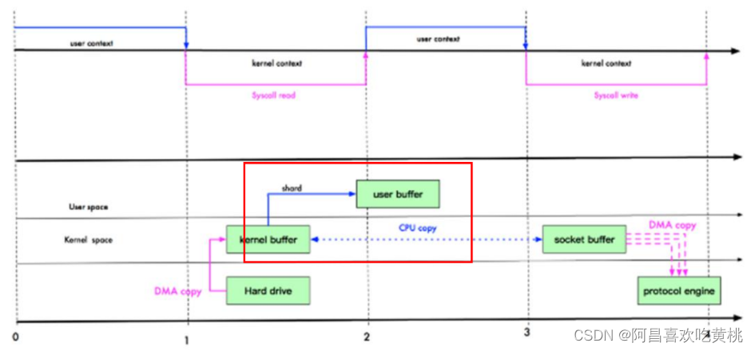
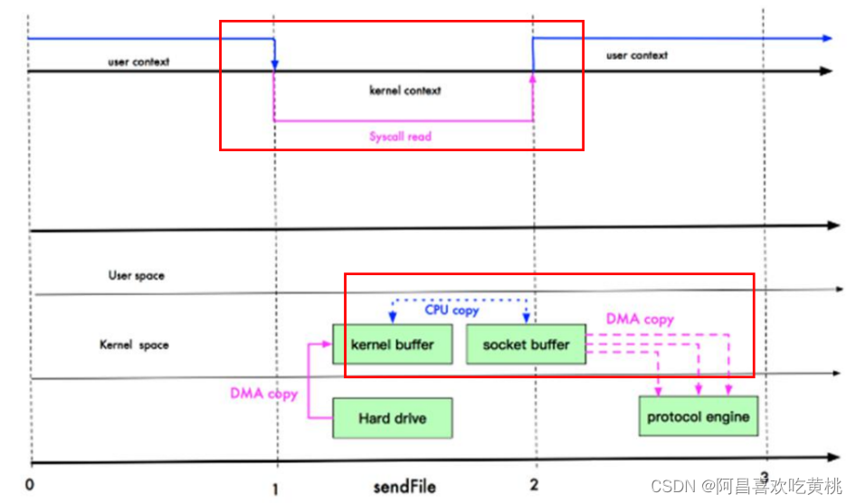
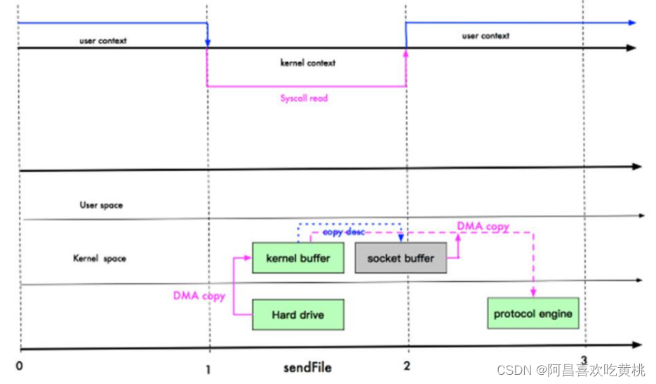

# 一、介绍
````
零拷贝是网络编程的关键，很多性能优化都离不开。
在 Java 程序中，常用的零拷贝有 mmap(内存映射) 和 sendFile。那么，他们在 OS 里，到底是怎么样的一个的设计？我们分析 mmap 和 sendFile 这两个零拷贝
另外我们看下 NIO 中如何使用零拷贝
````
# 二、传统 IO 模型
````
需要切换内核态用户态3次，拷贝4次
DMA: direct memory access 直接内存拷贝(不使用 CPU)
````

# 三、mmap 优化
````
mmap 通过内存映射，将 文件映射到内核缓冲区，同时， 用户空间可以共享内核空间的数据。
这样，在进行网络传输时，就可以减少内核空间到用户空间的拷贝次数。
但用户态&内核态的切换依然是3次
````

# 四、sendFile 优化
````
Linux 2.1 版本 提供了 sendFile 函数，其基本原理如下：
数据根本不经过用户态，直接从内核缓冲区进入到Socket Buffer，同时，由于和用户态完全无关，就减少了一次上下文切换
减少了1次用户态内核态的切换，减少1次拷贝次数
````

````
零拷贝从操作系统角度，是没有 cpu 拷贝
Linux 在 2.4 版本中，做了一些修改，避免了从 内核缓冲区拷贝到 Socket buffer 的操作，直接拷贝到协议栈，从而再一次减少了数据拷贝。
此时，用户态内核态切换次数2次，拷贝次数1次

这里其实有 一次 cpu 拷贝kernel buffer -> socket buffer
但是，拷贝的信息很少，比如 length , offset , 消耗低，可以忽略
````

# 五、零拷贝的再次理解
````
我们说零拷贝，是从操作系统的角度来说的。因为内核缓冲区之间，没有数据是重复的（只有 kernel buffer 有一份数据）。

零拷贝不仅仅带来更少的数据复制，还能带来其他的性能优势，例如更少的上下文切换，更少的 CPU 缓存伪共享以及无 CPU 校验和计算。
````
# 六、mmap 和 sendFile 的区别
````
mmap 适合小数据量读写，sendFile 适合大文件传输。
mmap 需要 4 次上下文切换，3 次数据拷贝；sendFile 需要 3 次上下文切换，最少 2 次数据拷贝。
sendFile 可以利用 DMA 方式，减少 CPU 拷贝，mmap 则不能（必须从内核拷贝到 Socket 缓冲区）。
````
# 七、NIO 零拷贝案例
````
案例要求
使用传统的 IO 方法传递一个大文件
使用 NIO 零拷贝方式传递(transferTo)一个大文件
看看两种传递方式耗时时间分别是多少
````
````
NewIOServer

import java.io.IOException;
import java.net.InetSocketAddress;
import java.net.ServerSocket;
import java.nio.ByteBuffer;
import java.nio.channels.ServerSocketChannel;
import java.nio.channels.SocketChannel;

public class NewIOServer {
    public static void main(String[] args) throws IOException {
        InetSocketAddress address = new InetSocketAddress(7001);
        ServerSocketChannel serverSocketChannel = ServerSocketChannel.open();
        ServerSocket socket = serverSocketChannel.socket();
        socket.bind(address);

        // 创建 buffer
        ByteBuffer byteBuffer = ByteBuffer.allocate(4096);
        while (true) {
            SocketChannel socketChannel = serverSocketChannel.accept();

            int readCount = 0;
            while (readCount != -1) {
                try {
                    readCount = socketChannel.read(byteBuffer);
                } catch (Exception e) {
                    //e.printStackTrace();
                    break;
                }
                // 倒带 position = 0 mark = -1 作废
                byteBuffer.rewind();
            }
        }
    }
}
````
````
NewIOClient

import java.io.FileInputStream;
import java.io.IOException;
import java.net.InetSocketAddress;
import java.nio.channels.FileChannel;
import java.nio.channels.SocketChannel;

public class NewIOClient {
    public static void main(String[] args) throws IOException {
        SocketChannel socketChannel = SocketChannel.open();
        socketChannel.connect(new InetSocketAddress("localhost",7001));
        String filename = "1.txt";

        // 得到文件channel
        FileChannel fileChannel = new FileInputStream(filename).getChannel();

        // 准备发送
        long startTime = System.currentTimeMillis();

        // 在linux下, 一个transferTo就可以完成传输
        // 在windows下, 一次调用 transferTo 只能发送8m, 就需要分段传输文件, 而且主要传输时的位置
        // transferTo 底层使用零拷贝
        long transferCount = fileChannel.transferTo(0, fileChannel.size(), socketChannel);
        System.out.println("发送的总字节数 = " + transferCount + " 耗时" + (System.currentTimeMillis() - startTime));
        // 关闭
        fileChannel.close();
    }
}
````