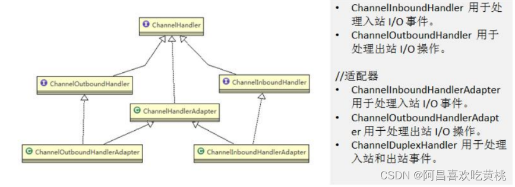
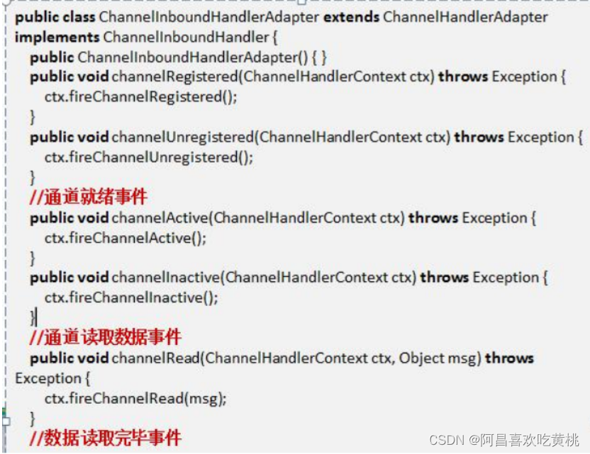
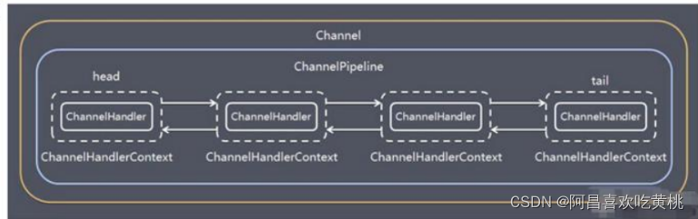
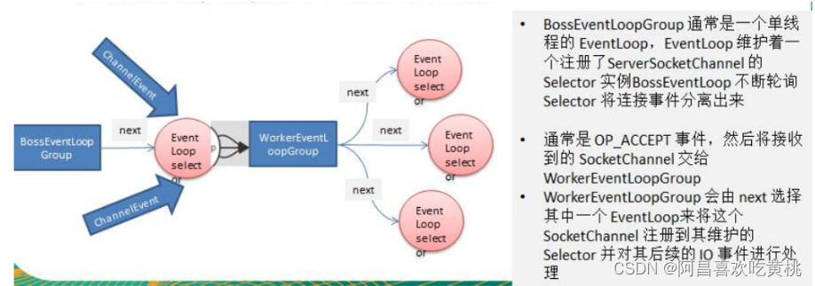

# 一、Bootstrap、ServerBootstrap
````
Bootstrap 意思是引导，一个 Netty 应用通常由一个 Bootstrap 开始，主要作用是配置整个 Netty 程序，串联各个组件Netty 中 :
    Bootstrap 类是客户端程序的启动引导类
    ServerBootstrap 是服务端启动引导类
````
````
常见的方法
public ServerBootstrap group(EventLoopGroup parentGroup, EventLoopGroup childGroup)，该方法用于服务器端，用来设置两个 EventLoop
public B group(EventLoopGroup group) ，该方法用于客户端，用来设置一个 EventLoop
public B channel(Class<? extends C> channelClass)，该方法用来设置一个服务器端的通道实现
public < T > B option(ChannelOption option, T value)，用来给 ServerChannel 添加配置
public < T > ServerBootstrap childOption(ChannelOption childOption, T value)，用来给接收到的通道添加配置
public ServerBootstrap childHandler(ChannelHandler childHandler)，该方法用来设置业务处理类（自定义的handler）针对WorkerGroup（干活的类）
public ServerBootstrap handler(ChannelHandler handler)针对BoosGroup（专门负责接收客户端请求的类）
public ChannelFuture bind(int inetPort) ，该方法用于服务器端，用来设置占用的端口号
public ChannelFuture connect(String inetHost, int inetPort) ，该方法用于客户端，用来连接服务器端
````
# 二、Future、ChannelFuture
````
Netty 中所有的 IO 操作都是异步的，不能立刻得知消息是否被正确处理。

但是可以过一会等它执行完成或者直接注册一个监听，具体的实现就是通过 Future 和 ChannelFutures，他们可以注册一个监听，当操作执行成功或失败时监听会自动触发注册的监听事件
常见的方法
    Channel channel()，返回当前正在进行 IO 操作的通道
    ChannelFuture sync()，等待异步操作 执行完毕
````
# 三、Channel
````
1、Netty 网络通信的组件，能够用于执行网络 I/O 操作。
2、通过 Channel 可获得当前网络连接的通道的状态
3、通过 Channel 可获得 网络连接的配置参数 （例如接收缓冲区大小）
4、Channel 提供异步的网络 I/O 操作(如建立连接，读写，绑定端口)，异步调用意味着任何 I/O 调用都将立即返回，并且不保证在调用结束时所请求的 I/O 操作已完成
5、调用立即返回一个 ChannelFuture 实例，通过注册监听器到 ChannelFuture 上，可以 I/O 操作成功、失败或取消时回调通知调用方
6、支持关联 I/O 操作与对应的处理程序
7、不同协议、不同的阻塞类型的连接都有不同的 Channel 类型与之对应，常用的 Channel 类型:
    NioSocketChannel，异步的客户端 TCP Socket 连接。
    NioServerSocketChannel，异步的服务器端 TCP Socket 连接。
    NioDatagramChannel，异步的 UDP 连接。
    NioSctpChannel，异步的客户端 Sctp 连接。
    NioSctpServerChannel，异步的 Sctp 服务器端连接，这些通道涵盖了 UDP 和 TCP 网络 IO 以及文件 IO。
````
# 四、Selector
````
1、Netty 基于 Selector 对象实现 I/O 多路复用，通过 Selector 一个线程可以监听多个连接的 Channel 事件。
2、当向一个 Selector 中注册 Channel 后，Selector 内部的机制就可以自动不断地查询(Select) 这些注册的Channel 是否有已就绪的 I/O 事件（例如可读，可写，网络连接完成等），这样程序就可以很简单地使用一个线程高效地管理多个 Channel
````
# 五、ChannelHandler 及其实现类
* 1、ChannelHandler 是一个接口，处理 I/O 事件或拦截 I/O 操作，并将其转发到其 ChannelPipeline(业务处理链)中的下一个处理程序。
* 2、ChannelHandler 本身并没有提供很多方法，因为这个接口有许多的方法需要实现，方便使用期间，可以继承它的子类
* 3、ChannelHandler 及其实现类一览图

* 4、我们经常需要自定义一个 Handler 类去继承 ChannelInboundHandlerAdapter
* 5、然后通过重写相应方法实现业务逻辑，我们接下来看看一般都需要重写哪些方法

# 六、Pipeline 和 ChannelPipeline
* 1、ChannelPipeline 是一个重点
````
1、ChannelPipeline 是一个 Handler 的集合
2、它负责处理和拦截 inbound 或者 outbound 的事件和操作，相当于一个贯穿 Netty 的链。(也可以这样理解：
ChannelPipeline 是 保存 ChannelHandler 的 List，用于处理或拦截Channel 的入站事件和出站操作)
3、ChannelPipeline 实现了一种高级形式的拦截过滤器模式，使用户可以完全控制事件的处理方式，以及 Channel中各个的 ChannelHandler 如何相互交互
4、在 Netty 中每个 Channel 都有且仅有一个 ChannelPipeline 与之对应，它们的组成关系如下
````

````
channel能拿到他对应的channelPipeline
channelPipeline也可以获取到对应的channel
channelPipeline中包含一个个的ChannelHandlerContext的双向链表
每个ChannelHandlerContext（保存 Channel 相关的所有上下文信息）里面包含对应具体的channelHandler
````
* 2、常用方法
````
ChannelPipeline addFirst(ChannelHandler… handlers)
把一个业务处理类（handler）添加到链中的第一个位置

ChannelPipeline addLast(ChannelHandler… handlers)
把一个业务处理类（handler）添加到链中的最后一个位置
````
# 七、ChannelHandlerContext
````
1、保存 Channel 相关的所有上下文信息，同时关联一个 ChannelHandler 对象
2、即 ChannelHandlerContext中包含一个具体的事件处理器ChannelHandler，同时ChannelHandlerContext中也绑定了对应的pipeline和Channel 的信息，方便ChannelHandler 进行调用。
3、常用方法
    ChannelFuture close(), //关闭通道
    ChannelOutboundInvoker flush(), //刷新
    ChannelFuture writeAndFlush(Object msg), //将数据写到ChannelPipeline中当前ChannelHandler的下一个ChannelHandler开始处理(出站)
````
# 八、ChannelOption
````
1、Netty 在创建 Channel 实例后,一般都需要设置 ChannelOption 参数。

2、ChannelOption 参数如下:

ChannelOption.SO_BACKLOG
对应 TCP/IP协议listen函数中的backlog参数, 用来初始化服务器可连接队列大小。服务端处理客户端连接请求是顺序处理的, 所以同一时间只能处理一个客户端连接。多个客户端来的时候, 服务端将不能处理的客户端连接请求放在队列中等待处理, backlog参数指定了队列大小

ChannelOption.SO_KEEPALIVE
一直保持连接活动状态
````
# 九、EventLoopGroup 和其实现类 NioEventLoopGroup
* 1、EventLoopGroup 是一组 EventLoop（就是对应线程） 的抽象，Netty 为了更好的利用多核 CPU 资源，一般会有多个 EventLoop同时工作，每个 EventLoop 维护着一个 Selector 实例。
* 2、EventLoopGroup 提供 next 接口，可以从组里面按照一定规则获取其中一个 EventLoop 来处理任务。
* 3、在 Netty服务器端编程中 ，我们一般 都 需 要 提 供 两 个 EventLoopGroup ， 例 如 ：
````
    EventLoopGroup bossGroup = new NioEventLoopGroup(1);
    EventLoopGroup workerGroup = new NioEventLoopGroup();
````
* 4、通常一个服务端口即一个 ServerSocketChannel 对应一个 Selector 和一个 EventLoop 线程。
* 5、服务端中，BossEventLoop 负责接收客户端的连接并将 SocketChannel 交给 WorkerEventLoopGroup 来进行 IO 处理

````
常用方法：

public NioEventLoopGroup()，构造方法
public Future<?> shutdownGracefully()，断开连接，关闭线程
````
# 十、Unpooled 类
````
1、Netty 提供一个专门用来操作缓冲区(即 Netty 的数据容器)的工具类
2、他内部维护了对应的readerIndex和writerIndex
3、相比NIO的ByteBuffer，Netty 提供的ByteBuf不用考虑flip反转去操作读写
4、public static ByteBuf copiedBuffer(CharSequence string, Charset charset)
//通过给定的数据和字符编码返回一个ByteBuf对象(类似于NIO中的ByteBbuffer但有区别)
````
````
案例1

import io.netty.buffer.ByteBuf;
import io.netty.buffer.Unpooled;

public class NettyByteBuf01 {

    public static void main(String[] args) {
        // 创建一个ByteBuf
        /**
         * 1、创建对象, 该对象包含一个数组arr, 是一个byte[10]
         * 2、在netty 的buffer中, 不需要使用flip进行反转
         *  底层维护了 readerIndex 和 writerIndex
         * 3、通过 readerIndex 和 writerIndex 和 capacity, 将buffer分成了三个区
         * 0 - readerIndex 已读区域
         * readerIndex - writerIndex 可读区域
         * writerIndex - capacity 可写区域
         */
        ByteBuf buffer = Unpooled.buffer(10);

        for (int i = 0; i < 10; i++) {
            buffer.writeByte(i);
        }

        System.out.println("capacity = " + buffer.capacity());// 10
        // 输出
        for (int i = 0; i < buffer.capacity(); i++) {
            System.out.println(buffer.getByte(i));
        }
        for (int i = 0; i < buffer.capacity(); i++) {
            System.out.println(buffer.readByte());
        }
    }
}
````
````
案例 2

import io.netty.buffer.ByteBuf;
import io.netty.buffer.Unpooled;
import java.nio.charset.Charset;

public class NettyByteBuf02 {
    public static void main(String[] args) {

        // 创建ByteBuf
        ByteBuf byteBuf = Unpooled.copiedBuffer("hello,world!", Charset.forName("utf-8"));

        // 使用相关的方法
        if (byteBuf.hasArray()) {
            byte[] content = byteBuf.array();

            // 将 content 转成字符串
            System.out.println(new String(content, Charset.forName("utf-8")).trim());

            System.out.println("byteBuf = " + byteBuf);

            System.out.println(byteBuf.arrayOffset());// 0
            System.out.println(byteBuf.readerIndex());// 0
            System.out.println(byteBuf.writerIndex());// 12
            System.out.println(byteBuf.capacity());// 36

            //System.out.println(byteBuf.readByte());
            System.out.println(byteBuf.getByte(0));// 104
            int len = byteBuf.readableBytes(); // 可读字节数 writerIndex - readerIndex
            System.out.println("len = " + len);

            // 使用for取出各个字节
            for (int i = 0; i < len; i++) {
                System.out.println((char) byteBuf.getByte(i));
            }
            System.out.println(byteBuf.getCharSequence(0, 4, Charset.forName("utf-8")));
        }
    }
}
````
# 十一、Netty 应用实例-群聊系统
````
实例要求

编写一个 Netty 群聊系统，实现服务器端和客户端之间的数据简单通讯（非阻塞）
实现多人群聊
服务器端：可以监测用户上线，离线，并实现消息转发功能
客户端：通过 channel 可以无阻塞发送消息给其它所有用户，同时可以接受其它用户发送的消息(有服务器转发得到)
目的：进一步理解 Netty 非阻塞网络编程机制
````
````
GroupChatServerHandler 服务端处理器

import io.netty.channel.Channel;
import io.netty.channel.ChannelHandlerContext;
import io.netty.channel.SimpleChannelInboundHandler;
import io.netty.channel.group.ChannelGroup;
import io.netty.channel.group.DefaultChannelGroup;
import io.netty.util.concurrent.GlobalEventExecutor;

import java.text.SimpleDateFormat;

public class GroupChatServerHandler extends SimpleChannelInboundHandler<String> {

    //定义一个channel组, 管理所有的channel
    private static ChannelGroup channelGroup = new DefaultChannelGroup(GlobalEventExecutor.INSTANCE);
    SimpleDateFormat sdf = new SimpleDateFormat("yyyy-MM-dd HH:mm:ss");

    // 表示连接建立, 一旦连接, 第一个被执行
    // 将当前channel加入到 channelGroup
    @Override
    public void handlerAdded(ChannelHandlerContext ctx) throws Exception {
        Channel channel = ctx.channel();
        // 将该客户加入聊天的信息推送给其它在线的客户端
        // 将channelGroup 中所有的channel 遍历, 并发送消息
        channelGroup.writeAndFlush("[客户端]" + channel.remoteAddress() + " 加入聊天"
                + sdf.format(new java.util.Date()) + "\n");
        channelGroup.add(channel);
    }

    // 断开连接, 将xx客户离开信息推送给当前在线的客户
    @Override
    public void handlerRemoved(ChannelHandlerContext ctx) throws Exception {
        Channel channel = ctx.channel();
        channelGroup.writeAndFlush("[客户端]" + channel.remoteAddress() + " 离开\n");
        System.out.println("channelGroup size = " + channelGroup.size());
    }

    //表示channel 处于活动状态, 提示 xx上线
    @Override
    public void channelActive(ChannelHandlerContext ctx) throws Exception {
        System.out.println(ctx.channel().remoteAddress() + "上线了\n");
    }

    //表示channel 处于不活动状态, 提示 xx下线
    @Override
    public void channelInactive(ChannelHandlerContext ctx) throws Exception {
        System.out.println(ctx.channel().remoteAddress() + "下线了\n");
    }
    // 读取数据
    @Override
    protected void channelRead0(ChannelHandlerContext ctx, String msg) throws Exception {
        Channel channel = ctx.channel();
        // 遍历channelGroup, 根据不同的情况, 回送不同的消息
        channelGroup.forEach(ch -> {
            if (ch != channel) { // 不是当前的channel, 转发
                ch.writeAndFlush("[客户]" + channel.remoteAddress() + "发给了消息" + msg + "\n");
            } else {
                ch.writeAndFlush("[自己]发送了消息" + msg + "\n");
            }
        });
    }

    @Override
    public void exceptionCaught(ChannelHandlerContext ctx, Throwable cause) throws Exception {
        // 关闭
        ctx.close();
    }
}
````
````
GroupChatServer 服务端启动

import io.netty.bootstrap.ServerBootstrap;
import io.netty.channel.*;
import io.netty.channel.nio.NioEventLoopGroup;
import io.netty.channel.socket.SocketChannel;
import io.netty.channel.socket.nio.NioServerSocketChannel;
import io.netty.handler.codec.string.StringDecoder;
import io.netty.handler.codec.string.StringEncoder;

public class GroupChatServer {

    private int port; // 监听端口

    public GroupChatServer(int port) {
        this.port = port;
    }

    // 编写run方法, 处理客户端的请求
    public void run() throws Exception {
        // 创建两个线程组
        EventLoopGroup bossGroup = new NioEventLoopGroup(1);
        EventLoopGroup workerGroup = new NioEventLoopGroup();

        try {
            ServerBootstrap bootstrap = new ServerBootstrap();
            bootstrap.group(bossGroup, workerGroup)
                    .channel(NioServerSocketChannel.class)
                    .option(ChannelOption.SO_BACKLOG, 128)
                    .childOption(ChannelOption.SO_KEEPALIVE, true)
                    .childHandler(new ChannelInitializer<SocketChannel>() {
                        @Override
                        protected void initChannel(SocketChannel socketChannel) throws Exception {
                            ChannelPipeline pipeline = socketChannel.pipeline();
                            // 向pipeline里加入一个解码器
                            pipeline.addLast("decoder", new StringDecoder());
                            // 向pipeline里加入一个编码器
                            pipeline.addLast("ebcoder", new StringEncoder());
                            // 加入自己的业务处理handler
                            pipeline.addLast(new GroupChatServerHandler());
                        }
                    });
            System.out.println("netty 服务器启动成功");
            ChannelFuture channelFuture = bootstrap.bind(port).sync();

            // 监听关闭事件
            channelFuture.channel().closeFuture().sync();
        } catch (InterruptedException e) {
            e.printStackTrace();
        } finally {
            bossGroup.shutdownGracefully();
            workerGroup.shutdownGracefully();
        }
    }

    public static void main(String[] args) throws Exception {
        new GroupChatServer(7000).run();
    }
}
````
````
GroupChatClientHandler 客户端处理器

import io.netty.channel.ChannelHandlerContext;
import io.netty.channel.SimpleChannelInboundHandler;

public class GroupChatClientHandler extends SimpleChannelInboundHandler<String> {
    @Override
    protected void channelRead0(ChannelHandlerContext channelHandlerContext, String msg) throws Exception {
        System.out.println(msg.trim());

    }
}
````
````
GroupChatClient 客户端启动

import io.netty.bootstrap.Bootstrap;
import io.netty.channel.*;
import io.netty.channel.nio.NioEventLoopGroup;
import io.netty.channel.socket.SocketChannel;
import io.netty.channel.socket.nio.NioSocketChannel;
import io.netty.handler.codec.string.StringDecoder;
import io.netty.handler.codec.string.StringEncoder;
import java.util.Scanner;

public class GroupChatClient {

    private final String host;
    private final int port;

    public GroupChatClient(String host, int port) {
        this.host = host;
        this.port = port;
    }

    public void run() throws Exception{
        EventLoopGroup group = new NioEventLoopGroup();
        try {
            Bootstrap bootstrap = new Bootstrap();
            bootstrap.group(group)
                    .channel(NioSocketChannel.class)
                    .handler(new ChannelInitializer<SocketChannel>() {
                        @Override
                        protected void initChannel(SocketChannel socketChannel) throws Exception {
                            ChannelPipeline pipeline = socketChannel.pipeline();
                            pipeline.addLast("decoder", new StringDecoder());
                            pipeline.addLast("encoder", new StringEncoder());
                            pipeline.addLast(new GroupChatClientHandler());
                        }
                    });
            ChannelFuture channelFuture = bootstrap.connect(host, port).sync();
            Channel channel = channelFuture.channel();
            System.out.println("------" + channel.localAddress() + "------");
            // 客户端需要输入信息
            Scanner scanner = new Scanner(System.in);
            while (scanner.hasNextLine()) {
                String msg = scanner.nextLine();
                channel.writeAndFlush(msg);
            }
        } catch (InterruptedException e) {
            e.printStackTrace();
        } finally {
            group.shutdownGracefully();
        }
    }

    public static void main(String[] args) throws Exception {
        new GroupChatClient("127.0.0.1", 7000).run();
    }
}
````
# 十二、Netty 心跳检测机制案例
````
1、编写一个 Netty 心跳检测机制案例, 当服务器超过 3 秒没有读时，就提示读空闲
2、当服务器超过 5 秒没有写操作时，就提示写空闲
3、实现当服务器超过 7 秒没有读或者写操作时，就提示读写空闲
````
````
MyServerHandler

import io.netty.channel.ChannelHandlerContext;
import io.netty.channel.ChannelInboundHandlerAdapter;
import io.netty.handler.timeout.IdleStateEvent;

public class MyServerHandler extends ChannelInboundHandlerAdapter {
    /**
     *
     * @param ctx 上下文
     * @param evt 事件
     * @throws Exception
     */
    @Override
    public void userEventTriggered(ChannelHandlerContext ctx, Object evt) throws Exception {
        if (evt instanceof IdleStateEvent) {
            // 将 evt 向下转型 IdleStateEvent
            IdleStateEvent event = (IdleStateEvent) evt;
            String eventType = null;
            switch (event.state()) {
                case READER_IDLE:
                    eventType = "读空闲";
                    break;
                case WRITER_IDLE:
                    eventType = "写空闲";
                    break;
                case ALL_IDLE:
                    eventType = "读写空闲";
                    break;
            }
            System.out.println(ctx.channel().remoteAddress() + "--超时事件发生--" + eventType);

            // 如果发生空闲, 我们关闭通道
            //ctx.channel().close();
        }
    }
}
````
````
MyServer

import io.netty.bootstrap.ServerBootstrap;
import io.netty.channel.ChannelFuture;
import io.netty.channel.ChannelInitializer;
import io.netty.channel.ChannelPipeline;
import io.netty.channel.EventLoopGroup;
import io.netty.channel.nio.NioEventLoopGroup;
import io.netty.channel.socket.SocketChannel;
import io.netty.channel.socket.nio.NioServerSocketChannel;
import io.netty.handler.logging.LogLevel;
import io.netty.handler.logging.LoggingHandler;
import io.netty.handler.timeout.IdleStateHandler;

import java.util.concurrent.TimeUnit;

public class MyServer {
    public static void main(String[] args) throws Exception{
        // 创建两个线程组
        EventLoopGroup bossGroup = new NioEventLoopGroup(1);
        EventLoopGroup workerGroup = new NioEventLoopGroup();
        try {
            ServerBootstrap serverBootstrap = new ServerBootstrap();
            serverBootstrap.group(bossGroup, workerGroup)
                    .channel(NioServerSocketChannel.class)
                    .handler(new LoggingHandler(LogLevel.INFO)) //在bossGroup增加日志处理器
                    .childHandler(new ChannelInitializer<SocketChannel>() {
                        @Override
                        protected void initChannel(SocketChannel socketChannel) throws Exception {
                            ChannelPipeline pipeline = socketChannel.pipeline();
                            /**
                             * 1、IdleStateHandler 是netty 提供的处理空闲状态的处理器
                             * 2、long readerIdleTime : 表示多长时间没有读, 就会发送一个心跳检测包, 检测是否连接
                             * 3、long writerIdleTime : 表示多长时间没有写, 就会发送一个心跳检测包, 检测是否连接
                             * 4、long allIdleTime : 表示多长时间没有读写, 就会发送一个心跳检测包, 检测是否连接
                             * 5、当 IdleStateEvent 触发后, 就会传递给管道的下一个Handler去处理,
                             *  通过回调(触发)下一个handler的userEventTriggered, 在该方法中去处理IdleStateEvent(读空闲, 写空闲, 读写空闲)
                             */
                            pipeline.addLast(new IdleStateHandler(3,5,7, TimeUnit.SECONDS));
                            // 加入一个对空闲检测进一步处理的handler(自定义)
                            pipeline.addLast(new MyServerHandler());
                        }
                    });
            System.out.println("服务端绑定端口7000.....启动成功");

            //启动服务端
            ChannelFuture cf = serverBootstrap.bind(7000).sync();
            cf.channel().closeFuture().sync();

        } finally {
            bossGroup.shutdownGracefully();
            workerGroup.shutdownGracefully();
        }
    }
}
````
# 十三、Netty 通过 WebSocket 编程实现服务器和客户端长连接
````
实例要求

1、Http 协议是无状态的, 浏览器和服务器间的请求响应一次，下一次会重新创建连接.
2、要求：实现基于 webSocket 的长连接的全双工的交互
3、改变 Http 协议多次请求的约束，实现长连接了， 服务器可以发送消息给浏览器
4、客户端浏览器和服务器端会相互感知，比如服务器关闭了，浏览器会感知，同样浏览器关闭了，服务器会感知
````
````
MyTestWebSocketFrameHandler

import io.netty.channel.ChannelHandlerContext;
import io.netty.channel.SimpleChannelInboundHandler;
import io.netty.handler.codec.http.websocketx.TextWebSocketFrame;
import java.time.LocalDateTime;

//这里 TextWebSocketFrame 类型, 表示一个文本帧(frame)
public class MyTestWebSocketFrameHandler extends SimpleChannelInboundHandler<TextWebSocketFrame> {

    @Override
    protected void channelRead0(ChannelHandlerContext ctx, TextWebSocketFrame msg) throws Exception {
        System.out.println("服务器收到消息" + msg.text());

        // 回复消息
        ctx.channel().writeAndFlush(new TextWebSocketFrame("服务器时间" + LocalDateTime.now() + " "
            + msg.text()));
    }

    // 当web客户端连接后, 就会触发方法
    @Override
    public void handlerAdded(ChannelHandlerContext ctx) throws Exception {
        // id表示唯一的值, LongText是唯一的, ShortText不是唯一
        System.out.println("handlerAdded被调用了" + ctx.channel().id().asLongText());
        System.out.println("handlerAdded被调用了" + ctx.channel().id().asShortText());
    }

    @Override
    public void handlerRemoved(ChannelHandlerContext ctx) throws Exception {
        System.out.println("handlerRemoved被调用了" + ctx.channel().id().asLongText());
    }

    @Override
    public void exceptionCaught(ChannelHandlerContext ctx, Throwable cause) throws Exception {
        System.out.println("异常发送" + cause.getMessage());
        ctx.close();
    }
}
````
````
MyServer

import io.netty.bootstrap.ServerBootstrap;
import io.netty.channel.ChannelFuture;
import io.netty.channel.ChannelInitializer;
import io.netty.channel.ChannelPipeline;
import io.netty.channel.EventLoopGroup;
import io.netty.channel.nio.NioEventLoopGroup;
import io.netty.channel.socket.SocketChannel;
import io.netty.channel.socket.nio.NioServerSocketChannel;
import io.netty.handler.codec.http.HttpObjectAggregator;
import io.netty.handler.codec.http.HttpServerCodec;
import io.netty.handler.codec.http.websocketx.WebSocketServerProtocolHandler;
import io.netty.handler.logging.LogLevel;
import io.netty.handler.logging.LoggingHandler;
import io.netty.handler.stream.ChunkedWriteHandler;

public class MyServer {
    public static void main(String[] args) throws Exception{
        // 创建两个线程组
        EventLoopGroup bossGroup = new NioEventLoopGroup(1);
        EventLoopGroup workerGroup = new NioEventLoopGroup();
        try {
            ServerBootstrap serverBootstrap = new ServerBootstrap();
            serverBootstrap.group(bossGroup, workerGroup)
                    .channel(NioServerSocketChannel.class)
                    .handler(new LoggingHandler(LogLevel.INFO)) //在bossGroup增加日志处理器
                    .childHandler(new ChannelInitializer<SocketChannel>() {
                        @Override
                        protected void initChannel(SocketChannel socketChannel) throws Exception {
                            ChannelPipeline pipeline = socketChannel.pipeline();
                            // http编码解码器
                            pipeline.addLast(new HttpServerCodec());
                            // 是以块方式写, 添加ChunkedWrite处理器
                            pipeline.addLast(new ChunkedWriteHandler());
                            /**
                             * 1、http数据在传输过程中是分段, HttpObjectAggregator可以将多个段聚合
                             * 2、当浏览器发送大量数据时, 就会发出多次http请求
                             */
                            pipeline.addLast(new HttpObjectAggregator(8192));
                            /**
                             * 1、对于WebSocket是以帧(frame)传递
                             * 2、可以看到WebSocketFrame 下面有六个子类
                             * 3、浏览器请求时 ws: //localhost:7000/hello 表示请求的uri
                             * 4、WebSocketServerProtocolHandler 将http协议升级为ws协议
                             */
                            pipeline.addLast(new WebSocketServerProtocolHandler("/hello"));
                            // 自定义Handler
                            pipeline.addLast(new MyTestWebSocketFrameHandler());
                        }
                    });
            System.out.println("服务端绑定端口7000.....启动成功");

            //启动服务端
            ChannelFuture cf = serverBootstrap.bind(7000).sync();
            cf.channel().closeFuture().sync();

        } finally {
            bossGroup.shutdownGracefully();
            workerGroup.shutdownGracefully();
        }
    }
}
````