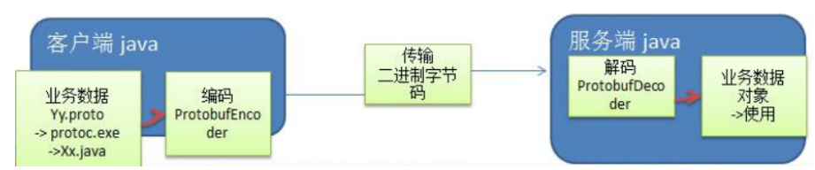

# 一、编码和解码的基本介绍
````
1、编写网络应用程序时，因为数据在网络中传输的都是二进制字节码数据，
    在发送数据时就需要编码
    接收数据时就需要解码
2、codec(编解码器) 的组成部分有两个：decoder(解码器)和 encoder(编码器)。encoder 负责把业务数据转换成字节码数据，decoder 负责把字节码数据转换成业务数据
````
# 二、Netty 本身的编码解码的机制和问题分析
````
1、Netty 提供的编码器
    StringEncoder，对字符串数据进行编码
    ObjectEncoder，对 Java 对象进行编码
2、Netty 提供的解码器
    StringDecoder, 对字符串数据进行解码
    ObjectDecoder，对 Java 对象进行解码
3、Netty 本身自带的 ObjectDecoder 和 ObjectEncoder 可以用来实现 POJO 对象或各种业务对象的编码和解码，底层使用的仍是 Java 序列化技术 , 而 Java 序列化技术本身效率就不高，存在如下问题
    无法跨语言
    序列化后的体积太大，是二进制编码的 5 倍多。
    序列化性能太低
    引出 新的解决方案 [Google的Protobuf]
````
# 三、Protobuf
* 1、Protobuf 基本介绍
````
1、Protobuf 是 Google 发布的开源项目，全称 Google Protocol Buffers，是一种轻便高效的结构化数据存储格式，
可以用于结构化数据串行化，或者说序列化。它很适合做数据存储或 RPC[远程过程调用 remote procedure call ] 数据交换格式 。目前很多公司http+json —> tcp+protobuf
2、参考文档 : https://developers.google.com/protocol-buffers/docs/proto 语言指南
3、Protobuf 是以 message 的方式来管理数据的.
4、支持跨平台、跨语言，即[客户端和服务器端可以是不同的语言编写的] （支持目前绝大多数语言，例如 C++、C#、Java、python 等）
5、高性能，高可靠性
6、使用 protobuf 编译器能自动生成代码，Protobuf 是将类的定义使用.proto 文件进行描述。说明，在 idea 中编写 .proto 文件时，会自动提示是否下载 .ptotot 编写插件. 可以让语法高亮。
7、然后通过 protoc.exe 编译器根据.proto 自动生成.java 文件
````
* 2、protobuf 使用示意图

# 四、Protobuf 快速入门实例1
* 1、编写程序，使用 Protobuf 完成如下功能
````
客户端可以发送一个 Student PoJo 对象到服务器 (通过 Protobuf 编码)
服务端能接收 Student PoJo 对象，并显示信息(通过 Protobuf 解码)
````
* 2、代码
````
1、引入maven依赖
<dependency>
    <groupId>com.google.protobuf</groupId>
    <artifactId>protobuf-java</artifactId>
    <version>3.6.1</version>
</dependency>

2、Student.proto文件
syntax = "proto3"; // 版本
option java_outer_classname = "com.jch.netty.codec.StudentPOJO";// 生成的外部类名, 同时也是文件名
//protobuf 使用message 管理数据
message Student { //会在 StudentPOJO 外部类生成一个内部类 Student, 真正发送的POJO对象
  int32 id = 1; //Student类中有一个属性 名字为id 类型为int32(protobuf类型) 1表示属性序号不是值
  string name = 2;
}

3、编译
利用idea插件 Protoc

4、将生成的 StudentPOJO 放入到项目使用
````
* 3、使用
````
public class NettyClientHandler extends ChannelInboundHandlerAdapter {

    @Override
    public void channelActive(ChannelHandlerContext ctx) throws Exception {
        // 发生一个Student 对象到服务器
        StudentPOJO.Student student = StudentPOJO.Student.newBuilder().setId(4).setName("张三").build();
        ctx.writeAndFlush(student);
    }
}
````
````
NettyClient

.handler(new ChannelInitializer<SocketChannel>() {
    @Override
    protected void initChannel(SocketChannel socketChannel) throws Exception {
        ChannelPipeline pipeline = socketChannel.pipeline();
        pipeline.addLast(new ProtobufEncoder());//加入编码器
        pipeline.addLast(new NettyClientHandler());// 加入自己的处理器
    }
})
````
````
public class NettyServerHandler extends SimpleChannelInboundHandler<StudentPOJO.Student> {

    @Override
    public void channelRead0(ChannelHandlerContext ctx, StudentPOJO.Student msg) throws Exception {
        // 读取从客户端发送的StudentPOJO.Student
        System.out.println("客户端发送的数据 id=" + msg.getId() + " name=" + msg.getName());
    }
}
````
````
NettyServer

.childHandler(new ChannelInitializer<SocketChannel>() { // 创建一个通道初始化对象(匿名对象)
    // 向给pipeline 设置处理器
    @Override
    protected void initChannel(SocketChannel socketChannel) throws Exception {
        ChannelPipeline pipeline = socketChannel.pipeline();
        pipeline.addLast("decoder", new ProtobufDecoder(StudentPOJO.Student.getDefaultInstance())); // 加入解码器
        pipeline.addLast(new NettyServerHandler());
    }
})
````
# 五、Protobuf 快速入门实例 2
````
1、编写程序，使用 Protobuf 完成如下功能
2、客户端可以随机发送 Student PoJo/ Worker PoJo 对象到服务器 (通过 Protobuf 编码)
3、服务端能接收 Student PoJo/ Worker PoJo 对象(需要判断是哪种类型)，并显示信息(通过 Protobuf 解码)
````
````
Student.proto文件

syntax = "proto3";
option optimize_for = SPEED; //加快解析
option java_package = "com.jch.netty.codec2"; //指定生成到哪个包下
option java_outer_classname = "MyDataInfo"; // 外部类名称

//protobuf 可以使用message 管理其他的message
message MyMessage {
  // 定义一个枚举类型
  enum DateType {
    StudentType = 0;//在proto3 要求enum的编号从0开始
    WorkerType = 1;
  }

  //用data_type 来标识传的是哪一个枚举类型
  DateType data_type = 1;

  // 标识每次枚举类型最多只能出现其中一个, 节省空间
  oneof dataBody {
    Student student = 2;
    Worker worker = 3;
  }
}

message Student {
  int32 id = 1;
  string name = 2;
}

message Worker {
  string name = 1;
  int32 age = 2;
}
````
````
public class NettyClientHandler extends ChannelInboundHandlerAdapter {
    @Override
    public void channelActive(ChannelHandlerContext ctx) throws Exception {
        // 随机发送Student 或者 Worker对象
        int random = new Random().nextInt(3);
        MyDataInfo.MyMessage myMessage = null;
        if (0 == random) { //发送Student
            myMessage = MyDataInfo.MyMessage.newBuilder().setDataType(MyDataInfo.MyMessage.DataType.StudentType)
                    .setStudent(MyDataInfo.Student.newBuilder().setId(5).setName("张三 李四").build()).build();
        } else { // 发送
            myMessage = MyDataInfo.MyMessage.newBuilder().setDataType(MyDataInfo.MyMessage.DataType.WorkerType)
                    .setWorker(MyDataInfo.Worker.newBuilder().setAge(20).setName("阿西吧").build()).build();
        }
        ctx.writeAndFlush(myMessage);
    }
}
````
````
public class NettyServerHandler extends SimpleChannelInboundHandler<MyDataInfo.MyMessage> {
        @Override
    public void channelRead0(ChannelHandlerContext ctx, MyDataInfo.MyMessage msg) throws Exception {
        // 根据dataType 显示不同信息
        MyDataInfo.MyMessage.DateType dataType = msg.getDataType();
        if (dataType == MyDataInfo.MyMessage.DataType.StudentType) {
            MyDataInfo.Student student = msg.getStudent();
            System.out.println("学生 id = " + student.getId() + " 学生名字 = " + student.getName());
        } else if (dataType == MyDataInfo.MyMessage.DataType.WorkerType) {
            MyDataInfo.Worker worker = msg.getWorker();
            System.out.println("工人 名字 = " + worker.getName() + " 年龄 = " + worker.getAge());
        } else {
            System.out.println("传输类型不正确");
        }
    }
}
````
````
public class NettyServer {
    .childHandler(new ChannelInitializer<SocketChannel>() { // 创建一个通道初始化对象(匿名对象)
        // 向给pipeline 设置处理器
        @Override
        protected void initChannel(SocketChannel socketChannel) throws Exception {
            ChannelPipeline pipeline = socketChannel.pipeline();
            pipeline.addLast("decoder", new ProtobufDecoder(MyDataInfo.MyMessage.getDefaultInstance()));
            pipeline.addLast(new NettyServerHandler());
        }
    })
}
````