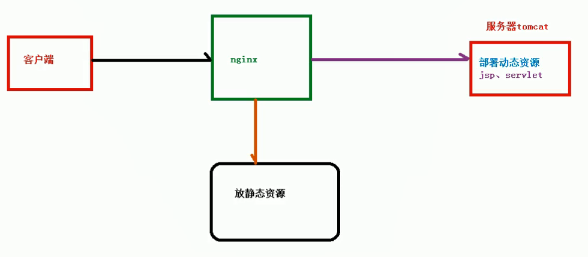

# 一、Nginx概念
````
Nginx(engine x) 是一个高性能的HTTP和反向代理web服务器，同时也提供了IMAP/POP3/SMTP服务。Nginx是由伊戈尔·赛索耶夫为俄罗斯访问量第二的Rambler.ru站点（俄文：Рамблер）开发的，第一个公开版本0.1.0发布于2004年10月4日。

其将源代码以类BSD许可证的形式发布，因它的稳定性、丰富的功能集、简单的配置文件和低系统资源的消耗而闻名。2011年6月1日，nginx 1.0.4发布。

Nginx是一款轻量级的Web 服务器/反向代理服务器及电子邮件（IMAP/POP3）代理服务器，在BSD-like 协议下发行。其特点是占有内存少，并发能力强，事实上nginx的并发能力在同类型的网页服务器中表现较好。
````
# 二、正向代理
````
浏览器 -> 代理服务器 -> 真实服务器
在客户端（如浏览器）配置代理服务器，通过代理服务器进行网络访问的过程，就称为正向代理。
````

# 三、反向代理
````
1、客户端对代理是无感知的，因为客户端不需要任何配置就可以访问，我们只需要将请求发送到反向代理服务器，由反向代理服务器去选择目标服务器获取数据后，返回给客户端，此时反向代理服务器和目标服务器对外就是一个服务器
2、暴露的是代理服务器地址，隐藏了真实服务器 IP 地址
3、对用户来讲，自己是与代理服务器进行请求访问，实际上是请求到达代理服务器后，由代理服务器去不同ip地址或端口获取资源，最终返回。
````

# 四、负载均衡
````
最初单一模式

浏览器请求服务器，服务器查询数据库

数据库返回查询结果给服务器，服务器响应结果给浏览器

当出现高并发时服务器可能崩溃

负载均衡技术

浏览器向代理服务器请求，代理服务器又将请求分发到多个服务器，从而降低服务器的压力
````

# 五、动静分离
````
传统方式：
服务器端部署有静态资源（JS、HTML等）和动态资源（jsp、servlet等）

为了加快网站解析速度，采用动静分离的方式：
把动态页面和静态页面由不同的服务器来解析，加快解析速度，降低原来单个服务器的压力。
````
