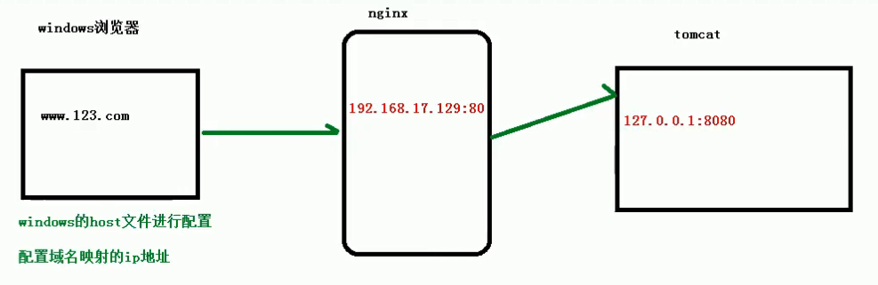
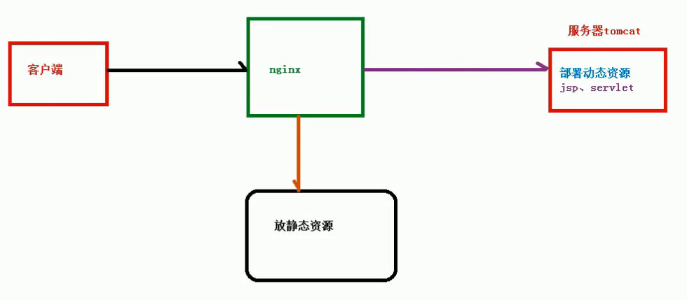
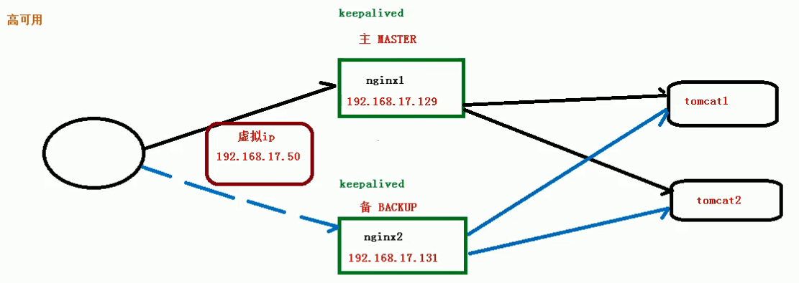

# 一、反向代理 实例一
* 1、实现的效果
````
打开浏览器，在浏览器地址栏输入地址 www.123.com，跳转到 liunx 系统 tomcat 主页 面中
````

* 2、准备工作
````
在linux系统中安装Tomcat，使用默认端口8080
    将tomcat安装文件放到linux系统下的usr/src文件夹中，解压
    进入tomcat的bin目录中，./startup.sh启动tomcat服务器

添加对外开放访问端口的权限
    添加8080端口：firewall-cmd --add-port=8080/tcp --permanent
    重载防火墙：firewall-cmd –reload
    查看已经开放的端口号： firewall-cmd --list-all

测试：在windows系统中输入linux服务器，查看是否能够访问到tomcat服务器页面
````
* 3、具体操作
````
1、在windows系统中的host文件中，添加域名与ip地址之间的映射，以方便在浏览器输入www.123.com之后，能够跳转到nginx服务器。
虚拟机ip www.123.com

2、在nginx的配置文件中，进行请求转发的相关配置(反向代理配置)
server {
    listen 80;
    server_name 192.168.17.129;#改这里, nginx服务器地址

    location / {
        proxy_pass http://127.0.0.1:8080;#改这里, tomcat服务器地址
        root html;
        index index.html index.htm;
    }
}
````
# 二、反向代理 实例二
* 1、实现效果：
````
使用 nginx 反向代理：根据访问的路径，需要nginx服务器处理，将请求跳转到不同端口的服务中，其中 nginx 服务器监听端口为 9001

访问 http://127.0.0.1:9001/edu/ 直接跳转到 127.0.0.1:8081

访问 http://127.0.0.1:9001/vod/ 直接跳转到 127.0.0.1:8082
````
* 2、准备工作
````
第一步：准备两个tomcat服务器，一个 8001 端口，一个 8002 端口，并准备好测试的页面
第二步：创建文件夹（ edu 和 vod ）和测试页面
````
* 3、具体配置
````
server {
    listen 9001;
    server_name 192.168.17.129;#改这里

    location ~ /edu/ {
        proxy_pass http://127.0.0.1:8080;#改这里
    }
    location ~ /vod/ {
        proxy_pass http://127.0.0.1:8081;#改这里
    }
}
````
* 4、location 指令说明
````
该指令用于匹配 URL

location [ = | ~ | ~* | ^~] url {}

= ：用于不含正则表达式的 uri ，要求请求字符串与 uri 严格匹配，如果匹配成功，就停止继续向下搜索并立即处理该请求。
~：用于表示 uri 包含正则表达式，并且区分大小写。
~*：用于表示 uri 包含正则表达式，并且不区分大小写。
^~：用于不含正则表达式的 uri 前，要求 Nginx 服务器找到标识 uri 和请求字符串匹配度最高的 location 后，立即使用此 location 处理请求，而不再使用 location 块中的正则 uri 和请求字符串做匹配。
````
* 5、开放对外访问的端口号 9001 8080 8081
* 6、测试
````
http://192.168.17.129:9001/edu/a.html
http://192.168.17.129:9001/vod/a.html
````
# 三、负载均衡
* 1、实现效果
````
浏览器地址栏中，输入地址 http://192.168.17.129/edu/a.html，有负载均衡的效果，即：平均到 8080 和 8081 端口中
````
* 2、准备工作
````
第一步：准备两台 tomcat 服务器，一台 8080，一台 8081
第二步：在两台 tomcat 里面 webapps 目录中，创建名称是 edu 文件夹，在 edu 文件夹中创建 页面 a.html，用于测试
````
* 3、具体配置
````
使用 upstream 命令：添加承担负载的两个服务器
upstream myserver {
    server 192.168.17.129:8080;
    server 192.168.17.129:8081;
}
在server块中进行配置：server_name和listen是nginx服务器的地址端口，在location块中配置 proxy_pass ，将承担均衡负载的两个服务器引入，每次nginx服务器就会将负载分摊到不同的服务单元。
server {
    listen 80;
    server_name 192.168.17.129;#改这里

    location ~ /edu/ {
        proxy_pass http://myserver;#改这里
    }
}
````
* 4、测试：请求显示的页面在8080和8081端口下的页面，来回切换
* 5、nginx 分配服务器策略
````
1、轮询(默认)
每个请求按时间顺序逐一分配到不同的后端服务器，如果后端服务器 down 掉，能自动剔除。

2、weight
 weight 代表权重，默认为 1，权重越高被分配的客户端越多
指定轮询几率，weight 和访问比率成正比，用于后端服务器性能不均的情况
upstream myserver {
    server 192.168.17.129:8080 weight=10;
    server 192.168.17.129:8081 weight=10;
}

3、ip_hash
每个请求按访问 ip 的 hash 结果分配，这样每个访客固定访问一个后端服务器，可以解决 session 的问题
upstream myserver {
    ip_hash;
    server 192.168.17.129:8080;
    server 192.168.17.129:8081;
}

4、fair(第三方)
按后端服务器的响应时间来分配请求，响应时间短的优先分配
upstream myserver {
    server 192.168.17.129:8080;
    server 192.168.17.129:8081;
    fair;
}
````
# 四、动静分离
* 1、基本介绍
````
把动态跟静态请求分开，动静分离从目前实现角度来讲大致分为两种：

1、纯粹把静态文件独立成单独的域名，放在独立的服务器上，也是目前主流推崇的方案
2、动态跟静态文件混合在一起发布，通过 nginx 来分开
​通过 location 指定不同的后缀名实现不同的请求转发。
​通过 expires 参数设置（在location中进行添加），可以使浏览器缓存过期时间，减少与服务器之前的请求和流量：

​具体 Expires 定义：是给一个资源设定一个过期时间，也就是说无需去服务端验证，直接通过浏览器自身确认是否过期即可， 所以不会产生额外的流量。此种方法非常适合不经常变动的资源。（如果经常更新的文件， 不建议使用 Expires 来缓存），我这里设置 3d，表示在这 3 天之内访问这个URL，发送一个请求，比对服务器该文件最后更新时间没有变化，则不会从服务器抓取，返回状态码 304，如果有修改，则直接从服务器重新下载，返回状态码 200。
````

* 2、准备工作
````
在linux系统中准备静态资源，比如image、www两个文件夹，存放静态资源
````
* 3、具体配置
````
在nginx配置文件中进行配置，找到 nginx 安装目录，打开/conf/nginx.conf 配置文件

server {
    listen 80;
    server_name 192.168.17.129;#改这里

    location /www/ {#改这里
        root /data/;#表示资源在linux中根目录的位置
        index index.html index.htm;
    }
    location /image/ {#改这里
        root /data/;
        autoindex on;#显示静态资源目录下的资源列表
    }
}
````
# 五、配置高可用集群
* 1、什么是nginx高可用
````
1、之前的配置中，只有一台nginx服务器，如果这台服务器发生了宕机，那么客户端就无法进行请求的访问，高可用集群就是为了解决这样一个问题。
2、两台nginx服务器，一台主服务器和一台从服务器，用来保证nginx的服务不会因为一台服务器的宕机而崩溃
3、需要一个软件 Keepalived 支持
Keepalived的作用是检测服务器的状态，如果有一台web服务器宕机，或工作出现故障，Keepalived将检测到，并将有故障的服务器从系统中剔除，同时使用其他服务器代替该服务器的工作，当服务器工作正常后Keepalived自动将服务器加入到服务器群中，这些工作全部自动完成，不需要人工干涉，需要人工做的只是修复故障的服务器。
4、对外暴露一个虚拟ip，通过路由转发到这两台nginx服务器进行请求转发的处理
````

* 2、配置高可用集群的准备工作
````
1、需要两台nginx服务器，比如：192.168.17.129 和 192.168.17.131
2、在两台服务器安装 nginx
3、在两台服务器安装 keepalived
yum install keepalived –y
安装之后，在 etc 里面生成目录 keepalived，有文件 keepalived.conf
4、完成高可用配置（主从配置）
修改/etc/keepalived/keepalivec.conf 配置文件
````
````
global_defs { #全局配置

	notification_email {

         acassen@firewall.loc

         failover@firewall.loc

         sysadmin@firewall.loc

 	}

     notification_email_from Alexandre.Cassen@firewall.loc

     smtp_server 192.168.17.129

     smtp_connect_timeout 30

     router_id LVS_DEVEL #主机的名字

}

vrrp_script chk_http_port { # 检测脚本配置

     script "/usr/local/src/nginx_check.sh" # 脚本文件位置

     interval 2 # 检测脚本执行的间隔

     weight 2 # 权重，一旦校测脚本中的条件成立，就修改为这个新权重（比如检测到这个服务器宕机，那么就将权重降低）

}

vrrp_instance VI_1 { # 虚拟ip配置

    state BACKUP # 备份服务器上将 MASTER 改为 BACKUP 

    interface ens33 //网卡

    virtual_router_id 51 # 主、备机的 virtual_router_id 必须相同

    priority 90 # 主、备机取不同的优先级，主机值较大，备份机值较小（主机100，备机90）

    advert_int 1 # 默认每隔一秒检测主机状态

    authentication {

         auth_type PASS

         auth_pass 1111

     }

     virtual_ipaddress {

     	192.168.17.50 // VRRP H 虚拟地址 (对外暴露的虚拟ip地址)

     }

}
````
````
5、在/usr/local/src 添加检测脚本（检测主服务器是否宕机挂掉）
````
````
#!/bin/bash

A=`ps -C nginx –no-header |wc -l`

if [ $A -eq 0 ];then

     /usr/local/nginx/sbin/nginx # nginx位置

     sleep 2

     if [ `ps -C nginx --no-header |wc -l` -eq 0 ];then

     	killall keepalived

     fi

fi
````
````
6、把两台服务器上 nginx 和 keepalived 启动
启动 nginx：./nginx
启动 keepalived：systemctl start keepalived.service
````
* 3、最终测试
````
在浏览器地址栏输入 虚拟 ip 地址 192.168.17.50

把主服务器（192.168.17.129）nginx 和 keepalived 停止，再输入 192.168.17.50，内部访问的是备用nginx服务器（192.168.17.131）
````