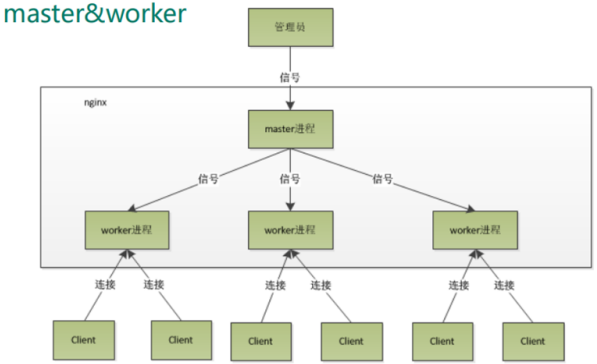
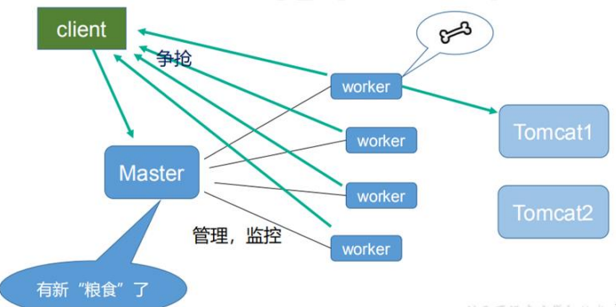

# 一、Nginx 原理解析
* 1、采用 master 和 worker 的工作方式
````
mater作为管理者，管理和监控工作进程
worker作为实际处理进程，采用 争抢 的方式对处理请求进行处理
````

* 2、worker是如何工作的

* 3、一个 master 和多个 woker 有好处
````
可以使用 nginx –s reload 热部署，利用 nginx 进行热部署操作
    无需重新启动 nginx，避免服务器停止服务
    倘若有worker正在处理请求，那么只是余下的worker进行热部署操作
每个 woker 是独立的进程，如果有其中的一个 woker 出现问题，其他 woker 独立的， 继续进行争抢，实现请求过程，不会造成服务中断
````
* 4、设置多少个 woker 合适
````
worker 数和服务器的 cpu 数相等是最为适宜的
````
* 5、连接数 worker_connection
````
1、发送请求，占用了 woker 的几个连接数？
    2 或者 4
        如果是访问静态资源，client发送请求，worker响应
        如果是访问动态资源，那么worker在上面的基础上，会多增加两个连接，用于与tomcat进行交互，请求数据库访问
2、nginx 有一个 master，有四个 woker，每个 woker 支持最大的连接数 1024，支持的 最大并发数是多少？
    普通的静态资源访问最大并发数是： worker_connections * worker_processes /2（每个worker的最大连接数 × worker个数，再除以访问静态资源的两个连接数）
    而如果是 HTTP 作为反向代理来说，最大并发数量应该是：worker_connections * worker_processes / 4
````