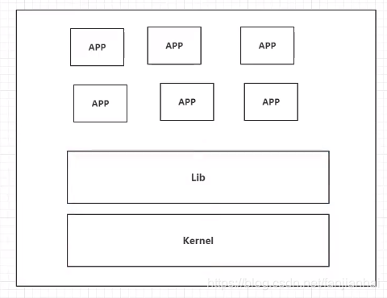
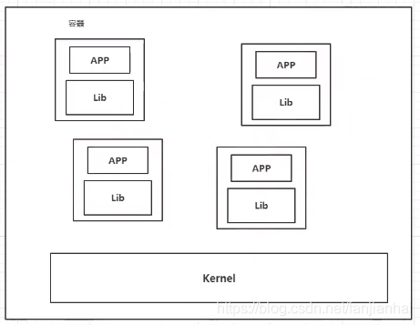

# 一、Docker出现的原因
````
java部署jar包, 打包项目带上环境(也就是镜像), Docker仓库下载发布的镜像, 就可以运行

Docker的思想来源于集装箱
Docker 通过隔离机制, 可以将服务器利用到极致
````
# 二、虚拟化技术和容器化技术对比
## 1、虚拟化技术的缺点

````
资源占用十分多
冗余步骤多
启动很慢
````
## 2、容器化技术
**容器化技术不是模拟的一个完整的操作系统**

* 1、比较Docker和虚拟化技术的不同
````
传统虚拟机， 虚拟出一条硬件，运行一个完整的操作系统，然后在这个系统上安装和运行软件
容器内的应用直接运行在宿主机的内部，容器是没有自己的内核的，也没有虚拟硬件，所以轻便
每个容器间是相互隔离的，每个容器内都有一个属于自己的文件系统，互不影响
````
* 2、应用更快速的交互和部署
````
传统：一堆帮助文档，安装程序
Docker： 打包镜像发布测试，一键运行
````
* 3、更便捷的升级和扩缩容
* 4、更简的系统运维
* 5、更高效的计算资源利用
## 3、DevOps(开发、运维)
* 1、应用更快速的交付和部署
````
传统: 一堆帮助文档, 安装程序
Docker: 打包镜像发布测试, 一键运行
````
* 2、更便捷的升级和扩缩容
````
使用了Docker之后, 部署应用就像搭积木
项目打包为一个镜像, 扩展服务器A和服务器B
````
* 3、更简单的系统运维
````
在容器化之后,开发和测试环境高度统一
````
* 4、更高效的计算资源利用
````
Docker是内核级别的虚拟化, 可以在一个物理机上运行很多容器实例, 服务器性能可以被压榨到极致
````
# 三、名词解释
## 1、镜像(image)
````
Docker镜像就好比是一个模板，可以通过这个模板来创建容器服务，tomcat镜像 ===> run ===> tomcat01容器， 通过这个镜像可以创建多个容器(最终服务运行或者项目运行就是在容器中的)
````
## 2、容器(container)
````
Docker利用容器技术，独立运行一个或者一组应用， 通过镜像来创建的
启动，停止，删除，基本命令！
可以把这个容器理解为一个简易的linux系统
````
## 3、仓库(repository)
````
存放镜像的地方
Docker Hub(默认是国外的)
阿里云 都有容器服务(配置镜像加速!)
````
# 四、Docker安装
## 1、卸载旧版本
````
for pkg in docker.io docker-doc docker-compose docker-compose-v2 podman-docker containerd runc; do sudo apt-get remove $pkg; done
````
## 2、设置 Docker 的存储库
* 1、软件更新
````
sudo apt-get update
此时从乌班图官网更新软件失败
````
* 2、设置阿里云镜像
````
备份原来的源
sudo cp /etc/apt/sources.list /etc/apt/sources_init.list
````
````
更换源
sudo gedit /etc/apt/sources.list

更换为以下内容
deb http://mirrors.aliyun.com/ubuntu/ bionic main restricted universe multiverse
deb-src http://mirrors.aliyun.com/ubuntu/ bionic main restricted universe multiverse

deb http://mirrors.aliyun.com/ubuntu/ bionic-security main restricted universe multiverse
deb-src http://mirrors.aliyun.com/ubuntu/ bionic-security main restricted universe multiverse

deb http://mirrors.aliyun.com/ubuntu/ bionic-updates main restricted universe multiverse
deb-src http://mirrors.aliyun.com/ubuntu/ bionic-updates main restricted universe multiverse

deb http://mirrors.aliyun.com/ubuntu/ bionic-proposed main restricted universe multiverse
deb-src http://mirrors.aliyun.com/ubuntu/ bionic-proposed main restricted universe multiverse

deb http://mirrors.aliyun.com/ubuntu/ bionic-backports main restricted universe multiverse
deb-src http://mirrors.aliyun.com/ubuntu/ bionic-backports main restricted universe multiverse
````
* 3、添加 Docker 的官方 GPG 密钥
````
sudo apt-get install ca-certificates curl gnupg
sudo install -m 0755 -d /etc/apt/keyrings
curl -fsSL https://download.docker.com/linux/ubuntu/gpg | sudo gpg --dearmor -o /etc/apt/keyrings/docker.gpg
sudo chmod a+r /etc/apt/keyrings/docker.gpg
````
* 4、将存储库添加到Apt源
````
echo \
  "deb [arch=$(dpkg --print-architecture) signed-by=/etc/apt/keyrings/docker.gpg] https://download.docker.com/linux/ubuntu \
  $(. /etc/os-release && echo "$VERSION_CODENAME") stable" | \
  sudo tee /etc/apt/sources.list.d/docker.list > /dev/null
sudo apt-get update
````
## 3、安装 Docker
* 1、安装Docker包
````
sudo apt-get install docker-ce docker-ce-cli containerd.io docker-buildx-plugin docker-compose-plugin
````
* 2、启动
````
sudo systemctl start docker
````
* 3、查看Docker的版本
````
docker version
````
* 4、通过运行映像来验证 Docker 引擎安装是否成功
````
sudo docker run hello-world
````
* 5、查看下载的 hello-world 镜像
````
docker images
````
## 4、卸载 Docker 引擎
* 1、下载依赖
````
sudo apt-get purge docker-ce docker-ce-cli containerd.io docker-buildx-plugin docker-compose-plugin docker-ce-rootless-extras
````
* 2、删除资源
````
rm -rf /var/lib/docker

# /var/lib/docker docker的默认工作路径
````
## 5、Docker配置阿里云
````
sudo mkdir -p /etc/docker
sudo tee /etc/docker/daemon.json <<-'EOF'
{
  "registry-mirrors": ["https://f214zc7d.mirror.aliyuncs.com"]
}
EOF
sudo systemctl daemon-reload
sudo systemctl restart docker
````
# 五、底层原理
## 1、运行 docker run hello-world

## 2、Docker如何工作
````
Docker 是一个 Client - Server 结构的系统, Docker的守护进程运行在主机上。通过Socket从客户端访问!
DockerServer 接收 DOcker - Client 的指令, 就会执行这个命令。
````
## 3、为什么Docker比Vm快
````
1、docker有着比虚拟机更少的抽象层。
2、docker利用的是宿主机的内核。vm需要Guest OS。
3、新建容器时, Docker不需要和虚拟机一样重新加载一个操作系统的内核, 避免引导。虚拟机时加载Guest OS, 分钟级别的。而docker由于直接利用宿主机的操作系统,则省略了返个过程,因此新建一个docker容器只需要几秒钟。
````