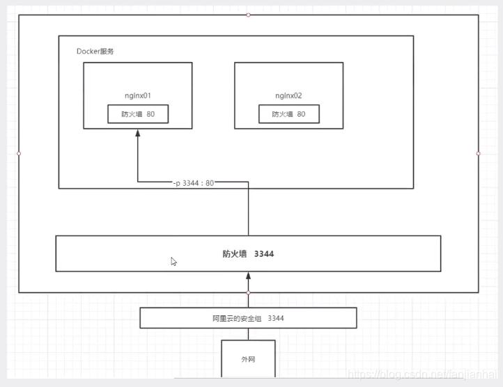

# 一、Docker安装Nginx
* 1、拉取镜像
````
root@jch-virtual-machine:/# docker pull nginx
Using default tag: latest
latest: Pulling from library/nginx
a2abf6c4d29d: Pull complete 
a9edb18cadd1: Pull complete 
589b7251471a: Pull complete 
186b1aaa4aa6: Pull complete 
b4df32aa5a72: Pull complete 
a0bcbecc962e: Pull complete 
Digest: sha256:0d17b565c37bcbd895e9d92315a05c1c3c9a29f762b011a10c54a66cd53c9b31
Status: Downloaded newer image for nginx:latest
docker.io/library/nginx:latest
root@jch-virtual-machine:/# docker images
REPOSITORY   TAG       IMAGE ID       CREATED         SIZE
nginx        latest    605c77e624dd   23 months ago   141MB
````
* 2、运行容器
````
# -d 后台运行
# -name 给容器命名
# -p 宿主机端口：容器内部端口

root@jch-virtual-machine:/# docker run -d --name nginx01 -p 3344:80 nginx
0b681b73bf44c4705d50ab217ae8efd22a690f35b6faf09cb0b7c381dc615ea0
root@jch-virtual-machine:/# docker ps
CONTAINER ID   IMAGE     COMMAND                   CREATED         STATUS         PORTS                                   NAMES
0b681b73bf44   nginx     "/docker-entrypoint.…"   5 seconds ago   Up 3 seconds   0.0.0.0:3344->80/tcp, :::3344->80/tcp   nginx01
````
* 3、curl 测试
````
root@jch-virtual-machine:/# curl localhost:3344
<!DOCTYPE html>
<html>
<head>
<title>Welcome to nginx!</title>
<style>
html { color-scheme: light dark; }
body { width: 35em; margin: 0 auto;
font-family: Tahoma, Verdana, Arial, sans-serif; }
</style>
</head>
<body>
<h1>Welcome to nginx!</h1>
<p>If you see this page, the nginx web server is successfully installed and
working. Further configuration is required.</p>

<p>For online documentation and support please refer to
<a href="http://nginx.org/">nginx.org</a>.<br/>
Commercial support is available at
<a href="http://nginx.com/">nginx.com</a>.</p>

<p><em>Thank you for using nginx.</em></p>
</body>
</html>
````
* 4、外网测试
````
http://192.168.48.128:3344/ 正常访问nginx
````

* 5、进入容器
````
root@jch-virtual-machine:/# docker ps
CONTAINER ID   IMAGE     COMMAND                   CREATED          STATUS          PORTS                                   NAMES
0b681b73bf44   nginx     "/docker-entrypoint.…"   17 minutes ago   Up 17 minutes   0.0.0.0:3344->80/tcp, :::3344->80/tcp   nginx01
root@jch-virtual-machine:/# docker exec -it nginx01 /bin/bash
root@0b681b73bf44:/# whereis nginx
nginx: /usr/sbin/nginx /usr/lib/nginx /etc/nginx /usr/share/nginx
root@0b681b73bf44:/# cd  /etc/nginx/
root@0b681b73bf44:/etc/nginx# ls
conf.d	fastcgi_params	mime.types  modules  nginx.conf  scgi_params  uwsgi_params
````
# 二、Docker安装Tomcat
* 1、官方的使用
````
# 这个命令会先 pull tomcat 9.0的镜像
docker run -it --rm tomcat:9.0
# 我们之前的启动都是后台的，停止了容器之后， 容器还是可以查到，docker run -it --rm 一般用来测试，用完就删
````
* 2、拉取并启动
````
root@jch-virtual-machine:/# docker pull tomcat:9.0
9.0: Pulling from library/tomcat
0e29546d541c: Pull complete 
9b829c73b52b: Pull complete 
cb5b7ae36172: Pull complete 
6494e4811622: Pull complete 
668f6fcc5fa5: Pull complete 
dc120c3e0290: Pull complete 
8f7c0eebb7b1: Pull complete 
77b694f83996: Pull complete 
7662046c36cb: Pull complete 
b93639122cb4: Pull complete 
Digest: sha256:cd96d4f7d3f5fc4d3bc1622ec678207087b8215d55021a607ecaefba80b403ea
Status: Downloaded newer image for tomcat:9.0
docker.io/library/tomcat:9.0
root@jch-virtual-machine:/# docker images
REPOSITORY   TAG       IMAGE ID       CREATED         SIZE
nginx        latest    605c77e624dd   23 months ago   141MB
tomcat       9.0       b8e65a4d736d   23 months ago   680MB

root@jch-virtual-machine:/# docker run -d -p 3355:8080 --name tomcat01 tomcat:9.0
4bbbfca622ab4ef5143b27c99f3d302fbed803796f8cb4b14379a6bfecbb80fe
````
* 3、测试
````
# 测试访问没有问题(显示404)
 
# 进入容器
root@jch-virtual-machine:/# docker exec -it tomcat01 /bin/bash
 
# 发现问题：1.linux命令少了， 2. webapps下内容为空，阿里云净吸纳过默认是最小的镜像，所有不必要的都剔除了，保证最小可运行环境即可
root@4bbbfca622ab:/usr/local/tomcat# cd webapps
root@4bbbfca622ab:/usr/local/tomcat/webapps# ls

root@4bbbfca622ab:/usr/local/tomcat/webapps# cd ..
root@4bbbfca622ab:/usr/local/tomcat# ls
BUILDING.txt	 NOTICE		RUNNING.txt  lib	     temp	   work
CONTRIBUTING.md  README.md	bin	     logs	     webapps
LICENSE		 RELEASE-NOTES	conf	     native-jni-lib  webapps.dist

root@4bbbfca622ab:/usr/local/tomcat# cp -r webapps.dist/* webapps

root@4bbbfca622ab:/usr/local/tomcat# cd webapps
root@4bbbfca622ab:/usr/local/tomcat/webapps# ls
ROOT  docs  examples  host-manager  manager

# 这时再访问可以访问到tomcat
````
# 三、Docker部署es + kibana
## 1、elasticsearch
````
# es 暴露的端口很多
# es 十分的耗内存
# es 的数据一般需要放置到安全目录！ 挂载
# --net somenetwork 网络配置
root@jch-virtual-machine:/# docker run -d --name elasticsearch -p 9200:9200 -p 9300:9300 -e "discovery.type=single-node" elasticsearch:7.6.2
Unable to find image 'elasticsearch:7.6.2' locally
7.6.2: Pulling from library/elasticsearch
ab5ef0e58194: Pull complete 
c4d1ca5c8a25: Pull complete 
941a3cc8e7b8: Pull complete 
43ec483d9618: Pull complete 
c486fd200684: Pull complete 
1b960df074b2: Pull complete 
1719d48d6823: Pull complete 
Digest: sha256:1b09dbd93085a1e7bca34830e77d2981521a7210e11f11eda997add1c12711fa
Status: Downloaded newer image for elasticsearch:7.6.2
574c681f99059a3a349fcbf07be54ad060d45ebb7421c6cc9db2a8ce62c182a8

# 启动了linux就卡主了，docker stats 查看cpu状态

# 增加内存限制，修改配置文件 -e 环境配置修改
root@jch-virtual-machine:/# docker run -d --name elasticsearch -p 9200:9200 -p 9300:9300 -e "discovery.type=single-node" -e ES_JAVA_OPTS="-Xms64m -Xmx512m" elasticsearch:7.6.2
4337a30f5a1acd33b8e33e8ee3655cba0912689f60a6fd27d16fc049888a4389

root@jch-virtual-machine:/# docker ps
CONTAINER ID   IMAGE                 COMMAND                   CREATED          STATUS          PORTS                                                                                  NAMES
4337a30f5a1a   elasticsearch:7.6.2   "/usr/local/bin/dock…"   13 seconds ago   Up 12 seconds   0.0.0.0:9200->9200/tcp, :::9200->9200/tcp, 0.0.0.0:9300->9300/tcp, :::9300->9300/tcp   elasticsearch

root@jch-virtual-machine:/# docker stats 4337a30f5a1a
CONTAINER ID   NAME            CPU %     MEM USAGE / LIMIT     MEM %     NET I/O       BLOCK I/O        PIDS
4337a30f5a1a   elasticsearch   9.08%     360.7MiB / 1.859GiB   18.95%    3.03kB / 0B   65.6MB / 729kB   44

# 访问http://192.168.48.128:9200/
{
    "name": "4337a30f5a1a",
    "cluster_name": "docker-cluster",
    "cluster_uuid": "xFDF7pAVR8i6aKPFQ0sycg",
    "version": {
        "number": "7.6.2",
        "build_flavor": "default",
        "build_type": "docker",
        "build_hash": "ef48eb35cf30adf4db14086e8aabd07ef6fb113f",
        "build_date": "2020-03-26T06:34:37.794943Z",
        "build_snapshot": false,
        "lucene_version": "8.4.0",
        "minimum_wire_compatibility_version": "6.8.0",
        "minimum_index_compatibility_version": "6.0.0-beta1"
    },
    "tagline": "You Know, for Search"
}
````
## 2、kibana(es的图形化工具)
* 1、启动kibana
````
root@jch-virtual-machine:/# docker run -it -d -e ELASTICSEARCH_URL=http://192.168.48.128:9200 --name kibana --network=host kibana:7.5.1
Unable to find image 'kibana:7.5.1' locally
7.5.1: Pulling from library/kibana
ab5ef0e58194: Already exists 
25e215bb3065: Pull complete 
6107ae08f064: Pull complete 
64c422d40727: Pull complete 
6aa99d3c8ec5: Pull complete 
365f35274fa8: Pull complete 
71b4061bcd9b: Pull complete 
9029ace019df: Pull complete 
bf094831f307: Pull complete 
2a0c7aa9823b: Pull complete 
Digest: sha256:569a331068e399520a943cbeacf98e5a8b3b2305c6c89832c678eda4ebbd8cb9
Status: Downloaded newer image for kibana:7.5.1
2128746bcfe959ae2746b663d30a5e94bc580e7818ca648fe528ec16917e1c37
````
* 2、进入kibana容器，修改连接es的配置
````
root@jch-virtual-machine:/# docker ps
CONTAINER ID   IMAGE                 COMMAND                   CREATED              STATUS              PORTS                                                                                  NAMES
2128746bcfe9   kibana:7.5.1          "/usr/local/bin/dumb…"   About a minute ago   Up About a minute                                                                                          kibana
4337a30f5a1a   elasticsearch:7.6.2   "/usr/local/bin/dock…"   18 minutes ago       Up 18 minutes       0.0.0.0:9200->9200/tcp, :::9200->9200/tcp, 0.0.0.0:9300->9300/tcp, :::9300->9300/tcp   elasticsearch
# 进入kibana容器
root@jch-virtual-machine:/# docker exec -it 2128746bcfe9 /bin/bash
# 查看kibana的配置文件, config是一个文件夹
bash-4.2$ ls
LICENSE.txt  NOTICE.txt  README.txt  bin  built_assets	config	data  node  node_modules  optimize  package.json  plugins  src	webpackShims  x-pack
# 修改kibana的配置文件中elasticsearch.hosts
bash-4.2$ cd config
bash-4.2$ vi  kibana.yml
#
# ** THIS IS AN AUTO-GENERATED FILE **
#

# Default Kibana configuration for docker target
server.name: kibana
server.host: "0"
elasticsearch.hosts: [ "http://192.168.48.128:9200" ]
xpack.monitoring.ui.container.elasticsearch.enabled: true

bash-4.2$ exit
exit
````
* 3、重启kibana容器
````
root@jch-virtual-machine:/# docker ps
CONTAINER ID   IMAGE                 COMMAND                   CREATED          STATUS          PORTS                                                                                  NAMES
2128746bcfe9   kibana:7.5.1          "/usr/local/bin/dumb…"   33 minutes ago   Up 33 minutes                                                                                          kibana
4337a30f5a1a   elasticsearch:7.6.2   "/usr/local/bin/dock…"   50 minutes ago   Up 50 minutes   0.0.0.0:9200->9200/tcp, :::9200->9200/tcp, 0.0.0.0:9300->9300/tcp, :::9300->9300/tcp   elasticsearch
root@jch-virtual-machine:/# docker restart 2128746bcfe9
2128746bcfe9
````
* 4、测试
````
访问http://192.168.48.128:5601/
````
# 四、可视化
* 1、portainer
````
docker run -d -p 8088:9000 --restart=always -v /var/run/docker.sock:/var/run/docker.sock --privileged=true portainer/portainer

访问 http://192.168.48.128:8088/
````
* 2、Rancher(CI/CD再用)