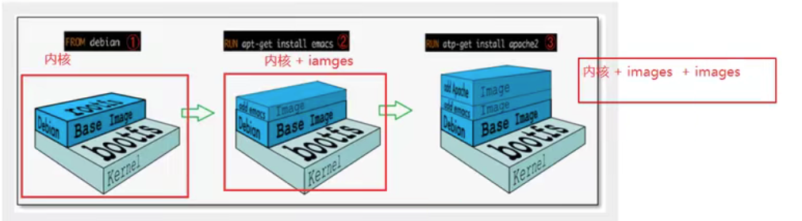
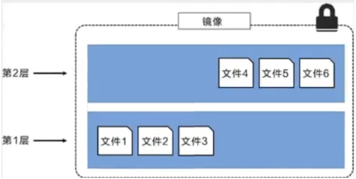
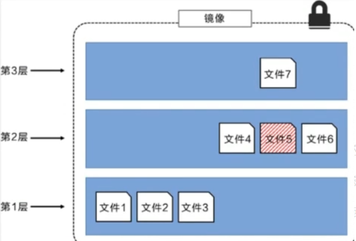
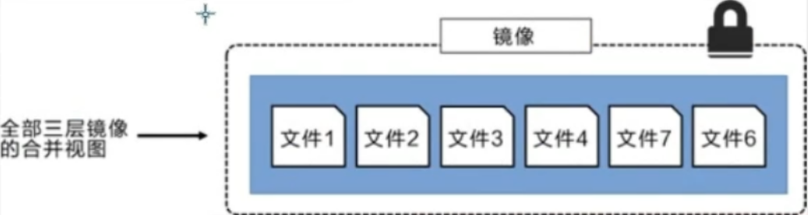
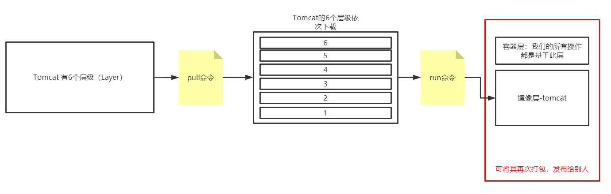

# 一、镜像定义
## 1、定义
````
镜像是一种轻量级、可执行的独立软件包，用来打包软件运行环境和基于运行环境开发的软件，它包含运行某个软件所需的所有内容，包括代码、运行时库、环境变量和配置文件。

所有应用，直接打包docker镜像，就可以直接跑起来
````
##  2、获取镜像
````
1、从远程仓库下载
2、别人拷贝给你
3、自己制作一个镜像 DockerFile
````
# 二、Docker镜像加载原理
## 1、UnionFs(联合文件系统)
* 1、定义
````
UnionFs(联合文件系统)：Union文件系统(UnionFs)是一种分层、轻量级并且高性能的文件系统，他支持对文件系统的修改作为一次提交来一层层的叠加，同时可以将不同目录挂载到同一个虚拟文件系统下(unite several directories into a single virtual filesystem)。
Union文件系统是 Docker镜像的基础。镜像可以通过分层来进行继承，基于基础镜像（没有父镜像），可以制作各种具体的应用镜像
````
* 2、特性
````
一次同时加载多个文件系统，但从外面看起来，只能看到一个文件系统，联合加载会把各层文件系统叠加起来，这样最终的文件系统会包含所有底层的文件和目录。
````
## 2、Docker镜像加载原理
````
docker的镜像实际上由一层一层的文件系统组成，这种层级的文件系统UnionFS。
````
* 1、明确两个名词概念
````
1、bootfs(boot file system): 主要包含 bootloader(加载器)和 Kernel(内核), bootloader主要是引导加载kernel, Linux刚启动时会加bootfs文件系统, 在 Docker镜像的最底层是 boots。这一层与我们典型的Linux/Unix系统是一样的, 包含boot加载器和内核。当boot加载完成之后整个内核就都在内存中了, 此时内存的使用权已由 bootfs转交给内核, 此时系统也会卸载bootfs。(说白了就是电脑黑屏—>加载—>开机, 三个阶段中的加载部分, 用完就不需要的就卸载掉)
2、rootfs(root file system): 在bootfs之上。包含的就是典型 Linux系统中的/dev，/proc，/bin，/etc等标准目录和文件。 rootfs就是各种不同的操作系统发行版，比如 Ubuntu，Centos等等。
````
* 2、层级文件系统结构


````
第一阶段：只有bootfs和rootfs
第二阶段：bootfs和rootfs部分加上了images
第三阶段：bootfs和rootfs部分加上了images，再加上images…无限加层
````
* 3、安装进虚拟机的Centos都是好几个G, 为什么Docker这里只有200M
````
对于一个精简的OS（操作系统），rootfs可以很小，只需要包合最基本的命令，工具和程序库就可以了，因为底层直接用Host的kernel（主机的内核），自己只需要提供rootfs就可以了。由此可见对于不同的Linux发行版， bootfs基本是一致的， rootfs会有差別，因此不同的发行版可以公用bootfs。所以说虚拟机是分钟级别，容器是秒级
````
# 三、分层理解
## 1、定义
* 1、查看分层
````
root@jch-virtual-machine:/# docker pull redis
Using default tag: latest
latest: Pulling from library/redis
a2abf6c4d29d: Already exists 
c7a4e4382001: Pull complete 
4044b9ba67c9: Pull complete 
c8388a79482f: Pull complete 
413c8bb60be2: Pull complete 
1abfd3011519: Pull complete 
Digest: sha256:db485f2e245b5b3329fdc7eff4eb00f913e09d8feb9ca720788059fdc2ed8339
Status: Downloaded newer image for redis:latest
docker.io/library/redis:latest
````
* 2、为什么要分层
````
root@jch-virtual-machine:/# docker image inspect redis:latest
        ...
        "RootFS": {
            "Type": "layers",
            "Layers": [
                "sha256:2edcec3590a4ec7f40cf0743c15d78fb39d8326bc029073b41ef9727da6c851f",# 这是安装centos, 所以显示Already exists
                "sha256:9b24afeb7c2f21e50a686ead025823cd2c6e9730c013ca77ad5f115c079b57cb",# 以下几步是拉取redis的镜像
                "sha256:4b8e2801e0f956a4220c32e2c8b0a590e6f9bd2420ec65453685246b82766ea1",
                "sha256:529cdb636f61e95ab91a62a51526a84fd7314d6aab0d414040796150b4522372",
                "sha256:9975392591f2777d6bf4d9919ad1b2c9afa12f9a9b4d260f45025ec3cc9b18ed",
                "sha256:8e5669d8329116b8444b9bbb1663dda568ede12d3dbcce950199b582f6e94952"
            ]
        },
        ...
````
````
最大的好处，我觉得莫过于资源共享了！比如有多个镜像都从相同的Base镜像构建而来，那么宿主机只需在磁盘上保留一份base镜像，同时内存中也只需要加载一份base镜像，这样就可以为所有的容器服务了，而且镜像的每一层都可以被共享。
````
## 2、原理
````
所有的 Docker镜像都起始于一个基础镜像层，当进行修改或培加新的内容时，就会在当前镜像层之上，创建新的镜像层

例子，每个镜像层包含3个文件，而将这两个层进行打包之后，镜像包含了来自两个镜像层的6个文件。
````

````
文件7作为文件5的更新版, 形成了三层镜像
````

````
这种情況下，上层镜像层中的文件覆盖了底层镜像层中的文件。这样就使得文件的更新版本作为一个新镜像层添加到镜像当中
    1、Docker通过存储引擎（新版本采用快照机制）的方式来实现镜像层堆栈，并保证多镜像层对外展示为统一的文件系统
    2、Linux上可用的存储引撃有AUFS、 Overlay2、 Device Mapper、Btrfs以及ZFS。顾名思义，每种存储引擎都基于 Linux中对应的文件系统或者块设备技术，井且每种存储引擎都有其独有的性能特点。
    3、Docker在 Windows上仅支持 windowsfilter 一种存储引擎，该引擎基于NTFS文件系统之上实现了分层和CoW 。
````
````
三层镜像的合并视图
````

## 3、特点
````
Docker 镜像都是只读的, 当容器启动时, 一个新的可写层加载到镜像的顶部!
这一层就是我们通常说的容器层, 容器之下的都叫镜像层。
````

# 四、commit镜像
````
# 命令和git原理类似
docker commit -m="描述信息" -a="作者名字" 容器id 目标镜像名:[版本TAG]
````
* 1、查看镜像
````
root@jch-virtual-machine:/# docker images
REPOSITORY      TAG       IMAGE ID       CREATED         SIZE
nginx           latest    605c77e624dd   23 months ago   141MB
tomcat          9.0       b8e65a4d736d   23 months ago   680MB
redis           latest    7614ae9453d1   24 months ago   113MB
elasticsearch   7.6.2     f29a1ee41030   3 years ago     791MB
kibana          7.5.1     2d043e33afa4   3 years ago     949MB
````
* 2、启动tomcat容器
````
root@jch-virtual-machine:/# docker run -it -p 8080:8080 tomcat:9.0
````
* 3、ctrl+p+q退出
* 4、查看是否启动成功
````
root@jch-virtual-machine:/# docker ps
CONTAINER ID   IMAGE        COMMAND             CREATED          STATUS          PORTS                                       NAMES
c2310962359b   tomcat:9.0   "catalina.sh run"   37 seconds ago   Up 36 seconds   0.0.0.0:8080->8080/tcp, :::8080->8080/tcp   nervous_hugle
````
* 5、进入tomcat容器
````
root@jch-virtual-machine:/# docker exec -it c2310962359b /bin/bash
````
* 6、查看webapps下的文件, 发现为空
````
root@c2310962359b:/usr/local/tomcat# cd webapps
root@c2310962359b:/usr/local/tomcat/webapps# ls
````
* 7、将webapps.dist里的所有东西拷贝文件进webapps，并查看
````
root@c2310962359b:/usr/local/tomcat/webapps# cd ..
root@c2310962359b:/usr/local/tomcat# cp -r webapps.dist/* webapps
root@c2310962359b:/usr/local/tomcat# cd webapps
root@c2310962359b:/usr/local/tomcat/webapps# ls
ROOT  docs  examples  host-manager  manager
````
* 8、操作过的容器通过commit提交为一个镜像!后续可以直接使用修改过的镜像即可，不需要每次都重新拷贝webapps.dist下的文件到webapps了。
````
root@c2310962359b:/usr/local/tomcat/webapps# exit
exit
root@jch-virtual-machine:/# docker ps
CONTAINER ID   IMAGE        COMMAND             CREATED         STATUS         PORTS                                       NAMES
c2310962359b   tomcat:9.0   "catalina.sh run"   8 minutes ago   Up 8 minutes   0.0.0.0:8080->8080/tcp, :::8080->8080/tcp   nervous_hugle
root@jch-virtual-machine:/# docker commit -a="jch" -m="add webapps" c2310962359b tomcat02:1.0
sha256:f1d89eacdf44c71139b32415c2bbeced99a4a1484866791df087c652e2149043
root@jch-virtual-machine:/# docker images
REPOSITORY      TAG       IMAGE ID       CREATED         SIZE
tomcat02        1.0       f1d89eacdf44   3 seconds ago   685MB
nginx           latest    605c77e624dd   23 months ago   141MB
tomcat          9.0       b8e65a4d736d   23 months ago   680MB
redis           latest    7614ae9453d1   24 months ago   113MB
elasticsearch   7.6.2     f29a1ee41030   3 years ago     791MB
kibana          7.5.1     2d043e33afa4   3 years ago     949MB
````
````
如果你想要保存当前容器的状态，就可以通过commit来提交，获得一个镜像，就好比我们我们使用虚拟机的快照。对应tag，因为tag可以自定义，以后我们可以自定义1.0版本或者2.0版本。
````