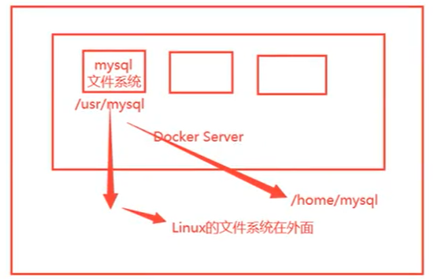
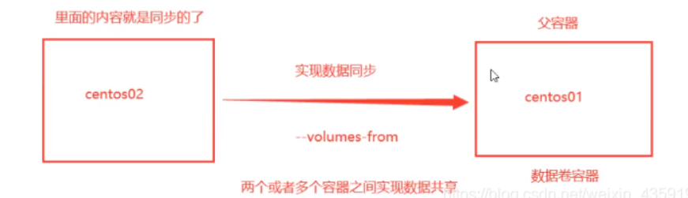

# 一、容器数据卷定义
````
docker的理念是将应用和环境打包成一个镜像！
如果数据都在容器中，那么我们容器删除，数据就会丢失！所以我们就有需求：数据可以持久化

比如：安装了MySQL，容器删除了，相当于删库跑路！所以我们就有需求：MySQL数据可以存储在本地！
所以我们需要容器之间可以有一个数据共享的技术！Docker容器中产生的数据，同步到本地！
这就是数据卷技术！说白了就是目录的挂载，将我们容器内的目录，挂载到Linux上面！

数据卷是存在于一个或多个容器中的特定文件或文件夹，这个文件或文件夹以独立于 docker 文件系统的形式存在于宿主机中。数据卷的最大特定是：其生存周期独立于容器的生存周期。

容器的持久化和同步操作！容器间也是可以数据共享的！
将mysql容器内部的文件系统映射（挂载）到linux上边，实现数据的持久化和同步
````

# 二、使用数据卷
## 1、直接使用命令挂载 -v
````
docker run -it -v 主机目录:容器内目录
# 查看虚拟机 /home目录下的文件
root@jch-virtual-machine:/home/jch# cd /home
root@jch-virtual-machine:/home# ls
jch
# 启动centos容器, 并挂载目录
root@jch-virtual-machine:/home# docker run -it -v /home/ceshi:/home centos /bin/bash
Unable to find image 'centos:latest' locally
latest: Pulling from library/centos
a1d0c7532777: Pull complete 
Digest: sha256:a27fd8080b517143cbbbab9dfb7c8571c40d67d534bbdee55bd6c473f432b177
Status: Downloaded newer image for centos:latest
# 查看容器内 /home目录下的文件
[root@d6af32bcfbaf /]# cd /home
[root@d6af32bcfbaf home]# ls
````
````
# 打开另一个终端
# 查看虚拟机 /home目录下的文件
root@jch-virtual-machine:/home/jch# cd /home
root@jch-virtual-machine:/home# ls
ceshi  jch
# 查看是否挂载成功
root@jch-virtual-machine:/home# docker ps
CONTAINER ID   IMAGE     COMMAND       CREATED         STATUS         PORTS     NAMES
d6af32bcfbaf   centos    "/bin/bash"   4 minutes ago   Up 4 minutes             amazing_yalow
root@jch-virtual-machine:/home# docker inspect d6af32bcfbaf
[
    {
        ...
        "Mounts": [ # 挂载
            {
                "Type": "bind",
                "Source": "/home/ceshi", # 主机内地址
                "Destination": "/home", # docker容器内地址
                "Mode": "",
                "RW": true,
                "Propagation": "rprivate"
            }
        ],
        ...
    }
]
````
## 2、安装MySQL
````
# 1、获取mysql镜像
root@jch-virtual-machine:/home# docker pull mysql:5.7
5.7: Pulling from library/mysql
72a69066d2fe: Pull complete 
93619dbc5b36: Pull complete 
99da31dd6142: Pull complete 
626033c43d70: Pull complete 
37d5d7efb64e: Pull complete 
ac563158d721: Pull complete 
d2ba16033dad: Pull complete 
0ceb82207cd7: Pull complete 
37f2405cae96: Pull complete 
e2482e017e53: Pull complete 
70deed891d42: Pull complete 
Digest: sha256:f2ad209efe9c67104167fc609cca6973c8422939491c9345270175a300419f94
Status: Downloaded newer image for mysql:5.7
docker.io/library/mysql:5.7

# 2、运行容器的时候需要做数据挂载，此处我们挂载了配置文件以及数据目录（有两个哦），同时咱们也配置了mysql的密码
-d 后台运行
-p 端口映射
-v 卷挂载
-e 环境配置
-- name 容器名字
root@jch-virtual-machine:/home# docker run -d -p 3310:3306 -v /home/mysql/conf:/etc/mysql/conf.d -v /home/mysql/data:/var/lib/mysql -e MYSQL_ROOT_PASSWORD=123456 --name mysql01 mysql:5.7
aa01af5b67a7b6a0d37bfe2becbe8b8bf42b0b1612b51a48fc9eee2dd5672df9

# 3、启动之后本地可以连接
本地连接是3310端口，3310端口映射了容器的3306端口，所以本质还是访问到的容器
使用 navicat 创建数据库 test

# 4、进入主机 /home/mysql/data目录查看, 发现刚刚创建的test数据库
root@jch-virtual-machine:/home# cd /home/mysql/data
root@jch-virtual-machine:/home/mysql/data# ls
auto.cnf         client-key.pem  ib_logfile1         private_key.pem  sys
ca-key.pem       ib_buffer_pool  ibtmp1              public_key.pem   test
ca.pem           ibdata1         mysql               server-cert.pem
client-cert.pem  ib_logfile0     performance_schema  server-key.pem

# 5、删除mysql容器
root@jch-virtual-machine:/home# docker rm -f mysql01
mysql01
# test数据库还在, 挂载到本地的数据卷没有丢失, 容器数据持久化成功
root@jch-virtual-machine:/home/mysql/data# ls
auto.cnf         client-key.pem  ib_logfile1         private_key.pem  sys
ca-key.pem       ib_buffer_pool  ibtmp1              public_key.pem   test
ca.pem           ibdata1         mysql               server-cert.pem
client-cert.pem  ib_logfile0     performance_schema  server-key.pem
````
## 3、具名和匿名挂载
* 1、匿名挂载
````
# 使用命令匿名挂载 -v 容器内路径，这里我们没有写主机的路径，那么它就会自动的生成一个目录
root@jch-virtual-machine:/home/jch# docker run -d -P --name nginx01 -v /etc/nginx nginx
c86dc934da08cb71cdfcfd8c1bdc3cce96779063b81b8747600d42764f005917
# 查看所有volume(卷)的情况
root@jch-virtual-machine:/home/jch# docker volume ls
DRIVER    VOLUME NAME
local     51805ad4c2f0f1ff150ef01948d4f006f9e9eca6abe6c2e005dfa13db685737a # 卷名字，这个一串乱码其实是真实存在的目录
````
* 2、具名挂载
````
# 使用命令具名挂载 -v 卷名:容器内路径
root@jch-virtual-machine:/home/jch# docker run -d -P --name nginx02 -v juming-nginx:/etc/nginx nginx
e8fa444960aa3227019a16aa193723c140053255773f57790a27a819fdf88435
root@jch-virtual-machine:/home/jch# docker volume ls
DRIVER    VOLUME NAME
local     51805ad4c2f0f1ff150ef01948d4f006f9e9eca6abe6c2e005dfa13db685737a
local     juming-nginx  # 注:juming-nginx:/etc/nginx, 给/etc/nginx命名为juming-nginx，并没有写主机地址
# 查看这个卷
root@jch-virtual-machine:/home/jch# docker volume inspect juming-nginx
[
    {
        "CreatedAt": "2023-12-13T14:41:04+08:00",
        "Driver": "local",
        "Labels": null,
        "Mountpoint": "/var/lib/docker/volumes/juming-nginx/_data",
        "Name": "juming-nginx",
        "Options": null,
        "Scope": "local"
    }
]
````
* 3、总结
````
所有的docker容器内的卷，没有指定目录的情况下都是在**/var/lib/docker/volumes/自定义的卷名/_data**下, 使用最多的也是具名挂载
````
````
# 三种挂载： 匿名挂载、具名挂载、指定路径挂载
-v 容器内路径			#匿名挂载
-v 卷名：容器内路径		  #具名挂载
-v /宿主机路径：容器内路径 #指定路径挂载 docker volume ls 是查看不到的
````
````
# 通过 -v 容器内路径： ro rw 改变读写权限
ro #readonly 只读
rw #readwrite 可读可写
# 一旦设置了容器的权限, 容器对挂载出来的内容就有限定了。
$ docker run -d -P --name nginx05 -v juming:/etc/nginx:ro nginx # ro 只要看到ro就说明这个路径只能通过宿主机来操作，容器内部是无法操作！
$ docker run -d -P --name nginx05 -v juming:/etc/nginx:rw nginx
````
## 4、初识Dockerfile
````
Dockerfile 就是用来构建docker镜像的构建文件, 它即是命令脚本。

通过这个脚本可以生成镜像, 镜像是一层一层的, 脚本是一个个的命令, 每个命令都是一层。
````
* 1、在主机/home目录下创建一个docker-test-volume文件夹
````
root@jch-virtual-machine:/home# ls
ceshi  jch  mysql
root@jch-virtual-machine:/home# mkdir docker-test-volume
root@jch-virtual-machine:/home# ls
ceshi  docker-test-volume  jch  mysql
````
* 2、然后进入docker-test-volume文件夹
````
root@jch-virtual-machine:/home# cd docker-test-volume/
````
* 3、我们在dockerfile文件夹里边写一个脚本文件
````
root@jch-virtual-machine:/home/docker-test-volume# gedit dockerfile1
````
````
内容如下
# 这里的每个命令都是镜像的一层
# 指令(大写) 参数
FROM centos 					
# 匿名挂载
VOLUME ["volume01","volume02"]

CMD echo "-----end-----"

CMD /bin/bash
````
````
root@jch-virtual-machine:/home/docker-test-volume# cat dockerfile1 
FROM centos 					

VOLUME ["volume01","volume02"]

CMD echo "-----end-----"

CMD /bin/bash
````
* 4、使用脚本去创建自己的镜像
````
root@jch-virtual-machine:/home/docker-test-volume# docker build -f /home/docker-test-volume/dockerfile1 -t jch/centos:1.0 .
[+] Building 0.2s (5/5) FINISHED                                                
 => [internal] load .dockerignore                                          0.0s
 => => transferring context: 2B                                            0.0s
 => [internal] load build definition from dockerfile1                      0.0s
 => => transferring dockerfile: 129B                                       0.0s
 => [internal] load metadata for docker.io/library/centos:latest           0.0s
 => CACHED [1/1] FROM docker.io/library/centos                             0.0s
 => exporting to image                                                     0.0s
 => => exporting layers                                                    0.0s
 => => writing image sha256:5f6352c382306e2ddce0a4220b0d7c1ad60a96a2c5a34  0.0s
 => => naming to docker.io/jch/centos:1.0                                  0.0s

root@jch-virtual-machine:/home/docker-test-volume# docker images
REPOSITORY      TAG       IMAGE ID       CREATED         SIZE
centos          latest    5d0da3dc9764   2 years ago     231MB
jch/centos      1.0       5f6352c38230   2 years ago     231MB
````
* 5、启动自己的容器
````
root@jch-virtual-machine:/home/docker-test-volume# docker images
REPOSITORY      TAG       IMAGE ID       CREATED         SIZE
jch/centos      1.0       5f6352c38230   2 years ago     231MB
centos          latest    5d0da3dc9764   2 years ago     231MB

root@jch-virtual-machine:/home/docker-test-volume# docker run -it 5f6352c38230 /bin/bash

[root@99035567a997 /]# ls -l
total 56
lrwxrwxrwx   1 root root    7 Nov  3  2020 bin -> usr/bin
drwxr-xr-x   5 root root  360 Dec 13 07:20 dev
drwxr-xr-x   1 root root 4096 Dec 13 07:20 etc
drwxr-xr-x   2 root root 4096 Nov  3  2020 home
lrwxrwxrwx   1 root root    7 Nov  3  2020 lib -> usr/lib
lrwxrwxrwx   1 root root    9 Nov  3  2020 lib64 -> usr/lib64
drwx------   2 root root 4096 Sep 15  2021 lost+found
drwxr-xr-x   2 root root 4096 Nov  3  2020 media
drwxr-xr-x   2 root root 4096 Nov  3  2020 mnt
drwxr-xr-x   2 root root 4096 Nov  3  2020 opt
dr-xr-xr-x 310 root root    0 Dec 13 07:20 proc
dr-xr-x---   2 root root 4096 Sep 15  2021 root
drwxr-xr-x  11 root root 4096 Sep 15  2021 run
lrwxrwxrwx   1 root root    8 Nov  3  2020 sbin -> usr/sbin
drwxr-xr-x   2 root root 4096 Nov  3  2020 srv
dr-xr-xr-x  13 root root    0 Dec 13 07:20 sys
drwxrwxrwt   7 root root 4096 Sep 15  2021 tmp
drwxr-xr-x  12 root root 4096 Sep 15  2021 usr
drwxr-xr-x  20 root root 4096 Sep 15  2021 var
# 这两个目录是生成镜像的时候自动挂载的, 数据卷目录
# 这个卷和外部一定有一个同步的目录
drwxr-xr-x   2 root root 4096 Dec 13 07:20 volume01
drwxr-xr-x   2 root root 4096 Dec 13 07:20 volume02
````
# 三、数据卷容器

* 1、测试 启动3个容器，通过刚才自己写的镜像启动
* 2、启动第一个centos
````
root@jch-virtual-machine:/home/docker-test-volume# docker images
REPOSITORY      TAG       IMAGE ID       CREATED         SIZE
centos          latest    5d0da3dc9764   2 years ago     231MB
jch/centos      1.0       5f6352c38230   2 years ago     231MB

root@jch-virtual-machine:/home/docker-test-volume# docker run -it --name docker0001 jch/centos:1.0

[root@56b5aa2bb656 /]# ls -l
total 56
lrwxrwxrwx   1 root root    7 Nov  3  2020 bin -> usr/bin
drwxr-xr-x   5 root root  360 Dec 13 07:34 dev
drwxr-xr-x   1 root root 4096 Dec 13 07:34 etc
drwxr-xr-x   2 root root 4096 Nov  3  2020 home
lrwxrwxrwx   1 root root    7 Nov  3  2020 lib -> usr/lib
lrwxrwxrwx   1 root root    9 Nov  3  2020 lib64 -> usr/lib64
drwx------   2 root root 4096 Sep 15  2021 lost+found
drwxr-xr-x   2 root root 4096 Nov  3  2020 media
drwxr-xr-x   2 root root 4096 Nov  3  2020 mnt
drwxr-xr-x   2 root root 4096 Nov  3  2020 opt
dr-xr-xr-x 316 root root    0 Dec 13 07:34 proc
dr-xr-x---   2 root root 4096 Sep 15  2021 root
drwxr-xr-x  11 root root 4096 Sep 15  2021 run
lrwxrwxrwx   1 root root    8 Nov  3  2020 sbin -> usr/sbin
drwxr-xr-x   2 root root 4096 Nov  3  2020 srv
dr-xr-xr-x  13 root root    0 Dec 13 07:20 sys
drwxrwxrwt   7 root root 4096 Sep 15  2021 tmp
drwxr-xr-x  12 root root 4096 Sep 15  2021 usr
drwxr-xr-x  20 root root 4096 Sep 15  2021 var
drwxr-xr-x   2 root root 4096 Dec 13 07:34 volume01
drwxr-xr-x   2 root root 4096 Dec 13 07:34 volume02
````
````
ctrl+p+q退出容器
````
* 3、创建第二个容器docker0002，继承docker0001
````
# docker0002 --volumes-from docker0001 相当于 docker0002 extends docker0001
[root@56b5aa2bb656 /]# root@jch-virtual-machine:/home/docker-test-volume# docker run -it --name docker0002 --volumes-from docker0001 jch/centos:1.0

[root@f35e339484fe /]# ls -l
total 56
lrwxrwxrwx   1 root root    7 Nov  3  2020 bin -> usr/bin
drwxr-xr-x   5 root root  360 Dec 13 07:40 dev
drwxr-xr-x   1 root root 4096 Dec 13 07:40 etc
drwxr-xr-x   2 root root 4096 Nov  3  2020 home
lrwxrwxrwx   1 root root    7 Nov  3  2020 lib -> usr/lib
lrwxrwxrwx   1 root root    9 Nov  3  2020 lib64 -> usr/lib64
drwx------   2 root root 4096 Sep 15  2021 lost+found
drwxr-xr-x   2 root root 4096 Nov  3  2020 media
drwxr-xr-x   2 root root 4096 Nov  3  2020 mnt
drwxr-xr-x   2 root root 4096 Nov  3  2020 opt
dr-xr-xr-x 316 root root    0 Dec 13 07:40 proc
dr-xr-x---   2 root root 4096 Sep 15  2021 root
drwxr-xr-x  11 root root 4096 Sep 15  2021 run
lrwxrwxrwx   1 root root    8 Nov  3  2020 sbin -> usr/sbin
drwxr-xr-x   2 root root 4096 Nov  3  2020 srv
dr-xr-xr-x  13 root root    0 Dec 13 07:20 sys
drwxrwxrwt   7 root root 4096 Sep 15  2021 tmp
drwxr-xr-x  12 root root 4096 Sep 15  2021 usr
drwxr-xr-x  20 root root 4096 Sep 15  2021 var
drwxr-xr-x   2 root root 4096 Dec 13 07:34 volume01
drwxr-xr-x   2 root root 4096 Dec 13 07:34 volume02
````
* 4、在docker0001中的volume01中创建文件，然后在docker0002中的volume01中查看
````
# 打开一个新终端
root@jch-virtual-machine:/home/jch# docker attach 56b5aa2bb656
[root@56b5aa2bb656 /]# ls -l
total 56
lrwxrwxrwx   1 root root    7 Nov  3  2020 bin -> usr/bin
drwxr-xr-x   5 root root  360 Dec 13 07:34 dev
drwxr-xr-x   1 root root 4096 Dec 13 07:34 etc
drwxr-xr-x   2 root root 4096 Nov  3  2020 home
lrwxrwxrwx   1 root root    7 Nov  3  2020 lib -> usr/lib
lrwxrwxrwx   1 root root    9 Nov  3  2020 lib64 -> usr/lib64
drwx------   2 root root 4096 Sep 15  2021 lost+found
drwxr-xr-x   2 root root 4096 Nov  3  2020 media
drwxr-xr-x   2 root root 4096 Nov  3  2020 mnt
drwxr-xr-x   2 root root 4096 Nov  3  2020 opt
dr-xr-xr-x 319 root root    0 Dec 13 07:34 proc
dr-xr-x---   2 root root 4096 Sep 15  2021 root
drwxr-xr-x  11 root root 4096 Sep 15  2021 run
lrwxrwxrwx   1 root root    8 Nov  3  2020 sbin -> usr/sbin
drwxr-xr-x   2 root root 4096 Nov  3  2020 srv
dr-xr-xr-x  13 root root    0 Dec 13 07:20 sys
drwxrwxrwt   7 root root 4096 Sep 15  2021 tmp
drwxr-xr-x  12 root root 4096 Sep 15  2021 usr
drwxr-xr-x  20 root root 4096 Sep 15  2021 var
drwxr-xr-x   2 root root 4096 Dec 13 07:34 volume01
drwxr-xr-x   2 root root 4096 Dec 13 07:34 volume02
[root@56b5aa2bb656 /]# cd volume01
[root@56b5aa2bb656 volume01]# touch docker01
````
````
# 在docker0002容器内查看, 文件同步过来了
[root@f35e339484fe /]# cd volume01
[root@f35e339484fe volume01]# ls
docker01
````
* 5、创建第三个容器docker0003，继承docker0001
````
root@jch-virtual-machine:/home/docker-test-volume# docker run -it --name docker0003 --volumes-from docker0001 jch/centos:1.0

[root@85bb7728f43f /]# ls -l
total 56
lrwxrwxrwx   1 root root    7 Nov  3  2020 bin -> usr/bin
drwxr-xr-x   5 root root  360 Dec 13 07:51 dev
drwxr-xr-x   1 root root 4096 Dec 13 07:51 etc
drwxr-xr-x   2 root root 4096 Nov  3  2020 home
lrwxrwxrwx   1 root root    7 Nov  3  2020 lib -> usr/lib
lrwxrwxrwx   1 root root    9 Nov  3  2020 lib64 -> usr/lib64
drwx------   2 root root 4096 Sep 15  2021 lost+found
drwxr-xr-x   2 root root 4096 Nov  3  2020 media
drwxr-xr-x   2 root root 4096 Nov  3  2020 mnt
drwxr-xr-x   2 root root 4096 Nov  3  2020 opt
dr-xr-xr-x 319 root root    0 Dec 13 07:51 proc
dr-xr-x---   2 root root 4096 Sep 15  2021 root
drwxr-xr-x  11 root root 4096 Sep 15  2021 run
lrwxrwxrwx   1 root root    8 Nov  3  2020 sbin -> usr/sbin
drwxr-xr-x   2 root root 4096 Nov  3  2020 srv
dr-xr-xr-x  13 root root    0 Dec 13 07:20 sys
drwxrwxrwt   7 root root 4096 Sep 15  2021 tmp
drwxr-xr-x  12 root root 4096 Sep 15  2021 usr
drwxr-xr-x  20 root root 4096 Sep 15  2021 var
drwxr-xr-x   2 root root 4096 Dec 13 07:44 volume01
drwxr-xr-x   2 root root 4096 Dec 13 07:34 volume02

[root@85bb7728f43f /]# cd volume01
[root@85bb7728f43f volume01]# ls
docker01
````
* 6、在docker0003中的volume01中创建文件，然后在docker0001中的volume01中查看
````
[root@85bb7728f43f volume01]# touch docker03
````
````
# docker0003创建的文件，docker0001可以查询到，说明容器之间的数据形成了共享(本质是指向了宿主机上的同一块地址)
[root@56b5aa2bb656 volume01]# ls
docker01  docker03
````
* 7、此时删除或者停掉docker0001，我们查看docker0002和docker0003的数据依旧能够查询到，说明数据存在于宿主机中
* 8、结论
````
容器之间的配置信息的传递，数据卷容器的生命周期一直持续到没有容器使用为止。

但是一旦你持久化到了本地，这个时候，本地的数据是不会删除的!
````