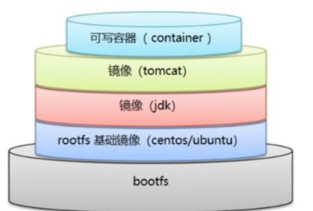

# 一、DockerFile介绍
* 1、定义
````
dockerfile是用来构建docker镜像的文件！命令参数脚本！
````
* 2、构建步骤
````
1、编写一个dockerfile文件
2、docker build 构建称为一个镜像
3、docker run运行镜像
4、docker push发布镜像(DockerHub 、阿里云仓库)
````
* 3、查看官方是怎么做
````
FROM scratch
ADD centos-7-aarch64-docker.tar.xz /

LABEL \
    org.label-schema.schema-version="1.0" \
    org.label-schema.name="CentOS Base Image" \
    org.label-schema.vendor="CentOS" \
    org.label-schema.license="GPLv2" \
    org.label-schema.build-date="20201113" \
    org.opencontainers.image.title="CentOS Base Image" \
    org.opencontainers.image.vendor="CentOS" \
    org.opencontainers.image.licenses="GPL-2.0-only" \
    org.opencontainers.image.created="2020-11-13 00:00:00+00:00"

CMD ["/bin/bash"]
````
````
很多官方镜像都是基础包，很多功能没有，我们通常会自己搭建自己的镜像！比如：centos+jdk+tomcat+redis等等
````
# 二、DockerFile构建过程
* 1、dockerfile基础知识
````
1、每个保留关键字（指令）都是必须是大写字母
2、执行从上到下顺序
3、#表示注释
4、每一个指令都会创建提交一个新的镜像层，并提交!
````

* 2、dockerfile作用
````
1、Dockerfile是面向开发的，我们以后要发布项目，做镜像，就需要编写dockerfile文件，这个文件十分简单！
2、Docker镜像逐渐成企业交付的标准，必须要掌握！
````
* 3、DockerFile、images、容器之间的关系
````
DockerFile：构建文件，定义了一切的步骤，源代码
DockerImages：通过DockerFile构建生成的镜像，最终发布和运行产品。原来是一个jar包或者war包，之后我们都要整成docker镜像来使用
Docker容器：容器就是镜像运行起来提供服务。
````
# 三、DockerFile的指令
````
FROM				# from:基础镜像，一切从这里开始构建
MAINTAINER			# maintainer:镜像是谁写的， 姓名+邮箱
RUN					# run:镜像构建的时候需要运行的命令
ADD					# add:步骤，tomcat镜像，这个tomcat压缩包！添加内容 添加同目录
WORKDIR				# workdir:镜像的工作目录
VOLUME				# volume:挂载的目录位置
EXPOSE				# expose:暴露端口配置
CMD					# cmd:指定这个容器启动的时候要运行的命令，只有最后一个会生效，可被替代
ENTRYPOINT			# entrypoint:指定这个容器启动的时候要运行的命令，可以追加命令
ONBUILD				# onbuild:当构建一个被继承DockerFile这个时候就会运行onbuild的指令，是触发指令
COPY				# copy:类似ADD，将我们文件拷贝到镜像中
ENV					# env:构建的时候设置环境变量！
````
# 四、实战测试
````
Dockerhub中99%的镜像都是由FROM scratch开始的，然后配置需要的软件和配置来进行构建
````
## 1、DockerFile制作centos
* 1、/home下新建dockerfile目录，并进入
````
root@jch-virtual-machine:/# cd /home
root@jch-virtual-machine:/home# ls
ceshi  docker-test-volume  jch  mysql
root@jch-virtual-machine:/home# mkdir dockerfile
root@jch-virtual-machine:/home# cd dockerfile/
root@jch-virtual-machine:/home/dockerfile# ls
````
* 2、启动官方的centos镜像
````
root@jch-virtual-machine:/home/jch# docker images
REPOSITORY      TAG       IMAGE ID       CREATED         SIZE
centos          latest    5d0da3dc9764   2 years ago     231MB
root@jch-virtual-machine:/home/jch# docker run -it centos
# 发现缺少一些命令
[root@9980ee8e1bfe /]# pwd
/
[root@9980ee8e1bfe /]# vim
bash: vim: command not found
[root@9980ee8e1bfe /]# ifconfig
bash: ifconfig: command not found
````
* 3、dockerfile目录下新建mydockerfile-centos文件
````
root@jch-virtual-machine:/home/dockerfile# vi mydockerfile-centos
````
````
内容如下

FROM centos:7
MAINTAINER jch<test@qq.com>

ENV MYPATH /usr/local
WORKDIR $MYPATH

RUN yum -y install vim
RUN yum -y install net-tools

EXPOSE 80

CMD echo $MYPATH
CMD echo "----end----"
CMD /bin/bash
````
* 4、通过mydockerfile-centos文件构建镜像
````
#语法：docker build -f dockerfile的文件路径 -t 镜像名:[tag] .
root@jch-virtual-machine:/home/dockerfile# docker build -f mydockerfile-centos -t mycentos:1.0 .
Building 118.5s (8/8) FINISHED       
````
* 5、查看我们构建的镜像
````
root@jch-virtual-machine:/home/dockerfile# docker images                        
REPOSITORY      TAG       IMAGE ID       CREATED              SIZE              
mycentos        1.0       021c1b8a22ea   About a minute ago   687MB
````
* 6、测试运行
````
root@jch-virtual-machine:/home/dockerfile# docker run -it mycentos:1.0
# 工作目录变成了/usr/local
[root@8b59ae95ae05 local]# pwd
/usr/local
# 使用vim以及ifconfig命令
[root@8b59ae95ae05 local]# ifconfig
eth0: flags=4163<UP,BROADCAST,RUNNING,MULTICAST>  mtu 1500
        inet 172.17.0.2  netmask 255.255.0.0  broadcast 172.17.255.255
        ether 02:42:ac:11:00:02  txqueuelen 0  (Ethernet)
        RX packets 24  bytes 2995 (2.9 KiB)
        RX errors 0  dropped 0  overruns 0  frame 0
        TX packets 0  bytes 0 (0.0 B)
        TX errors 0  dropped 0 overruns 0  carrier 0  collisions 0

lo: flags=73<UP,LOOPBACK,RUNNING>  mtu 65536
        inet 127.0.0.1  netmask 255.0.0.0
        loop  txqueuelen 1000  (Local Loopback)
        RX packets 0  bytes 0 (0.0 B)
        RX errors 0  dropped 0  overruns 0  frame 0
        TX packets 0  bytes 0 (0.0 B)
        TX errors 0  dropped 0 overruns 0  carrier 0  collisions 0

[root@8b59ae95ae05 local]# vim test
````
* 7、查看镜像的构建过程
````
#命令：docker history 镜像id

root@jch-virtual-machine:/home/dockerfile# docker history 021c1b8a22ea
IMAGE          CREATED         CREATED BY                                       SIZE      COMMENT
021c1b8a22ea   5 minutes ago   CMD ["/bin/sh" "-c" "/bin/bash"]                 0B        buildkit.dockerfile.v0
<missing>      5 minutes ago   CMD ["/bin/sh" "-c" "echo \"----end----\""]      0B        buildkit.dockerfile.v0
<missing>      5 minutes ago   CMD ["/bin/sh" "-c" "echo $MYPATH"]              0B        buildkit.dockerfile.v0
<missing>      5 minutes ago   EXPOSE map[80/tcp:{}]                            0B        buildkit.dockerfile.v0
<missing>      5 minutes ago   RUN /bin/sh -c yum -y install net-tools # bu…   198MB     buildkit.dockerfile.v0
<missing>      5 minutes ago   RUN /bin/sh -c yum -y install vim # buildkit     285MB     buildkit.dockerfile.v0
<missing>      6 minutes ago   WORKDIR /usr/local                               0B        buildkit.dockerfile.v0
<missing>      6 minutes ago   ENV MYPATH=/usr/local                            0B        buildkit.dockerfile.v0
<missing>      6 minutes ago   MAINTAINER jch<test@qq.com>                      0B        buildkit.dockerfile.v0
<missing>      2 years ago     /bin/sh -c #(nop)  CMD ["/bin/bash"]             0B        
<missing>      2 years ago     /bin/sh -c #(nop)  LABEL org.label-schema.sc…   0B        
<missing>      2 years ago     /bin/sh -c #(nop) ADD file:b3ebbe8bd304723d4…   204MB     
````
## 2、CMD命令
* 1. 编写dockerfile-test-cmd文件
````
root@jch-virtual-machine:/home/dockerfile# vi dockerfile-cmd-test
````
````
#dockerfile-test-cmd的内容如下：

FROM centos:7
CMD ["ls","-a"]
````
* 2、构建镜像
````
root@jch-virtual-machine:/home/dockerfile# docker build -f dockerfile-cmd-test -t cmdtest .
[+] Building 16.2s (5/5) FINISHED     
````
* 3、run命令执行，发现”ls -a“的命令生效
````
root@jch-virtual-machine:/home/dockerfile# docker images
REPOSITORY   TAG       IMAGE ID       CREATED       SIZE
cmdtest      latest    06f2cc65ea4a   2 years ago   204MB
root@jch-virtual-machine:/home/dockerfile# docker run 06f2cc65ea4a
.
..
.dockerenv
anaconda-post.log
bin
dev
etc
home
lib
lib64
media
mnt
opt
proc
root
run
sbin
srv
sys
tmp
usr
var
````
* 4、此时如果我们想追加一个"-l"命令，我们期望能实现"ls -al"的效果
````
root@jch-virtual-machine:/home/jch# docker run 06f2cc65ea4a -l
docker: Error response from daemon: failed to create task for container: failed to create shim task: OCI runtime create failed: runc create failed: unable to start container process: exec: "-l": executable file not found in $PATH: unknown.
ERRO[0000] error waiting for container: 

#分析：在使用cmd的情况下“-l”替换了CMD的["ls","-a"]命令，但是“-l”不是命令，所以报错

#带着这个问题去测试ENTRYPOINT
````
* 5、使用 ls -al 替换 CMD的["ls","-a"]
````
root@jch-virtual-machine:/home/jch# docker run 06f2cc65ea4a ls -al
total 64
drwxr-xr-x   1 root root  4096 Dec 13 11:50 .
drwxr-xr-x   1 root root  4096 Dec 13 11:50 ..
-rwxr-xr-x   1 root root     0 Dec 13 11:50 .dockerenv
-rw-r--r--   1 root root 12114 Nov 13  2020 anaconda-post.log
lrwxrwxrwx   1 root root     7 Nov 13  2020 bin -> usr/bin
drwxr-xr-x   5 root root   340 Dec 13 11:50 dev
drwxr-xr-x   1 root root  4096 Dec 13 11:50 etc
drwxr-xr-x   2 root root  4096 Apr 11  2018 home
lrwxrwxrwx   1 root root     7 Nov 13  2020 lib -> usr/lib
lrwxrwxrwx   1 root root     9 Nov 13  2020 lib64 -> usr/lib64
drwxr-xr-x   2 root root  4096 Apr 11  2018 media
drwxr-xr-x   2 root root  4096 Apr 11  2018 mnt
drwxr-xr-x   2 root root  4096 Apr 11  2018 opt
dr-xr-xr-x 300 root root     0 Dec 13 11:50 proc
dr-xr-x---   2 root root  4096 Nov 13  2020 root
drwxr-xr-x  11 root root  4096 Nov 13  2020 run
lrwxrwxrwx   1 root root     8 Nov 13  2020 sbin -> usr/sbin
drwxr-xr-x   2 root root  4096 Apr 11  2018 srv
dr-xr-xr-x  13 root root     0 Dec 13 11:50 sys
drwxrwxrwt   7 root root  4096 Nov 13  2020 tmp
drwxr-xr-x  13 root root  4096 Nov 13  2020 usr
drwxr-xr-x  18 root root  4096 Nov 13  2020 var
````
## 3、ENTRYPOINT命令
* 1、编写dockerfile-test-entrypoint文件
````
root@jch-virtual-machine:/home/dockerfile# vi dockerfile-cmd-entrypoint
````
````
内容如下
FROM centos:7
ENTRYPOINT ["ls","-a"]
````
* 2、构建镜像
````
root@jch-virtual-machine:/home/dockerfile# docker build -f dockerfile-cmd-entrypoint -t entrypoint-test .
[+] Building 0.3s (5/5) FINISHED
````
* 3、运行镜像
````
root@jch-virtual-machine:/home/dockerfile# docker images
REPOSITORY        TAG       IMAGE ID       CREATED       SIZE
cmdtest           latest    06f2cc65ea4a   2 years ago   204MB
centos            7         eeb6ee3f44bd   2 years ago   204MB
entrypoint-test   latest    5184c7d459a0   2 years ago   204MB
root@jch-virtual-machine:/home/dockerfile# docker run 5184c7d459a0
.
..
.dockerenv
anaconda-post.log
bin
dev
etc
home
lib
lib64
media
mnt
opt
proc
root
run
sbin
srv
sys
tmp
usr
var
````
* 4、此时如果我们想追加一个"-l"命令，我们期望能实现"ls -al"的效果
````
#我们的命令，是直接拼接在我们得ENTRYPOINT命令后面的

root@jch-virtual-machine:/home/dockerfile# docker run 5184c7d459a0 -l
total 64
drwxr-xr-x   1 root root  4096 Dec 13 12:00 .
drwxr-xr-x   1 root root  4096 Dec 13 12:00 ..
-rwxr-xr-x   1 root root     0 Dec 13 12:00 .dockerenv
-rw-r--r--   1 root root 12114 Nov 13  2020 anaconda-post.log
lrwxrwxrwx   1 root root     7 Nov 13  2020 bin -> usr/bin
drwxr-xr-x   5 root root   340 Dec 13 12:00 dev
drwxr-xr-x   1 root root  4096 Dec 13 12:00 etc
drwxr-xr-x   2 root root  4096 Apr 11  2018 home
lrwxrwxrwx   1 root root     7 Nov 13  2020 lib -> usr/lib
lrwxrwxrwx   1 root root     9 Nov 13  2020 lib64 -> usr/lib64
drwxr-xr-x   2 root root  4096 Apr 11  2018 media
drwxr-xr-x   2 root root  4096 Apr 11  2018 mnt
drwxr-xr-x   2 root root  4096 Apr 11  2018 opt
dr-xr-xr-x 302 root root     0 Dec 13 12:00 proc
dr-xr-x---   2 root root  4096 Nov 13  2020 root
drwxr-xr-x  11 root root  4096 Nov 13  2020 run
lrwxrwxrwx   1 root root     8 Nov 13  2020 sbin -> usr/sbin
drwxr-xr-x   2 root root  4096 Apr 11  2018 srv
dr-xr-xr-x  13 root root     0 Dec 13 11:50 sys
drwxrwxrwt   7 root root  4096 Nov 13  2020 tmp
drwxr-xr-x  13 root root  4096 Nov 13  2020 usr
drwxr-xr-x  18 root root  4096 Nov 13  2020 var
````
## 4、DockerFile制作tomcat镜像
* 1、准备tomcat和jdk的压缩包
````
root@jch-virtual-machine:/#  cd /home/tomcat/
root@jch-virtual-machine:/home/tomcat# ls
apache-tomcat-9.0.84.tar.gz  jdk-8u202-linux-x64.tar.gz
````
* 2、# 创建readme.txt文件
````
root@jch-virtual-machine:/home/tomcat# touch readme.txt
````
* 3、编写Dockerfile文件(如果dockerfile的名称为"Dockerfile"，build会自动找寻这个文件，不需要再去使用"-f"指定)
````
# 创建Dockerfile文件
root@jch-virtual-machine:/home/tomcat# vi Dockerfile
````
````
Dockerfile文件内容如下
FROM centos:7
MAINTAINER jch<test@qq.com>

COPY readme.txt /usr/local/readme.txt

ADD jdk-8u202-linux-x64.tar.gz /usr/local/
ADD apache-tomcat-9.0.84.tar.gz /usr/local/

RUN yum -y install vim

ENV MYPATH /usr/local
WORKDIR $MYPATH

ENV JAVA_HOME /usr/local/jdk1.8.0_202
ENV CLASSPATH $JAVA_HOME/lib/dt.jar:$JAVA_HOME/lib/tools.jar
ENV CATALINA_HOME /usr/local/apache-tomcat-9.0.84
ENV CATALINA_BASH /usr/local/apache-tomcat-9.0.84
ENV PATH $PATH:$JAVA_HOME/bin:$CATALINA_HOME/lib:$CATALINA_HOME/bin

EXPOSE 8080

CMD /usr/local/apache-tomcat-9.0.84/bin/startup.sh && tail -F /usr/local/apache-tomcat-9.0.84/logs/catalina.out
````
* 4、构建镜像
````
root@jch-virtual-machine:/home/tomcat# docker build -t diytomcat:1.0 .
[+] Building 53.9s (11/11) FINISHED

root@jch-virtual-machine:/home/tomcat# docker images                                                                                                                                 
REPOSITORY        TAG       IMAGE ID       CREATED         SIZE
diytomcat         1.0       c0fbc67a9980   7 seconds ago   913MB
````
* 5、通过镜像运行容器
````
root@jch-virtual-machine:/home/tomcat# docker run -d -p 9090:8080 --name jchtomcat -v /home/tomcat/test:/usr/local/apache-tomcat-9.0.84/webapps/test -v /home/tomcat/tomcatlogs:/usr/local/apache-tomcat-9.0.84/logs diytomcat:1.0
31efc08d36ff979c34bb795e9bcb05a79cc7e2c6cc6ad460188e05c20658f095
````
* 6、访问测试
````
root@jch-virtual-machine:/home/tomcat# docker exec -it 31efc08d36ff979c34bb795e9bcb05a79cc7e2c6cc6ad460188e05c20658f095 /bin/bash

[root@322599b32604 local]# ls -l
total 52
drwxr-xr-x 1 root root 4096 Dec 14 02:33 apache-tomcat-9.0.84
drwxr-xr-x 2 root root 4096 Apr 11  2018 bin
drwxr-xr-x 2 root root 4096 Apr 11  2018 etc
drwxr-xr-x 2 root root 4096 Apr 11  2018 games
drwxr-xr-x 2 root root 4096 Apr 11  2018 include
drwxr-xr-x 7   10  143 4096 Dec 15  2018 jdk1.8.0_202
drwxr-xr-x 2 root root 4096 Apr 11  2018 lib
drwxr-xr-x 2 root root 4096 Apr 11  2018 lib64
drwxr-xr-x 2 root root 4096 Apr 11  2018 libexec
-rw-r--r-- 1 root root    0 Dec 14 02:12 readme.txt
drwxr-xr-x 2 root root 4096 Apr 11  2018 sbin
drwxr-xr-x 5 root root 4096 Nov 13  2020 share
drwxr-xr-x 2 root root 4096 Apr 11  2018 src

# 本地测试可以访问
[root@31efc08d36ff local]# curl localhost:8080

# 外网 http://192.168.48.128:9090/ 可以访问
````
* 7、发布项目
````
# 在/home/tomcat/test/ 下创建目录 WEB-INF
root@jch-virtual-machine:/# cd /home/tomcat/test/
root@jch-virtual-machine:/home/tomcat/test# mkdir WEB-INF
root@jch-virtual-machine:/home/tomcat/test# ls
WEB-INF
````
````
# 在WEB-INF下创建web.xml
root@jch-virtual-machine:/home/tomcat/test# cd WEB-INF/
root@jch-virtual-machine:/home/tomcat/test/WEB-INF# vi web.xml

# web.xml中内容如下

<?xml version="1.0" encoding="UTF-8"?>
<web-app version="2.4" 
    xmlns="http://java.sun.com/xml/ns/j2ee" 
    xmlns:xsi="http://www.w3.org/2001/XMLSchema-instance"
    xsi:schemaLocation="http://java.sun.com/xml/ns/j2ee 
        http://java.sun.com/xml/ns/j2ee/web-app_2_4.xsd">
        
</web-app>
````
````
# 在test下创建index.jsp
root@jch-virtual-machine:/home/tomcat/test/WEB-INF# cd ..
root@jch-virtual-machine:/home/tomcat/test# ls
WEB-INF
root@jch-virtual-machine:/home/tomcat/test# vi index.jsp

# index.jsp内容如下
<%@ page language="java" contentType="text/html; charset=UTF-8"
    pageEncoding="UTF-8"%>
<!DOCTYPE html>
<html>
<head>
<meta charset="utf-8">
<title>hello. xiaofan</title>
</head>
<body>
Hello World!<br/>
<%
System.out.println("-----my test web logs------");
%>
</body>
</html>
````
````
访问 http://192.168.48.128:9090/test/

Hello World!
````