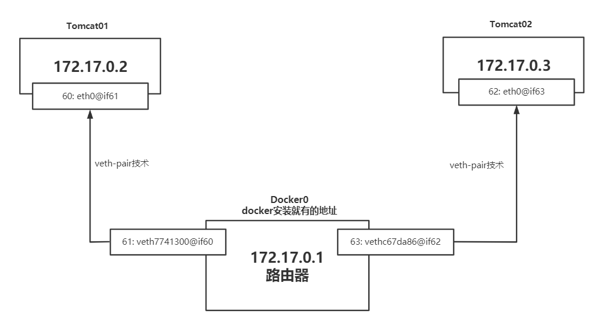
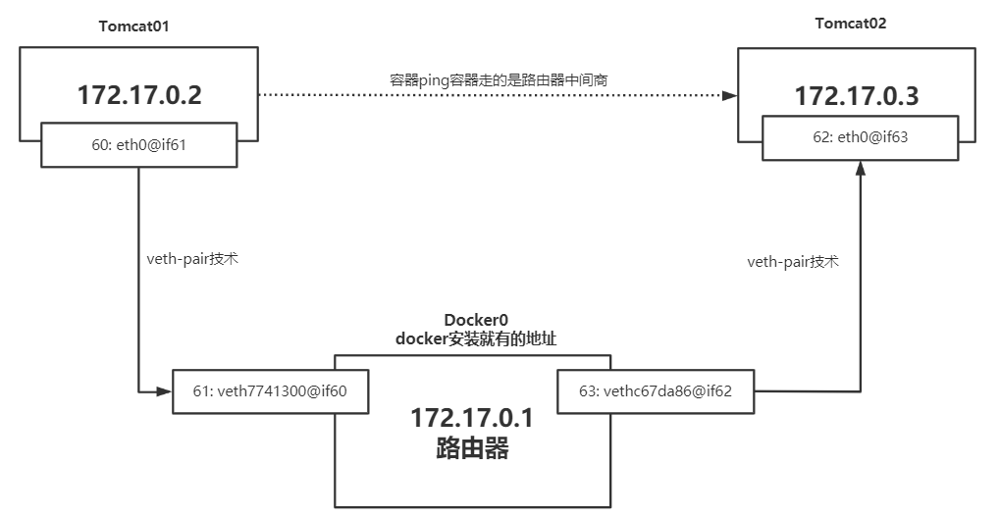
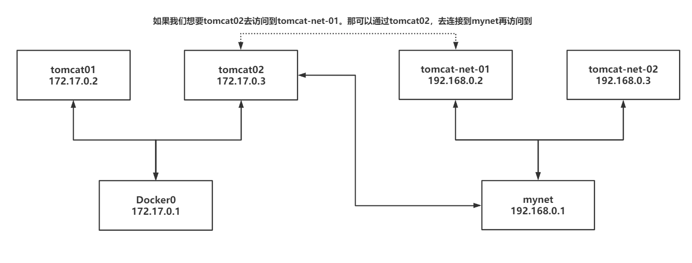

# 一、理解Docker0
## 1、学习之前清空下前面的docker 镜像、容器
````
# 删除全部容器
$ docker rm -f $(docker ps -aq)

# 删除全部镜像
$ docker rmi -f $(docker images -aq)
````
## 2、测试docker网络
* 1、获取ip地址
````
root@jch-virtual-machine:/# ip addr
1: lo: <LOOPBACK,UP,LOWER_UP> mtu 65536 qdisc noqueue state UNKNOWN group default qlen 1000
    link/loopback 00:00:00:00:00:00 brd 00:00:00:00:00:00
    #本机环回地址
    inet 127.0.0.1/8 scope host lo 
       valid_lft forever preferred_lft forever
    inet6 ::1/128 scope host 
       valid_lft forever preferred_lft forever
2: ens32: <BROADCAST,MULTICAST,UP,LOWER_UP> mtu 1500 qdisc fq_codel state UNKNOWN group default qlen 1000
    link/ether 00:0c:29:01:00:77 brd ff:ff:ff:ff:ff:ff
    #阿里云内网地址
    inet 192.168.48.128/24 brd 192.168.48.255 scope global dynamic noprefixroute ens32
       valid_lft 1502sec preferred_lft 1502sec
    inet6 fe80::e4c7:a119:5610:eca8/64 scope link noprefixroute 
       valid_lft forever preferred_lft forever
3: docker0: <NO-CARRIER,BROADCAST,MULTICAST,UP> mtu 1500 qdisc noqueue state DOWN group default 
    link/ether 02:42:e9:ba:a2:ab brd ff:ff:ff:ff:ff:ff
    #docker0地址
    inet 172.17.0.1/16 brd 172.17.255.255 scope global docker0
       valid_lft forever preferred_lft forever
````
* 2、问题： docker 是如何处理容器网络访问的?
````
比如现在有一个tomcat，它是如何连接到mysql的

# 1、启动一个tomcat
root@jch-virtual-machine:/# docker run -d -P --name tomcat01 tomcat
Unable to find image 'tomcat:latest' locally
latest: Pulling from library/tomcat
0e29546d541c: Pull complete 
9b829c73b52b: Pull complete 
cb5b7ae36172: Pull complete 
6494e4811622: Pull complete 
668f6fcc5fa5: Pull complete 
dc120c3e0290: Pull complete 
8f7c0eebb7b1: Pull complete 
77b694f83996: Pull complete 
0f611256ec3a: Pull complete 
4f25def12f23: Pull complete 
Digest: sha256:9dee185c3b161cdfede1f5e35e8b56ebc9de88ed3a79526939701f3537a52324
Status: Downloaded newer image for tomcat:latest
62e4766a98c24230f7c6a60e774146780f1d27a969b984ce924bfe34d9d7a9b2

# 2、进入容器内部
root@jch-virtual-machine:/# docker exec -it 62e4766a98c2 /bin/bash
root@62e4766a98c2:/usr/local/tomcat# 

# 3、查看容器内部网络地址
root@62e4766a98c2:/usr/local/tomcat# apt update
root@62e4766a98c2:/usr/local/tomcat# apt install -y iproute2
root@62e4766a98c2:/usr/local/tomcat# ip addr
1: lo: <LOOPBACK,UP,LOWER_UP> mtu 65536 qdisc noqueue state UNKNOWN group default qlen 1000
    link/loopback 00:00:00:00:00:00 brd 00:00:00:00:00:00
    inet 127.0.0.1/8 scope host lo
       valid_lft forever preferred_lft forever
4: eth0@if5: <BROADCAST,MULTICAST,UP,LOWER_UP> mtu 1500 qdisc noqueue state UP group default 
    link/ether 02:42:ac:11:00:02 brd ff:ff:ff:ff:ff:ff link-netnsid 0
    inet 172.17.0.2/16 brd 172.17.255.255 scope global eth0
       valid_lft forever preferred_lft forever

# 4、linux可以ping通容器内部
root@62e4766a98c2:/usr/local/tomcat# apt install iputils-ping

root@62e4766a98c2:/usr/local/tomcat# ping 172.17.0.2
PING 172.17.0.2 (172.17.0.2) 56(84) bytes of data.
64 bytes from 172.17.0.2: icmp_seq=1 ttl=64 time=0.022 ms
64 bytes from 172.17.0.2: icmp_seq=2 ttl=64 time=0.029 ms
64 bytes from 172.17.0.2: icmp_seq=3 ttl=64 time=0.026 ms
^C
--- 172.17.0.2 ping statistics ---
5 packets transmitted, 5 received, 0% packet loss, time 4111ms
rtt min/avg/max/mdev = 0.022/0.025/0.029/0.002 ms
````
# 二、原理
* 1、我们每启动一个docker容器，docker就会给docker容器分配一个ip，我们只要安装了docker，就会有一个网卡docker0（桥接模式），使用的技术是veth-pair技术
* 2、再次查看宿主机 ip addr
````
root@jch-virtual-machine:/home/jch# ip addr
1: lo: <LOOPBACK,UP,LOWER_UP> mtu 65536 qdisc noqueue state UNKNOWN group default qlen 1000
    link/loopback 00:00:00:00:00:00 brd 00:00:00:00:00:00
    inet 127.0.0.1/8 scope host lo
       valid_lft forever preferred_lft forever
    inet6 ::1/128 scope host 
       valid_lft forever preferred_lft forever
2: ens32: <BROADCAST,MULTICAST,UP,LOWER_UP> mtu 1500 qdisc fq_codel state UNKNOWN group default qlen 1000
    link/ether 00:0c:29:01:00:77 brd ff:ff:ff:ff:ff:ff
    inet 192.168.48.128/24 brd 192.168.48.255 scope global dynamic noprefixroute ens32
       valid_lft 1322sec preferred_lft 1322sec
    inet6 fe80::e4c7:a119:5610:eca8/64 scope link noprefixroute 
       valid_lft forever preferred_lft forever
3: docker0: <BROADCAST,MULTICAST,UP,LOWER_UP> mtu 1500 qdisc noqueue state UP group default 
    link/ether 02:42:48:d4:1a:d5 brd ff:ff:ff:ff:ff:ff
    inet 172.17.0.1/16 brd 172.17.255.255 scope global docker0
       valid_lft forever preferred_lft forever
    inet6 fe80::42:48ff:fed4:1ad5/64 scope link 
       valid_lft forever preferred_lft forever
# 与容器内 (4: eth0@if5) 对应 
5: vethc3bc233@if4: <BROADCAST,MULTICAST,UP,LOWER_UP> mtu 1500 qdisc noqueue master docker0 state UP group default 
    link/ether 0a:b7:84:72:a3:ae brd ff:ff:ff:ff:ff:ff link-netnsid 0
    inet6 fe80::8b7:84ff:fe72:a3ae/64 scope link 
       valid_lft forever preferred_lft forever
````
* 3、再启动一个tomcat02
````
root@jch-virtual-machine:/home/jch# docker run -d -P --name tomcat02 tomcat
1c8e269d289ee67d658b79021d2bc089a199ea57377414cea9497800f6d17af7

root@jch-virtual-machine:/home/jch# ip addr
1: lo: <LOOPBACK,UP,LOWER_UP> mtu 65536 qdisc noqueue state UNKNOWN group default qlen 1000
    link/loopback 00:00:00:00:00:00 brd 00:00:00:00:00:00
    inet 127.0.0.1/8 scope host lo
       valid_lft forever preferred_lft forever
    inet6 ::1/128 scope host 
       valid_lft forever preferred_lft forever
2: ens32: <BROADCAST,MULTICAST,UP,LOWER_UP> mtu 1500 qdisc fq_codel state UNKNOWN group default qlen 1000
    link/ether 00:0c:29:01:00:77 brd ff:ff:ff:ff:ff:ff
    inet 192.168.48.128/24 brd 192.168.48.255 scope global dynamic noprefixroute ens32
       valid_lft 1673sec preferred_lft 1673sec
    inet6 fe80::e4c7:a119:5610:eca8/64 scope link noprefixroute 
       valid_lft forever preferred_lft forever
3: docker0: <BROADCAST,MULTICAST,UP,LOWER_UP> mtu 1500 qdisc noqueue state UP group default 
    link/ether 02:42:43:6b:cd:d3 brd ff:ff:ff:ff:ff:ff
    inet 172.17.0.1/16 brd 172.17.255.255 scope global docker0
       valid_lft forever preferred_lft forever
    inet6 fe80::42:43ff:fe6b:cdd3/64 scope link 
       valid_lft forever preferred_lft forever
# tomcat01的网络
5: veth389be63@if4: <BROADCAST,MULTICAST,UP,LOWER_UP> mtu 1500 qdisc noqueue master docker0 state UP group default 
    link/ether 0a:c6:3b:13:f0:97 brd ff:ff:ff:ff:ff:ff link-netnsid 0
    inet6 fe80::8c6:3bff:fe13:f097/64 scope link 
       valid_lft forever preferred_lft forever
# tomcat02的网络
7: veth36795ce@if6: <BROADCAST,MULTICAST,UP,LOWER_UP> mtu 1500 qdisc noqueue master docker0 state UP group default 
    link/ether 4e:43:f8:3c:b4:fb brd ff:ff:ff:ff:ff:ff link-netnsid 1
    inet6 fe80::4c43:f8ff:fe3c:b4fb/64 scope link 
       valid_lft forever preferred_lft forever
````
* 4、进入tomcat02查看 ip
````
root@1c8e269d289e:/usr/local/tomcat# apt update

root@1c8e269d289e:/usr/local/tomcat# apt install -y iproute2

root@1c8e269d289e:/usr/local/tomcat# ip addr
1: lo: <LOOPBACK,UP,LOWER_UP> mtu 65536 qdisc noqueue state UNKNOWN group default qlen 1000
    link/loopback 00:00:00:00:00:00 brd 00:00:00:00:00:00
    inet 127.0.0.1/8 scope host lo
       valid_lft forever preferred_lft forever
# 与tomcat02的网络对应 (7: veth36795ce@if6)
6: eth0@if7: <BROADCAST,MULTICAST,UP,LOWER_UP> mtu 1500 qdisc noqueue state UP group default 
    link/ether 02:42:ac:11:00:03 brd ff:ff:ff:ff:ff:ff link-netnsid 0
    inet 172.17.0.3/16 brd 172.17.255.255 scope global eth0
       valid_lft forever preferred_lft forever
````
````
我们发现这个容器带来网卡，都是一对对的
veth-pair 就是一对的虚拟设备接口，他们都是成对出现的，一端连着协议，一端彼此相连
正因为有这个特性 veth-pair 充当一个桥梁，连接各种虚拟网络设备的
OpenStac,Docker容器之间的连接，OVS的连接，都是使用evth-pair技术
````
* 5、tomcat02 ping tomcat01
````
root@1c8e269d289e:/usr/local/tomcat# apt install iputils-ping

root@1c8e269d289e:/usr/local/tomcat# ping 172.17.0.2
PING 172.17.0.2 (172.17.0.2) 56(84) bytes of data.
64 bytes from 172.17.0.2: icmp_seq=1 ttl=64 time=0.063 ms

64 bytes from 172.17.0.2: icmp_seq=2 ttl=64 time=0.044 ms
^C
--- 172.17.0.2 ping statistics ---
2 packets transmitted, 2 received, 0% packet loss, time 1004ms
rtt min/avg/max/mdev = 0.044/0.053/0.063/0.009 ms
````
  * 情况一：路由器可以直接去访问容器

  * 情况二：容器之间的访问，比如Tomcat01去访问Tomcat02，路由器就是作为一个中间商

````
#Tomcat01和Tomcat02是共用的一个路由器，docker0
#所有的容器不指定网络的情况下，都是docker0路由的，docker会给我们的容器分配一个默认的可用ip
````
# 三、命令：–link
## 1、使用
* 1、使用名字去ping，ping不通
````
root@jch-virtual-machine:/# docker exec -it tomcat02 /bin/bash
root@1c8e269d289e:/usr/local/tomcat# ping tomcat01
ping: tomcat01: Name or service not known
````
* 2、再次启动一个tomcat03，但是使用一个"--link"命令与tomcat02连接启动
````
root@jch-virtual-machine:/# docker run -d -P --name tomcat03 --link tomcat02 tomcat
258c22fd703c15315be52ba620f398c155ece63b08deb7fbccc830fb522683f4
````
* 3、tomcat03通过名字 ping tomcat02 成功
````
root@jch-virtual-machine:/home/jch# docker exec -it tomcat03 /bin/bash
root@258c22fd703c:/usr/local/tomcat# apt update
root@258c22fd703c:/usr/local/tomcat# apt install iputils-ping
root@258c22fd703c:/usr/local/tomcat# ping tomcat02
PING tomcat02 (172.17.0.2) 56(84) bytes of data.
64 bytes from tomcat02 (172.17.0.2): icmp_seq=1 ttl=64 time=0.111 ms
64 bytes from tomcat02 (172.17.0.2): icmp_seq=2 ttl=64 time=0.040 ms
^C
--- tomcat02 ping statistics ---
2 packets transmitted, 2 received, 0% packet loss, time 1000ms
rtt min/avg/max/mdev = 0.040/0.075/0.111/0.035 ms
````
* 4、tomcat02去ping tomcat03不能ping通
````
root@1c8e269d289e:/usr/local/tomcat# ping tomcat03
ping: tomcat03: Name or service not known
````
## 2、原理
* 1、查看网络
````
root@jch-virtual-machine:/home/jch# docker network ls
NETWORK ID     NAME      DRIVER    SCOPE
19b4e8f4104a   bridge    bridge    local
98a1369567ea   host      host      local
d05180111537   none      null      local
````
* 2、查看一下bridge的信息
````
root@jch-virtual-machine:/home/jch# docker network inspect 19b4e8f4104a
[
    {
        "Name": "bridge",
        "Id": "19b4e8f4104a1a5aa7bdd2dc059b1bf4af948c901b4b6b4d3f20aa6591b3ca41",
        "Created": "2023-12-15T16:01:29.090770784+08:00",
        "Scope": "local",
        "Driver": "bridge",
        "EnableIPv6": false,
        "IPAM": {
            "Driver": "default",
            "Options": null,
            "Config": [
                {
                    "Subnet": "172.17.0.0/16",
                    "Gateway": "172.17.0.1" # docker默认网关
                }
            ]
        },
        "Internal": false,
        "Attachable": false,
        "Ingress": false,
        "ConfigFrom": {
            "Network": ""
        },
        "ConfigOnly": false,
        # 容器地址
        "Containers": {
            "1c8e269d289ee67d658b79021d2bc089a199ea57377414cea9497800f6d17af7": {
                "Name": "tomcat02",
                "EndpointID": "0e0f29c878acdcd4a6f0aa070bc621657cbb64393f04b02300acbb3d6c120616",
                "MacAddress": "02:42:ac:11:00:02",
                "IPv4Address": "172.17.0.2/16",
                "IPv6Address": ""
            },
            "258c22fd703c15315be52ba620f398c155ece63b08deb7fbccc830fb522683f4": {
                "Name": "tomcat03",
                "EndpointID": "9ab822b64f837cde22024010d5d2cd55caf25e81901ae7c2898d2d8e6af622eb",
                "MacAddress": "02:42:ac:11:00:03",
                "IPv4Address": "172.17.0.3/16",
                "IPv6Address": ""
            },
            "62e4766a98c24230f7c6a60e774146780f1d27a969b984ce924bfe34d9d7a9b2": {
                "Name": "tomcat01",
                "EndpointID": "aab04bb32b27cb7e0e5377f97fbfd459c3d9c21c2a04a831baae6a93c6c00322",
                "MacAddress": "02:42:ac:11:00:04",
                "IPv4Address": "172.17.0.4/16",
                "IPv6Address": ""
            }
        },
        "Options": {
            "com.docker.network.bridge.default_bridge": "true",
            "com.docker.network.bridge.enable_icc": "true",
            "com.docker.network.bridge.enable_ip_masquerade": "true",
            "com.docker.network.bridge.host_binding_ipv4": "0.0.0.0",
            "com.docker.network.bridge.name": "docker0",
            "com.docker.network.driver.mtu": "1500"
        },
        "Labels": {}
    }
]
````
* 3、查看tomcat03的信息
````
root@jch-virtual-machine:/# docker ps
CONTAINER ID   IMAGE     COMMAND             CREATED          STATUS          PORTS                                         NAMES
258c22fd703c   tomcat    "catalina.sh run"   18 minutes ago   Up 11 seconds   0.0.0.0:32770->8080/tcp, :::32770->8080/tcp   tomcat03
1c8e269d289e   tomcat    "catalina.sh run"   58 minutes ago   Up 17 seconds   0.0.0.0:32769->8080/tcp, :::32769->8080/tcp   tomcat02
root@jch-virtual-machine:/# docker inspect 258c22fd703c
[
    {
        "HostConfig": {
            "Binds": null,
            "ContainerIDFile": "",
            "LogConfig": {
                "Type": "json-file",
                "Config": {}
            },
            "NetworkMode": "default",
            "PortBindings": {},
            "RestartPolicy": {
                "Name": "no",
                "MaximumRetryCount": 0
            },
            "AutoRemove": false,
            "VolumeDriver": "",
            "VolumesFrom": null,
            "ConsoleSize": [
                44,
                181
            ],
            "CapAdd": null,
            "CapDrop": null,
            "CgroupnsMode": "host",
            "Dns": [],
            "DnsOptions": [],
            "DnsSearch": [],
            "ExtraHosts": null,
            "GroupAdd": null,
            "IpcMode": "private",
            "Cgroup": "",
            "Links": [
                "/tomcat02:/tomcat03/tomcat02" # tomcat03 link tomcat02
            ],
        },
    }
]
````
* 4、还可以去通过/etc/hosts查询到绑定的信息
````
root@jch-virtual-machine:/# docker exec -it tomcat03 cat /etc/hosts
127.0.0.1	localhost
::1	localhost ip6-localhost ip6-loopback
fe00::0	ip6-localnet
ff00::0	ip6-mcastprefix
ff02::1	ip6-allnodes
ff02::2	ip6-allrouters
172.17.0.2	tomcat02 1c8e269d289e # tomcat03 link tomcat02
172.17.0.3	258c22fd703c
````
* 5、注意
````
-–link 本质就是在hosts配置中添加映射，现在使用Docker已经不建议使用–-link了！
我们现在需要高级的东西，即自定义网络，就不使用docker0了！因为docker0有问题：即不支持使用容器名连接访问！
````
# 四、自定义网络
## 1、查看所有的docker网络
````
root@jch-virtual-machine:/# docker network ls
NETWORK ID     NAME      DRIVER    SCOPE
897083229a15   bridge    bridge    local
98a1369567ea   host      host      local
d05180111537   none      null      local
````
## 2、网络模式
````
bridge ：桥接 docker（默认，自己创建也是用bridge模式）
none ：不配置网络，一般不用
host ：和宿主机共享网络
container ：容器网络连通（用得少！局限很大）
````
## 3、例子
````
# 我们直接启动的命令 --net bridge,而这个就是我们的docker0
# bridge就是docker0
#"--net bridge"就是默认参数
docker run -d -P --name tomcat01 tomcat
docker run -d -P --name tomcat01 --net bridge tomcat
````
* 1、清理环境，删除之前的容器
````
root@jch-virtual-machine:/# docker rm -f  $(docker ps -aq)
````
* 2、创建一个子网为“192.168.0.0/16”，网关（路由）为“192.168.0.1”，网络名字为“mynet”的网络
````
root@jch-virtual-machine:/home/jch# docker network create --driver bridge --subnet 192.168.0.0/16 --gateway 192.168.0.1 mynet
a88fae42957070b02c761853fba20e9f90bb6e58908cb7693224369435cc8f1f
````
* 3、查看创建的网络
````
root@jch-virtual-machine:/home/jch# docker network ls
NETWORK ID     NAME      DRIVER    SCOPE
3e39640b6a26   bridge    bridge    local
98a1369567ea   host      host      local
a88fae429570   mynet     bridge    local
d05180111537   none      null      local
````
* 4、创建两个个tomcat使用我们自定义的网络
````
root@jch-virtual-machine:/home/jch# docker run -d -P --name tomcat-net-01 --net mynet tomcat
fd22c6ff9b48f7fed0845fe0136307ba5575fc86e589648dfbc83ede366811d0
root@jch-virtual-machine:/home/jch# docker run -d -P --name tomcat-net-02 --net mynet tomcat
9161adfcc954cfb893a75c1cbcc46470a6044c440e32d8fed8507aa7da6783f9
````
* 5、查看自定义的网络
````
root@jch-virtual-machine:/home/jch# docker network inspect a88fae429570
[
    {
        "Name": "mynet",
        "Id": "a88fae42957070b02c761853fba20e9f90bb6e58908cb7693224369435cc8f1f",
        "Created": "2023-12-15T16:40:50.787673317+08:00",
        "Scope": "local",
        "Driver": "bridge",
        "EnableIPv6": false,
        "IPAM": {
            "Driver": "default",
            "Options": {},
            "Config": [
                {
                    "Subnet": "192.168.0.0/16",
                    "Gateway": "192.168.0.1"
                }
            ]
        },
        "Internal": false,
        "Attachable": false,
        "Ingress": false,
        "ConfigFrom": {
            "Network": ""
        },
        "ConfigOnly": false,
        #发现容器使用的是我们配置的网络
        "Containers": {
            "9161adfcc954cfb893a75c1cbcc46470a6044c440e32d8fed8507aa7da6783f9": {
                "Name": "tomcat-net-02",
                "EndpointID": "2a72415923667bb9b49d8a6b367946a18de0f9561866865ba6c98a558567bf6f",
                "MacAddress": "02:42:c0:a8:00:03",
                "IPv4Address": "192.168.0.3/16",
                "IPv6Address": ""
            },
            "fd22c6ff9b48f7fed0845fe0136307ba5575fc86e589648dfbc83ede366811d0": {
                "Name": "tomcat-net-01",
                "EndpointID": "675a354d5705af554332fbb076680ed25348cd1025b708636f7f836978f85e29",
                "MacAddress": "02:42:c0:a8:00:02",
                "IPv4Address": "192.168.0.2/16",
                "IPv6Address": ""
            }
        },
        "Options": {},
        "Labels": {}
    }
]
````
* 6、tomcat-net-01 ping tomcat-net-02
````
root@jch-virtual-machine:/home/jch# docker exec -it tomcat-net-01 /bin/bash
root@fd22c6ff9b48:/usr/local/tomcat# apt update
root@fd22c6ff9b48:/usr/local/tomcat# apt install iputils-ping

# ping名字成功
root@fd22c6ff9b48:/usr/local/tomcat# ping tomcat-net-02
PING tomcat-net-02 (192.168.0.3) 56(84) bytes of data.
64 bytes from tomcat-net-02.mynet (192.168.0.3): icmp_seq=1 ttl=64 time=0.072 ms
64 bytes from tomcat-net-02.mynet (192.168.0.3): icmp_seq=2 ttl=64 time=0.065 ms
64 bytes from tomcat-net-02.mynet (192.168.0.3): icmp_seq=3 ttl=64 time=0.071 ms
^C
--- tomcat-net-02 ping statistics ---
3 packets transmitted, 3 received, 0% packet loss, time 2033ms
rtt min/avg/max/mdev = 0.065/0.069/0.072/0.003 ms

# ping ip 成功
root@fd22c6ff9b48:/usr/local/tomcat# ping 192.168.0.3
PING 192.168.0.3 (192.168.0.3) 56(84) bytes of data.
64 bytes from 192.168.0.3: icmp_seq=1 ttl=64 time=0.063 ms
64 bytes from 192.168.0.3: icmp_seq=2 ttl=64 time=0.052 ms
^C
--- 192.168.0.3 ping statistics ---
2 packets transmitted, 2 received, 0% packet loss, time 1015ms
rtt min/avg/max/mdev = 0.052/0.057/0.063/0.005 ms
````
* 7、优点
````
我们自定义的网络docker当我们维护好了对应的关系，推荐我们平时这样使用网络！

好处：
   redis -不同的集群使用不同的网络，可以保证集群是安全和健康的
   mysql-不同的集群使用不同的网络，可以保证集群是安全和健康的
````
# 五、网络连通
## 1、原理

## 2、例子
* 1、创建两个容器
````
root@jch-virtual-machine:/home/jch# docker run -d -P --name tomcat01 tomcat
315464132dedf590fa1707bdfc756638f0ddf26f7443dabf71f9ca12f87d807b
root@jch-virtual-machine:/home/jch# docker run -d -P --name tomcat02 tomcat
3e28ece43276c907e54ba64d18043e961a23476206aaef9425a6fd3760584f7c
````
* 2、打通tomcat01和mynet
````
root@jch-virtual-machine:/home/jch# docker network connect mynet tomcat01
````
* 3、查看网络配置
````
root@jch-virtual-machine:/home/jch# docker network inspect mynet
[
    {
        "Name": "mynet",
        "Id": "a88fae42957070b02c761853fba20e9f90bb6e58908cb7693224369435cc8f1f",
        "Created": "2023-12-15T16:40:50.787673317+08:00",
        "Scope": "local",
        "Driver": "bridge",
        "EnableIPv6": false,
        "IPAM": {
            "Driver": "default",
            "Options": {},
            "Config": [
                {
                    "Subnet": "192.168.0.0/16",
                    "Gateway": "192.168.0.1"
                }
            ]
        },
        "Internal": false,
        "Attachable": false,
        "Ingress": false,
        "ConfigFrom": {
            "Network": ""
        },
        "ConfigOnly": false,
        "Containers": {
            # tomcat01已连通
            "315464132dedf590fa1707bdfc756638f0ddf26f7443dabf71f9ca12f87d807b": {
                "Name": "tomcat01",
                "EndpointID": "fc0a080464802ed05325e399efaf29982b484deccf95c13711178b9d0f65d9d8",
                "MacAddress": "02:42:c0:a8:00:04",
                "IPv4Address": "192.168.0.4/16",
                "IPv6Address": ""
            },
            "9161adfcc954cfb893a75c1cbcc46470a6044c440e32d8fed8507aa7da6783f9": {
                "Name": "tomcat-net-02",
                "EndpointID": "2a72415923667bb9b49d8a6b367946a18de0f9561866865ba6c98a558567bf6f",
                "MacAddress": "02:42:c0:a8:00:03",
                "IPv4Address": "192.168.0.3/16",
                "IPv6Address": ""
            },
            "fd22c6ff9b48f7fed0845fe0136307ba5575fc86e589648dfbc83ede366811d0": {
                "Name": "tomcat-net-01",
                "EndpointID": "675a354d5705af554332fbb076680ed25348cd1025b708636f7f836978f85e29",
                "MacAddress": "02:42:c0:a8:00:02",
                "IPv4Address": "192.168.0.2/16",
                "IPv6Address": ""
            }
        },
        "Options": {},
        "Labels": {}
    }
]
````
* 4、tomcat01 ping tomcat-net-02
````
root@jch-virtual-machine:/home/jch# docker exec -it tomcat01 /bin/bash
root@258c22fd703c:/usr/local/tomcat# apt update
root@258c22fd703c:/usr/local/tomcat# apt install iputils-ping
root@258c22fd703c:/usr/local/tomcat# ping tomcat-net-02

root@315464132ded:/usr/local/tomcat# ping tomcat-net-02
PING tomcat-net-02 (192.168.0.3) 56(84) bytes of data.
64 bytes from tomcat-net-02.mynet (192.168.0.3): icmp_seq=1 ttl=64 time=0.057 ms
64 bytes from tomcat-net-02.mynet (192.168.0.3): icmp_seq=2 ttl=64 time=0.040 ms
^C
--- tomcat-net-02 ping statistics ---
2 packets transmitted, 2 received, 0% packet loss, time 1002ms
rtt min/avg/max/mdev = 0.040/0.048/0.057/0.008 ms
````
* 5、假设要跨网络操作别人，就需要使用docker network connect 连通