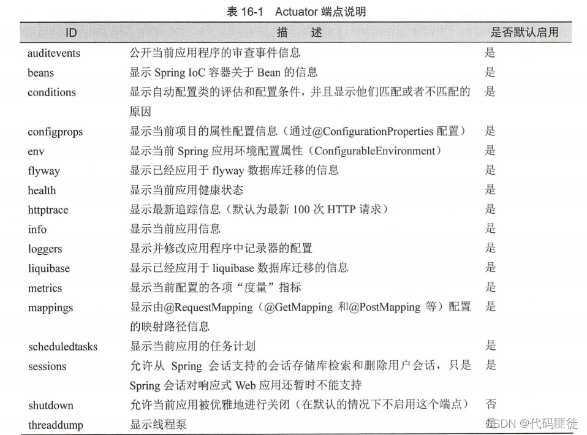

# 一、SpringCloud Bus 介绍
## 1、消息总线的由来
````
回顾 Config分布式配置中心存在的问题

假如有多个微服务客户端3355/3366/3377......，每个微服务都要执行一次post请求，手动刷新？
可否广播，一次通知，处处生效？
我们想大范围的自动刷新，求方法
以上就是消息总线的产生由来

Spring Cloud Bus 配合 Spring Cloud Config 使用可以实现配置的动态刷新
````
## 2、定义
````
Spring Cloud Bus是用来将分布式系统的节点与轻量级消息系统链接起来的框架，它整合了Java的事件处理机制和消息中间件的功能。

Spring Cloud Bus目前支持RabbitMQ和Kafka。
````
## 3、作用
````
Spring Cloud Bus能管理和传播分布式系统间的消息，就像一个分布式执行器，可用于广播状态更改、事件推送等，也可以当作微服务间的通信通道。
````
## 4、总线
* 1、什么是总线
````
在微服务架构的系统中，通常会使用轻量级的消息代理来构建一个共用的消息主题，并让系统中所有微服务实例都连接上来。由于该主题中产生的消息会被所有实例监听和消费，所以称它为消息总线。
在总线上的各个实例，都可以方便地广播一些需要让其他连接在该主题上的实例都知道的消息。
````
* 2、基本原理
````
ConfigClient实例都监听MQ中同一个topic(默认是springCloudBus)。当一个服务刷新数据的时候，它会把这个信息放入到Topic中，这样其它监听同一Topic的服务就能得到通知，然后去更新自身的配置。
````
# 二、RabbitMQ环境配置
* 1、安装Erlang，下载地址：https://www.erlang.org/patches/otp-25.3.2
* 2、安装RabbitMQ，下载地址：https://www.rabbitmq.com/install-windows.html
* 3、进入RabbitMQ安装目录下的sbin目录，输入以下命令启动管理功能: rabbitmq-plugins enable rabbitmq_management
````
1、此时启动报Plugin configuration unchanged.
2、管理员cmd 进入到安装RabbitMQ的安装目录sbin下 进入到这里之后在终端执行,
rabbitmq-service.bat remove 命令 等待执行完成(去除现有的RabbitMQ指令)
3、重新安装RabbitMQ的服务 执行: rabbitmq-service.bat install
4、执行完此命令之后再次执行：rabbitmq-plugins enable rabbitmq_management 命令
5、再需要执行RabbitMQ启动命令: rabbitmq-server.bat start
````
* 4、访问
````
访问地址查看是否安装成功：http://localhost:15672/
输入账号密码并登录：guest guest
````
# 三、动态刷新全局广播
## 1、搭建客户端微服务3366
* 1、pom.xml
````
<?xml version="1.0" encoding="UTF-8"?>
<project xmlns="http://maven.apache.org/POM/4.0.0"
         xmlns:xsi="http://www.w3.org/2001/XMLSchema-instance"
         xsi:schemaLocation="http://maven.apache.org/POM/4.0.0 http://maven.apache.org/xsd/maven-4.0.0.xsd">
    <parent>
        <artifactId>cloud2020</artifactId>
        <groupId>com.jch.springcloud</groupId>
        <version>1.0-SNAPSHOT</version>
    </parent>
    <modelVersion>4.0.0</modelVersion>

    <artifactId>cloud-config-client-3366</artifactId>

    <dependencies>
        <!-- config Client 和 服务端的依赖不一样 -->
        <dependency>
            <groupId>org.springframework.cloud</groupId>
            <artifactId>spring-cloud-starter-config</artifactId>
        </dependency>
        <dependency>
            <groupId>org.springframework.cloud</groupId>
            <artifactId>spring-cloud-starter-netflix-eureka-client</artifactId>
        </dependency>
        <dependency>
            <groupId>org.springframework.boot</groupId>
            <artifactId>spring-boot-starter-web</artifactId>
        </dependency>
        <dependency>
            <groupId>org.springframework.boot</groupId>
            <artifactId>spring-boot-starter-actuator</artifactId>
        </dependency>
        <dependency>
            <groupId>org.springframework.boot</groupId>
            <artifactId>spring-boot-devtools</artifactId>
            <scope>runtime</scope>
            <optional>true</optional>
        </dependency>
        <dependency>
            <groupId>org.projectlombok</groupId>
            <artifactId>lombok</artifactId>
            <optional>true</optional>
        </dependency>
        <dependency>
            <groupId>org.springframework.boot</groupId>
            <artifactId>spring-boot-starter-test</artifactId>
            <scope>test</scope>
        </dependency>
        <dependency><!-- 引入自己定义的api通用包，可以使用Payment支付Entity -->
            <groupId>com.jch.springcloud</groupId>
            <artifactId>cloud-api-commons</artifactId>
            <version>${project.version}</version>
        </dependency>
    </dependencies>

</project>
````
* 2、bootstrap.yml 
````
server:
  port: 3366

spring:
  application:
    name: config-client
  cloud:
    #Config客户端配置
    config:
      label: master #分支名称
      name: config #配置文件名称
      profile: test #读取后缀名称   上述3个综合：master分支上config-test.yml的配置文件被读取
      uri: http://localhost:3344 #配置中心地址
      # 综合上面四个 即读取配置文件地址为： http://config-3344.com:3344/master/config-test.yml

#服务注册到eureka
eureka:
  client:
    service-url:
      defaultZone: http://localhost:7001/eureka

# 暴露监控端点
management:
  endpoints:
    web:
      exposure:
        include: "*"
````
* 3、主启动类
````
@SpringBootApplication
@EnableEurekaClient
public class ConfigClientMain3366 {
    public static void main(String[] args) {
        SpringApplication.run(ConfigClientMain3366.class,args);
    }
}
````
* 4、controller层
````
@RestController
@RefreshScope
public class ConfigClientController {
    @Value("${server.port}")
    private String serverPort;
 
    @Value("${config.info}") //gitee里的yml文件里的内容
    private String configInfo;
 
    @RequestMapping("/configInfo")
    public String getConfigInfo(){
        return "serverPort: "+serverPort+"\t\n\n configInfo: "+configInfo;
    }
}
````
## 2、设计思想
* 1、利用消息总线触发一个客户端/bus/refresh,而刷新所有客户端的配置

* 2、利用消息总线触发一个服务端ConfigServer的/bus/refresh端点，而刷新所有客户端的配置

````
图二的架构显然更加适合，图一不适合的原因如下：

打破了微服务的职责单一性，因为微服务本身是业务模块，它本不应该承担配置刷新的职责。
破坏了微服务各节点的对等性。
有一定的局限性。例如，微服务在迁移时，它的网络地址常常会发生变化，此时如果想要做到自动刷新，那就会增加更多的修改
````
## 3、配置中心3344添加消息总线支持
* 1、pom.xml
````
<!--添加消息总线RabbitMQ支持-->
<dependency>
    <groupId>org.springframework.cloud</groupId>
    <artifactId>spring-cloud-starter-bus-amqp</artifactId>
</dependency>
````
* 2、application.yml
````
spring:
#rabbitmq相关配置 15672是Web管理界面的端口；5672是MQ访问的端口
  rabbitmq:
    host: 192.168.16.106
    port: 5672
    username: guest
    password: guest
 
# 暴露bus刷新配置的端点 actuator刷新配置
management:
  endpoints:
    web:
      exposure:
        include: 'bus-refresh' #Post /bus/refresh 官网架构图
````
## 4、客户端3355，3366添加消息总线支持
* 1、pom.xml
````
<!--添加消息总线RabbitMQ支持-->
<dependency>
    <groupId>org.springframework.cloud</groupId>
    <artifactId>spring-cloud-starter-bus-amqp</artifactId>
</dependency>
````
* 2、bootstrap.yml
````
spring:
  #rabbitmq相关配置 15672是Web管理界面的端口；5672是MQ访问的端口
  rabbitmq:
    host: localhost
    port: 5672
    username: guest
    password: guest
````
## 5、测试
````
修改Gitee上配置文件增加版本号

发送POST请求: curl -X POST "http://localhost:3344/actuator/bus-refresh"

测试结果：一次修改，广播通知，处处生效
````
# 四、动态刷新定点通知
````
不想全部通知，只想定点通知：只通知3355，不通知3366

简单一句话：指定具体某一个实例生效而不是全部

公式
http://localhost:配置中心的端口号/actuator/bus-refresh/{destination}
/bus-refresh请求不再发送到具体的服务实例上，而是发给config server并通过destination参数类指定需要更新配置的服务或实例
````
## 1、案例
````
以刷新运行在3355端口上的config-client为例：只通知3355，不通知3366
curl -X POST "http://localhost:3344/actuator/bus-refresh/config-client:3355"
````
## 2、额外内容：Springboot Actuator 的说明
* 1、定义
````
监控中心是针对微服务期间

查看服务器内存变化(对内存,线程,日志管理等)
检测服务配置连接池地址是否可用(模拟访问,懒加载)
统计现在有多个bean(是Spring容器中的bean)
统计SpringMVC@RequestMapping(统计http接口)
使用Actuator来查看这些信息,它是没有界面的返回的是json格式的数据

AdminUi底层使用的是Actuator实现的,只不过给它加了个可视化界面
````
* 2、应用场景
````
生产环境

使用它的原因：它是springboot的一个附加功能，可帮助你在应用程序生产环境时监控和管理应用程序，可使用Http的各种请求来监管，审计，收集应用的运行情况，特别对于微服务管理十分有意义。

建议使用springboot2.0.5，因为它里面返回的信息更加全面。

springboot 提供了对项目的监控功能。
````
* 3、如何使用
````
1、导入依赖包
<dependency>
   <groupId>org.springframework.boot</groupId>
   <artifactId>spring-boot-starter-actuator</artifactId>
   <version>2.1.3.RELEASE</version>
</dependency>

2、配置端点
在application.properties中配置端点,

暴露部分端点
management.endpoints.web.exposure.include=info,health,beans,env
 
暴露所有端点 
management.endpoints.web.exposure.include=*
 
不暴露beans端点
management.endpoints.web.exposure.exclude=beans

在上述配置中，首先使用 management.endpoints.web.exposure.include 暴露所有的端点，接着使用management.endpoints.web.exposure.exclud 排除 beans 端点，这样就能够暴露除 beans 外的所有 actuator端点了。

3、浏览器访问
http://127.0.0.1:8080/actuator/health
````
* 4、端点说明

* 5、总结
````
上面利用SpringCloud Config刷新客户端配置，以及消息总线触发服务端ConfigServer的/bus-refresh端点，而刷新所有客户端的配置，利用的就是actuator刷新配置文件。

因为手动刷新需要自己调用一个类似于健康检查的端点（接口），所以呢，我们需要把这个端点给暴露出来，以便外部可访问。

curl -X POST "http://localhost:3355/actuator/refresh"
curl -X POST "http://localhost:3344/actuator/bus-refresh"
````