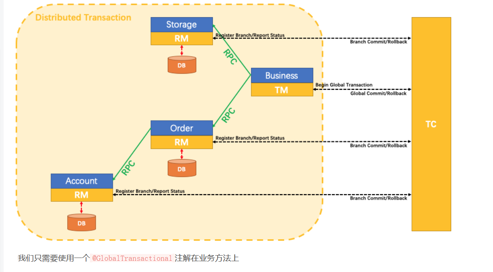
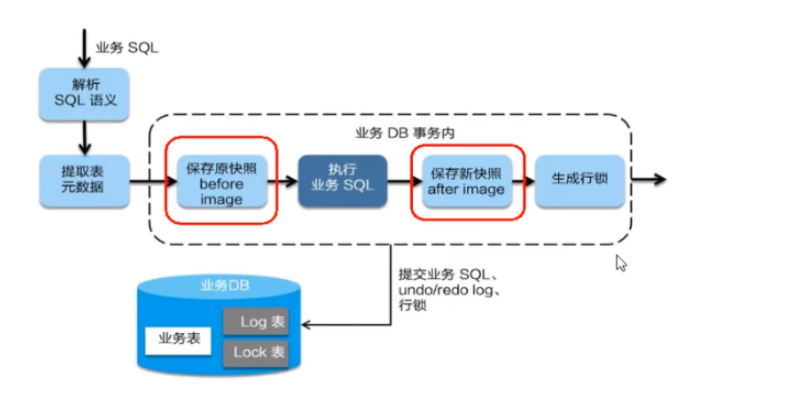
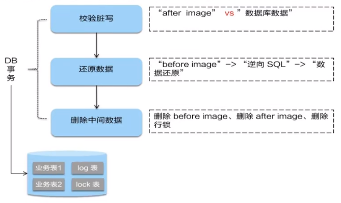

# 一、分布式事务问题由来
````
分布式前: 单机单库没这个问题。

分布式后: 单体应用被拆分成微服务应用, 原来的三个模块被拆分成三个独立的应用, 分别使用三个独立的数据源, 业务操作需要调用三个服务来完成。此时每个服务内部的数据一致性由本地事务来保证, 但是全局的数据一致性问题没法保证。

一次业务操作需要跨多个数据源或需要跨多个系统进行远程调用，就会产生分布式事务问题。
````
# 二、Seata简介
## 1、定义
````
Seata是一款开源的分布式事务解决方案，致力于在微服务架构下提供高性能和简单易用的分布式事务服务。
````
## 2、一个典型的分布式事务过程
* 1、分布式事务处理过程的一ID+三组件模型
````
Transaction ID XID: 全局唯一的事务ID

三组件概念:
TC (Transaction Coordinator) - 事务协调者：维护全局和分支事务的状态，驱动全局事务提交或回滚。
TM (Transaction Manager) - 事务管理器：定义全局事务的范围：开始全局事务、提交或回滚全局事务。
RM (Resource Manager) - 资源管理器：管理分支事务处理的资源，与TC交谈以注册分支事务和报告分支事务的状态，并驱动分支事务提交或回滚。
````
* 2、处理过程
````
1、TM向TC申请开启一个全局事务，全局事务创建成功并生成一个全局唯一的XID；
2、XID在微服务调用链路的上下文中传播；
3、RM向TC注册分支事务，将其纳入XID对应全局事务的管辖；
4、TM向TC发起针对XID的全局提交或回滚决议；
5、TC调度XID下管辖的全部分支事务完成提交或回滚请求。
````
## 3、使用
````
本地 @Transactional 
全局 @GlobalTransactional 
````
## 4、SEATA的分布式交易解决方案

# 三、Seata-Server安装
* 1、下载
````
http://seata.io/zh-cn/docs/download
````
* 2、修改conf目录下的application.yml配置文件, 修改seata的config和registry
````
#  Copyright 1999-2019 Seata.io Group.
#
#  Licensed under the Apache License, Version 2.0 (the "License");
#  you may not use this file except in compliance with the License.
#  You may obtain a copy of the License at
#
#  http://www.apache.org/licenses/LICENSE-2.0
#
#  Unless required by applicable law or agreed to in writing, software
#  distributed under the License is distributed on an "AS IS" BASIS,
#  WITHOUT WARRANTIES OR CONDITIONS OF ANY KIND, either express or implied.
#  See the License for the specific language governing permissions and
#  limitations under the License.

server:
  port: 7091

spring:
  application:
    name: seata-server

logging:
  config: classpath:logback-spring.xml
  file:
    path: ${user.home}/logs/seata
  extend:
    logstash-appender:
      destination: 127.0.0.1:4560
    kafka-appender:
      bootstrap-servers: 127.0.0.1:9092
      topic: logback_to_logstash

console:
  user:
    username: seata
    password: seata

seata:
  config:
    # support: nacos, consul, apollo, zk, etcd3
    type: nacos
    nacos:
      server-addr: 127.0.0.1:8848  # nacos地址
      group: SEATA_GROUP  # 配置文件的分组
      username: nacos  # nacos用户名
      password: nacos  # nacos密码
      # 这是默认值
      data-id: seata.properties  # 配置文件的data id也就是配置文件名加后缀
  registry:
    # support: nacos, eureka, redis, zk, consul, etcd3, sofa
    type: nacos
    nacos:
      application: seata-server   #seata启动后在nacos的服务名
      server-addr: 127.0.0.1:8848  # nacos地址
      group: SEATA_GROUP  # 配置文件的分组
      cluster: test #此处注意,这的值要和nacos中的配置文件service.vgroupMapping.my_test_tx_group的值一样
      username: nacos  # nacos用户名
      password: nacos  # nacos密码
  store:
    # support: file 、 db 、 redis
    mode: file
#  server:
#    service-port: 8091 #If not configured, the default is '${server.port} + 1000'
  security:
    secretKey: SeataSecretKey0c382ef121d778043159209298fd40bf3850a017
    tokenValidityInMilliseconds: 1800000
    ignore:
      urls: /,/**/*.css,/**/*.js,/**/*.html,/**/*.map,/**/*.svg,/**/*.png,/**/*.ico,/console-fe/public/**,/api/v1/auth/login
````
* 3、nacos添加配置文件 seata.properties
````
Data ID是“application.yml”中的“seata-config-nacos-data-id”；
Group是“application.yml”中的“seata-config-nacos-group”；
配置内容在seata目录中 seata/script/config-center/ 下的 config.txt 文件中。
````
````
# 下面三行是在原来配置的基础上新增的
service.vgroupMapping.my_test_tx_group=test
service.test.grouplist=127.0.0.1:8091
store.mode=db

#For details about configuration items, see https://seata.io/zh-cn/docs/user/configurations.html
#Transport configuration, for client and server
transport.type=TCP
transport.server=NIO
transport.heartbeat=true
transport.enableTmClientBatchSendRequest=false
transport.enableRmClientBatchSendRequest=true
transport.enableTcServerBatchSendResponse=false
transport.rpcRmRequestTimeout=30000
transport.rpcTmRequestTimeout=30000
transport.rpcTcRequestTimeout=30000
transport.threadFactory.bossThreadPrefix=NettyBoss
transport.threadFactory.workerThreadPrefix=NettyServerNIOWorker
transport.threadFactory.serverExecutorThreadPrefix=NettyServerBizHandler
transport.threadFactory.shareBossWorker=false
transport.threadFactory.clientSelectorThreadPrefix=NettyClientSelector
transport.threadFactory.clientSelectorThreadSize=1
transport.threadFactory.clientWorkerThreadPrefix=NettyClientWorkerThread
transport.threadFactory.bossThreadSize=1
transport.threadFactory.workerThreadSize=default
transport.shutdown.wait=3
transport.serialization=seata
transport.compressor=none

#Transaction routing rules configuration, only for the client
service.vgroupMapping.default_tx_group=default
#If you use a registry, you can ignore it
service.default.grouplist=127.0.0.1:8091
service.enableDegrade=false
service.disableGlobalTransaction=false

#Transaction rule configuration, only for the client
client.rm.asyncCommitBufferLimit=10000
client.rm.lock.retryInterval=10
client.rm.lock.retryTimes=30
client.rm.lock.retryPolicyBranchRollbackOnConflict=true
client.rm.reportRetryCount=5
client.rm.tableMetaCheckEnable=true
client.rm.tableMetaCheckerInterval=60000
client.rm.sqlParserType=druid
client.rm.reportSuccessEnable=false
client.rm.sagaBranchRegisterEnable=false
client.rm.sagaJsonParser=fastjson
client.rm.tccActionInterceptorOrder=-2147482648
client.tm.commitRetryCount=5
client.tm.rollbackRetryCount=5
client.tm.defaultGlobalTransactionTimeout=60000
client.tm.degradeCheck=false
client.tm.degradeCheckAllowTimes=10
client.tm.degradeCheckPeriod=2000
client.tm.interceptorOrder=-2147482648
client.undo.dataValidation=true
client.undo.logSerialization=jackson
client.undo.onlyCareUpdateColumns=true
server.undo.logSaveDays=7
server.undo.logDeletePeriod=86400000
client.undo.logTable=undo_log
client.undo.compress.enable=true
client.undo.compress.type=zip
client.undo.compress.threshold=64k
#For TCC transaction mode
tcc.fence.logTableName=tcc_fence_log
tcc.fence.cleanPeriod=1h

#Log rule configuration, for client and server
log.exceptionRate=100

#Transaction storage configuration, only for the server. The file, db, and redis configuration values are optional.
store.mode=file
store.lock.mode=file
store.session.mode=file
#Used for password encryption
store.publicKey=

#If `store.mode,store.lock.mode,store.session.mode` are not equal to `file`, you can remove the configuration block.
store.file.dir=file_store/data
store.file.maxBranchSessionSize=16384
store.file.maxGlobalSessionSize=512
store.file.fileWriteBufferCacheSize=16384
store.file.flushDiskMode=async
store.file.sessionReloadReadSize=100

#These configurations are required if the `store mode` is `db`. If `store.mode,store.lock.mode,store.session.mode` are not equal to `db`, you can remove the configuration block.
store.db.datasource=druid
store.db.dbType=mysql
store.db.driverClassName=com.mysql.jdbc.Driver
store.db.url=jdbc:mysql://127.0.0.1:3306/seata?useUnicode=true&rewriteBatchedStatements=true
store.db.user=root
store.db.password=root
store.db.minConn=5
store.db.maxConn=30
store.db.globalTable=global_table
store.db.branchTable=branch_table
store.db.distributedLockTable=distributed_lock
store.db.queryLimit=100
store.db.lockTable=lock_table
store.db.maxWait=5000

#These configurations are required if the `store mode` is `redis`. If `store.mode,store.lock.mode,store.session.mode` are not equal to `redis`, you can remove the configuration block.
store.redis.mode=single
store.redis.single.host=127.0.0.1
store.redis.single.port=6379
store.redis.sentinel.masterName=
store.redis.sentinel.sentinelHosts=
store.redis.maxConn=10
store.redis.minConn=1
store.redis.maxTotal=100
store.redis.database=0
store.redis.password=
store.redis.queryLimit=100

#Transaction rule configuration, only for the server
server.recovery.committingRetryPeriod=1000
server.recovery.asynCommittingRetryPeriod=1000
server.recovery.rollbackingRetryPeriod=1000
server.recovery.timeoutRetryPeriod=1000
server.maxCommitRetryTimeout=-1
server.maxRollbackRetryTimeout=-1
server.rollbackRetryTimeoutUnlockEnable=false
server.distributedLockExpireTime=10000
server.xaerNotaRetryTimeout=60000
server.session.branchAsyncQueueSize=5000
server.session.enableBranchAsyncRemove=false
server.enableParallelRequestHandle=false

#Metrics configuration, only for the server
metrics.enabled=false
metrics.registryType=compact
metrics.exporterList=prometheus
metrics.exporterPrometheusPort=9898
````
* 4、创建seata数据库
````
执行 seata/script/server/db目录下对应数据库的sql脚本
````
* 5、启动seata
````
进入seata/bin目录
执行 seata-server.bat
浏览器访问 http://localhost:7091/#/login
````
# 四、Seata业务数据库准备
````
这里我们会创建三个服务，一个订单服务，一个库存服务，一个账户服务。

当用户下单时,会在订单服务中创建一个订单, 然后通过远程调用库存服务来扣减下单商品的库存，再通过远程调用账户服务来扣减用户账户里面的余额，最后在订单服务中修改订单状态为已完成。

该操作跨越三个数据库，有两次远程调用，很明显会有分布式事务问题。
````
* 1、创建业务数据库
````
seata_ order：存储订单的数据库;
seata_ storage：存储库存的数据库;
seata_ account：存储账户信息的数据库。

CREATE DATABASE seata_order;
CREATE DATABASE seata_storage;
CREATE DATABASE seata_account;
````
* 2、seata_order库下建t_order表
````
CREATE TABLE t_order (
    `id` BIGINT(11) NOT NULL AUTO_INCREMENT PRIMARY KEY,
    `user_id` BIGINT(11) DEFAULT NULL COMMENT '用户id',
    `product_id` BIGINT(11) DEFAULT NULL COMMENT '产品id',
    `count` INT(11) DEFAULT NULL COMMENT '数量',
    `money` DECIMAL(11,0) DEFAULT NULL COMMENT '金额',
    `status` INT(1) DEFAULT NULL COMMENT '订单状态: 0:创建中; 1:已完结'
) ENGINE=INNODB AUTO_INCREMENT=1 DEFAULT CHARSET=utf8;
````
* 3、seata_storage库下建t_storage表
````
CREATE TABLE t_storage (
`id` BIGINT(11) NOT NULL AUTO_INCREMENT PRIMARY KEY,
`product_id` BIGINT(11) DEFAULT NULL COMMENT '产品id',
`total` INT(11) DEFAULT NULL COMMENT '总库存',
`used` INT(11) DEFAULT NULL COMMENT '已用库存',
`residue` INT(11) DEFAULT NULL COMMENT '剩余库存'
) ENGINE=INNODB AUTO_INCREMENT=1 DEFAULT CHARSET=utf8;
 
INSERT INTO seata_storage.t_storage(`id`, `product_id`, `total`, `used`, `residue`)
VALUES ('1', '1', '100', '0','100');
````
* 4、seata_account库下建t_account表
````
CREATE TABLE t_account(
	`id` BIGINT(11) NOT NULL AUTO_INCREMENT PRIMARY KEY COMMENT 'id',
	`user_id` BIGINT(11) DEFAULT NULL COMMENT '用户id',
	`total` DECIMAL(10,0) DEFAULT NULL COMMENT '总额度',
	`used` DECIMAL(10,0) DEFAULT NULL COMMENT '已用余额',
	`residue` DECIMAL(10,0) DEFAULT '0' COMMENT '剩余可用额度'
) ENGINE=INNODB AUTO_INCREMENT=1 DEFAULT CHARSET=utf8;
 
INSERT INTO seata_account.t_account(`id`, `user_id`, `total`, `used`, `residue`)
VALUES ('1', '1', '1000', '0', '1000');
````
* 5、按照上述3库分别建对应的回滚日志表
````
drop table `undo_log`;
CREATE TABLE `undo_log` (
  `id` bigint(20) NOT NULL AUTO_INCREMENT,
  `branch_id` bigint(20) NOT NULL,
  `xid` varchar(100) NOT NULL,
  `context` varchar(128) NOT NULL,
  `rollback_info` longblob NOT NULL,
  `log_status` int(11) NOT NULL,
  `log_created` datetime NOT NULL,
  `log_modified` datetime NOT NULL,
  `ext` varchar(100) DEFAULT NULL,
  PRIMARY KEY (`id`),
  UNIQUE KEY `ux_undo_log` (`xid`,`branch_id`)
) ENGINE=InnoDB AUTO_INCREMENT=1 DEFAULT CHARSET=utf8;
````
# 五、Seata业务微服务准备
## 1、Seata之Order-Module配置搭建
* 1、pom.xml
````
<?xml version="1.0" encoding="UTF-8"?>
<project xmlns="http://maven.apache.org/POM/4.0.0"
         xmlns:xsi="http://www.w3.org/2001/XMLSchema-instance"
         xsi:schemaLocation="http://maven.apache.org/POM/4.0.0 http://maven.apache.org/xsd/maven-4.0.0.xsd">
    <parent>
        <artifactId>cloud2020</artifactId>
        <groupId>com.jch.springcloud</groupId>
        <version>1.0-SNAPSHOT</version>
    </parent>
    <modelVersion>4.0.0</modelVersion>

    <artifactId>cloudalibaba-seata-order2001</artifactId>
    <dependencies>
        <!-- seata -->
        <dependency>
            <groupId>com.alibaba.cloud</groupId>
            <artifactId>spring-cloud-starter-alibaba-seata</artifactId>
            <exclusions>
                <exclusion>
                    <artifactId>seata-all</artifactId>
                    <groupId>seata-spring-boot-starter</groupId>
                </exclusion>
            </exclusions>
        </dependency>
        <dependency>
            <groupId>com.alibaba.cloud</groupId>
            <artifactId>spring-cloud-alibaba-seata</artifactId>
            <version>2.1.0.RELEASE</version>
            <exclusions>
                <exclusion>
                    <groupId>io.seata</groupId>
                    <artifactId>seata-all</artifactId>
                </exclusion>
            </exclusions>
        </dependency>
        <dependency>
            <groupId>io.seata</groupId>
            <artifactId>seata-all</artifactId>
            <version>1.4.2</version>
        </dependency>
        <dependency>
            <groupId>io.seata</groupId>
            <artifactId>seata-spring-boot-starter</artifactId>
            <version>1.4.2</version>
        </dependency>
        <!-- springcloud alibaba nacos 依赖,Nacos Server 服务注册中心 -->
        <dependency>
            <groupId>com.alibaba.cloud</groupId>
            <artifactId>spring-cloud-starter-alibaba-nacos-discovery</artifactId>
        </dependency>

        <!-- open feign 服务调用 -->
        <dependency>
            <groupId>org.springframework.cloud</groupId>
            <artifactId>spring-cloud-starter-openfeign</artifactId>
        </dependency>

        <!-- springboot整合Web组件 -->
        <dependency>
            <groupId>org.springframework.boot</groupId>
            <artifactId>spring-boot-starter-web</artifactId>
        </dependency>
        <dependency>
            <groupId>org.springframework.boot</groupId>
            <artifactId>spring-boot-starter-actuator</artifactId>
        </dependency>

        <!-- 持久层支持 -->
        <dependency>
            <groupId>com.alibaba</groupId>
            <artifactId>druid-spring-boot-starter</artifactId>
            <version>1.1.10</version>
        </dependency>
        <!--mysql-connector-java-->
        <dependency>
            <groupId>mysql</groupId>
            <artifactId>mysql-connector-java</artifactId>
        </dependency>
        <!--jdbc-->
        <dependency>
            <groupId>org.springframework.boot</groupId>
            <artifactId>spring-boot-starter-jdbc</artifactId>
        </dependency>
        <!-- mybatis -->
        <dependency>
            <groupId>org.mybatis.spring.boot</groupId>
            <artifactId>mybatis-spring-boot-starter</artifactId>
        </dependency>

        <!-- 日常通用jar包 -->
        <dependency>
            <groupId>org.mybatis.spring.boot</groupId>
            <artifactId>mybatis-spring-boot-starter</artifactId>
        </dependency>
        <dependency>
            <groupId>org.springframework.boot</groupId>
            <artifactId>spring-boot-devtools</artifactId>
            <scope>runtime</scope>
            <optional>true</optional>
        </dependency>
        <dependency>
            <groupId>org.projectlombok</groupId>
            <artifactId>lombok</artifactId>
            <optional>true</optional>
        </dependency>
        <dependency>
            <groupId>org.springframework.boot</groupId>
            <artifactId>spring-boot-starter-test</artifactId>
            <scope>test</scope>
        </dependency>
        <dependency><!-- 引入自己定义的api通用包，可以使用Payment支付Entity -->
            <groupId>com.jch.springcloud</groupId>
            <artifactId>cloud-api-commons</artifactId>
            <version>${project.version}</version>
        </dependency>
        <dependency>
            <groupId>jakarta.activation</groupId>
            <artifactId>jakarta.activation-api</artifactId>
        </dependency>
    </dependencies>
</project>
````
* 2、application.yml
````
server:
  port: 2001
spring:
  application:
    name: seata-order-service
  cloud:
    alibaba:
      seata:
        # 自定义事务组，与nacos配置文件 seata.properties 中的 service.vgroupMapping.my_test_tx_group一致
        tx-service-group: my_test_tx_group
    nacos:
      discovery:
        server-addr: 127.0.0.1:8848
  datasource:
    driver-class-name: com.mysql.jdbc.Driver
    url: jdbc:mysql://127.0.0.1:3306/seata_order
    username: root
    password: root
    dynamic:
      seata: true
# seata配置
seata:
  enabled: true
  # Seata 应用编号，默认为 ${spring.application.name}
  application-id: ${spring.application.name}
  # 自定义事务组，与nacos配置文件 seata.properties 中的 service.vgroupMapping.my_test_tx_group一致
  tx-service-group: my_test_tx_group
  # 关闭自动代理
  enable-auto-data-source-proxy: false
  config:
    type: nacos
    nacos:
      namespace:
      serverAddr: 127.0.0.1:8848
      group: SEATA_GROUP
      userName: nacos
      password: nacos
    registry:
      type: nacos
      nacos:
        application: seata-server
        server-addr: 127.0.0.1:8848
        namespace:
        userName: nacos
        password: nacos

feign:
  hystrix:
    enabled: false

# 注意，这是自定义的，原来的是mapper_locations
mybatis:
  mapperLocations: classpath:mapper/*.xml
logging:
  level:
    io:
      seata: info
````
* 3、返回值
````
@Data
@AllArgsConstructor
@NoArgsConstructor
public class CommonResult<T> {
    private Integer code;
    private String msg;
    private T data;

    public CommonResult(Integer code, String msg) {
        this(code, msg, null);
    }
}
````
* 4、订单类
````
@Data
@AllArgsConstructor
@NoArgsConstructor
public class Order
{
    private Long id;

    private Long userId;

    private Long productId;

    private Integer count;

    private BigDecimal money;

    /**
     * 订单状态：0：创建中；1：已完结
     */
    private Integer status;
}
````
* 5、Dao接口及实现
````
@Mapper
public interface OrderDao {

    /**
     * 创建订单
     */
    void create(Order order);

    /**
     * 修改订单状态
     */
    void update(@Param("userId") Long userId, @Param("status") Integer status);
}
````
````
<mapper namespace="com.jch.springcloud.dao.OrderDao">

    <resultMap id="BaseResultMap" type="com.jch.springcloud.domain.Order">
        <id column="id" property="id" jdbcType="BIGINT"/>
        <result column="user_id" property="userId" jdbcType="BIGINT"/>
        <result column="product_id" property="productId" jdbcType="BIGINT"/>
        <result column="count" property="count" jdbcType="INTEGER"/>
        <result column="money" property="money" jdbcType="DECIMAL"/>
        <result column="status" property="status" jdbcType="INTEGER"/>
    </resultMap>

    <insert id="create">
        INSERT INTO `t_order` (`id`, `user_id`, `product_id`, `count`, `money`, `status`)
        VALUES (NULL, #{userId}, #{productId}, #{count}, #{money}, 0);
    </insert>

    <update id="update">
        UPDATE `t_order`
        SET status = 1
        WHERE user_id = #{userId} AND status = #{status};
    </update>
</mapper>
````
* 6、Service接口及实现
````
public interface OrderService {
    /**
     * 创建订单
     */
    void create(Order order);

}
````
````
@FeignClient(value = "seata-storage-service")
public interface StorageService {

    /**
     * 扣减库存
     */
    @PostMapping(value = "/storage/decrease")
    CommonResult decrease(@RequestParam("productId") Long productId, @RequestParam("count") Integer count);
}
````
````
@FeignClient(value = "seata-account-service")
public interface AccountService {

    /**
     * 扣减账户余额
     */
    @PostMapping("/account/decrease")
    CommonResult decrease(@RequestParam("userId") Long userId, @RequestParam("money") BigDecimal money);
}
````
````
@Service
@Slf4j
public class OrderServiceImpl implements OrderService {
    @Resource
    private OrderDao orderDao;

    @Resource
    private StorageService storageService;

    @Resource
    private AccountService accountService;

    /**
     * 创建订单->调用库存服务扣减库存->调用账户服务扣减账户余额->修改订单状态
     * 简单说：
     * 下订单->减库存->减余额->改状态
     */
    @Override
    public void create(Order order) {
        log.info("------->下单开始");
        //本应用创建订单
        orderDao.create(order);

        //远程调用库存服务扣减库存
        log.info("------->order-service中扣减库存开始");
        storageService.decrease(order.getProductId(),order.getCount());
        log.info("------->order-service中扣减库存结束");

        //远程调用账户服务扣减余额
        log.info("------->order-service中扣减余额开始");
        accountService.decrease(order.getUserId(),order.getMoney());
        log.info("------->order-service中扣减余额结束");

        //修改订单状态为已完成
        log.info("------->order-service中修改订单状态开始");
        orderDao.update(order.getUserId(),0);
        log.info("------->order-service中修改订单状态结束");

        log.info("------->下单结束");
    }
}
````
* 7、controller类 
````
@RestController
public class OrderController 	{

    @Autowired
    private OrderService orderService;

    /**
     * 创建订单
     */
    @GetMapping("/order/create")
    public CommonResult create(Order order) {
        orderService.create(order);
        return new CommonResult(200, "订单创建成功!");
    }
}
````
* 8、config类
````
@Configuration
@MapperScan("com.jch.springcloud.dao") //表明mybatis和dao层相关
public class MyBatisConfig {
}
````
````
import com.alibaba.druid.pool.DruidDataSource;
import io.seata.rm.datasource.DataSourceProxy;
import org.apache.ibatis.session.SqlSessionFactory;
import org.mybatis.spring.SqlSessionFactoryBean;
import org.mybatis.spring.transaction.SpringManagedTransactionFactory;
import org.springframework.beans.factory.annotation.Value;
import org.springframework.boot.context.properties.ConfigurationProperties;
import org.springframework.context.annotation.Bean;
import org.springframework.context.annotation.Configuration;
import org.springframework.core.io.support.PathMatchingResourcePatternResolver;

import javax.sql.DataSource;

/**
 * 使用Seata对数据源进行代理
 */
@Configuration
public class DataSourceProxyConfig {

    @Value("${mybatis.mapperLocations}")
    private String mapperLocations;

    @Bean
    @ConfigurationProperties(prefix = "spring.datasource")
    public DataSource druidDataSource(){
        return new DruidDataSource();
    }

    @Bean
    public DataSourceProxy dataSourceProxy(DataSource dataSource) {
        return new DataSourceProxy(dataSource);
    }

    @Bean
    public SqlSessionFactory sqlSessionFactoryBean(DataSourceProxy dataSourceProxy) throws Exception {
        SqlSessionFactoryBean sqlSessionFactoryBean = new SqlSessionFactoryBean();
        sqlSessionFactoryBean.setDataSource(dataSourceProxy);
        sqlSessionFactoryBean.setMapperLocations(new PathMatchingResourcePatternResolver().getResources(mapperLocations));
        sqlSessionFactoryBean.setTransactionFactory(new SpringManagedTransactionFactory());
        return sqlSessionFactoryBean.getObject();
    }

}
````
* 9、主启动类
````
@EnableDiscoveryClient
@EnableFeignClients
//取消数据源的自动创建，而是使用自己定义的
@SpringBootApplication(exclude = DataSourceAutoConfiguration.class)
public class SeataOrderMain2001 {
    public static void main(String[] args) {
        SpringApplication.run(SeataOrderMain2001.class,args);
    }
}
````
## 2、Seata之Storage-Module配置搭建
* 1、pom.xml
````
<?xml version="1.0" encoding="UTF-8"?>
<project xmlns="http://maven.apache.org/POM/4.0.0"
         xmlns:xsi="http://www.w3.org/2001/XMLSchema-instance"
         xsi:schemaLocation="http://maven.apache.org/POM/4.0.0 http://maven.apache.org/xsd/maven-4.0.0.xsd">
    <parent>
        <artifactId>cloud2020</artifactId>
        <groupId>com.jch.springcloud</groupId>
        <version>1.0-SNAPSHOT</version>
    </parent>
    <modelVersion>4.0.0</modelVersion>

    <artifactId>cloudalibaba-storage-service2002</artifactId>
    <dependencies>
        <!--nacos-->
        <dependency>
            <groupId>com.alibaba.cloud</groupId>
            <artifactId>spring-cloud-starter-alibaba-nacos-discovery</artifactId>
        </dependency>
        <!-- seata -->
        <dependency>
            <groupId>com.alibaba.cloud</groupId>
            <artifactId>spring-cloud-starter-alibaba-seata</artifactId>
            <exclusions>
                <exclusion>
                    <artifactId>seata-all</artifactId>
                    <groupId>seata-spring-boot-starter</groupId>
                </exclusion>
            </exclusions>
        </dependency>
        <dependency>
            <groupId>com.alibaba.cloud</groupId>
            <artifactId>spring-cloud-alibaba-seata</artifactId>
            <version>2.1.0.RELEASE</version>
            <exclusions>
                <exclusion>
                    <groupId>io.seata</groupId>
                    <artifactId>seata-all</artifactId>
                </exclusion>
            </exclusions>
        </dependency>
        <dependency>
            <groupId>io.seata</groupId>
            <artifactId>seata-all</artifactId>
            <version>1.4.2</version>
        </dependency>
        <dependency>
            <groupId>io.seata</groupId>
            <artifactId>seata-spring-boot-starter</artifactId>
            <version>1.4.2</version>
        </dependency>
        <!--feign-->
        <dependency>
            <groupId>org.springframework.cloud</groupId>
            <artifactId>spring-cloud-starter-openfeign</artifactId>
        </dependency>
        <dependency>
            <groupId>org.springframework.boot</groupId>
            <artifactId>spring-boot-starter-web</artifactId>
        </dependency>
        <dependency>
            <groupId>org.springframework.boot</groupId>
            <artifactId>spring-boot-starter-test</artifactId>
            <scope>test</scope>
        </dependency>
        <dependency>
            <groupId>org.mybatis.spring.boot</groupId>
            <artifactId>mybatis-spring-boot-starter</artifactId>
        </dependency>
        <dependency>
            <groupId>mysql</groupId>
            <artifactId>mysql-connector-java</artifactId>
        </dependency>
        <dependency>
            <groupId>com.alibaba</groupId>
            <artifactId>druid-spring-boot-starter</artifactId>
            <version>1.1.10</version>
        </dependency>
        <dependency>
            <groupId>org.projectlombok</groupId>
            <artifactId>lombok</artifactId>
            <optional>true</optional>
        </dependency>
        <dependency>
            <groupId>com.jch.springcloud</groupId>
            <artifactId>cloud-api-commons</artifactId>
            <version>${project.version}</version>
        </dependency>
    </dependencies>
</project>
````
* 2、application.yml
````
server:
  port: 2002
spring:
  application:
    name: seata-storage-service
  cloud:
    alibaba:
      seata:
        # 自定义事务组，与nacos配置文件 seata.properties 中的 service.vgroupMapping.my_test_tx_group一致
        tx-service-group: my_test_tx_group
    nacos:
      discovery:
        server-addr: 127.0.0.1:8848
  datasource:
    driver-class-name: com.mysql.jdbc.Driver
    url: jdbc:mysql://127.0.0.1:3306/seata_storage
    username: root
    password: root
    dynamic:
      seata: true
# seata配置
seata:
  enabled: true
  # Seata 应用编号，默认为 ${spring.application.name}
  application-id: ${spring.application.name}
  # 自定义事务组，与nacos配置文件 seata.properties 中的 service.vgroupMapping.my_test_tx_group一致
  tx-service-group: my_test_tx_group
  # 关闭自动代理
  enable-auto-data-source-proxy: false
  config:
    type: nacos
    nacos:
      namespace:
      serverAddr: 127.0.0.1:8848
      group: SEATA_GROUP
      userName: nacos
      password: nacos
    registry:
      type: nacos
      nacos:
        application: seata-server
        server-addr: 127.0.0.1:8848
        namespace:
        userName: nacos
        password: nacos
feign:
  hystrix:
    enabled: false

# 注意，这是自定义的，原来的是mapper_locations
mybatis:
  mapperLocations: classpath:mapper/*.xml
logging:
  level:
    io:
      seata: info
````
* 3、库存实体类 
````
@Data
public class Storage {

    private Long id;

    /**
     * 产品id
     */
    private Long productId;

    /**
     * 总库存
     */
    private Integer total;

    /**
     * 已用库存
     */
    private Integer used;

    /**
     * 剩余库存
     */
    private Integer residue;
}
````
* 4、Dao接口及实现
````
@Mapper
public interface StorageDao {

    /**
     * 扣减库存
     */
    void decrease(@Param("productId") Long productId, @Param("count") Integer count);
}
````
````
<?xml version="1.0" encoding="UTF-8" ?>
<!DOCTYPE mapper PUBLIC "-//mybatis.org//DTD Mapper 3.0//EN" "http://mybatis.org/dtd/mybatis-3-mapper.dtd" >


<mapper namespace="com.jch.springcloud.dao.StorageDao">

    <resultMap id="BaseResultMap" type="com.jch.springcloud.domain.Storage">
        <id column="id" property="id" jdbcType="BIGINT"/>
        <result column="product_id" property="productId" jdbcType="BIGINT"/>
        <result column="total" property="total" jdbcType="INTEGER"/>
        <result column="used" property="used" jdbcType="INTEGER"/>
        <result column="residue" property="residue" jdbcType="INTEGER"/>
    </resultMap>

    <update id="decrease">
        UPDATE t_storage
        SET used    = used + #{count},
            residue = residue - #{count}
        WHERE product_id = #{productId}
    </update>

</mapper>
````
* 5、Service接口及实现
````
public interface StorageService {
    /**
     * 扣减库存
     */
    void decrease(Long productId, Integer count);

}
````
````
@Service
public class StorageServiceImpl implements StorageService {

    private static final Logger LOGGER = LoggerFactory.getLogger(StorageServiceImpl.class);

    @Resource
    private StorageDao storageDao;

    /**
     * 扣减库存
     */
    @Override
    public void decrease(Long productId, Integer count) {
        LOGGER.info("------->storage-service中扣减库存开始");
        storageDao.decrease(productId,count);
        LOGGER.info("------->storage-service中扣减库存结束");
    }
}
````
* 6、Controller类
````
@RestController
public class StorageController {

    @Autowired
    private StorageService storageService;

    /**
     * 扣减库存
     */
    @RequestMapping("/storage/decrease")
    public CommonResult decrease(Long productId, Integer count) {
        storageService.decrease(productId, count);
        return new CommonResult(200,"扣减库存成功！");
    }
}
````
* 7、Config
````
@Configuration
@MapperScan("com.jch.springcloud.dao") //表明mybatis和dao层相关
public class MyBatisConfig {
}
````
````
import com.alibaba.druid.pool.DruidDataSource;
import io.seata.rm.datasource.DataSourceProxy;
import org.apache.ibatis.session.SqlSessionFactory;
import org.mybatis.spring.SqlSessionFactoryBean;
import org.mybatis.spring.transaction.SpringManagedTransactionFactory;
import org.springframework.beans.factory.annotation.Value;
import org.springframework.boot.context.properties.ConfigurationProperties;
import org.springframework.context.annotation.Bean;
import org.springframework.context.annotation.Configuration;
import org.springframework.core.io.support.PathMatchingResourcePatternResolver;

import javax.sql.DataSource;

/**
 * 使用Seata对数据源进行代理
 */
@Configuration
public class DataSourceProxyConfig {

    @Value("${mybatis.mapperLocations}")
    private String mapperLocations;

    @Bean
    @ConfigurationProperties(prefix = "spring.datasource")
    public DataSource druidDataSource(){
        return new DruidDataSource();
    }

    @Bean
    public DataSourceProxy dataSourceProxy(DataSource dataSource) {
        return new DataSourceProxy(dataSource);
    }

    @Bean
    public SqlSessionFactory sqlSessionFactoryBean(DataSourceProxy dataSourceProxy) throws Exception {
        SqlSessionFactoryBean sqlSessionFactoryBean = new SqlSessionFactoryBean();
        sqlSessionFactoryBean.setDataSource(dataSourceProxy);
        sqlSessionFactoryBean.setMapperLocations(new PathMatchingResourcePatternResolver().getResources(mapperLocations));
        sqlSessionFactoryBean.setTransactionFactory(new SpringManagedTransactionFactory());
        return sqlSessionFactoryBean.getObject();
    }

}
````
* 8、主启动
````
@SpringBootApplication(exclude = DataSourceAutoConfiguration.class)
@EnableDiscoveryClient
@EnableFeignClients
public class SeataStorageService2002Application {
    public static void main(String[] args) {
        SpringApplication.run(SeataStorageService2002Application.class, args);
        System.out.println("启动成功");
    }
}
````
## 3、Seata之Account-Module配置搭建
* 1、pom.xml
````
<?xml version="1.0" encoding="UTF-8"?>
<project xmlns="http://maven.apache.org/POM/4.0.0"
         xmlns:xsi="http://www.w3.org/2001/XMLSchema-instance"
         xsi:schemaLocation="http://maven.apache.org/POM/4.0.0 http://maven.apache.org/xsd/maven-4.0.0.xsd">
    <parent>
        <artifactId>cloud2020</artifactId>
        <groupId>com.jch.springcloud</groupId>
        <version>1.0-SNAPSHOT</version>
    </parent>
    <modelVersion>4.0.0</modelVersion>

    <artifactId>cloudalibaba-account-service2003</artifactId>
    <dependencies>
        <!--nacos-->
        <dependency>
            <groupId>com.alibaba.cloud</groupId>
            <artifactId>spring-cloud-starter-alibaba-nacos-discovery</artifactId>
        </dependency>
        <!-- seata -->
        <dependency>
            <groupId>com.alibaba.cloud</groupId>
            <artifactId>spring-cloud-starter-alibaba-seata</artifactId>
            <exclusions>
                <exclusion>
                    <artifactId>seata-all</artifactId>
                    <groupId>seata-spring-boot-starter</groupId>
                </exclusion>
            </exclusions>
        </dependency>
        <dependency>
            <groupId>com.alibaba.cloud</groupId>
            <artifactId>spring-cloud-alibaba-seata</artifactId>
            <version>2.1.0.RELEASE</version>
            <exclusions>
                <exclusion>
                    <groupId>io.seata</groupId>
                    <artifactId>seata-all</artifactId>
                </exclusion>
            </exclusions>
        </dependency>
        <dependency>
            <groupId>io.seata</groupId>
            <artifactId>seata-all</artifactId>
            <version>1.4.2</version>
        </dependency>
        <dependency>
            <groupId>io.seata</groupId>
            <artifactId>seata-spring-boot-starter</artifactId>
            <version>1.4.2</version>
        </dependency>
        <!--feign-->
        <dependency>
            <groupId>org.springframework.cloud</groupId>
            <artifactId>spring-cloud-starter-openfeign</artifactId>
        </dependency>
        <dependency>
            <groupId>org.springframework.boot</groupId>
            <artifactId>spring-boot-starter-web</artifactId>
        </dependency>
        <dependency>
            <groupId>org.springframework.boot</groupId>
            <artifactId>spring-boot-starter-test</artifactId>
            <scope>test</scope>
        </dependency>
        <dependency>
            <groupId>org.mybatis.spring.boot</groupId>
            <artifactId>mybatis-spring-boot-starter</artifactId>
        </dependency>
        <dependency>
            <groupId>mysql</groupId>
            <artifactId>mysql-connector-java</artifactId>
        </dependency>
        <dependency>
            <groupId>com.alibaba</groupId>
            <artifactId>druid-spring-boot-starter</artifactId>
            <version>1.1.10</version>
        </dependency>
        <dependency>
            <groupId>org.projectlombok</groupId>
            <artifactId>lombok</artifactId>
            <optional>true</optional>
        </dependency>
        <dependency>
            <groupId>com.jch.springcloud</groupId>
            <artifactId>cloud-api-commons</artifactId>
            <version>${project.version}</version>
        </dependency>
    </dependencies>

</project>
````
* 2、application.yml
````
server:
  port: 2003
spring:
  application:
    name: seata-account-service
  cloud:
    alibaba:
      seata:
        # 自定义事务组，与nacos配置文件 seata.properties 中的 service.vgroupMapping.my_test_tx_group一致
        tx-service-group: my_test_tx_group
    nacos:
      discovery:
        server-addr: 127.0.0.1:8848
  datasource:
    driver-class-name: com.mysql.jdbc.Driver
    url: jdbc:mysql://127.0.0.1:3306/seata_account
    username: root
    password: root
    dynamic:
      seata: true
# seata配置
seata:
  enabled: true
  # Seata 应用编号，默认为 ${spring.application.name}
  application-id: ${spring.application.name}
  # 自定义事务组，与nacos配置文件 seata.properties 中的 service.vgroupMapping.my_test_tx_group一致
  tx-service-group: my_test_tx_group
  # 关闭自动代理
  enable-auto-data-source-proxy: false
  config:
    type: nacos
    nacos:
      namespace:
      serverAddr: 127.0.0.1:8848
      group: SEATA_GROUP
      userName: nacos
      password: nacos
    registry:
      type: nacos
      nacos:
        application: seata-server
        server-addr: 127.0.0.1:8848
        namespace:
        userName: nacos
        password: nacos

feign:
  hystrix:
    enabled: false

# 注意，这是自定义的，原来的是mapper_locations
mybatis:
  mapperLocations: classpath:mapper/*.xml
logging:
  level:
    io:
      seata: info
````
* 3、账号实体类
````
@Data
@AllArgsConstructor
@NoArgsConstructor
public class Account {

    private Long id;

    /**
     * 用户id
     */
    private Long userId;

    /**
     * 总额度
     */
    private BigDecimal total;

    /**
     * 已用额度
     */
    private BigDecimal used;

    /**
     * 剩余额度
     */
    private BigDecimal residue;
}
````
* 4、Dao接口及实现
````
@Mapper
public interface AccountDao {

    /**
     * 扣减账户余额
     */
    void decrease(@Param("userId") Long userId, @Param("money") BigDecimal money);
}
````
````
<?xml version="1.0" encoding="UTF-8" ?>
<!DOCTYPE mapper PUBLIC "-//mybatis.org//DTD Mapper 3.0//EN" "http://mybatis.org/dtd/mybatis-3-mapper.dtd" >

<mapper namespace="com.jch.springcloud.dao.AccountDao">

    <resultMap id="BaseResultMap" type="com.jch.springcloud.domain.Account">
        <id column="id" property="id" jdbcType="BIGINT"/>
        <result column="user_id" property="userId" jdbcType="BIGINT"/>
        <result column="total" property="total" jdbcType="DECIMAL"/>
        <result column="used" property="used" jdbcType="DECIMAL"/>
        <result column="residue" property="residue" jdbcType="DECIMAL"/>
    </resultMap>

    <update id="decrease">
        UPDATE t_account
        SET
            residue = residue - #{money},used = used + #{money}
        WHERE
            user_id = #{userId};
    </update>

</mapper>
````
* 5、Service接口及实现
````
public interface AccountService {

    /**
     * 扣减账户余额
     * @param userId 用户id
     * @param money 金额
     */
    void decrease(@RequestParam("userId") Long userId, @RequestParam("money") BigDecimal money);
}
````
````
@Service
public class AccountServiceImpl implements AccountService {

    private static final Logger LOGGER = LoggerFactory.getLogger(AccountServiceImpl.class);


    @Resource
    AccountDao accountDao;

    /**
     * 扣减账户余额
     */
    @Override
    public void decrease(Long userId, BigDecimal money) {
        LOGGER.info("------->account-service中扣减账户余额开始");
        accountDao.decrease(userId,money);
        LOGGER.info("------->account-service中扣减账户余额结束");
    }
}
````
* 6、Controller类
````
@RestController
public class AccountController {

    @Resource
    AccountService accountService;

    /**
     * 扣减账户余额
     */
    @RequestMapping("/account/decrease")
    public CommonResult decrease(@RequestParam("userId") Long userId, @RequestParam("money") BigDecimal money){
        accountService.decrease(userId,money);
        return new CommonResult(200,"扣减账户余额成功！");
    }
}
````
* 7、Config
````
@Configuration
@MapperScan("com.jch.springcloud.dao") //表明mybatis和dao层相关
public class MyBatisConfig {
}
````
````
import com.alibaba.druid.pool.DruidDataSource;
import io.seata.rm.datasource.DataSourceProxy;
import org.apache.ibatis.session.SqlSessionFactory;
import org.mybatis.spring.SqlSessionFactoryBean;
import org.mybatis.spring.transaction.SpringManagedTransactionFactory;
import org.springframework.beans.factory.annotation.Value;
import org.springframework.boot.context.properties.ConfigurationProperties;
import org.springframework.context.annotation.Bean;
import org.springframework.context.annotation.Configuration;
import org.springframework.core.io.support.PathMatchingResourcePatternResolver;

import javax.sql.DataSource;

/**
 * 使用Seata对数据源进行代理
 */
@Configuration
public class DataSourceProxyConfig {

    @Value("${mybatis.mapperLocations}")
    private String mapperLocations;

    @Bean
    @ConfigurationProperties(prefix = "spring.datasource")
    public DataSource druidDataSource(){
        return new DruidDataSource();
    }

    @Bean
    public DataSourceProxy dataSourceProxy(DataSource dataSource) {
        return new DataSourceProxy(dataSource);
    }

    @Bean
    public SqlSessionFactory sqlSessionFactoryBean(DataSourceProxy dataSourceProxy) throws Exception {
        SqlSessionFactoryBean sqlSessionFactoryBean = new SqlSessionFactoryBean();
        sqlSessionFactoryBean.setDataSource(dataSourceProxy);
        sqlSessionFactoryBean.setMapperLocations(new PathMatchingResourcePatternResolver().getResources(mapperLocations));
        sqlSessionFactoryBean.setTransactionFactory(new SpringManagedTransactionFactory());
        return sqlSessionFactoryBean.getObject();
    }

}
````
* 8、主启动
````
@SpringBootApplication(exclude = DataSourceAutoConfiguration.class)
@EnableDiscoveryClient
@EnableFeignClients
public class SeataAccountService2003Application {
    public static void main(String[] args) {
        SpringApplication.run(SeataAccountService2003Application.class, args);
        System.out.println("启动成功");
    }
}

````
# 六、TEST
## 1、数据库初始数据
* 1、订单库初始为空
* 2、库存表初始数据

| id | product_id | total | used | residue|
| :----:| :----: | :----: | :----: | :----: |
| 1 | 1 | 100 | 0 | 100 |

* 3、账户库初始数据

| id | product_id | total | used | residue|
| :----:| :----: | :----: | :----: | :----: |
| 1 | 1 | 1000 | 0 | 1000 |
## 2、正常下单
* 1、请求
````
localhost:2001/order/create?userId=1&productId=1&count=10&money=100

返回
{
    "code": 200,
    "msg": "订单创建成功!",
    "data": null
}
````
* 2、订单库数据

| id | user_id | product_id | count | money| status |
| :----:| :----: | :----: | :----: | :----: | :----: |
| 1 | 1 | 1 | 10 | 100 | 1 |

* 3、库存表数据

| id | product_id | total | used | residue|
| :----:| :----: | :----: | :----: | :----: |
| 1 | 1 | 100 | 10 | 90 |

* 4、账户库数据

| id | product_id | total | used | residue|
| :----:| :----: | :----: | :----: | :----: |
| 1 | 1 | 1000 | 100 | 900 |
## 3、超时异常, 没加@GlobalTransactional
* 1、AccountServiceImpl添加超时
````
@Service
public class AccountServiceImpl implements AccountService {
 
    private static final Logger LOGGER = LoggerFactory.getLogger(AccountServiceImpl.class);
 
 
    @Resource
    AccountDao accountDao;
 
    /**
     * 扣减账户余额
     */
    @Override
    public void decrease(Long userId, BigDecimal money) {
        LOGGER.info("------->account-service中扣减账户余额开始");
        //模拟超时异常，全局事务回滚
        //暂停几秒钟线程
        try { 
            TimeUnit.SECONDS.sleep(30); 
        } catch (InterruptedException e) { 
            e.printStackTrace(); 
        }
        accountDao.decrease(userId,money);
        LOGGER.info("------->account-service中扣减账户余额结束");
    }
}
````
* 2、OpenFeign的调用默认时间是1s以内，所以最后会抛异常。
* 3、订单库数据

| id | user_id | product_id | count | money| status |
| :----:| :----: | :----: | :----: | :----: | :----: |
| 1 | 1 | 1 | 10 | 100 | 1 |
| 2 | 1 | 1 | 10 | 100 | 0 |

* 4、库存表数据

| id | product_id | total | used | residue|
| :----:| :----: | :----: | :----: | :----: |
| 1 | 1 | 100 | 20 | 80 |

* 5、账户库数据

| id | product_id | total | used | residue|
| :----:| :----: | :----: | :----: | :----: |
| 1 | 1 | 1000 | 200 | 800 |

* 6、故障情况
````
当库存和账户金额扣减后，订单状态并没有设置为已经完成，没有从零改为1

而且由于feign的重试机制，账户余额还有可能被多次扣减
````
## 4、超时异常, 添加@GlobalTransactional
* 1、还是模拟AccountServiceImpl添加超时，下单后数据库数据并没有任何改变，记录都添加不进来，达到出异常，数据库回滚的效果。
* 2、用@GlobalTransactional标注OrderServiceImpl的create()方法。
````
@Service
@Slf4j
public class OrderServiceImpl implements OrderService {
    @Resource
    private OrderDao orderDao;
 
    @Resource
    private StorageService storageService;
 
    @Resource
    private AccountService accountService;
 
    /**
     * 创建订单->调用库存服务扣减库存->调用账户服务扣减账户余额->修改订单状态
     * 简单说：
     * 下订单->减库存->减余额->改状态
     */
    @Override
    @GlobalTransactional(name = "test-create-order",rollbackFor = Exception.class)
    public void create(Order order) {
        log.info("------->下单开始");
        //本应用创建订单
        orderDao.create(order);
 
        //远程调用库存服务扣减库存
        log.info("------->order-service中扣减库存开始");
        storageService.decrease(order.getProductId(),order.getCount());
        log.info("------->order-service中扣减库存结束");
 
        //远程调用账户服务扣减余额
        log.info("------->order-service中扣减余额开始");
        accountService.decrease(order.getUserId(),order.getMoney());
        log.info("------->order-service中扣减余额结束");
 
        //修改订单状态为已完成
        log.info("------->order-service中修改订单状态开始");
        orderDao.update(order.getUserId(),0);
        log.info("------->order-service中修改订单状态结束");
 
        log.info("------->下单结束");
    }
}
````
* 3、订单库数据

| id | user_id | product_id | count | money| status |
| :----:| :----: | :----: | :----: | :----: | :----: |
| 1 | 1 | 1 | 10 | 100 | 1 |
| 2 | 1 | 1 | 10 | 100 | 0 |

* 4、库存表数据

| id | product_id | total | used | residue|
| :----:| :----: | :----: | :----: | :----: |
| 1 | 1 | 100 | 20 | 80 |

* 5、账户库数据

| id | product_id | total | used | residue|
| :----:| :----: | :----: | :----: | :----: |
| 1 | 1 | 1000 | 200 | 800 |
# 七、Seata原理简介
## 1、Simple Extensible Autonomous Transaction Architecture，简单可扩展自治事务框架。
## 2、TC、TM、RM三大组件
````
TC (Transaction Coordinator) - 事务协调者
TM (Transaction Manager) - 事务管理器
RM (Resource Manager) - 资源管理器
````
## 3、分布式事务的执行流程
````
TM开启分布式事务(TM向TC注册全局事务记录) ;
按业务场景，编排数据库、服务等事务内资源(RM向TC汇报资源准备状态) ;
TM结束分布式事务，事务一阶段结束(TM通知TC提交/回滚分布式事务) ;
TC汇总事务信息，决定分布式事务是提交还是回滚；
TC通知所有RM提交/回滚资源，事务二阶段结束。
````
## 4、AT模式如何做到对业务的无侵入
* 1、定义
````
前提
    基于支持本地 ACID 事务的关系型数据库。
    Java 应用，通过 JDBC 访问数据库。

整体机制
两阶段提交协议的演变：
    一阶段：业务数据和回滚日志记录在同一个本地事务中提交，释放本地锁和连接资源。
    二阶段：
        提交异步化，非常快速地完成。
        回滚通过一阶段的回滚日志进行反向补偿。
````
* 2、一阶段加载
````
在一阶段，Seata会拦截“业务SQL”
    解析SQL语义，找到“业务SQL" 要更新的业务数据，在业务数据被更新前，将其保存成"before image”
    执行“业务SQL" 更新业务数据，在业务数据更新之后,
    其保存成"after image”，最后生成行锁。
以上操作全部在一个数据库事务内完成, 这样保证了一阶段操作的原子性。
````

* 3、二阶段提交
````
二阶段如果顺利提交的话，因为"业务SQL"在一阶段已经提交至数据库，所以Seata框架只需将一阶段保存的快照数据和行锁删掉，完成数据清理即可。
````

* 4、二阶段回滚
````
二阶段如果是回滚的话，Seata 就需要回滚一阶段已经执行的 “业务SQL"，还原业务数据。

回滚方式便是用"before image"还原业务数据；但在还原前要首先要校验脏写，对比“数据库当前业务数据”和"after image"。

如果两份数据完全一致就说明没有脏写， 可以还原业务数据，如果不一致就说明有脏写, 出现脏写就需要转人工处理。
````

