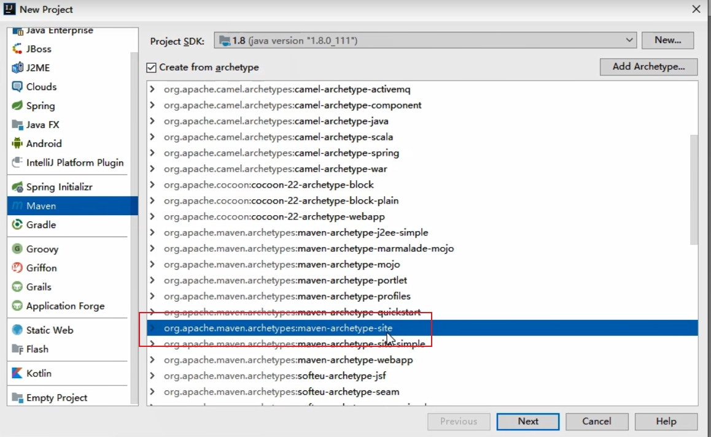
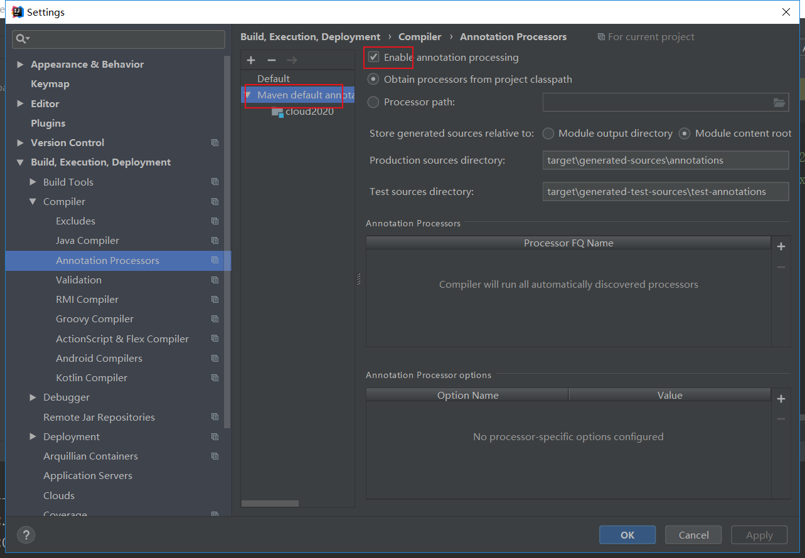
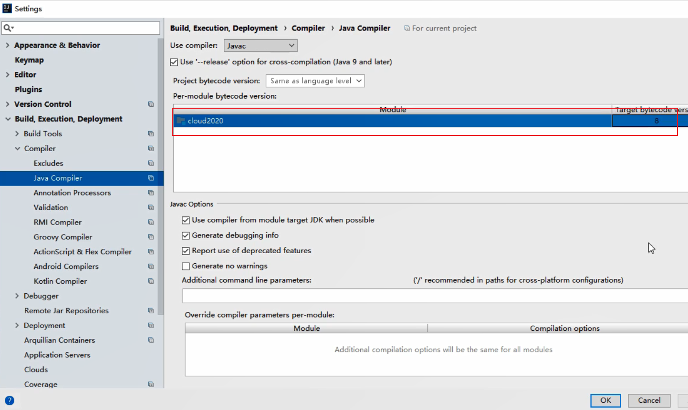

# 一、SpringCloud介绍
````
SpringCloud 是微服务一站式服务解决方案，微服务全家桶。它是微服务开发的主流技术栈。它采用了名称，而非数字版本号。

SpringCloud 和 springCloud Alibaba 目前是最主流的微服务框架组合。
````
## (一)、SpringCloud版本选择
````
Cloud       Release Train	Boot Version
Hoxton	    2.2.x, 2.3.x (Starting with SR5)
Greenwich	2.1.x
Finchley	2.0.x
Edgwj	    1.5.x
Dalston	    1.5.x
````
## (二)、课程所用软件版本
````
cloud	        Hoxton.SR1
boot	        2.2.2.RELEASE
cloud alibaba	2.1.0.RELEASE
java	        java8
maven	        3.5及以上
mysql	        5.7及以上
````
## (三)、Cloud各种组件的停更/升级/替换 

# 二、微服务架构编码构建
````
约定 > 配置 > 编码
````
## (一)、构建父工程
* 1、微服务cloud整体聚合父工程Project。构建父工程，后面的项目模块都在此工程中：

* 2、设置编码：Settings -> File Encodings
* 3、注解激活

* 4、Java版本确定

* 5、父工程pom配置
````
<?xml version="1.0" encoding="UTF-8"?>
<project xmlns="http://maven.apache.org/POM/4.0.0"
         xmlns:xsi="http://www.w3.org/2001/XMLSchema-instance"
         xsi:schemaLocation="http://maven.apache.org/POM/4.0.0 http://maven.apache.org/xsd/maven-4.0.0.xsd">
    <modelVersion>4.0.0</modelVersion>

    <groupId>com.jch.springcloud</groupId>
    <artifactId>cloud2020</artifactId>
    <version>1.0-SNAPSHOT</version>
    <!-- 用在父级工程或聚合工程中，用来做jar包的版本控制。 -->
    <packaging>pom</packaging>

    <!-- 统一管理 jar 包版本 -->
    <properties>
        <project.version>1.0-SNAPSHOT</project.version>
        <project.build.sourceEncoding>UTF-8</project.build.sourceEncoding>
        <maven.compiler.source>1.8</maven.compiler.source>
        <maven.compiler.target>1.8</maven.compiler.target>
        <junit.version>4.12</junit.version>
        <log4j.version>1.2.17</log4j.version>
        <lombok.version>1.16.18</lombok.version>
        <mysql.version>5.1.49</mysql.version>
        <druid.version>1.2.8</druid.version>
        <mybatis.spring.boot.version>2.2.2</mybatis.spring.boot.version>
    </properties>

    <!-- 子块基础之后，提供作用：锁定版本 + 子module不用写 groupId 和 version -->
    <dependencyManagement>
        <dependencies>
            <!-- 下面三个基本是微服务架构的标配 -->
            <!--spring boot 2.2.2-->
            <dependency>
                <groupId>org.springframework.boot</groupId>
                <artifactId>spring-boot-dependencies</artifactId>
                <version>2.2.2.RELEASE</version>
                <type>pom</type>
                <scope>import</scope>
            </dependency>
            <!--spring cloud Hoxton.SR1-->
            <dependency>
                <groupId>org.springframework.cloud</groupId>
                <artifactId>spring-cloud-dependencies</artifactId>
                <version>Hoxton.SR1</version>
                <type>pom</type>
                <scope>import</scope>
            </dependency>
            <!--spring cloud 阿里巴巴-->
            <dependency>
                <groupId>com.alibaba.cloud</groupId>
                <artifactId>spring-cloud-alibaba-dependencies</artifactId>
                <version>2.1.0.RELEASE</version>
                <type>pom</type>
                <scope>import</scope>
            </dependency>

            <!--mysql-->
            <dependency>
                <groupId>mysql</groupId>
                <artifactId>mysql-connector-java</artifactId>
                <version>${mysql.version}</version>
                <scope>runtime</scope>
            </dependency>
            <!-- druid-->
            <dependency>
                <groupId>com.alibaba</groupId>
                <artifactId>druid</artifactId>
                <version>${druid.version}</version>
            </dependency>
            <dependency>
                <groupId>org.mybatis.spring.boot</groupId>
                <artifactId>mybatis-spring-boot-starter</artifactId>
                <version>${mybatis.spring.boot.version}</version>
            </dependency>
            <!--junit-->
            <dependency>
                <groupId>junit</groupId>
                <artifactId>junit</artifactId>
                <version>${junit.version}</version>
            </dependency>
            <!--log4j-->
            <dependency>
                <groupId>log4j</groupId>
                <artifactId>log4j</artifactId>
                <version>${log4j.version}</version>
            </dependency>

        </dependencies>

    </dependencyManagement>

    <build>
        <plugins>
            <plugin>
                <groupId>org.springframework.boot</groupId>
                <artifactId>spring-boot-maven-plugin</artifactId>
                <configuration>
                    <addResources>true</addResources>
                </configuration>
            </plugin>
        </plugins>
    </build>

</project>
````
## (二)Rest微服务工程构建
### 1、支付Module模块8001
* 1、新建模块cloud-provider-payment8001
````
pom.xml
<?xml version="1.0" encoding="UTF-8"?>
<project xmlns="http://maven.apache.org/POM/4.0.0"
         xmlns:xsi="http://www.w3.org/2001/XMLSchema-instance"
         xsi:schemaLocation="http://maven.apache.org/POM/4.0.0 http://maven.apache.org/xsd/maven-4.0.0.xsd">
    <parent>
        <artifactId>cloud2020</artifactId>
        <groupId>springcloud</groupId>
        <version>1.0-SNAPSHOT</version>
    </parent>
    <modelVersion>4.0.0</modelVersion>
 
    <artifactId>cloud-provider-payment8001</artifactId>
 
    <dependencies>
        <dependency>
            <groupId>org.springframework.boot</groupId>
            <artifactId>spring-boot-starter-web</artifactId>
        </dependency>
        <dependency>
            <groupId>org.springframework.boot</groupId>
            <artifactId>spring-boot-starter-actuator</artifactId>
        </dependency>
        <dependency>
            <groupId>org.mybatis.spring.boot</groupId>
            <artifactId>mybatis-spring-boot-starter</artifactId>
        </dependency>
        <dependency>
            <groupId>com.alibaba</groupId>
            <artifactId>druid-spring-boot-starter</artifactId>
            <version>1.2.16</version>
        </dependency>
        <!--mysql-connector-java-->
        <dependency>
            <groupId>mysql</groupId>
            <artifactId>mysql-connector-java</artifactId>
        </dependency>
        <!--jdbc-->
        <dependency>
            <groupId>org.springframework.boot</groupId>
            <artifactId>spring-boot-starter-jdbc</artifactId>
        </dependency>
        <dependency>
            <groupId>org.springframework.boot</groupId>
            <artifactId>spring-boot-devtools</artifactId>
            <scope>runtime</scope>
            <optional>true</optional>
        </dependency>
        <dependency>
            <groupId>org.projectlombok</groupId>
            <artifactId>lombok</artifactId>
            <optional>true</optional>
        </dependency>
        <dependency>
            <groupId>org.springframework.boot</groupId>
            <artifactId>spring-boot-starter-test</artifactId>
            <scope>test</scope>
        </dependency>
    </dependencies>
</project>
````
* 2、application.yml 
````
server:
  port: 8001

spring:
  application:
    name: cloud-payment-service # 项目名,也是注册的名字

  datasource:
    type: com.alibaba.druid.pool.DruidDataSource  #当前数据源操作类型
    driver-class-name: org.gjt.mm.mysql.Driver    #mysql驱动包
    url: jdbc:mysql://localhost:3306/db2023?useUnicode=true&characterEncoding=utf-8&useSSL=false&serverTimezone=UTC
    username: root
    password: root

mybatis:
  mapper-locations: classpath:mapper/*.xml
  # 所有domain 别名类所在包
  type-aliases-package: com.jch.springcloud.domain
````
* 3、主启动类
````
@SpringBootApplication
public class PaymentMain8001 {
    public static void main(String[] args) {
        SpringApplication.run(PaymentMain8001.class,args);
    }
}
````
* 4、建表SQL
````
create table `payment`(
    `id` bigint(20) not null auto_increment comment 'ID',
    `serial` varchar(200) default '',
    PRIMARY KEY (`id`)
 
)ENGINE=InnoDB AUTO_INCREMENT=1 DEFAULT CHARSET=utf8
````
* 5、实体类
````
@Data
@AllArgsConstructor
@NoArgsConstructor
public class Payment implements Serializable {
    private Long id;
    private String serial;
}
````
* 6、返回给前端的通用json数据串
````
@Data
@AllArgsConstructor
@NoArgsConstructor
public class CommonResult<T> {
    private Integer code;
    private String msg;
    private T data;

    public CommonResult(Integer code, String msg) {
        this(code, msg, null);
    }
}
````
* 7、mapper
````
@Mapper
public interface PaymentMapper {
    public int create(Payment payment);

    public Payment getPaymentById(@Param("id") Long id);
}
````
* 8、mapper.xml
````
<?xml version="1.0" encoding="UTF-8" ?>
<!DOCTYPE mapper PUBLIC "-//mybatis.org//DTD Mapper 3.0//EN" "http://mybatis.org/dtd/mybatis-3-mapper.dtd">
<mapper namespace="com.jch.springcloud.mapper.PaymentMapper">

    <resultMap id="BaseResultMap" type="Payment">
        <id column="id" property="id" jdbcType="BIGINT"/>
        <id column="serial" property="serial" jdbcType="VARCHAR"/>
    </resultMap>

    <insert id="create" parameterType="Payment" useGeneratedKeys="true" keyProperty="id">
        insert into payment(serial) values(#{serial})
    </insert>

    <select id="getPaymentById" parameterType="Long" resultMap="BaseResultMap">
        select * from payment where id = #{id}
    </select>
</mapper>
````
* 9、service
````
public interface IPaymentService {
    public int create(Payment payment);

    public Payment getPaymentById(Long id);
}
````
````
@Service
public class PaymentServiceImpl implements IPaymentService {

    @Autowired
    PaymentMapper paymentMapper;

    @Override
    public int create(Payment payment) {
        return paymentMapper.create(payment);
    }

    @Override
    public Payment getPaymentById(Long id) {
        return paymentMapper.getPaymentById(id);
    }
}
````
* 10、controller 
````
@RestController
@Slf4j
public class PaymentController {
    @Autowired
    private IPaymentService paymentService;

    @PostMapping(value = "/payment/create")
    public CommonResult create(@RequestBody Payment payment){
        int result = paymentService.create(payment);
        log.info("***********插入结果："+result);

        if (result > 0){
            return new CommonResult(200,"插入数据库成功",result);
        }else {
            return new CommonResult(444,"插入数据库失败",null);
        }
    }

    @GetMapping(value = "/payment/get/{id}")
    public CommonResult<Payment> getPaymentById(@PathVariable("id") Long id){
        Payment payment = paymentService.getPaymentById(id);
        log.info("***********查询结果："+payment+"\t"+"oo哈哈");

        if (payment!=null){
            return new CommonResult(200,"查询成功",payment);
        }else {
            return new CommonResult(444,"查询失败",null);
        }
    }
}
````
### 2、消费者订单Module模块80
* 1、pom.xml
````
<?xml version="1.0" encoding="UTF-8"?>
<project xmlns="http://maven.apache.org/POM/4.0.0"
         xmlns:xsi="http://www.w3.org/2001/XMLSchema-instance"
         xsi:schemaLocation="http://maven.apache.org/POM/4.0.0 http://maven.apache.org/xsd/maven-4.0.0.xsd">
    <parent>
        <artifactId>cloud2020</artifactId>
        <groupId>com.jch.springcloud</groupId>
        <version>1.0-SNAPSHOT</version>
    </parent>

    <modelVersion>4.0.0</modelVersion>

    <artifactId>cloud-consumer-order80</artifactId>

    <dependencies>
        <dependency>
            <groupId>org.springframework.boot</groupId>
            <artifactId>spring-boot-starter-web</artifactId>
        </dependency>
        <dependency>
            <groupId>org.springframework.boot</groupId>
            <artifactId>spring-boot-starter-actuator</artifactId>
        </dependency>
        <dependency>
            <groupId>org.projectlombok</groupId>
            <artifactId>lombok</artifactId>
            <optional>true</optional>
        </dependency>
        <dependency>
            <groupId>org.springframework.boot</groupId>
            <artifactId>spring-boot-starter-test</artifactId>
            <scope>test</scope>
        </dependency>
    </dependencies>

</project>
````
* 2、application.yml
````
server:
  port: 80
````
* 3、 主启动类
````
@SpringBootApplication
public class OrderMain80 {
    public static void main(String[] args) {
        SpringApplication.run(OrderMain80.class, args);
    }
}
````
* 4、实体类
````
@Data
@AllArgsConstructor
@NoArgsConstructor
public class Payment implements Serializable {
    private Long id;
    private String serial;
}
````
* 5、返回给前端的通用json数据串
````
@Data
@AllArgsConstructor
@NoArgsConstructor
public class CommonResult<T> {
    private Integer code;
    private String msg;
    private T data;

    public CommonResult(Integer code, String msg) {
        this(code, msg, null);
    }
}
````
* 6、config配置类配置RestTemplate
````
@Configuration
public class ApplicationContextConfig {

    @Bean
    public RestTemplate getRestTemplate() {
        return new RestTemplate();
    }
}
````
* 7、controller
````
@RestController
@Slf4j
public class OrderController {

    public static final String PAYMENT_URL = "http://localhost:8001";

    @Autowired
    private RestTemplate restTemplate;

    @GetMapping ("/consumer/payment/create")
    public CommonResult<Payment> create(Payment payment) {
        return restTemplate.postForObject(PAYMENT_URL + "/payment/create", //请求地址
                payment, //请求参数
                CommonResult.class); //返回类型
    }

    @GetMapping("/consumer/payment/get/{id}")
    public CommonResult<Payment> getPayment(@PathVariable("id") Long id) {
        return restTemplate.getForObject(PAYMENT_URL + "/payment/get/" + id, //请求地址
                CommonResult.class); //返回类型
    }
}
````
### 3、工程重构
* 1、系统中有重复部分, 新建模块cloud-api-commons
* 2、pom.xml
````
<?xml version="1.0" encoding="UTF-8"?>
<project xmlns="http://maven.apache.org/POM/4.0.0"
         xmlns:xsi="http://www.w3.org/2001/XMLSchema-instance"
         xsi:schemaLocation="http://maven.apache.org/POM/4.0.0 http://maven.apache.org/xsd/maven-4.0.0.xsd">
    <parent>
        <artifactId>cloud2020</artifactId>
        <groupId>com.jch.springcloud</groupId>
        <version>1.0-SNAPSHOT</version>
    </parent>
    <modelVersion>4.0.0</modelVersion>

    <artifactId>cloud-api-commons</artifactId>

    <dependencies>
        <dependency>
            <groupId>org.springframework.boot</groupId>
            <artifactId>spring-boot-devtools</artifactId>
            <scope>runtime</scope>
            <optional>true</optional>
        </dependency>
        <dependency>
            <groupId>org.projectlombok</groupId>
            <artifactId>lombok</artifactId>
            <optional>true</optional>
        </dependency>

        <!-- 这个是新添加的，之前没用到，后面会用到。关于这个hutool 是个功能强大的工具包，官网：https://hutool.cn/ -->
        <dependency>
            <groupId>cn.hutool</groupId>
            <artifactId>hutool-all</artifactId>
            <version>5.1.0</version>
        </dependency>
    </dependencies>

</project>
````
* 3、实体类
````
@Data
@AllArgsConstructor
@NoArgsConstructor
public class Payment implements Serializable {
    private Long id;
    private String serial;
}
````
* 4、CommonResult通用封装类
````
@Data
@AllArgsConstructor
@NoArgsConstructor
public class CommonResult<T> {
    private Integer code;
    private String msg;
    private T data;

    public CommonResult(Integer code, String msg) {
        this(code, msg, null);
    }
}
````
* 5、maven命令clean install
* 6、订单80和支付8001分别改造，删除各自的原先有过的entities文件夹，分别粘贴
````
<dependency>
    <groupId>com.jch.springcloud</groupId>
     <artifactId>cloud-api-commons</artifactId>
     <version>${project.version}</version>
</dependency>
````