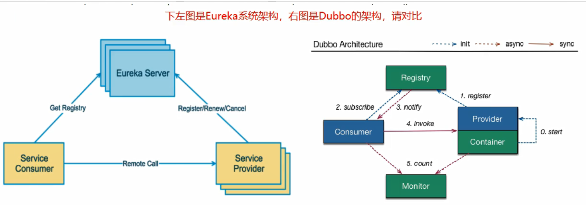

# 一、Eureka基础知识
## 1、什么是服务治理
````
SpringCloud封装了Netflix公司开发的Eureka模块来实现服务治理

在传统的rpc远程调用框架中，管理每个服务与服务之间依赖关系比较复杂，管理比较复杂，所以需要使用服务治理，管理服务于服务之间依赖关系，可以实现服务调用、负载均衡、容错等，实现服务发现与注册。
````
## 2、什么是服务注册与发现
````
Eureka采用了CS的设计结构，Eureka Server服务注册功能的服务器，它是服务注册中心。而系统中的其他微服务，使用Eureka的客户端连接到Eureka Server并维持心跳连接。这样系统的维护人员就可以通过Eureka Server来监控系统中各个微服务是否正常运行。这点和zookeeper很相似

在服务注册与发现中，有一个注册中心。当服务器启动时候，会把当前自己服务器的信息 比如服务地址 通讯地址等以别名方式注册到注册中心上。另一方（消费者|服务提供者），以该别名的方式去注册中心上获取到实际的服务通讯地址，然后再实现本地RPC调用。RPC远程调用框架核心设计思想：在于注册中心，因为便用注册中心管理每个服务与服务之间的一个依赖关系(服务治理概念)。在任何rpc远程框架中，都会有一个注册中心（存放服务地址相关信息（接口地址））
````

## 3、Eureka包含两个组件：Eureka Server和Eureka Client
````
1、Eureka Server提供服务注册服务
各个微服务节点通过配置启动后，会在EurekaServer中进行注册，这样EurekaServer中的服务注册表中将会存储所有可用服务节点的信息，服务节点的信息可以在界面中直观看到。
2、EurekaClient通过注册中心进行访问

是一个Java客户端，用于简化Eureka Server的交互，客户端同时也具备一个内置的、使用轮询(round-robin)负载算法的负载均衡器。在应用启动后，将会向Eureka Server发送心跳(默认周期为30秒)。如果Eureka Server在多个心跳周期内没有接收到某个节点的心跳，EurekaServer将会从服务注册表中把这个服务节点移除（默认90秒）
````
# 二、单机Eureka构建步骤
````
消费者端口80，提供者端口8001，Eureka端口7001
````
## 1、Server模块
* 1、pom.xml
````
<?xml version="1.0" encoding="UTF-8"?>
<project xmlns="http://maven.apache.org/POM/4.0.0"
         xmlns:xsi="http://www.w3.org/2001/XMLSchema-instance"
         xsi:schemaLocation="http://maven.apache.org/POM/4.0.0 http://maven.apache.org/xsd/maven-4.0.0.xsd">
    <parent>
        <artifactId>cloud2020</artifactId>
        <groupId>com.jch.springcloud</groupId>
        <version>1.0-SNAPSHOT</version>
    </parent>
    <modelVersion>4.0.0</modelVersion>

    <artifactId>cloud-eureka-server7001</artifactId>

    <dependencies>
        <!--eureka-server-->
        <!--SpringBoot2.X-->
        <dependency>
            <groupId>org.springframework.cloud</groupId>
            <artifactId>spring-cloud-starter-netflix-eureka-server</artifactId>
            <version>2.2.10.RELEASE</version>
        </dependency>

        <dependency>
            <groupId>org.springframework.boot</groupId>
            <artifactId>spring-boot-starter-web</artifactId>
        </dependency>
        <dependency>
            <groupId>org.springframework.boot</groupId>
            <artifactId>spring-boot-starter-actuator</artifactId>
        </dependency>
        <dependency>
            <groupId>org.springframework.boot</groupId>
            <artifactId>spring-boot-devtools</artifactId>
            <scope>runtime</scope>
            <optional>true</optional>
        </dependency>
        <dependency>
            <groupId>org.springframework.boot</groupId>
            <artifactId>spring-boot-starter-test</artifactId>
            <scope>test</scope>
        </dependency>
        <dependency>
            <groupId>com.jch.springcloud</groupId>
            <artifactId>cloud-api-commons</artifactId>
            <version>${project.version}</version>
        </dependency>
    </dependencies>

</project>
````
* 2、application.yml
````
server:
  port: 7001

eureka:
  instance:
    hostname: localhost  # eureka 服务端的实例名称
  
  client:
    # false 代表不向服务注册中心注册自己，因为它本身就是服务中心
    register-with-eureka: false
    # false 代表自己就是服务注册中心，自己的作用就是维护服务实例，并不需要去检索服务
    fetch-registry: false
    service-url:
      # 设置与 Eureka Server 交互的地址，查询服务 和 注册服务都依赖这个地址
      defaultZone: http://localhost:7001/eureka/
````
* 3、主启动类
````
@SpringBootApplication
@EnableEurekaServer
public class EurekaMain7001 {
    public static void main(String[] args) {
        SpringApplication.run(EurekaMain7001.class, args);
    }
}
````
## 2、8001注册进Eureka成为提供者
* 1、pom.xml
````
<!--eureka-client-->
<dependency>
    <groupId>org.springframework.cloud</groupId>
    <artifactId>spring-cloud-starter-netflix-eureka-client</artifactId>
    <version>2.2.10.RELEASE</version>
</dependency>
````
* 2、application.yml
````
eureka:
  client:
    # 注册进 Eureka 的服务中心
    register-with-eureka: true
    # 检索服务中心的其它服务
    # 单节点无所谓，集群必须设置为true才能配合ribbon使用负载均衡
    fetch-registry: true
    service-url:
      # 设置与 Eureka Server 交互的地址
      defaultZone: http://localhost:7001/eureka/
````
* 3、主启动类
````
@SpringBootApplication
@EnableEurekaClient
public class PaymentMain8001 {
    public static void main(String[] args) {
        SpringApplication.run(PaymentMain8001.class, args);
    }
}
````
## 3、80注册进Eureka成为消费者
* 1、pom.xml
````
<!--eureka-client-->
<dependency>
    <groupId>org.springframework.cloud</groupId>
    <artifactId>spring-cloud-starter-netflix-eureka-client</artifactId>
    <version>2.2.10.RELEASE</version>
</dependency>
````
* 2、application.yml
````
eureka:
  client:
    # 注册进 Eureka 的服务中心
    register-with-eureka: true
    # 检索服务中心的其它服务
    # 单节点无所谓，集群必须设置为true才能配合ribbon使用负载均衡
    fetch-registry: true
    service-url:
      # 设置与 Eureka Server 交互的地址
      defaultZone: http://localhost:7001/eureka/
````
* 3、主启动类
````
@SpringBootApplication
@EnableEurekaClient
public class OrderMain80 {
    public static void main(String[] args) {
        SpringApplication.run(OrderMain80.class, args);
    }
}
````
# 三、集群Eureka构建步骤
## 1、集群原理说明
* 1、Eureka Server
````
服务注册: 将服务信息注册进注册中心
服务发现: 从注册中心获取服务信息
实质: 存key服务名, 取value调用地址
````
* 2、完整流程
````
1、先启动eureka注册中心
2、启动服务提供者payment支付服务
3、支付服务启动后会把自身信息(比如服务地址以别名方式注册进eureka)
4、消费者order服务在需要调用接口时, 使用服务别名去注册中心获取实际的RPC远程调用地址
5、消费者获得调用地址后, 底层实际是利用HttpClient技术实现远程调用
6、消费者获得服务地址后会缓存在本地jvm内存中, 默认每30秒更新一次服务调用地址
````
## 2、集群环境构建
* 1、新建cloud-eureka-server7002
* 2、修改映射配置文件
````
127.0.0.1 eureka7001.com
127.0.0.1 eureka7002.com
````
* 3、application.yml
````
注册中心eureakeServer端7001

server:
  port: 7001

eureka:
  instance:
    hostname: eureka7001.com  # eureka 服务端的实例名称

  client:
    # false 代表不向服务注册中心注册自己，因为它本身就是服务中心
    register-with-eureka: false
    # false 代表自己就是服务注册中心，自己的作用就是维护服务实例，并不需要去检索服务
    fetch-registry: false
    service-url:
      # 设置与 Eureka Server 交互的地址，查询服务 和 注册服务都依赖这个地址
      # 单机就是自己
      # defaultZone: http://eureka7001.com:7001/eureka/
      # 集群指向其他eureka
      defaultZone: http://eureka7002.com:7002/eureka/
````
````
7002：

server:
  port: 7002
 
eureka:
  instance:
    hostname: eureka7002.com  # eureka 服务端的实例名称
 
  client:
    # false 代表不向服务注册中心注册自己，因为它本身就是服务中心
    register-with-eureka: false
    # false 代表自己就是服务注册中心，自己的作用就是维护服务实例，并不需要去检索服务
    fetch-registry: false
    service-url:
      # 设置与 Eureka Server 交互的地址，查询服务 和 注册服务都依赖这个地址
      # 集群指向其他eureka
      defaultZone: http://eureka7001.com:7001/eureka/
````
## 3、8001发布到2台Eureka集群
````
server:
  port: 8001

spring:
  application:
    name: cloud-payment-service # 项目名,也是注册的名字

  datasource:
    type: com.alibaba.druid.pool.DruidDataSource  #当前数据源操作类型
    driver-class-name: org.gjt.mm.mysql.Driver    #mysql驱动包
    url: jdbc:mysql://localhost:3306/db2023?useUnicode=true&characterEncoding=utf-8&useSSL=false&serverTimezone=UTC
    username: root
    password: root
eureka:
  client:
    # 注册进 Eureka 的服务中心
    register-with-eureka: true
    # 检索服务中心的其它服务
    # 单节点无所谓，集群必须设置为true才能配合ribbon使用负载均衡
    fetch-registry: true
    service-url:
      # 设置与 Eureka Server 交互的地址
      # defaultZone: http://localhost:7001/eureka/
      defaultZone: http://eureka7001.com:7001/eureka/,http://eureka7002.com:7002/eureka/
mybatis:
  mapper-locations: classpath:mapper/*.xml
  # 所有domain 别名类所在包
  type-aliases-package: com.jch.springcloud.domain
````
## 4、80发布到2台Eureka集群 
````
server:
  port: 80
spring:
  application:
    name: cloud-order-service

eureka:
  client:
    # 注册进 Eureka 的服务中心
    register-with-eureka: true
    # 检索服务中心的其它服务
    # 单节点无所谓，集群必须设置为true才能配合ribbon使用负载均衡
    fetch-registry: true
    service-url:
      # 设置与 Eureka Server 交互的地址
      # defaultZone: http://localhost:7001/eureka/
      defaultZone: http://eureka7001.com:7001/eureka/,http://eureka7002.com:7002/eureka/
````
## 5、支付服务提供者8001集群环境构建 
````
参考cloud-provider-payment8001新建cloud-provider-payment8002
````
* 1、application.yml，只有端口号不同
````
server:
  port: 8002
````
* 2、修改8001/8002的PaymentServiceImpl
````
@RestController
@Slf4j
public class PaymentController {
    @Autowired
    private IPaymentService paymentService;

    @Value("${server.port}")
    private String serverPort;

    @PostMapping(value = "/payment/create")
    public CommonResult create(@RequestBody Payment payment){
        int result = paymentService.create(payment);
        log.info("***********插入结果："+result);

        if (result > 0){
            return new CommonResult(200,"插入数据库成功, serverPort" + serverPort,result);
        }else {
            return new CommonResult(444,"插入数据库失败",null);
        }
    }

    @GetMapping(value = "/payment/get/{id}")
    public CommonResult<Payment> getPaymentById(@PathVariable("id") Long id){
        Payment payment = paymentService.getPaymentById(id);
        log.info("***********查询结果："+payment+"\t"+"oo哈哈");

        if (payment!=null){
            return new CommonResult(200,"查询成功, serverPort" + serverPort,payment);
        }else {
            return new CommonResult(444,"查询失败",null);
        }
    }
}
````
## 6、消费者80
* 1、将远程调用的地址，改成提供者在Eureka 上的名称，无需写端口号
````
@RestController
@Slf4j
public class OrderController {

    // public static final String PAYMENT_URL = "http://localhost:8001";
    public static final String PAYMENT_URL = "http://CLOUD-PAYMENT-SERVICE";

    @Autowired
    private RestTemplate restTemplate;

    @GetMapping ("/consumer/payment/create")
    public CommonResult<Payment> create(Payment payment) {
        return restTemplate.postForObject(PAYMENT_URL + "/payment/create", //请求地址
                payment, //请求参数
                CommonResult.class); //返回类型
    }

    @GetMapping("/consumer/payment/get/{id}")
    public CommonResult<Payment> getPayment(@PathVariable("id") Long id) {
        return restTemplate.getForObject(PAYMENT_URL + "/payment/get/" + id, //请求地址
                CommonResult.class); //返回类型
    }
}
````
* 2、@LoadBalanced
````
修改注入RestTemplate的配置类 
这时候，消费者消费的提供者多次访问就会变化了（这就是Ribbon的负载平衡功能）

@Configuration
public class ApplicationContextConfig {

    @Bean
    @LoadBalanced
    public RestTemplate getRestTemplate() {
        return new RestTemplate();
    }
}
````
# 四、actuator微服务信息完善
## 1、当前问题
* 1、含有主机名称
````
修改8001 yml文件, 8002同理
instance:
  instance-id: payment8002 # 每个提供者的id不同，显示的不再是默认的项目名

server:
  port: 8002
 
spring:
  application:
    name: cloud-payment-service # 项目名,也是注册的名字
  datasource:
    type: com.alibaba.druid.pool.DruidDataSource  #当前数据源操作类型
    driver-class-name: org.gjt.mm.mysql.Driver    #mysql驱动包
    url: jdbc:mysql://localhost:3306/db2019?useUnicode=true&characterEncoding=utf-8&useSSL=false&serverTimezone=UTC
    username: root
    password: 12345
 
eureka:
  client:
    # 注册进 Eureka 的服务中心
    register-with-eureka: true
    # 检索 服务中心 的其它服务
    fetch-registry: true
    service-url:
      # 设置与 Eureka Server 交互的地址
      defaultZone: http://eureka7001.com:7001/eureka/,http://eureka7002.com:7002/eureka/
  instance:
    instance-id: payment8001 # 每个提供者的id不同，显示的不再是默认的项目名
 
mybatis:
  mapper-locations: classpath:mapper/*.xml
  type-aliases-package: com.atguigu.springcloud.entities  # 所有Entity 别名类所在包
````
* 2、访问信息没有IP信息提示
````
为了在微服务Eureka控制台能看到我们的某个具体服务是在哪台服务器上部署的，我们需要配置一些内容。
修改8001 yml文件, 8002同理
prefer-ip-address: true # 可以显示ip地址

server:
  port: 8002

spring:
  application:
    name: cloud-payment-service # 项目名,也是注册的名字

  datasource:
    type: com.alibaba.druid.pool.DruidDataSource  #当前数据源操作类型
    driver-class-name: org.gjt.mm.mysql.Driver    #mysql驱动包
    url: jdbc:mysql://localhost:3306/db2023?useUnicode=true&characterEncoding=utf-8&useSSL=false&serverTimezone=UTC
    username: root
    password: root
eureka:
  client:
    # 注册进 Eureka 的服务中心
    register-with-eureka: true
    # 检索服务中心的其它服务
    # 单节点无所谓，集群必须设置为true才能配合ribbon使用负载均衡
    fetch-registry: true
    service-url:
      # 设置与 Eureka Server 交互的地址
      # defaultZone: http://localhost:7001/eureka/
      defaultZone: http://eureka7001.com:7001/eureka/,http://eureka7002.com:7002/eureka/
  instance:
    instance-id: payment8002
    prefer-ip-address: true # 可以显示ip地址
mybatis:
  mapper-locations: classpath:mapper/*.xml
  # 所有domain 别名类所在包
  type-aliases-package: com.jch.springcloud.domain
````
# 五、服务发现Discovery
## 1、修改8001和8002的Controller
````
添加以下内容

public class PaymentController {
    @Resource
    private DiscoveryClient discoveryClient;
 
 
    @GetMapping(value = "/payment/discovery")
    public Object discovery(){
        //获得服务清单列表
        List<String> services = discoveryClient.getServices();
        for (String service : services) {
            log.info("*****element:"+service);
        }
        
        // 根据具体服务进一步获得该微服务的信息
        List<ServiceInstance> instances = discoveryClient.getInstances("CLOUD-PAYMENT-SERVICE");
        for (ServiceInstance instance : instances) {
            log.info(instance.getServiceId()+"\t"+instance.getHost()+"\t"+instance.getPort()+"\t"+instance.getUri());
        }
        return this.discoveryClient;
    }
}
````
## 2、主启动类
````
主启动类添加注解：@EnableDiscoveryClient

@SpringBootApplication
@EnableEurekaClient
@EnableDiscoveryClient //服务发现
public class PaymentMain8002 {
    public static void main(String[] args) {
        SpringApplication.run(PaymentMain8002.class,args);
    }
}
````
# 六、Eureka自我保护
## 1、故障现象
````
保护模式主要用于一组客户端和Eureka Server之间存在网络分区场景下的保护。一旦进入保护模式，Eureka Server将会尝试保护其服务注册表中的信息，不再删除服务注册表中的数据，也就是不会注销任何微服务。

如果在Eureka Server的首页看到以下这段提示，则说明Eureka进入了保护模式：
EMERGENCY! EUREKA MAY BE INCORRECTLY CLAIMING INSTANCES ARE UP WHEN THEY'RE NOT. 
RENEWALS ARE LESSER THAN THRESHOLD AND HENCE THE INSTANCES ARE NOT BEING EXPIRED JUST TO BE SAFE 
````
## 2、故障原因
* 1、为什么会产生Eureka自我保护机制？
````
为了防止EurekaClient可以正常运行，但是 与 EurekaServer网络不通情况下，EurekaServer不会立刻将EurekaClient服务剔除
````
* 2、什么是自我保护模式？
````
默认情况下，如果EurekaServer在一定时间内没有接收到某个微服务实例的心跳，EurekaServer将会注销该实例（默认90秒）。但是当网络分区故障发生(延时、卡顿、拥挤)时，微服务与EurekaServer之间无法正常通信，以上行为可能变得非常危险了——因为微服务本身其实是健康的，此时本不应该注销这个微服务。Eureka通过“自我保护模式”来解决这个问题——当EurekaServer节点在短时间内丢失过多客户端时（可能发生了网络分区故障），那么这个节点就会进入自我保护模式。

在自我保护模式中，Eureka Server会保护服务注册表中的信息，不再注销任何服务实例。

综上，自我保护模式是一种应对网络异常的安全保护措施。它的架构哲学是宁可同时保留所有微服务（健康的微服务和不健康的微服务都会保留）也不盲目注销任何健康的微服务。使用自我保护模式，可以让Eureka集群更加的健壮、稳定。

一句话：某时刻某一个微服务不可用了，Eureka不会立刻清理，依旧会对该微服务的信息进行保存,属于CAP里面的AP分支
````
## 3、怎么禁止自我保护
* 1、注册中心eureakeServer端7001
````
出厂默认，自我保护机制是开启的 eureka.server.enable-self-preservation=true，使用eureka.server.enable-self-preservation = false 可以禁用自我保护模式

server:
  port: 7001

eureka:
  instance:
    hostname: eureka7001.com  # eureka 服务端的实例名称

  client:
    # false 代表不向服务注册中心注册自己，因为它本身就是服务中心
    register-with-eureka: false
    # false 代表自己就是服务注册中心，自己的作用就是维护服务实例，并不需要去检索服务
    fetch-registry: false
    service-url:
      # 设置与 Eureka Server 交互的地址，查询服务 和 注册服务都依赖这个地址
      # 单机就是自己
      defaultZone: http://eureka7001.com:7001/eureka/
      # 集群指向其他eureka
      # defaultZone: http://eureka7002.com:7002/eureka/

    # 关闭自我保护机制，保证不可用该服务被及时剔除
    enable-self-preservation: false
    eviction-interval-timer-in-ms: 2000
````
* 2、生产者客户端eureakeClient端8001
````
server:
  port: 8001

spring:
  application:
    name: cloud-payment-service # 项目名,也是注册的名字

  datasource:
    type: com.alibaba.druid.pool.DruidDataSource  #当前数据源操作类型
    driver-class-name: org.gjt.mm.mysql.Driver    #mysql驱动包
    url: jdbc:mysql://localhost:3306/db2023?useUnicode=true&characterEncoding=utf-8&useSSL=false&serverTimezone=UTC
    username: root
    password: root
eureka:
  client:
    # 注册进 Eureka 的服务中心
    register-with-eureka: true
    # 检索服务中心的其它服务
    # 单节点无所谓，集群必须设置为true才能配合ribbon使用负载均衡
    fetch-registry: true
    service-url:
      # 设置与 Eureka Server 交互的地址
      defaultZone: http://localhost:7001/eureka/
      # defaultZone: http://eureka7001.com:7001/eureka/,http://eureka7002.com:7002/eureka/
  instance:
    instance-id: payment8001
    prefer-ip-address: true # 可以显示ip地址
    # Eureka客户端像服务端发送心跳的时间间隔，单位s，默认30s
    least-renewal-interval-in-seconds: 1
    # Rureka服务端在收到最后一次心跳后等待时间上线，单位为s，默认90s，超时将剔除服务
    least-expiration-duration-in-seconds: 2
mybatis:
  mapper-locations: classpath:mapper/*.xml
  # 所有domain 别名类所在包
  type-aliases-package: com.jch.springcloud.domain
````