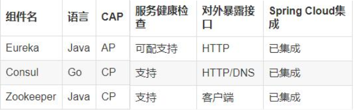

# 一、Consul简介
## 1、定义
````
Consul 是一套开源的分布式服务发现和配置管理系统，由 HashiCorp 公司用 Go 语言开发。

提供了微服务系统中的服务治理、配置中心、控制总线等功能。这些功能中的每一个都可以根据需要单独使用，也可以一起使用以构建全方位的服务网格，总之Consul提供了一种完整的服务网格解决方案。

它具有很多优点。包括： 基于 raft 协议，比较简洁； 支持健康检查, 同时支持 HTTP 和 DNS 协议 支持跨数据中心的 WAN 集群 提供图形界面 跨平台，支持 Linux、Mac、Windows。
````
## 2、作用
````
1、服务发现：提供HTTP和DNS两种发现方式
2、健康监测：支持多种方式，HTTP、TCP、Docker、Shell脚本定制化监控
3、KV存储：Key、Value的存储方式
4、多数据中心：Consul支持多数据中心
5、可视化Web界面
````
# 二、安装并运行Consul
## 1、下载和安装
````
下载地址: https://www.consul.io/downloads.html
下载完成后只有一个consul.exe文件，硬盘路径下双击运行
查看 consul 版本信息: consul --version
````
## 2、运行
````
使用开发模式启动: consul agent -dev
Consul的首页：http://localhost:8500
````
## 3、服务提供者注册进Consul
* 1、pom.xml
````
<?xml version="1.0" encoding="UTF-8"?>
<project xmlns="http://maven.apache.org/POM/4.0.0"
         xmlns:xsi="http://www.w3.org/2001/XMLSchema-instance"
         xsi:schemaLocation="http://maven.apache.org/POM/4.0.0 http://maven.apache.org/xsd/maven-4.0.0.xsd">
    <parent>
        <artifactId>cloud2020</artifactId>
        <groupId>com.jch.springcloud</groupId>
        <version>1.0-SNAPSHOT</version>
    </parent>
    <modelVersion>4.0.0</modelVersion>

    <artifactId>cloud-providerconsul-payment8006</artifactId>

    <dependencies>
        <!--springcloud consul server-->
        <dependency>
            <groupId>org.springframework.cloud</groupId>
            <artifactId>spring-cloud-starter-consul-discovery</artifactId>
        </dependency>
        <!-- springboot整合Web组件 -->
        <dependency>
            <groupId>org.springframework.boot</groupId>
            <artifactId>spring-boot-starter-web</artifactId>
        </dependency>
        <dependency>
            <groupId>org.springframework.boot</groupId>
            <artifactId>spring-boot-starter-actuator</artifactId>
        </dependency>
        <!-- 日常通用jar包 -->
        <dependency>
            <groupId>org.springframework.boot</groupId>
            <artifactId>spring-boot-devtools</artifactId>
            <scope>runtime</scope>
            <optional>true</optional>
        </dependency>
        <dependency>
            <groupId>org.projectlombok</groupId>
            <artifactId>lombok</artifactId>
            <optional>true</optional>
        </dependency>
        <dependency>
            <groupId>org.springframework.boot</groupId>
            <artifactId>spring-boot-starter-test</artifactId>
            <scope>test</scope>
        </dependency>
        <dependency>
            <!-- 引入自己定义的api通用包，可以使用Payment支付Entity -->
            <groupId>com.jch.springcloud</groupId>
            <artifactId>cloud-api-commons</artifactId>
            <version>1.0-SNAPSHOT</version>
        </dependency>
    </dependencies>

</project>
````
* 2、application.yml
````
server:
  port: 8006

spring:
  application:
    name: consul-provider-payment
  #consul注册中心地址
  cloud:
    consul:
      host: localhost
      port: 8500
      discovery:    # 指定注册对外暴露的服务名称
        #hostname: 127.0.0.1
        service-name: ${spring.application.name}
````
* 3、主启动类
````
@SpringBootApplication
@EnableDiscoveryClient//该注解用于向使用consul或者zookeeper作为注册中心时注册服务
public class PaymentMain8006 {
    public static void main(String[] args) {
        SpringApplication.run(PaymentMain8006.class,args);
    }
}
````
* 4、Controller类
````
@RestController
@Slf4j
public class PaymentController {
    @Value("${server.port}")
    private String serverPort;

    @RequestMapping(value = "/payment/consul")
    public String paymentConsul(){
        return "springcloud with consul: "+serverPort+"\t"+ UUID.randomUUID().toString();
    }
}
````
## 4、服务消费者注册进consul
* 1、pom.xml
````
<?xml version="1.0" encoding="UTF-8"?>
<project xmlns="http://maven.apache.org/POM/4.0.0"
         xmlns:xsi="http://www.w3.org/2001/XMLSchema-instance"
         xsi:schemaLocation="http://maven.apache.org/POM/4.0.0 http://maven.apache.org/xsd/maven-4.0.0.xsd">
    <parent>
        <artifactId>cloud2020</artifactId>
        <groupId>com.jch.springcloud</groupId>
        <version>1.0-SNAPSHOT</version>
    </parent>

    <modelVersion>4.0.0</modelVersion>

    <artifactId>cloud-consumerconsul-order80</artifactId>

    <dependencies>
        <dependency>
            <groupId>org.springframework.cloud</groupId>
            <artifactId>spring-cloud-starter-consul-discovery</artifactId>
        </dependency>
        <dependency>
            <groupId>org.springframework.boot</groupId>
            <artifactId>spring-boot-starter-web</artifactId>
        </dependency>
        <dependency>
            <groupId>org.springframework.boot</groupId>
            <artifactId>spring-boot-starter-actuator</artifactId>
        </dependency>
        <dependency>
            <groupId>org.projectlombok</groupId>
            <artifactId>lombok</artifactId>
            <optional>true</optional>
        </dependency>
        <dependency>
            <groupId>org.springframework.boot</groupId>
            <artifactId>spring-boot-starter-test</artifactId>
            <scope>test</scope>
        </dependency>
        <dependency>
            <groupId>com.jch.springcloud</groupId>
            <artifactId>cloud-api-commons</artifactId>
            <version>${project.version}</version>
        </dependency>
    </dependencies>
</project>
````
* 2、application.yml
````
server:
  port: 80
spring:
  application:
    name: cloud-consumer-order
    
  #consul注册中心地址
  cloud:
    consul:
      host: localhost
      port: 8500
      discovery:    # 指定注册对外暴露的服务名称
        #hostname: 127.0.0.1
        service-name: ${spring.application.name}
````
* 3、主启动类
````
@SpringBootApplication
@EnableDiscoveryClient
public class OrderConsulMain80 {
    public static void main(String[] args) {
        SpringApplication.run(OrderConsulMain80.class, args);
    }
}
````
* 4、config类
````
@Configuration
public class ApplicationContextConfig {
    @Bean
    @LoadBalanced
    public RestTemplate getRestTemplate(){
        return new RestTemplate();
    }
}
````
* 5、Controller类
````
@RestController
@Slf4j
public class OrderConsulController {
    public static final String INVOKE_URL = "http://consul-provider-payment";

    @Resource
    private RestTemplate restTemplate;

    @GetMapping(value = "/consumer/payment/consul")
    public String paymentInfo(){
        String result = restTemplate.getForObject(INVOKE_URL+"/payment/consul",String.class);
        return result;
    }
}
````
# 三、三个注册中心异同点

## 1、CAP
````
C：Consistency（强一致性）
A：Availability（可用性）
P：Partition tolerance（分区容错性）

CAP理论关注粒度是数据，而不是整体系统设计的策略
````
## 2、经典CAP图
````
最多只能同时较好的满足两个。
CAP理论的核心是：一个分布式系统不可能同时很好的满足一致性，可用性和分区容错性这三个需求。
因此，根据 CAP 原理将 NoSQL 数据库分成了满足 CA 原则、满足 CP 原则和满足 AP 原则三大类：
    CA - 单点集群，满足一致性，可用性的系统，通常在可扩展性上不太强大
    CP - 满足一致性，分区容忍必的系统，通常性能不是特别高
    AP - 满足可用性，分区容忍性的系统，通常可能对一致性要求低一些
````
* 1、AP(Eureka)：
````
AP架构：
当网络分区出现后，为了保证可用性，系统B可以返回旧值，保证系统的可用性。
结论：违背了一致性C的要求，只满足可用性和分区容错，即AP
````

* 2、CP(Zookeeper/Consul)：
````
当网络分区出现后，为了保证一致性，就必须拒接请求，否则无法保证一致性
结论：违背了可用性A的要求，只满足一致性和分区容错，即CP
````
