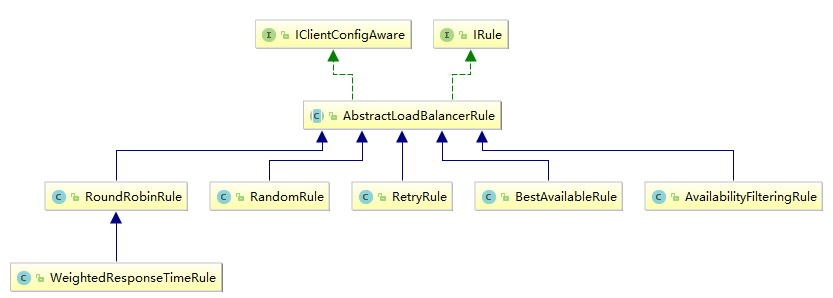

# 一、Ribbon简介
## 1、定义
````
Spring Cloud Ribbon是基于Netflix Ribbon实现的一套客户端负载均衡的工具。

简单的说，Ribbon是Netflix发布的开源项目，主要功能是提供客户端的软件负载均衡算法和服务调用。Ribbon客户端组件提供一系列完善的配置项如连接超时，重试等。简单的说，就是在配置文件中列出Load Balancer（简称LB）后面所有的机器，Ribbon会自动的帮助你基于某种规则（如简单轮询，随机连接等）去连接这些机器。我们很容易使用Ribbon实现自定义的负载均衡算法。
````
## 2、作用
* 1、LB负载均衡(Load Balance)
````
简单的说就是将用户的请求平摊的分配到多个服务上，从而达到系统的HA（高可用），常见的负载均衡有软件Nginx，LVS，硬件 F5等
````
* 2、Ribbon本地负载均衡客户端 VS Nginx服务端负载均衡区别
````
Nginx是服务器负载均衡，客户端所有请求都会交给nginx，然后由nginx实现转发请求。即负载均衡是由服务端实现的
Ribbon是本地负载均衡，在调用微服务接口时候，会在注册中心上获取注册信息服务列表之后缓存到JVM本地，从而在本地实现RPC远程服务调用技术
````
* 3、集中式LB
````
即在服务的消费方和提供方之间使用独立的LB设施(可以是硬件，如F5, 也可以是软件，如nginx), 由该设施负责把访问请求通过某种策略转发至服务的提供方
````
* 4、进程内LB
````
将LB逻辑集成到消费方，消费方从服务注册中心获知有哪些地址可用，然后自己再从这些地址中选择出一个合适的服务器。Ribbon就属于进程内LB，它只是一个类库，集成于消费方进程，消费方通过它来获取到服务提供方的地址
````
## 3、总结
````
负载均衡+RestTemplate调用
````
# 二、Ribbon负载均衡演示
## 1、架构说明
````
Ribbon在工作时分成两步：

第一步先选择 EurekaServer ,它优先选择在同一个区域内负载较少的server
第二步再根据用户指定的策略，从server取到的服务注册列表中选择一个地址；其中Ribbon提供了多种策略：比如轮询、随机和根据响应时间加权
总结：Ribbon其实就是一个软负载均衡的客户端组件，他可以和其他所需请求的客户端结合使用，和eureka结合只是其中的一个实例。
````

## 2、pom说明
````
spring-cloud-starter-netflix-eureka-client自带了spring-cloud-starter-ribbon引用，
````
## 3、RestTemplate的使用
* 1、get请求
````
getForObject方法: 返回对象为响应体中数据转化成的对象，基本上可以理解为Json
getForEntity方法: 返回对象为ResponseEntity对象，包含了响应中的一些重要信息，比如响应头、响应状态码、响应体 
````
````
加到 cloud-consumer-order80 的controller类里

@GetMapping("/consumer/payment/getForEntity/{id}")
public CommonResult<Payment> getPayment2(@PathVariable("id")Long id){
    ResponseEntity<CommonResult> eneity = restTemplate.getForEntity(PAYMENT_URL + "/payment/get/" + id, CommonResult.class);
    if(eneity.getStatusCode().is2xxSuccessful()){
        log.info(eneity.getStatusCode()+"\t"+eneity.getHeaders());
        return eneity.getBody();
    }else {
        return new CommonResult<>(444,"操作失败");
    }
}
````
* 2、post请求
````
@PostMapping ("/consumer/payment/create")
public CommonResult<Payment> create(@RequestBody Payment payment) {
    return restTemplate.postForObject(PAYMENT_URL + "/payment/create", //请求地址
            payment, //请求参数
            CommonResult.class); //返回类型
}
````
# 三、Ribbon核心组件IRule
## 1、IRule接口实现类说明
````
IRule：根据特定算法中从服务列表中选取一个要访问的服务
````

````
com.netflix.loadbalancer.RoundRobinRule：轮询
com.netflix.loadbalancer.RandomRule：随机
com.netflix.loadbalancer.RetryRule：先按照RoundRobinRule的策略获取服务，如果获取服务失败则在指定时间内会进行重试，获取可用的服务
WeightedResponseTimeRule：对RoundRobinRule的扩展，响应速度越快的实例选择权重越大，越容易被选择
BestAvailableRule：会先过滤掉由于多次访问故障而处于断路器跳闸状态的服务，然后选择一个并发量最小的服务
AvailabilityFilteringRule：先过滤掉故障实例，再选择并发较小的实例
ZoneAvoidanceRule：默认规则,复合判断server所在区域的性能和server的可用性选择服务器
````
## 2、Ribbon负载规则替换
* 1、修改cloud-consumer-order80
````
注意配置细节
官方文档明确给出了警告：
这个自定义配置类不能放在@ComponentScan所扫描的当前包下以及子包下，否则我们自定义的这个配置类就会被所有的Ribbon客户端所共享，达不到特殊化定制的目的了。
````
* 2、新建package
````
com.jch.myrule
````
* 3、新建MySelfRule规则类
````
@Configuration
public class MySelfRule {
    @Bean
    public IRule myRule(){
        return new RandomRule();//定义为随机
    }
}
````
* 4、主启动类添加@RibbonClient
````
@SpringBootApplication
@EnableEurekaClient
@RibbonClient(name = "CLOUD-PAYMENT-SERVICE",configuration = MySelfRule.class) //name与controller中保持一致
public class OrderMain80 {
    public static void main(String[] args) {
        SpringApplication.run(OrderMain80.class, args);
    }
}
````
# 四、Ribbon负载均衡算法 
## 1、原理
````
负载均衡算法：rest接口第几次请求数 % 服务器集群总数量 = 实际调用服务器位置下标  ，每次服务重启动后rest接口计数从1开始。
List instances = discoveryClient.getInstances("CLOUD-PAYMENT-SERVICE");

List [0] instances = 127.0.0.1:8002
List [1] instances = 127.0.0.1:8001

8001+ 8002 组合成为集群，它们共计2台机器，集群总数为2， 按照轮询算法原理：
当总请求数为1时： 1 % 2 =1 对应下标位置为1 ，则获得服务地址为127.0.0.1:8001
当总请求数位2时： 2 % 2 =0 对应下标位置为0 ，则获得服务地址为127.0.0.1:8002
当总请求数位3时： 3 % 2 =1 对应下标位置为1 ，则获得服务地址为127.0.0.1:8001
````
## 2、ribbon源码
````
com.netflix.loadbalancer.RoundRobinRule类

public Server choose(ILoadBalancer lb, Object key) {
 
    Server server = null;
    int count = 0;
    while (server == null && count++ < 10) {
        List<Server> reachableServers = lb.getReachableServers();
        List<Server> allServers = lb.getAllServers();
        int upCount = reachableServers.size();
        int serverCount = allServers.size();
 
        int nextServerIndex = incrementAndGetModulo(serverCount);
        server = allServers.get(nextServerIndex);
 
        if (server == null) {
            /* Transient. */
            Thread.yield();
            continue;
        }
 
        if (server.isAlive() && (server.isReadyToServe())) {
            return (server);
        }
 
        // Next.
        server = null;
    }
 
    if (count >= 10) {
        log.warn("No available alive servers after 10 tries from load balancer: "  + lb);
    }
    return server;
}
private int incrementAndGetModulo(int modulo) {
    for (;;) {
        int current = nextServerCyclicCounter.get();//获取原子的值
        int next = (current + 1) % modulo;
        if (nextServerCyclicCounter.compareAndSet(current, next)) //CAS
            return next;
    }
}
````
## 3、手写负载均衡器
* 1、服务提供者8001，8002controller加上80端调用的方法
````
@GetMapping(value = "/payment/lb")
public String getPayment(){
    return serverPort;
}
````
* 2、修改服务消费者80
````
去掉
@RibbonClient(name = "CLOUD-PAYMENT-SERVICE",configuration = MySelfRule.class)
和@LoadBalanced
````
* 3、新建包com.jch.springcloud.lb
* 4、接口
````
public interface LoadBalancer {
    /**
     * 从服务列表选出一台机器进行访问
     * @param serviceInstances 服务列表
     * @return
     */
    ServiceInstance instances(List<ServiceInstance> serviceInstances);
}
````
* 5、实现类
````
@Component
public class MyLB implements LoadBalancer {

    private AtomicInteger atomicInteger = new AtomicInteger(0);

    public final int getAndIncrement(){
        int current;
        int next;
        do{
            current = this.atomicInteger.get();
            next = current >= Integer.MAX_VALUE ? 0 : current+1;
        }while (!this.atomicInteger.compareAndSet(current,next));
        //atomicInteger.compareAndSet(expect, update),
        //比较except和update，如果相等返回true，否则返回fasle
        System.out.println("*********第"+next+"次访问");
        return next;
    }

    @Override
    public ServiceInstance instances(List<ServiceInstance> serviceInstances) {
        int index = getAndIncrement() % serviceInstances.size();
        return serviceInstances.get(index);
    }
}
````
* 6、消费方80controller类加上自己实现的轮询方法
````
@Slf4j
@RestController
public class OrderController {
 
    @Resource
    private LoadBalancer loadBalancer;

    @Resource
    private DiscoveryClient discoveryClient; //import org.springframework.cloud.client.discovery.DiscoveryClient;
 
    @GetMapping(value = "/consumer/payment/lb")
    public String getPayment(){
        //获得服务列表
        List<ServiceInstance> instances = discoveryClient.getInstances("CLOUD-PAYMENT-SERVICE");
        if(instances == null || instances.size()<=0){
            return null;
        }
 
        ServiceInstance serviceInstance = loadBalancer.instances(instances);
        URI uri = serviceInstance.getUri();
 
        log.info(" "+uri);
        return restTemplate.getForObject(uri+"/payment/lb",String.class);
    }
 
}
````