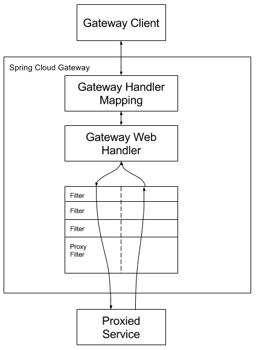

# 一、Gateway简介
## 1、定义
````
SpringCloud Gateway是SpringCloud的一个全新项目，基于Spring5.O+Springboot 2.0和ProjectReactor等技术开发的网关，它旨在为微服务架构提供一种简单有效的统一的API路由管理方式。

SpringCloudGateway作为SpringCloud生态系统中的网关，目标是替代Zuul,在SpringCloud2.0以上版本中，没有对新版本的zuul2.0以上最新高性能版本进行集成，仍然还是使用的Zuul 1.x非Reactor模式的老版本。而为了提升网关的性能，SpringCloud Gateway是基于WebFlux框架实现的，而webFlux框架底层则使用了高性能的Reactor模式通信框架Netty。

springCloudGateway的目标提供统一的路由方式且基于Filter链的方式提供了网关基本的功能，例如：安全，监控/指标，和限流。
````
## 2、作用
````
1、反向代理
2、鉴权
3、流量控制
4、熔断
5、日志监控
````
## 3、Gateway特征
````
1、基于Spring Framework 5, Project Reactor 和 Spring Boot 2.0 进行构建
2、动态路由：能够匹配任何请求属性
3、可以对路由指定 Predicate（断言）和 Filter（过滤器）
4、集成Hystrix的断路器功能
5、集成 Spring Cloud 服务发现功能
6、易于编写的 Predicate（断言）和 Filter（过滤器）
7、请求限流功能
8、支持路径重写
````
## 4、SpringCloudGateway与Zuul的区别：
````
1、在SpringCloudFinchley正式版之前，SpringCloud推荐的网关是Netflix提供的Zuul：
2、Zuul 1.x是一个基于阻塞I/O的APIGateway
3、Zuul 1.x基于ServIet2.5使用阻塞架构，它不支持任何长连接（如WebSocket)，Zuul的设计模式和Nginx较像，每次I/O操作都是从工作线程中选择一个执行，请求线程阻塞到工作线程完成，但是差别是Nginx用C++实现，Zuul用Java实现，而JVM本身会有第一次加载较慢的情况，使得Zuul的性能相对较差。
4、Zuul 2.x理念更先进想基于Netty非阻塞和支持长连接，但SpringCloud目前还没有整合。Zuul2.x的性能较Zuul1.x有较大提升。在性能方面，根据官方提供的基准测试，SpringCloudGateway的RPS（每秒请求数）是Zuul的1.6倍。
5、SpringCloudGateway建立在SpringFramework5、ProjectReactor和SpringB00t2．之上，使用非阻塞API
6、SpringCloudGateway还支持WebSocket,并且与Spring紧密集成拥有更好的开发体验
````
## 5、Zuul1.x模型
````
springcloud中所集成的zuul版本，采用的是tomcat容器，使用的是传统的servlet IO处理模型。

Servlet的生命周期？servlet由servlet container进行生命周期管理。
    1、container启动时构造servlet对象并调用servlet init()进行初始化，
    2、container运行时接受请求，并为每个请求分配一个线程（一般从线程池中获取空闲线程）然后调用service()
    3、container关闭时调用servlet destory()销毁servlet

 上述模式的缺点 
servlete—个简单的网络IO模型，当请求进入servlet container时，servlet container就会为其绑定一个线程在并发不高的场景下这种模型是适用的。但是一旦高并发(比如抽风用jemeter压),线程数量就会上涨，而线程资源代价是昂贵的（上下文切换，内存消耗大）严重影响请求的处理时间。

在一些简单业务场景下，不希望为每个request分配一个线程，只需要1个或几个线程就能应对极大并发的请求，这种业务场景下servlet模型没有优势。

所以Zuul 1.x是基于servlet之上的一个阻塞式处理模型，即spring实现了处理所有request请求的一个servlet(DispatcherServlet)并由该servlet阻塞式处理处理。所以springcloudzuul无法摆脱servlet模型的弊端。
````
## 6、GateWay模型​​​​​​​ 
````
传统的Web框架比如说：struts2,springmvc等都是基于Servlet API与Servlet容器基础之上运行的。

但是，在Servlet3.1之后有了异步非阻塞的支持。而WebFlux是一个典型非阻塞异步的框架，它的核心是基于Reactor的相关API实现的。相对于传统的web框架来说，它可以运行在诸如Netty，Undertow及支持Servlet3.1的容器上。非阻塞式+函数式编程(Spring5必须让你使用java8)

SpringWebFlux是Spring5.0引入的新的响应式框架区别于SpringMVC,它不需要依赖ServletAPI，它是完全异步非阻塞的，并且基于Reactor来实现响应式流规范。
````
# 二、Gateway工作流程
## 1、三大核心概念
* 1、Route(路由)
````
路由是构建网关的基本模块，它由ID，目标URI，一系列的断言和过滤器组成，如果断言为true则匹配该路由
````
* 2、Predicate(断言)
````
参考的是Java8的java.util.function.Predicate，开发人员可以匹配HTTP请求中的所有内容(例如请求头或请求参数)，如果请求与断言相匹配则进行路由
````
* 3、Filter(过滤)
````
指的是Spring框架中GatewayFilter的实例，使用过滤器，可以在请求被路由前或者之后对请求进行修改。
````
* 4、结构图


````
web请求通过一些匹配条件，定位到真正的服务节点。并在这个转发过程的前后，进行一些精细化控制。

predicate就是我们的匹配条件；而filter，就可以理解为一个无所不能的拦截器。有了这两个元素，再加上目标uri，就可以实现一个具体的路由了。
````
## 2、Gateway工作流程

````
1、客户端向 Spring Cloud Gateway 发出请求。然后在 Gateway Handler Mapping 中找到与请求相匹配的路由，将其发送到 Gateway Web Handler。
2、Handler 再通过指定的过滤器链来将请求发送到我们实际的服务执行业务逻辑，然后返回。
3、过滤器之间用虚线分开是因为过滤器可能会在发送代理请求之前（“pre”）或之后（“post”）执行业务逻辑。
4、Filter在“pre”类型的过滤器可以做参数校验、权限校验、流量监控、日志输出、协议转换等，在“post”类型的过滤器中可以做响应内容、响应头的修改，日志的输出，流量监控等有着非常重要的作用。

核心逻辑：路由转发+执行过滤器链
````
# 三、入门配置
## 1、Gateway9527搭建
* 1、新建Module：cloud-gateway-gateway9527
* 2、pom.xml
````
<?xml version="1.0" encoding="UTF-8"?>
<project xmlns="http://maven.apache.org/POM/4.0.0"
         xmlns:xsi="http://www.w3.org/2001/XMLSchema-instance"
         xsi:schemaLocation="http://maven.apache.org/POM/4.0.0 http://maven.apache.org/xsd/maven-4.0.0.xsd">
    <parent>
        <artifactId>cloud2020</artifactId>
        <groupId>com.jch.springcloud</groupId>
        <version>1.0-SNAPSHOT</version>
    </parent>
    <modelVersion>4.0.0</modelVersion>

    <artifactId>cloud-gateway-gateway9527</artifactId>

    <dependencies>
        <!--gateway-->
        <dependency>
            <groupId>org.springframework.cloud</groupId>
            <artifactId>spring-cloud-starter-gateway</artifactId>
        </dependency>
        <!--eureka-client gateWay网关作为一种微服务，也要注册进服务中心。哪个注册中心都可以，如zk-->
        <dependency>
            <groupId>org.springframework.cloud</groupId>
            <artifactId>spring-cloud-starter-netflix-eureka-client</artifactId>
        </dependency>
        <!-- gateway和spring web+actuator不能同时存在，即web相关jar包不能导入 -->
        <dependency>
            <groupId>org.springframework.boot</groupId>
            <artifactId>spring-boot-devtools</artifactId>
            <scope>runtime</scope>
            <optional>true</optional>
        </dependency>
        <dependency>
            <groupId>org.projectlombok</groupId>
            <artifactId>lombok</artifactId>
            <optional>true</optional>
        </dependency>
        <dependency>
            <groupId>org.springframework.boot</groupId>
            <artifactId>spring-boot-starter-test</artifactId>
            <scope>test</scope>
        </dependency>
        <dependency><!-- 引入自己定义的api通用包，可以使用Payment支付Entity -->
            <groupId>com.jch.springcloud</groupId>
            <artifactId>cloud-api-commons</artifactId>
            <version>${project.version}</version>
        </dependency>
    </dependencies>
</project>
````
* 3、application.yml
````
server:
  port: 9527

spring:
  application:
    name: cloud-gateway

# 注册进 eureka Server # 网关他本身也是一个微服务，也要注册进注册主中心
eureka:
  instance:
    hostname: cloud-gateway-service
  client:
    service-url:
      register-with-eureka: true
      fetch-registry: true
      defaultZone: http://eureka7001.com:7001/eureka
````
* 4、主启动类
````
import org.springframework.boot.SpringApplication;
import org.springframework.boot.autoconfigure.SpringBootApplication;
import org.springframework.cloud.netflix.eureka.EnableEurekaClient;

@SpringBootApplication
@EnableEurekaClient
public class GateWayMain9527 {
    public static void main(String[] args) {
        SpringApplication.run(GateWayMain9527.class,args);
    }
}
````
## 2、9527网关做路由映射-不想暴露8001端口，希望在8001外面套一层9527
* YML新增网关配置
````
8001看controller的访问地址，我们目前不想暴露8001端口，希望在8001外面套一层9527。这样别人就攻击不了8001，有网关挡着

server:
  port: 9527
 
spring:
  application:
    name: cloud-gateway
  ## GateWay配置
  cloud:
    gateway:
      routes: #多个路由
        - id: payment_routh  # 路由ID ， 没有固定的规则但要求唯一，建议配合服务名
 
          #uri+predicates  要访问这个路径得先经过9527处理
          uri: http://localhost:8001  # 匹配成功后提供服务的路由地址 
          predicates:
            - Path=/payment/get/**  # 断言，路径相匹配的进行路由
 
        - id: payment_routh2
          uri: http://localhost:8001
          predicates:
            - Path=/payment/lb/**  
 
# 注册进 eureka Server # 网关他本身也是一个微服务，也要注册进注册主中心
eureka:
  instance:
    hostname: cloud-gateway-service
  client:
    service-url:
      register-with-eureka: true
      fetch-registry: true
      defaultZone: http://eureka7001.com:7001/eureka
````
## 3、Gateway配置路由的两种方式
````
Gateway网关路由有两种配置方式：
    1、在配置文件yml中配置
    2、代码中注入RouteLocator的Bean 

自己写一个案例：通过9527网关访问到外网的百度新闻网址：http://news.baidu.com/guonei
添加配置类
当访问地址 http://localhost:9527/guonei时会自动转发到地址：http://news.baidu.com/guonei

@Configuration
public class GateWayConfig {
    @Bean
    public RouteLocator customeRouteLocator(RouteLocatorBuilder routeLocatorBuilder){
        RouteLocatorBuilder.Builder routes = routeLocatorBuilder.routes();

        routes.route("path_route_jch",
                r->r.path("/guonei").uri("http://news.baidu.com/guonei")).build();
        return routes.build();
    }
}
````
# 四、通过微服务名实现动态路由
## 1、以前的配置说明
````
路径写死了
默认情况下gateway会根据注册中心注册的服务列表，以注册中心上微服务名为路径创建动态路由进行转发，从而实现动态路由的功能。
````
## 2、配置动态路由 
* 1、application.yml
````
对yml进行配置：让其先通过gateway，再通过gateway去注册中心找提供者

server:
  port: 9527
 
spring:
  application:
    name: cloud-gateway
  ## GateWay配置
  cloud:
    gateway:
      discovery:
        locator:
          enabled: true #开启从注册中心动态创建路由的功能，利用微服务名进行路由
      routes:
        - id: payment_routh  # 路由ID ， 没有固定的规则但要求唯一，建议配合服务名
          uri: lb://cloud-payment-service # lb 属于GateWay 的关键字，代表是动态uri，即代表使用的是服务注册中心的微服务名，它默认开启使用负载均衡机制 
          predicates:
            - Path=/payment/get/**  # 断言，路径相匹配的进行路由
 
        - id: payment_routh2
          uri: lb://cloud-payment-service
          predicates:
            - Path=/payment/lb/**
 
# 注册进 eureka Server # 网关他本身也是一个微服务，也要注册进注册主中心
eureka:
  instance:
    hostname: cloud-gateway-service
  client:
    service-url:
      register-with-eureka: true
      fetch-registry: true
      defaultZone: http://eureka7001.com:7001/eureka
````
* 2、测试 
````
一个eureka7001 + 两个服务提供者8001/8002

结果：通过服务名动态路由, 在8001/8002两个端口切换
````
# 五、GateWay常用的Predicate
## 1、Route Predicate Factories定义
````
Spring Cloud Gateway将路由匹配作为Spring WebFlux HandlerMapping基础架构的一部分

Spring Cloud Gateway包括许多内置的Route Predicate工厂，所有这些Predicate都与HTTP请求的不同属性匹配，多个Route Predicate工厂可以进行组合。

Spring Cloud Gateway 创建 Route 对象时，使用 RoutePredicateFactory 创建 Predicate 对象，Predicate 对象可以赋值给 Route。 Spring Cloud Gateway 包含许多内置的Route Predicate Factories。

所有这些谓词都匹配HTTP请求的不同属性。多种谓词工厂可以组合，并通过逻辑and。
````
## 2、常用的Route Predicate
* 1、After Route Predicate
````
在这个时间之后这个路由才生效

spring:
  cloud:
    gateway:
      routes:
        - id: payment_routh
          uri: http://localhost:8001  
          predicates:
            - After=2024-01-03T19:53:19.185+08:00[Asia/Shanghai]
````
* 2、Before Route Predicate 
````
在这个时间之前这个路由才生效

spring:
  cloud:
    gateway:
      routes:
        - id: payment_routh
          uri: http://localhost:8001  
          predicates:
            - Before=2024-01-03T19:53:19.185+08:00[Asia/Shanghai]
````
* 3、Between Route Predicate
````
在这个时间之间路由生效

spring:
  cloud:
    gateway:
      routes:
        - id: payment_routh
          uri: http://localhost:8001  
          predicates:
            - Between=2022-01-03T19:53:19.185+08:00[Asia/Shanghai],2022-01-03T19:53:19.185+08:00[Asia/Shanghai]
````
* 4、Cookie Route Predicate 
````
Cookie Route Predicate需要两个参数，一个是 Cookie name，一个是正则表达式。
路由规则会通过获取对应的 Cookie name 值和正则表达式去匹配，如果匹配上就会执行路由；如果没有匹配上则不执行

spring:
  cloud:
    gateway:
      routes:
        - id: payment_routh
          uri: http://localhost:8001  
          predicates:
            - Cookie=username,zzyy

用curl测试，命令行输入
curl http://localhost:9527/payment/get/2 --cookie "username=zzyy"
````
* 5、Header Route Predicate
````
两个参数：一个是属性名称和一个正则表达式，这个属性值和正则表达式匹配则执行。

spring:
  cloud:
    gateway:
      routes:
        - id: payment_routh
          uri: http://localhost:8001  
          predicates:
            - Header=X-Request-Id, \d+ //配置说明：请求头要有X-Request-Id属性并且值为整数的正则表达式 

curl http://localhost:9527/payment/get/2 -H "X-Request-Id:123"
````
* 6、Host Route Predicate
````
spring:
  cloud:
    gateway:
      routes:
        - id: payment_routh
          uri: http://localhost:8001  
          predicates:
            - Host=**.atguigu.org,**.another.org

Host Route Predicate 接收一组参数，一组匹配的域名列表。
它通过参数中的主机地址作为匹配规则
curl http://localhost:9527/payment/get/2 -H "Host: news.another.org"
````
* 7、Method Route Predicate
````
spring:
  cloud:
    gateway:
      routes:
        - id: payment_routh
          uri: http://localhost:8001  
          predicates:
            - Method=GET
````
* 8、Path Route Predicate
````
spring:
  cloud:
    gateway:
      routes:
        - id: payment_routh
          uri: http://localhost:8001  
          predicates:
            - Path=/payment/lb/**
````
* 9、Query Route Predicate
````
支持传入两个参数，一个是属性名，一个为属性值，属性值可以是正则表达式

spring:
  cloud:
    gateway:
      routes:
        - id: payment_routh
          uri: http://localhost:8001  
          predicates:
            - Query=username, \d+ 

要有参数名username并且值还要是整数 
````
# 六、Filter的使用
## 1、定义
````
路由过滤器可用于修改进入的HTTP请求和返回的HTTP响应，路由过滤器只能指定路由进行使用。Spring Cloud Gateway 内置了多种路由过滤器，他们都由GatewayFilter的工厂类来产生。
````
## 2、Spring Cloud Gateway的Filter
* 1、生命周期
````
pre
post
````
* 2、种类
````
具体看官方文档 https://docs.spring.io/spring-cloud-gateway/docs/2.2.5.RELEASE/reference/html/#gatewayfilter-factories
GatewayFilter: 有31种
GlobalFilter: 有10种
````
* 3、常用的GatewayFilter
````
AddRequestParameter

spring:
  cloud:
    gateway:
      routes:
        - id: payment_routh
          uri: http://localhost:8001  
          filters:
            - AddRequestParameter=X-Request-Id,1024 #过滤器工厂会在匹配的请求头加上一对请求头，名称为X-Request-Id值为1024
````
## 3、自定义过滤器
* 1、2个主要接口：GlobalFilter,Ordered
* 2、作用
````
全局日志记录
统一网关鉴权
````
* 3、自定义全局过滤器配置类
````
@Component
@Slf4j
public class MyLogGateWayFilter implements GlobalFilter, Ordered {

    @Override
    public Mono<Void> filter(ServerWebExchange exchange, GatewayFilterChain chain) {
        log.info("************com in MyLogGateWayFilter:  "+new Date());
        String username = exchange.getRequest().getQueryParams().getFirst("username");
        //合法性检验
        if(username==null){
            log.info("************用户名为null, 非法用户, o(T~~T)o");
            //设置 response 状态码 406
            exchange.getResponse().setStatusCode(HttpStatus.NOT_ACCEPTABLE);
            //完成请求调用
            return exchange.getResponse().setComplete();
        }
        return chain.filter(exchange);
    }

    // 返回值是加载顺序，一般全局的都是第一位加载
    //这个返回的数值越小，上面的filter优先级就越高
    @Override
    public int getOrder() {
        return 0;
    }
}
````
* 4、测试
````
http://localhost:9527/payment/get/1 报错

http://localhost:9527/payment/get/1?username=2 正常访问
````