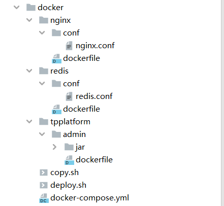

# 一、安装docker
## 1、卸载旧版本
````
sudo yum remove docker \
                  docker-client \
                  docker-client-latest \
                  docker-common \
                  docker-latest \
                  docker-latest-logrotate \
                  docker-logrotate \
                  docker-engine
````
## 2、安装需要的软件包
````
sudo yum install -y yum-utils \
  device-mapper-persistent-data \
  lvm2
````
````
yum-config-manager 配置阿里云
sudo yum-config-manager \
    --add-repo \
    http://mirrors.aliyun.com/docker-ce/linux/centos/docker-ce.repo
````
## 3、安装20.10.10版本的docker
````
sudo yum install docker-ce-20.10.10 docker-ce-cli-20.10.10 containerd.io
````
## 4、启动docker
````
systemctl start docker
````
## 5、查看docker版本
````
docker version
````
## 6、docker配置阿里云
````
sudo mkdir -p /etc/docker
sudo tee /etc/docker/daemon.json <<-'EOF'
{
  "registry-mirrors": ["https://yxzrazem.mirror.aliyuncs.com"]
}
EOF
sudo systemctl daemon-reload
sudo systemctl restart docker
````
## 7、docker设置开机启动
````
systemctl enable docker.service
````
# 二、安装docker-compose
## 1、下载
````
https://github.com/docker/compose/releases/tag/v2.23.2
下载文件名为 docker-compose-linux-x86_64 的docker-compose
````
## 2、上传
````
上传到/usr/local/bin/
并把文件名改为docker-compose
````
## 3、添加权限
````
chmod +x /usr/local/bin/docker-compose
````
## 4、查看版本
````
docker-compose version
````
# 三、服务器文件准备
## 1、将docker放到服务器/usr/local/src/下

````
conf是配置文件
dockerfile制作镜像
deploy.sh是部署的脚本
````
## 2、nginx.conf
````
#user  nobody;
worker_processes  1;

#error_log  logs/error.log;
#error_log  logs/error.log  notice;
#error_log  logs/error.log  info;

#pid        logs/nginx.pid;


events {
    worker_connections  1024;
}


http {
    include       mime.types;
    default_type  application/octet-stream;

    #log_format  main  '$remote_addr - $remote_user [$time_local] "$request" '
    #                  '$status $body_bytes_sent "$http_referer" '
    #                  '"$http_user_agent" "$http_x_forwarded_for"';

    #access_log  logs/access.log  main;

    sendfile        on;
    #tcp_nopush     on;

    #keepalive_timeout  0;
    keepalive_timeout  65;

    #gzip  on;

    server {
        listen       80;
        server_name  localhost;
        charset utf-8;
        #charset koi8-r;

        #access_log  logs/host.access.log  main;

        # client_max_body_size 用来修改允许客户端上传文件的大小。默认为1m，如果设置为0，表示上传文件大小不受限制。
        # 可以在以下模块设置: http, server, location
        client_max_body_size 10m;


        location / {
            # 主要配置这里
            # /home/tpplatform/projects/tpplatform-ui 是主机挂载到容器的路径
            root   /home/tpplatform/projects/tpplatform-ui;
            index  index.html index.htm;
            try_files $uri $uri/ /index.html;
        }
   location /prod-api/ {
      proxy_set_header Host $http_host;
      proxy_set_header X-Real-IP $remote_addr;
      proxy_set_header REMOTE-HOST $remote_addr;
      proxy_set_header X-Forwarded-For $proxy_add_x_forwarded_for;
      proxy_pass http://localhost:8080/;
   }

        #error_page  404              /404.html;

        # redirect server error pages to the static page /50x.html
        #
        error_page   500 502 503 504  /50x.html;
        location = /50x.html {
            root   html;
        }

        # proxy the PHP scripts to Apache listening on 127.0.0.1:80
        #
        #location ~ \.php$ {
        #    proxy_pass   http://127.0.0.1;
        #}

        # pass the PHP scripts to FastCGI server listening on 127.0.0.1:9000
        #
        #location ~ \.php$ {
        #    root           html;
        #    fastcgi_pass   127.0.0.1:9000;
        #    fastcgi_index  index.php;
        #    fastcgi_param  SCRIPT_FILENAME  /scripts$fastcgi_script_name;
        #    include        fastcgi_params;
        #}

        # deny access to .htaccess files, if Apache's document root
        # concurs with nginx's one
        #
        #location ~ /\.ht {
        #    deny  all;
        #}
    }


    # another virtual host using mix of IP-, name-, and port-based configuration
    #
    #server {
    #    listen       8000;
    #    listen       somename:8080;
    #    server_name  somename  alias  another.alias;

    #    location / {
    #        root   html;
    #        index  index.html index.htm;
    #    }
    #}


    # HTTPS server
    #
    #server {
    #    listen       443 ssl;
    #    server_name  localhost;

    #    ssl_certificate      cert.pem;
    #    ssl_certificate_key  cert.key;

    #    ssl_session_cache    shared:SSL:1m;
    #    ssl_session_timeout  5m;

    #    ssl_ciphers  HIGH:!aNULL:!MD5;
    #    ssl_prefer_server_ciphers  on;

    #    location / {
    #        root   html;
    #        index  index.html index.htm;
    #    }
    #}

}
````
## 3、docker/tpplatform/admin 下的 dockerfile
````
# 基础镜像
FROM  openjdk:8-jre
# author
MAINTAINER tpplatform

# 挂载目录
VOLUME /home/tpplatform
# 创建目录
RUN mkdir -p /home/tpplatform
# 指定路径
WORKDIR /home/tpplatform
# 复制jar文件到路径
COPY ./jar/tpplatform-admin.jar /home/tpplatform/tpplatform-admin.jar
# 启动
ENTRYPOINT ["java","-jar","tpplatform-admin.jar","--spring.profiles.active=druid"]

# 如果是生成环境把druid改为prod
````
## 4、其他文件一般是通用的, 如有特殊需要自己改改
## 5、开放端口
````
cd /usr/local/src/docker/
./deploy.sh port
````
## 6、容器配置开机启动
````
cd /etc/profile.d/
vi startDockerContainer.sh

/usr/local/src/docker/deploy.sh base
/usr/local/src/docker/deploy.sh modules
````
# 四、docker-compose.yml
````
version : '1.0'
services:
  tpplatform-redis:
    container_name: tpplatform-redis
    image: redis:3.0.5
    build:
      context: ./redis
    ports:
      - "6379:6379"
    volumes:
      - ./redis/conf/redis.conf:/home/tpplatform/redis/redis.conf
      - ./redis/data:/data
    network_mode: "host"
    command: redis-server /home/tpplatform/redis/redis.conf

  tpplatform-nginx:
    container_name: tpplatform-nginx
    image: nginx:1.19.2
    build:
      context: ./nginx
    ports:
      - "80:80"
    volumes:
      - ./nginx/html/dist:/home/tpplatform/projects/tpplatform-ui
      - ./nginx/conf/nginx.conf:/etc/nginx/nginx.conf
      - ./nginx/logs:/var/log/nginx
      - ./nginx/conf.d:/etc/nginx/conf.d
    network_mode: "host"

  tpplatform-admin:
    container_name: tpplatform-admin
    build:
      context: tpplatform/admin
      dockerfile: dockerfile
    ports:
      - "8080:8080"
    volumes:
      - /usr/local/src/tpplatform:/usr/local/src/tpplatform
    network_mode: "host"
    depends_on:
      - tpplatform-redis
      - tpplatform-nginx
````
# 五、Jenkinsfile
````
//目标服务器ip和路径，根据实际情况修改
String serverIp = ""
String username = 'root'
String sourcePath = '/var/lib/jenkins/workspace/PMPlatform/TPPlatform'
String targetPath = '/usr/local/src/docker'
String profiles = ""
string targetBranch = ""

pipeline{
    agent any

    stages{
        stage('pull code'){
            steps{
                script{
                    if(!env.BRANCH_NAME == ('master') && !env.BRANCH_NAME == ('dev')){
                        echo "非master或dev分支, 终止"
                        exit 0
                    }


                    targetBranch =  env.BRANCH_NAME
                    echo "${targetBranch}"

                    if(targetBranch  == "master"){ // 生产环境
                        profiles = "prod"
                        serverIp = "生成环境服务器ip"
                    } else if(targetBranch  == "dev"){ //开发环境
                        profiles = "druid"
                        serverIp = "开发环境服务器ip"
                    }
                }
                echo "拉取${targetBranch}分支代码, 部署${profiles}环境"
                git branch: "${targetBranch}", credentialsId: 'git证书', url: 'git地址'
                echo "拉取${targetBranch}分支代码成功"
            }
        }

        stage('project package'){
            steps{

                sh "echo 开始打包。。。"
                sh "mvn clean package -U -Dmaven.test.skip=true"
                sh "echo 打包成功。"

            }
        }
//        stage("SonarQube analysis") {
//            tools {
//                jdk "jdk11" // the name you have given the JDK installation using the JDK manager (Global Tool Configuration)
//            }
//            steps{
//                script{
//
//                    withSonarQubeEnv('SonarQube') {
//                        sh "/usr/local/sonar-scanner/bin/sonar-scanner -Dsonar.projectKey=TPPlatform -Dsonar.projectName=${JOB_NAME} -Dsonar.sources=. -Dsonar.java.binaries= -Dsonar.exclusions=**/src/test/**,**/target/**"
//                        sh "echo SonarQube analysis 结束。"
//                    }
//                    script{
//                        timeout(time: 10, unit: 'MINUTES') {
//                            def qualityGate = waitForQualityGate()
//                            if (qualityGate.status != 'OK') {
//                                error "质量门检测不通过: ${qualityGate.status}"
//                            }
//                        }
//                    }
//                }
//            }
//        }

        stage('deploy') {
            steps {
                script {
                    sh """
                        ssh ${username}@${serverIp} rm -rf ${targetPath}/tpplatform/admin/jar/*
                        exit
                    """
                    echo '旧jar包删除成功'
                    sh """
                        scp ${sourcePath}/tpplatform-admin/target/tpplatform-admin.jar ${username}@${serverIp}:${targetPath}/tpplatform/admin/jar
                        """
                    echo '新jar包上传成功'

                    sh "ssh ${username}@${serverIp} rm -rf ${targetPath}/docker-compose.yml;exit"
                    echo '旧docker-compose.yml删除成功'
                    sh """
                        scp ${sourcePath}/docker/docker-compose.yml ${username}@${serverIp}:${targetPath}
                        """
                    echo '新docker-compose.yml上传成功'

                    sh """ ssh ${username}@${serverIp} << EOF
                            systemctl restart docker
                            echo '重启docker成功' 
                            cd ${targetPath} 
                            chmod +x ./deploy.sh
                            docker rm -f tpplatform-admin
                            echo '停止旧容器成功' 
                            echo '查看容器'
                            docker ps -a
                            docker rmi docker-tpplatform-admin
                            echo '删除旧镜像成功'
                            echo '查看镜像'
                            docker images
                            ./deploy.sh base
                            echo '基础模块启动成功'
                            ./deploy.sh modules
                            echo '启动程序成功'
                        """
                }
            }
        }
    }
}
````
# 六、创建多分支流水线
````
主要配置这里
````

