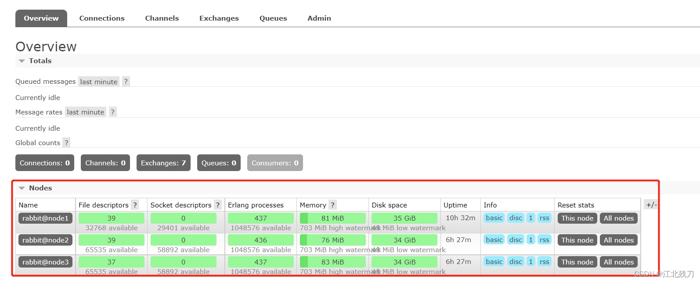
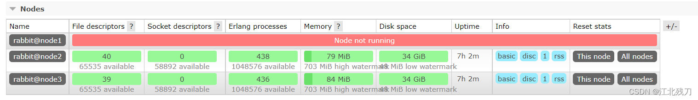
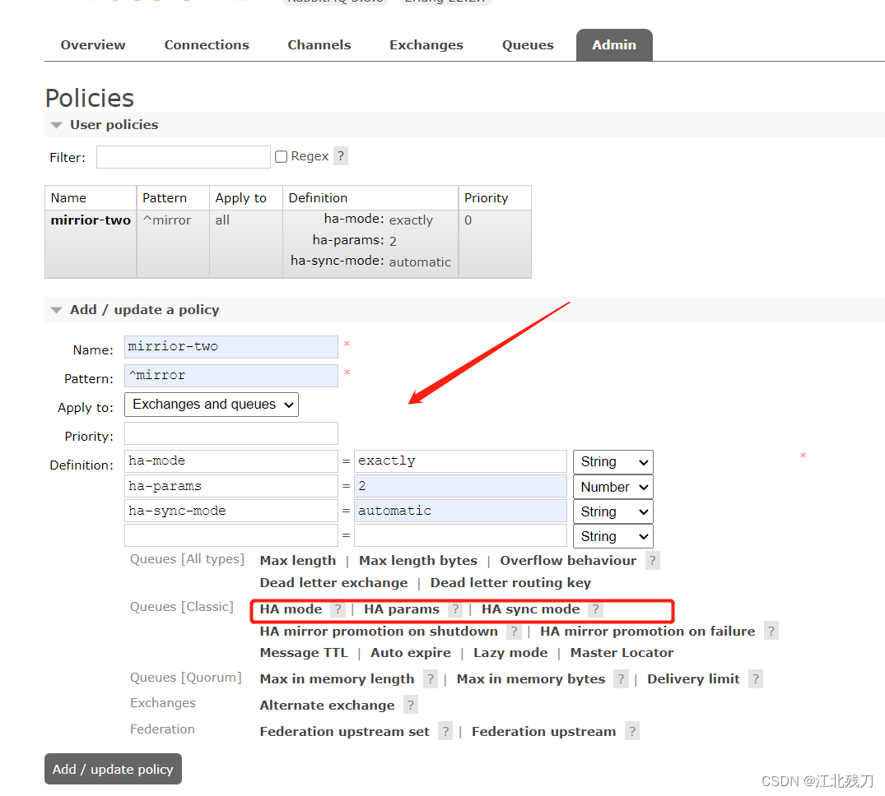
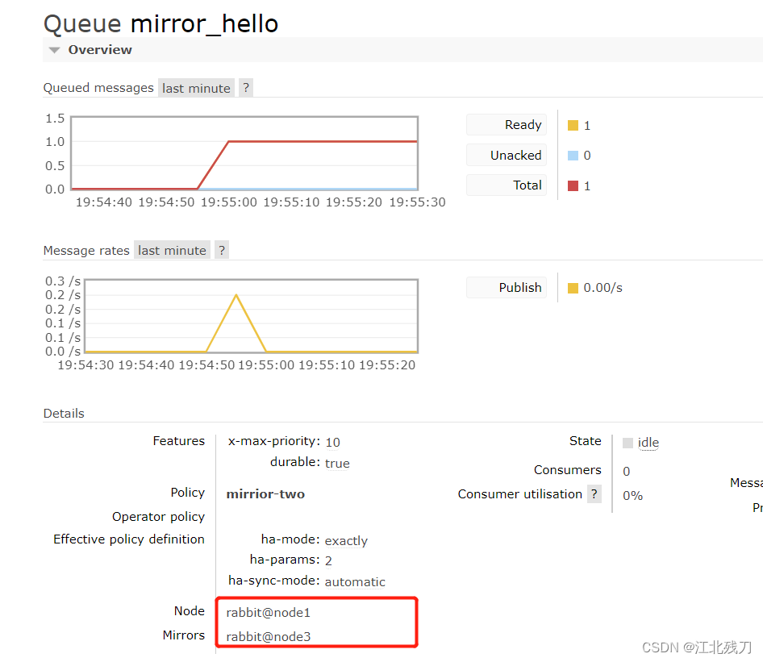

# 一、clustering
* 1、使用集群的原因
````
最开始我们介绍了如何安装运行 RabbitMQ 服务，不过都是单机版的，无法满足目前真实应用的要求。如果 RabbitMQ 服务器遇到内存崩溃、机器掉电或者主板故障等原因，该怎么办？单台 RabbitMQ 服务器可以满足每秒 1000 条消息的吞吐量，那么如果应用需要 RabbitMQ 服务满足每秒 10 万条消息的吞吐量呢？购买昂贵的服务器来增强单机 RabbitMQ 服务的性能显得捉襟见肘，搭建一个 RabbitMQ 集群才是解决实际问题的关键。
````
* 2、搭建步骤
````
1.购买三台阿里云服务器（按量付费）
2.按照前面的步骤给三台服务器都安装好 rabbitMQ
3.修改 3 台机器的主机名称，分别为 node1、node2、node3，重启服务器生效
vim /etc/hostname
4.配置各个节点的 hosts 文件，让各个节点都能互相识别对方
vim /etc/hosts

47.106.183.224 node1
47.106.223.71 node2
120.78.183.38 node3
5.确保各个节点的 cookie 文件使用的是同一个值
在 node1 上远程执行操作命令

scp /var/lib/rabbitmq/.erlang.cookie root@node2:/var/lib/rabbitmq/.erlang.cookie
scp /var/lib/rabbitmq/.erlang.cookie root@node3:/var/lib/rabbitmq/.erlang.cookie

6.启动 rabbitmq 服务，顺带启动 erlang 虚拟机和 rabbitmq 应用服务（在三台节点上分别执行）

rabbitmq-server -detached

7.在节点 2 执行

#rabbitmqctl stop 会将Erlang 虚拟机关闭，rabbitmqctl stop_app 只关闭 RabbitMQ 服务
rabbitmqctl stop_app

rabbitmqctl reset

rabbitmqctl join_cluster rabbit@node1

#只启动应用服务
rabbitmqctl start_app

8.在节点 3 执行

#rabbitmqctl stop 会将Erlang 虚拟机关闭，rabbitmqctl stop_app 只关闭 RabbitMQ 服务
rabbitmqctl stop_app

rabbitmqctl reset

rabbitmqctl join_cluster rabbit@node2

#只启动应用服务
rabbitmqctl start_app

9.查看集群状态

rabbitmqctl cluster_status

10.需要重新设置用户

#创建账号
rabbitmqctl add_user admin 123

#设置用户角色
rabbitmqctl set_user_tags admin administrator

#设置用户权限
rabbitmqctl set_permissions -p "/" admin ".*" ".*" ".*"

此时登录任意一个节点
````

````
11.解除集群节点（node2 和 node3）机器分别执行

rabbitmqctl stop_app
rabbitmqctl reset
rabbitmqctl start_app
rabbitmqctl cluster_status
rabbitmqctl forget_cluster_node rabbit@node2(node1 机器上执行)
````
# 二、镜像队列
* 1、使用镜像原因
````
1、如果 RabbitMQ 集群中只有一个 Broker 节点，那么该节点的失效将导致整体服务的临时不可用，并且可能会导致消息的丢失。可以将所有消息设置为持久化，并且对应队列的 durable 属性也设置为 true，但是这样仍然无法避免由于缓存丢失导致的问题：因为消息在发送之后和写入磁盘并执行刷盘操作之间存在一个短暂却会产生问题的时间窗。通过 publisherconfirm 机制能够确保客户端知道那些消息已经存入磁盘，尽管如此，一般不希望遇到因单节点故障导致的服务不可用。

引入镜像队列（Mirror Queue）的机制，可以将队列镜像到集群中的其他 Broker 节点上，如果集群中的一个节点失效了，队列能够自动切换到镜像中的另一个节点上保证服务的可用性。
````
````
2、node1 建一个 hello 队列，往里面发一条消息
public class Producer {

    //队列名称
    private static final String QUEUE_NAME = "hello";

    //发消息
    public static void main(String[] args) throws IOException, TimeoutException {

        //创建一个连接工厂
        ConnectionFactory factory = new ConnectionFactory();
        //工厂ip 连接RabbitMQ的队列
        factory.setHost("47.106.183.224");
        //用户名
        factory.setUsername("admin");
        //密码
        factory.setPassword("123");

        //创建连接
        Connection connection = factory.newConnection();
        //获取信道
        Channel channel = connection.createChannel();

        /**
         * 生成一个队列
         * 1.队列名称
         * 2.队列里面的消息是否持久化(磁盘) 默认情况下存储在内存中
         * 3.该队列是否只供一个消费者进行消费，是否可以消息共享，true可以多个消费者消费, false只能一个消费者消费
         * 4.是否自动删除 最后一个消费者断开连接之后，该队列是否自动删除 true自动删除 false不自动删除
         * 5.其他参数
         */
        Map<String, Object> arguments = new HashMap<>();
        arguments.put("x-max-priority", 10);//官方允许是0-255之间  此处设置10 允许优化级范围为0-10 不要设置过大  浪费CPU与内存
        channel.queueDeclare(QUEUE_NAME, true, false, false, arguments);

        //发消息
        /**
         * 发送一个消息
         * 1.发送到那个交换机
         * 2.路由的key值是那一个 本次是队列名称
         * 3.其他参数信息
         * 4.发送消息的消息体
         */
        String message = "hello world";
        channel.basicPublish("", QUEUE_NAME, null, message.getBytes());

        System.out.println("消息发送完毕");

    }
}
````
3、把 node1 停掉

[root@node1 ~]# rabbitmqctl stop_app
Stopping rabbit application on node rabbit@node1 ...
````
````

````
4、尝试连接 node2 去消费 hello 队列里面的消息

public class Consumer {

    //队列名称
    private static final String QUEUE_NAME = "hello";

    //接收消息
    public static void main(String[] args) throws IOException, TimeoutException {
        //创建一个连接工厂
        ConnectionFactory factory = new ConnectionFactory();
        //工厂ip 连接RabbitMQ的队列
        factory.setHost("47.106.223.71");
        //用户名
        factory.setUsername("admin");
        //密码
        factory.setPassword("123");

        //创建连接
        Connection connection = factory.newConnection();
        //获取信道
        Channel channel = connection.createChannel();

        //声明
        DeliverCallback deliverCallback = (consumerTag, message) -> {
            System.out.println(new String(message.getBody()));
        };
        CancelCallback cancelCallback = consumerTag -> {
            System.out.println("消息消费被中断");
        };


        /**
         * 消费者消费消息
         * 1.消费哪个队列
         * 2.消费成功之后是否要自动应答，true代表自动应答，false代表手动应答
         * 3.消费者未成功消费的回调
         * 4.消费者取消消费的回调
         */
        channel.basicConsume(QUEUE_NAME, true, deliverCallback, cancelCallback);
    }
}
````
````
5、重新启动 node1
[root@node1 ~]# rabbitmqctl start_app
Starting node rabbit@node1 ...
````
* 2、搭建步骤
````
随便找一个节点添加 policy
````

````
在 node1 上创建一个名为 mirror_hello 的队列，发送一条消息
````


````
停掉 node1，发现 node3 成为了镜像队列
````


````
启动 node2 的消费者，看看能不能消费到消息
使用镜像队列后，就算整个集群只剩下一台机器，依然能够消费队列里面的消息，说明队列里面的消息被镜像队列传递到相应的机器里面了。
````
