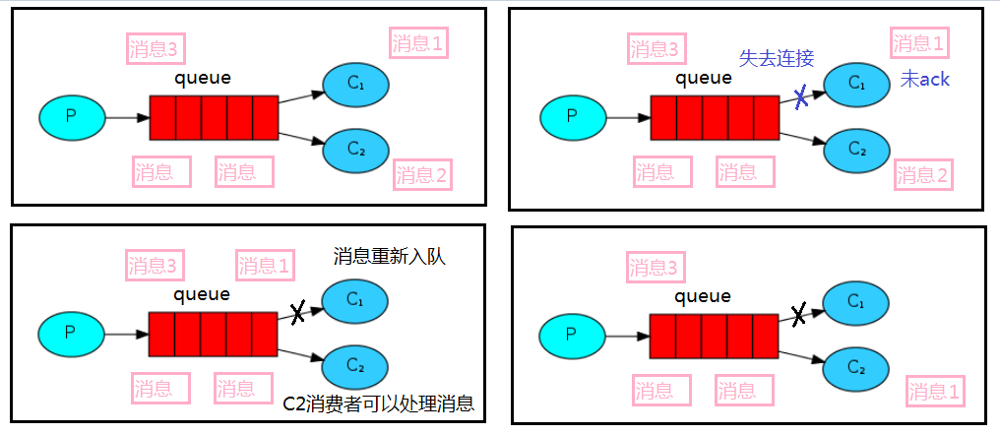

# 一、Hello world
* 1、依赖
````
pom.xml

<!--指定 jdk 编译版本-->
<dependencies>
    <!--rabbitmq 依赖客户端-->
    <dependency>
        <groupId>com.rabbitmq</groupId>
        <artifactId>amqp-client</artifactId>
        <version>5.8.0</version>
    </dependency>
    <!--操作文件流的一个依赖-->
    <dependency>
        <groupId>commons-io</groupId>
        <artifactId>commons-io</artifactId>
        <version>2.6</version>
    </dependency>
</dependencies>

<build>
    <plugins>
        <plugin>
            <groupId>org.apache.maven.plugins</groupId>
            <artifactId>maven-compiler-plugin</artifactId>
            <configuration>
                <source>8</source>
                <target>8</target>
            </configuration>
        </plugin>
    </plugins>
</build>
````
* 2、消息生产者
````
import com.rabbitmq.client.Channel;
import com.rabbitmq.client.Connection;
import com.rabbitmq.client.ConnectionFactory;

// 发送消息
public class Producer {
    private final static String QUEUE_NAME = "hello";

    public static void main(String[] args) throws Exception {
        //创建一个连接工厂
        ConnectionFactory factory = new ConnectionFactory();
        factory.setHost("42.192.149.71");
        factory.setUsername("admin");
        factory.setPassword("123456");
        //channel 实现了自动 close 接口 自动关闭 不需要显示关闭
        //创建连接
        Connection connection = factory.newConnection();
        //获取信道
        Channel channel = connection.createChannel();
        /**
         * 生成一个队列
         * 1.队列名称
         * 2.队列里面的消息是否持久化 也就是是否用完就删除
         * 3.该队列是否只供一个消费者进行消费 exclusive = true则设置队列为排他的,只允许一个消费者消费
         * 4.是否自动删除 最后一个消费者端开连接以后 该队列是否自动删除 true 自动删除
         * 5.其他参数
         */
        channel.queueDeclare(QUEUE_NAME, false, false, false, null);
        String message = "hello world";
        /**
         * 发送一个消息
         * 1.发送到那个交换机
         * 2.路由的 key 是哪个
         * 3.其他的参数信息
         * 4.发送消息的消息体
         */
        channel.basicPublish("", QUEUE_NAME, null, message.getBytes());
        System.out.println("消息发送完毕");

    }
    
}
````
* 3、消息消费者
````
import com.rabbitmq.client.*;

// 获取“生产者”发出的消息
public class Consumer {
    private final static String QUEUE_NAME = "hello";

    public static void main(String[] args) throws Exception {
        ConnectionFactory factory = new ConnectionFactory();
        factory.setHost("42.192.149.71");
        factory.setUsername("admin");
        factory.setPassword("123456");
        Connection connection = factory.newConnection();
        Channel channel = connection.createChannel();

        System.out.println("等待接收消息.........");

        //推送的消息如何进行消费的接口回调
        DeliverCallback deliverCallback = (consumerTag, delivery) -> {
            String message = new String(delivery.getBody());
            System.out.println(message);
        };
        //取消消费的一个回调接口 如在消费的时候队列被删除掉了
        CancelCallback cancelCallback = (consumerTag) -> {
            System.out.println("消息消费被中断");
        };
        /**
         * 消费者消费消息 - 接受消息
         * 1.消费哪个队列
         * 2.消费成功之后是否要自动应答 true 代表自动应答 false 手动应答
         * 3.消费者未成功消费的回调
         * 4.消息被取消时的回调
         */
        channel.basicConsume(QUEUE_NAME, true, deliverCallback, cancelCallback);
    }
}
````
# 二、Work Queues
````
Work Queues——工作队列(又称任务队列)的主要思想是避免立即执行资源密集型任务，而不得不等待它完成。 相反我们安排任务在之后执行。我们把任务封装为消息并将其发送到队列。在后台运行的工作进 程将弹出任务并最终执行作业。当有多个工作线程时，这些工作线程将一起处理这些任务。
````
* 1、轮训分发消息
````
1、抽取工具类

import com.rabbitmq.client.Channel;
import com.rabbitmq.client.Connection;
import com.rabbitmq.client.ConnectionFactory;

public class RabbitMqUtils {
    //得到一个连接的 channel
    public static Channel getChannel() throws Exception {
        //创建一个连接工厂
        ConnectionFactory factory = new ConnectionFactory();
        factory.setHost("42.192.149.71");
        factory.setUsername("admin");
        factory.setPassword("123456");
        Connection connection = factory.newConnection();
        Channel channel = connection.createChannel();
        return channel;
    }
}
````
````
2、启动两个工作线程来接受消息

import com.oddfar.utils.RabbitMqUtils;
import com.rabbitmq.client.CancelCallback;
import com.rabbitmq.client.Channel;
import com.rabbitmq.client.DeliverCallback;

public class Worker01 {

    private static final String QUEUE_NAME = "hello";

    public static void main(String[] args) throws Exception {

        Channel channel = RabbitMqUtils.getChannel();

        //消息接受
        DeliverCallback deliverCallback = (consumerTag, delivery) -> {
            String receivedMessage = new String(delivery.getBody());
            System.out.println("接收到消息:" + receivedMessage);
        };
        //消息被取消
        CancelCallback cancelCallback = (consumerTag) -> {
            System.out.println(consumerTag + "消费者取消消费接口回调逻辑");

        };

        System.out.println("C1 消费者启动等待消费.................. ");
        channel.basicConsume(QUEUE_NAME, true, deliverCallback, cancelCallback);

    }
}
利用idea启动多个work01
````
````
3、启动一个发送消息线程
public class Task01 {
    public static final String QUEUE_NAME = "hello";

    public static void main(String[] args) throws Exception {

        Channel channel = RabbitMqUtils.getChannel();

        Scanner scanner = new Scanner(System.in);
        while (scanner.hasNext()) {
            String message = scanner.next();
            channel.basicPublish("", QUEUE_NAME, null, message.getBytes());
            System.out.println("消息发送完成：" + message);
        }

    }
}
````
# 三、消息应答
* 1、自动应答
````
消费者完成一个任务可能需要一段时间，如果其中一个消费者处理一个长的任务并仅只完成了部分突然它挂掉了，会发生什么情况。RabbitMQ 一旦向消费者传递了一条消息，便立即将该消息标记为删除。在这种情况下，突然有个消费者挂掉了，我们将丢失正在处理的消息。以及后续发送给该消费这的消息，因为它无法接收到。

为了保证消息在发送过程中不丢失，引入消息应答机制，消息应答就是：消费者在接收到消息并且处理该消息之后，告诉 rabbitmq 它已经处理了，rabbitmq 可以把该消息删除了。
````
* 2、手动消息应答的方法
````
消息发送后立即被认为已经传送成功，这种模式需要在高吞吐量和数据传输安全性方面做权衡,因为这种模式如果消息在接收到之前，消费者那边出现连接或者 channel 关闭，那么消息就丢失 了,当然另一方面这种模式消费者那边可以传递过载的消息，没有对传递的消息数量进行限制，当然这样有可能使得消费者这边由于接收太多还来不及处理的消息，导致这些消息的积压，最终使 得内存耗尽，最终这些消费者线程被操作系统杀死，所以这种模式仅适用在消费者可以高效并以 某种速率能够处理这些消息的情况下使用。
````
* 3、手动消息应答的方法
````
Channel.basicAck(用于肯定确认)
RabbitMQ 已知道该消息并且成功的处理消息，可以将其丢弃了

Channel.basicNack(用于否定确认)

Channel.basicReject(用于否定确认)
与 Channel.basicNack 相比少一个参数，不处理该消息了直接拒绝，可以将其丢弃了
````
* 4、Multiple 的解释：
````
手动应答的好处是可以批量应答并且减少网络拥堵

channel.basicAck(deliveryTag, true);
true 代表批量应答 channel 上未应答的消息
比如说 channel 上有传送 tag 的消息 5,6,7,8 当前 tag 是8 那么此时5-8 的这些还未应答的消息都会被确认收到消息应答
false 同上面相比只会应答 tag=8 的消息 5,6,7 这三个消息依然不会被确认收到消息应答
````
* 5、消息自动重新入队
````
如果消费者由于某些原因失去连接(其通道已关闭，连接已关闭或 TCP 连接丢失)，导致消息未发送 ACK 确认，RabbitMQ 将了解到消息未完全处理，并将对其重新排队。如果此时其他消费者可以处理，它将很快将其重新分发给另一个消费者。这样，即使某个消费者偶尔死亡，也可以确保不会丢失任何消息。
````

* 6、消息手动应答代码
````
消费者在上面代码的基础上增加了以下内容
channel.basicAck(delivery.getEnvelope().getDeliveryTag(), false);
````
````
import com.oddfar.utils.RabbitMqUtils;
import com.rabbitmq.client.Channel;
import java.util.Scanner;
//消息生产者
public class Task02 {
    private static final String TASK_QUEUE_NAME = "ack_queue";

    public static void main(String[] args) throws Exception {
        Channel channel = RabbitMqUtils.getChannel();
        //声明队列
        channel.queueDeclare(TASK_QUEUE_NAME, false, false, false, null);
        Scanner sc = new Scanner(System.in);
        System.out.println("请输入信息");
        while (sc.hasNext()) {
            String message = sc.nextLine();
            //发布消息
            channel.basicPublish("", TASK_QUEUE_NAME, null, message.getBytes("UTF-8"));
            System.out.println("生产者发出消息" + message);
        }
    }
}
````
````
import com.oddfar.utils.RabbitMqUtils;
import com.rabbitmq.client.CancelCallback;
import com.rabbitmq.client.Channel;
import com.rabbitmq.client.DeliverCallback;

//消费者01
public class Work03 {
    private static final String TASK_QUEUE_NAME = "ack_queue";

    public static void main(String[] args) throws Exception {
        Channel channel = RabbitMqUtils.getChannel();
        System.out.println("C1 等待接收消息处理时间较 短");

        DeliverCallback deliverCallback = (consumerTag, delivery) -> {
            String message = new String(delivery.getBody());
            try {
                Thread.sleep(1000);
            } catch (InterruptedException e) {
                e.printStackTrace();
            }
            System.out.println("接收到消息:" + message);
            /**
             * 1.消息标记 tag
             * 2.是否批量应答未应答消息
             */
            channel.basicAck(delivery.getEnvelope().getDeliveryTag(), false);
        };

        CancelCallback cancelCallback = (s) -> {
            System.out.println(s + "消费者取消消费接口回调逻辑");
        };

        //采用手动应答
        boolean autoAck = false;
        channel.basicConsume(TASK_QUEUE_NAME, autoAck, deliverCallback, cancelCallback);
    }
}
````
````
import com.oddfar.utils.RabbitMqUtils;
import com.rabbitmq.client.CancelCallback;
import com.rabbitmq.client.Channel;
import com.rabbitmq.client.DeliverCallback;

//消费者 02
//​把时间改成30秒
public class Work03 {
    private static final String TASK_QUEUE_NAME = "ack_queue";

    public static void main(String[] args) throws Exception {
        Channel channel = RabbitMqUtils.getChannel();
        System.out.println("C2 等待接收消息处理时间较 短");

        DeliverCallback deliverCallback = (consumerTag, delivery) -> {
            String message = new String(delivery.getBody());
            try {
                Thread.sleep(1000);
            } catch (InterruptedException e) {
                e.printStackTrace();
            }
            System.out.println("接收到消息:" + message);
            /**
             * 1.消息标记 tag
             * 2.是否批量应答未应答消息
             */
            channel.basicAck(delivery.getEnvelope().getDeliveryTag(), false);
        };

        CancelCallback cancelCallback = (s) -> {
            System.out.println(s + "消费者取消消费接口回调逻辑");
        };

        //采用手动应答
        boolean autoAck = false;
        channel.basicConsume(TASK_QUEUE_NAME, autoAck, deliverCallback, cancelCallback);
    }
}
````
# 四、RabbitMQ 持久化
````
当 RabbitMQ 服务停掉以后，消息生产者发送过来的消息不丢失要如何保障？默认情况下 RabbitMQ 退出或由于某种原因崩溃时，它忽视队列和消息，除非告知它不要这样做。确保消息不会丢失需要做两件事：我们需要将队列和消息都标记为持久化。
````
* 1、队列如何实现持久化
````
之前我们创建的队列都是非持久化的，rabbitmq 如果重启的化，该队列就会被删除掉，如果要队列实现持久化需要在声明队列的时候把 durable 参数设置为持久化

//让队列持久化
boolean durable = true;
//声明队列
channel.queueDeclare(TASK_QUEUE_NAME, durable, false, false, null);
````
````
注意：如果之前声明的队列不是持久化的，需要把原先队列先删除，或者重新创建一个持久化的队列，不然就会出现错误
````
* 2、消息实现持久化
````
需要在消息生产者修改代码，MessageProperties.PERSISTENT_TEXT_PLAIN 添加这个属性。
channel.basicPublish("", TASK_QUEUE_NAME, MessageProperties.PERSISTENT_TEXT_PLAIN, message.getBytes("UTF-8"));

将消息标记为持久化并不能完全保证不会丢失消息。尽管它告诉 RabbitMQ 将消息保存到磁盘，但是这里依然存在当消息刚准备存储在磁盘的时候 但是还没有存储完，消息还在缓存的一个间隔点。此时并没 有真正写入磁盘。持久性保证并不强，但是对于我们的简单任务队列而言，这已经绰绰有余了。
````
# 五、不公平分发
````
在最开始的时候我们学习到 RabbitMQ 分发消息采用的轮训分发，但是在某种场景下这种策略并不是很好，比方说有两个消费者在处理任务，其中有个消费者 1 处理任务的速度非常快，而另外一个消费者 2 处理速度却很慢，这个时候我们还是采用轮训分发的化就会到这处理速度快的这个消费者很大一部分时间处于空闲状态，而处理慢的那个消费者一直在干活，这种分配方式在这种情况下其实就不太好，但是 RabbitMQ 并不知道这种情况它依然很公平的进行分发。

为了避免这种情况，在消费者中消费之前，我们可以设置参数 channel.basicQos(1);

//不公平分发
int prefetchCount = 1;
channel.basicQos(prefetchCount);
//采用手动应答
boolean autoAck = false;
channel.basicConsume(TASK_QUEUE_NAME, autoAck, deliverCallback, cancelCallback);

意思就是如果这个任务我还没有处理完或者我还没有应答你，你先别分配给我，我目前只能处理一个 任务，然后 rabbitmq 就会把该任务分配给没有那么忙的那个空闲消费者，当然如果所有的消费者都没有完 成手上任务，队列还在不停的添加新任务，队列有可能就会遇到队列被撑满的情况，这个时候就只能添加 新的 worker 或者改变其他存储任务的策略
````
# 六、预取值分发
````
带权的消息分发

本身消息的发送就是异步发送的，所以在任何时候，channel 上肯定不止只有一个消息另外来自消费 者的手动确认本质上也是异步的。因此这里就存在一个未确认的消息缓冲区，因此希望开发人员能限制此缓冲区的大小，以避免缓冲区里面无限制的未确认消息问题。这个时候就可以通过使用 basic.qos 方法设 置“预取计数”值来完成的。

该值定义通道上允许的未确认消息的最大数量。一旦数量达到配置的数量， RabbitMQ 将停止在通道上传递更多消息，除非至少有一个未处理的消息被确认，例如，假设在通道上有未确认的消息 5、6、7，8，并且通道的预取计数设置为 4，此时RabbitMQ 将不会在该通道上再传递任何消息，除非至少有一个未应答的消息被 ack。比方说 tag=6 这个消息刚刚被确认 ACK，RabbitMQ 将会感知 这个情况到并再发送一条消息。消息应答和 QoS 预取值对用户吞吐量有重大影响。

通常，增加预取将提高 向消费者传递消息的速度。虽然自动应答传输消息速率是最佳的，但是，在这种情况下已传递但尚未处理的消息的数量也会增加，从而增加了消费者的 RAM 消耗(随机存取存储器)应该小心使用具有无限预处理的自动确认模式或手动确认模式，消费者消费了大量的消息如果没有确认的话，会导致消费者连接节点的 内存消耗变大，所以找到合适的预取值是一个反复试验的过程，不同的负载该值取值也不同 100 到 300 范 围内的值通常可提供最佳的吞吐量，并且不会给消费者带来太大的风险。

预取值为 1 是最保守的。当然这将使吞吐量变得很低，特别是消费者连接延迟很严重的情况下，特别是在消费者连接等待时间较长的环境 中。对于大多数应用来说，稍微高一点的值将是最佳的。
````
