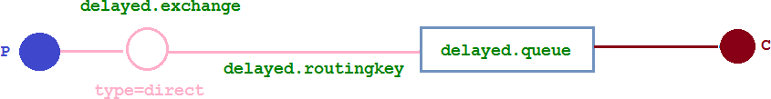

# 一、延迟队列介绍
* 1、延迟队列概念
````
延时队列,队列内部是有序的，最重要的特性就体现在它的延时属性上，延时队列中的元素是希望 在指定时间到了以后或之前取出和处理，简单来说，延时队列就是用来存放需要在指定时间被处理的 元素的队列。
````
* 2、延迟队列使用场景
````
1.订单在十分钟之内未支付则自动取消 2.新创建的店铺，如果在十天内都没有上传过商品，则自动发送消息提醒。 3.用户注册成功后，如果三天内没有登陆则进行短信提醒。 4.用户发起退款，如果三天内没有得到处理则通知相关运营人员。 5.预定会议后，需要在预定的时间点前十分钟通知各个与会人员参加会议

这些场景都有一个特点，需要在某个事件发生之后或者之前的指定时间点完成某一项任务，如： 发生订单生成事件，在十分钟之后检查该订单支付状态，然后将未支付的订单进行关闭；那我们一直轮询数据，每秒查一次，取出需要被处理的数据，然后处理不就完事了吗？

如果数据量比较少，确实可以这样做，比如：对于“如果账单一周内未支付则进行自动结算”这样的需求， 如果对于时间不是严格限制，而是宽松意义上的一周，那么每天晚上跑个定时任务检查一下所有未支付的账单，确实也是一个可行的方案。但对于数据量比较大，并且时效性较强的场景，如：“订单十分钟内未支付则关闭“，短期内未支付的订单数据可能会有很多，活动期间甚至会达到百万甚至千万级别，对这么庞大的数据量仍旧使用轮询的方式显然是不可取的，很可能在一秒内无法完成所有订单的检查，同时会给数据库带来很大压力，无法满足业务要求而且性能低下。
````

# 二、RabbitMQ 中的 TTL
* 1、队列设置TTL
````
在创建队列的时候设置队列的“x-message-ttl”属性
````
* 2、消息设置TTL
````
是针对每条消息设置TTL
````

* 3、两者的区别
````
如果设置了队列的 TTL 属性，那么一旦消息过期，就会被队列丢弃(如果配置了死信队列被丢到死信队列中)，而第二种方式，消息即使过期，也不一定会被马上丢弃，因为消息是否过期是在即将投递到消费者之前判定的，如果当前队列有严重的消息积压情况，则已过期的消息也许还能存活较长时间；

另外，还需要注意的一点是，如果不设置 TTL，表示消息永远不会过期，如果将 TTL 设置为 0，则表示除非此时可以直接投递该消息到消费者，否则该消息将会被丢弃。
````
# 三、整合 springboot
* 1、添加依赖：
````
<dependencies>
   <dependency>
        <groupId>org.springframework.boot</groupId>
        <artifactId>spring-boot-starter</artifactId>
    </dependency>
    <!--RabbitMQ 依赖-->
    <dependency>
        <groupId>org.springframework.boot</groupId>
        <artifactId>spring-boot-starter-amqp</artifactId>
    </dependency>
    <dependency>
        <groupId>org.springframework.boot</groupId>
        <artifactId>spring-boot-starter-web</artifactId>
    </dependency>
    <dependency>
        <groupId>org.springframework.boot</groupId>
        <artifactId>spring-boot-starter-test</artifactId>
        <scope>test</scope>
    </dependency>
    <dependency>
        <groupId>com.alibaba</groupId>
        <artifactId>fastjson</artifactId>
        <version>1.2.47</version>
    </dependency>
    <dependency>
        <groupId>org.projectlombok</groupId>
        <artifactId>lombok</artifactId>
    </dependency>
    <!--swagger-->
    <dependency>
        <groupId>io.springfox</groupId>
        <artifactId>springfox-swagger2</artifactId>
        <version>3.0.0</version>
    </dependency>
    <dependency>
        <groupId>io.springfox</groupId>
        <artifactId>springfox-swagger-ui</artifactId>
        <version>3.0.0</version>
    </dependency>
    <!--RabbitMQ 测试依赖-->
    <dependency>
        <groupId>org.springframework.amqp</groupId>
        <artifactId>spring-rabbit-test</artifactId>
        <scope>test</scope>
    </dependency>
</dependencies>
````
* 2、修改配置文件
````
spring.rabbitmq.host=10.68.63.68
spring.rabbitmq.port=5672
spring.rabbitmq.username=admin
spring.rabbitmq.password=123456
````
* 3、添加Swagger 配置类
````
import org.springframework.context.annotation.Bean;
import org.springframework.context.annotation.Configuration;
import springfox.documentation.builders.ApiInfoBuilder;
import springfox.documentation.service.ApiInfo;
import springfox.documentation.service.Contact;
import springfox.documentation.spi.DocumentationType;
import springfox.documentation.spring.web.plugins.Docket;
import springfox.documentation.swagger2.annotations.EnableSwagger2;


@Configuration
@EnableSwagger2
public class SwaggerConfig {

    @Bean
    public Docket webApiConfig() {
        return new Docket(DocumentationType.SWAGGER_2)
                .groupName("webApi")
                .apiInfo(webApiInfo())
                .select()
                .build();
    }

    private ApiInfo webApiInfo() {
        return new ApiInfoBuilder()
                .title("rabbitmq 接口文档")
                .description("本文档描述了 rabbitmq 微服务接口定义")
                .version("1.0")
                .contact(new Contact("zhiyuan", "http://oddfar.com", "test@qq.com"))
                .build();
    }

}
````
# 四、队列 TTL
* 1、代码架构图
````
创建两个队列 QA 和 QB，两者队列 TTL 分别设置为 10S 和 40S，然后在创建一个交换机 X 和死信交 换机 Y，它们的类型都是direct，创建一个死信队列 QD，它们的绑定关系如下：
````

````
原先配置队列信息，写在了生产者和消费者代码中，现在可写咋配置类中，生产者只发消息，消费者只接受消息
````
* 2、配置文件类代码
````
import org.springframework.amqp.core.*;
import org.springframework.beans.factory.annotation.Qualifier;
import org.springframework.context.annotation.Bean;
import org.springframework.context.annotation.Configuration;
import java.util.HashMap;
import java.util.Map;

@Configuration
public class TtlQueueConfig {
    public static final String X_EXCHANGE = "X";
    public static final String QUEUE_A = "QA";
    public static final String QUEUE_B = "QB";
    //死信交换机
    public static final String Y_DEAD_LETTER_EXCHANGE = "Y";
    //死信队列
    public static final String DEAD_LETTER_QUEUE = "QD";

    // 声明 xExchange
    @Bean("xExchange")
    public DirectExchange xExchange() {
        return new DirectExchange(X_EXCHANGE);
    }

    // 声明 死信队列交换机
    @Bean("yExchange")
    public DirectExchange yExchange() {
        return new DirectExchange(Y_DEAD_LETTER_EXCHANGE);
    }

    //声明队列 A ttl 为 10s 并绑定到对应的死信交换机
    @Bean("queueA")
    public Queue queueA() {
        Map<String, Object> args = new HashMap<>(3);
        //声明当前队列绑定的死信交换机
        args.put("x-dead-letter-exchange", Y_DEAD_LETTER_EXCHANGE);
        //声明当前队列的死信路由 key
        args.put("x-dead-letter-routing-key", "YD");
        //声明队列的 TTL
        args.put("x-message-ttl", 10000);
        return QueueBuilder.durable(QUEUE_A).withArguments(args).build();
    }

    // 声明队列 A 绑定 X 交换机
    @Bean
    public Binding queueaBindingX(@Qualifier("queueA") Queue queueA,
                                  @Qualifier("xExchange") DirectExchange xExchange) {
        return BindingBuilder.bind(queueA).to(xExchange).with("XA");
    }

    //声明队列 B ttl 为 40s 并绑定到对应的死信交换机
    @Bean("queueB")
    public Queue queueB() {
        Map<String, Object> args = new HashMap<>(3);
        //声明当前队列绑定的死信交换机
        args.put("x-dead-letter-exchange", Y_DEAD_LETTER_EXCHANGE);
        //声明当前队列的死信路由 key
        args.put("x-dead-letter-routing-key", "YD");
        //声明队列的 TTL
        args.put("x-message-ttl", 40000);
        return QueueBuilder.durable(QUEUE_B).withArguments(args).build();
    }

    //声明队列 B 绑定 X 交换机
    @Bean
    public Binding queuebBindingX(@Qualifier("queueB") Queue queue1B,
                                  @Qualifier("xExchange") DirectExchange xExchange) {
        return BindingBuilder.bind(queue1B).to(xExchange).with("XB");
    }

    //声明死信队列 QD
    @Bean("queueD")
    public Queue queueD() {
        return new Queue(DEAD_LETTER_QUEUE);
    }

    //声明死信队列 QD 绑定关系
    @Bean
    public Binding deadLetterBindingQAD(@Qualifier("queueD") Queue queueD,
                                        @Qualifier("yExchange") DirectExchange yExchange) {
        return BindingBuilder.bind(queueD).to(yExchange).with("YD");
    }

}
````
* 3、消息生产者代码
````
import lombok.extern.slf4j.Slf4j;
import org.springframework.amqp.rabbit.core.RabbitTemplate;
import org.springframework.beans.factory.annotation.Autowired;
import org.springframework.stereotype.Controller;
import org.springframework.web.bind.annotation.GetMapping;
import org.springframework.web.bind.annotation.PathVariable;
import org.springframework.web.bind.annotation.RequestMapping;
import org.springframework.web.bind.annotation.RestController;
import java.util.Date;

@Slf4j
@RequestMapping("ttl")
@RestController
public class SendMsgController {
    @Autowired
    private RabbitTemplate rabbitTemplate;

    @GetMapping("sendMsg/{message}")
    public void sendMsg(@PathVariable String message) {
        log.info("当前时间：{},发送一条信息给两个 TTL 队列:{}", new Date(), message);
        rabbitTemplate.convertAndSend("X", "XA", "消息来自 ttl 为 10S 的队列: " + message);
        rabbitTemplate.convertAndSend("X", "XB", "消息来自 ttl 为 40S 的队列: " + message);
    }
    
}
````
* 4、消息消费者代码
````
import com.rabbitmq.client.Channel;
import lombok.extern.slf4j.Slf4j;
import org.springframework.amqp.core.Message;
import org.springframework.amqp.rabbit.annotation.RabbitListener;
import org.springframework.stereotype.Component;
import java.io.IOException;
import java.util.Date;

// 消费者 - 死信队列
@Slf4j
@Component
public class DeadLetterQueueConsumer {

    @RabbitListener(queues = "QD")
    public void receiveD(Message message, Channel channel) throws IOException {
        String msg = new String(message.getBody());
        log.info("当前时间：{},收到死信队列信息{}", new Date().toString(), msg);
    }

}
````
* 5、结果
````
发起一个请求 http://localhost:8080/ttl/sendMsg/嘻嘻嘻(opens new window)

第一条消息在 10S 后变成了死信消息，然后被消费者消费掉，第二条消息在 40S 之后变成了死信消息， 然后被消费掉，这样一个延时队列就打造完成了。

不过，如果这样使用的话，岂不是每增加一个新的时间需求，就要新增一个队列，这里只有 10S 和 40S 两个时间选项，如果需要一个小时后处理，那么就需要增加TTL 为一个小时的队列，如果是预定会议室然后提前通知这样的场景，岂不是要增加无数个队列才能满足需求？
````
# 五、延时队列TTL优化
````
在这里新增了一个队列 QC,绑定关系如下,该队列不设置TTL 时间
````

* 1、配置文件类代码
````
@Configuration
public class MsgTtlQueueConfig {
    public static final String Y_DEAD_LETTER_EXCHANGE = "Y";
    public static final String QUEUE_C = "QC";

    //声明队列 C 死信交换机
    @Bean("queueC")
    public Queue queueB() {
        Map<String, Object> args = new HashMap<>(3);
        //声明当前队列绑定的死信交换机
        args.put("x-dead-letter-exchange", Y_DEAD_LETTER_EXCHANGE);
        //声明当前队列的死信路由 key
        args.put("x-dead-letter-routing-key", "YD");
        //没有声明 TTL 属性
        return QueueBuilder.durable(QUEUE_C).withArguments(args).build();
    }

    //声明队列 B 绑定 X 交换机
    @Bean
    public Binding queuecBindingX(@Qualifier("queueC") Queue queueC,
                                  @Qualifier("xExchange") DirectExchange xExchange) {
        return BindingBuilder.bind(queueC).to(xExchange).with("XC");
    }
}
````
* 2、生产者代码：
````
// 延时队列优化
@GetMapping("sendExpirationMsg/{message}/{ttlTime}")
public void sendMsg(@PathVariable String message, @PathVariable String ttlTime) {
    rabbitTemplate.convertAndSend("X", "XC", message, correlationData -> {
        correlationData.getMessageProperties().setExpiration(ttlTime);
        return correlationData;
    });
    log.info("当前时间：{},发送一条时长{}毫秒 TTL 信息给队列 C:{}", new Date(), ttlTime, message);
}
````
* 3、发起请求
````
http://localhost:8080/ttl/sendExpirationMsg/你好1/20000(opens new window)

http://localhost:8080/ttl/sendExpirationMsg/你好2/2000
````
* 4、不足
````
看起来似乎没什么问题，但是在最开始的时候，就介绍过如果使用在消息属性上设置 TTL 的方式，消息可能并不会按时“死亡“

因为 RabbitMQ 只会检查第一个消息是否过期，如果过期则丢到死信队列， 如果第一个消息的延时时长很长，而第二个消息的延时时长很短，第二个消息并不会优先得到执行。

这也就是为什么第二个延时2秒，却后执行。
````
# 六、Rabbitmq 插件实现延迟队列
````
上文中提到的问题，确实是一个问题，如果不能实现在消息粒度上的 TTL，并使其在设置的TTL 时间及时死亡，就无法设计成一个通用的延时队列。那如何解决呢，接下来我们就去解决该问题。
````
* 1、安装延时队列插件
````
可去官网下载 (opens new window)rabbitmq_delayed_message_exchange 插件，放置到 RabbitMQ 的插件目录。

进入 RabbitMQ 的安装目录下的 plgins 目录，执行下面命令让该插件生效，然后重启 RabbitMQ

[root@VM-0-6-centos software]# ls
erlang-21.3.8.21-1.el7.x86_64.rpm  rabbitmq_delayed_message_exchange-3.8.0.ez  rabbitmq-server-3.8.8-1.el7.noarch.rpm
#移动
cp rabbitmq_delayed_message_exchange-3.8.0.ez /usr/lib/rabbitmq/lib/rabbitmq_server-3.8.8/plugins
#安装
rabbitmq-plugins enable rabbitmq_delayed_message_exchange
#重启服务
systemctl restart rabbitmq-server
````

* 2、代码
````
在这里新增了一个队列delayed.queue,一个自定义交换机 delayed.exchange，绑定关系如下:
````

````
1、配置文件类代码：
在我们自定义的交换机中，这是一种新的交换类型，该类型消息支持延迟投递机制消息传递后并不会立即投递到目标队列中，而是存储在 mnesia(一个分布式数据系统)表中，当达到投递时间时，才投递到目标队列中。

@Configuration
public class DelayedQueueConfig {
    public static final String DELAYED_QUEUE_NAME = "delayed.queue";
    public static final String DELAYED_EXCHANGE_NAME = "delayed.exchange";
    public static final String DELAYED_ROUTING_KEY = "delayed.routingkey";

    @Bean
    public Queue delayedQueue() {
        return new Queue(DELAYED_QUEUE_NAME);
    }

    //自定义交换机 我们在这里定义的是一个延迟交换机
    @Bean
    public CustomExchange delayedExchange() {
        Map<String, Object> args = new HashMap<>();
        //自定义交换机的类型
        args.put("x-delayed-type", "direct");
        return new CustomExchange(DELAYED_EXCHANGE_NAME, "x-delayed-message", true, false, args);
    }

    @Bean
    public Binding bindingDelayedQueue(@Qualifier("delayedQueue") Queue queue,
                                       @Qualifier("delayedExchange") CustomExchange delayedExchange) {
        return BindingBuilder.bind(queue).to(delayedExchange).with(DELAYED_ROUTING_KEY).noargs();
    }
}
````
````
2、生产者代码

@GetMapping("sendDelayMsg/{message}/{delayTime}")
public void sendMsg(@PathVariable String message, @PathVariable Integer delayTime) {
    rabbitTemplate.convertAndSend(DELAYED_EXCHANGE_NAME, DELAYED_ROUTING_KEY, message,
            correlationData -> {
                correlationData.getMessageProperties().setDelay(delayTime);
                return correlationData;
            });
    log.info(" 当 前 时 间 ： {}, 发 送 一 条 延 迟 {} 毫秒的信息给队列 delayed.queue:{}", new Date(), delayTime, message);
}
````
````
3、消费者代码
// 消费者 - 基于插件的延时队列
@Slf4j
@ComponentScan
public class DelayQueueConsumer {

    public static final String DELAYED_QUEUE_NAME = "delayed.queue";

    @RabbitListener(queues = DELAYED_QUEUE_NAME)
    public void receiveDelayedQueue(Message message) {
        String msg = new String(message.getBody());
        log.info("当前时间：{},收到延时队列的消息：{}", new Date().toString(), msg);
    }
}
````
````
4、发送请求：

http://localhost:8080/ttl/sendDelayMsg/hello1/20000(opens new window)
http://localhost:8080/ttl/sendDelayMsg/hello2/2000
````
# 七、总结
````
延时队列在需要延时处理的场景下非常有用，使用 RabbitMQ 来实现延时队列可以很好的利用 RabbitMQ 的特性，如：消息可靠发送、消息可靠投递、死信队列来保障消息至少被消费一次以及未被正确处理的消息不会被丢弃。另外，通过 RabbitMQ 集群的特性，可以很好的解决单点故障问题，不会因为 单个节点挂掉导致延时队列不可用或者消息丢失。

当然，延时队列还有很多其它选择，比如利用 Java 的 DelayQueue，利用 Redis 的 zset，利用 Quartz 或者利用 kafka 的时间轮，这些方式各有特点,看需要适用的场景
````