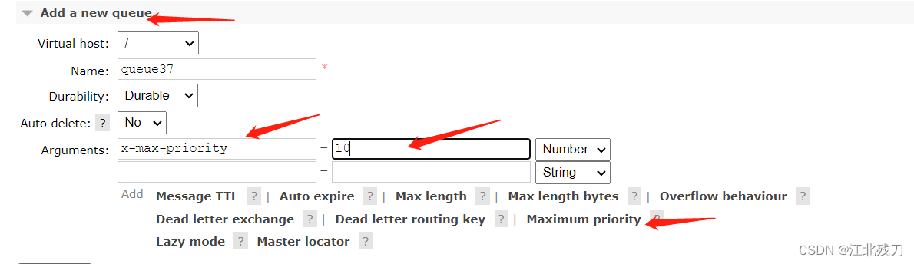
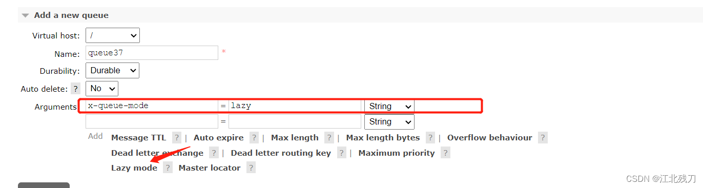
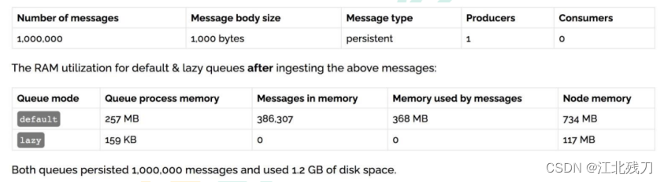

# 一、幂等性
* 1、概念
````
用户对于同一操作发起的一次请求或者多次请求的结果是一致的，不会因为多次点击而产生了副作用。举个最简单的例子，那就是支付，用户购买商品后支付，支付扣款成功，但是返回结果的时候网络异常，此时钱已经扣了，用户再次点击按钮，此时会进行第二次付款，返回结果成功，用户查询余额发现多扣了，流水记录也变成了两条。在以前的但应用系统中，我们只需要把数据操作放入事务中即可，发生错误立即回滚，但是再响应客户端的时候呀也有可能出现网络中断或者异常等等。
````
* 2、消息重复消费
````
消费者在消费 MQ 中的消息时，MQ 已经把消息发送给消费者，消费者在给 MQ 返回 ack 时网络中断，故 MQ 未收到确认消息，该条消息会重新发给其他的消费者，或者在网络重连后再次发送给该消费者，但实际上该消费者已成功消费了该消息，造成消费者消费了重复的消息。
````
* 3、解决思路
````
MQ 消费者的幂等性的解决一般使用全局ID或者写个唯一标识比如时间戳或者 UUID 或者订单消费者消费 MQ 中的消息也可以利用 MQ 的该 id 来判断，或者可按自己的规则生成一个全局唯一的 id，每次消费消息时用该 id 先判断该消息是否已消费过。
````
* 4、消费端的幂等性保障
````
在海量订单生成的业务高峰期，生产端有可能就会重复发生了消息，这时候消费端就要实现幂等性，这就意味着我们的消息永远不会被消费多次，即使我们收到了一样的消息。业务主流的幂等性有两种操作：

唯一ID+指纹码机制，利用数据库主键去重
利用 redis 的原子性去实现
````
* 5、唯一ID + 指纹码机制
````
指纹码

我们的一些规则或者时间戳家别的服务给到的唯一信息吗，它并不一定是我们系统生成的，基本都是由我们的业务规则拼接而来，但是一定要保证唯一性，然后就利用查询语句进行判断这个 id 是否存在数据库中，优势就是实现简单就一个拼接，然后查询判断是否重复；劣势就是在高并发时，如果是单个数据库就会有写入性能瓶颈，当然也可以使用分库分表提高性能，但是不是最推荐的放肆
````
* 6、Redis 原子性
````
利用 redis 执行 setnx 命令，天然具有幂等性。从而实现不重复消费
````
# 二、优先级队列
* 1、使用场景
````
在我们系统中有一个订单催付的场景，我们的客户在天猫下的订单，淘宝会及时将订单推送给我们，如果在用户设定的时间内未付款就会给用户推送一条短信提醒，很简单的一个功能把，但是，tmall 商家对我们来说，肯定是要分大客户和小客户的，比如像苹果，小米这样的商家一年起码能给我们创造很大的利润，所以理所当然，他们的订单必须得到优先处理，而曾经我们的后端系统是使用 redis 来存放的定时轮询，redis 只能用 list 做一个简简单单的消息队列，并不能实现一个优先级场景。所以订单量大了后采用 RabbitMQ 进行改造和优化，如果发现是大客户的订单给一个相对较高的优先级，否则就是默认优先级。
````
* 2、如何添加

````
队列中代码添加优先级

Map<String, Object> arguments = new HashMap<>();
//官方允许是0-255之间  此处设置10 允许优化级范围为0-10 不要设置过大  浪费CPU与内存
arguments.put("x-max-priority", 10);
channel.queueDeclare(QUEUE_NAME, true, false, false, arguments);
````
````
消息中代码添加优先级

AMQP.BasicProperties properties = 
    new AMQP.BasicProperties().builder().priority(5).build();
channel.basicPublish("", QUEUE_NAME, properties, message.getBytes());
````
````
**注意事项——**要让队列实现优先级需要做的事情如下

队列需要设置为优先级队列
消息需要设置消息的优先级
消费者需要等待消息已经发送到队列中去才消费，因为这样才有机会对消费进行排序
````
* 3、实战
````
消息生产者

public class Producer {

    //队列名称
    private static final String QUEUE_NAME = "hello";

    //发消息
    public static void main(String[] args) throws IOException, TimeoutException {

        //创建一个连接工厂
        ConnectionFactory factory = new ConnectionFactory();
        //工厂ip 连接RabbitMQ的队列
        factory.setHost("119.91.219.72");
        //用户名
        factory.setUsername("admin");
        //密码
        factory.setPassword("a123456");

        //创建连接
        Connection connection = factory.newConnection();
        //获取信道
        Channel channel = connection.createChannel();

        /**
         * 生成一个队列
         * 1.队列名称
         * 2.队列里面的消息是否持久化(磁盘) 默认情况下存储在内存中
         * 3.该队列是否只供一个消费者进行消费，是否可以消息共享，true可以多个消费者消费, false只能一个消费者消费
         * 4.是否自动删除 最后一个消费者断开连接之后，该队列是否自动删除 true自动删除 false不自动删除
         * 5.其他参数
         */
        Map<String, Object> arguments = new HashMap<>();
        arguments.put("x-max-priority", 10);//官方允许是0-255之间  此处设置10 允许优化级范围为0-10 不要设置过大  浪费CPU与内存
        channel.queueDeclare(QUEUE_NAME, true, false, false, arguments);

        for (int i = 1; i < 11; i++) {
            String message = "info" + i;
            if (i == 5) {
                AMQP.BasicProperties properties =
                        new AMQP.BasicProperties().builder().priority(5).build();
                channel.basicPublish("", QUEUE_NAME, properties, message.getBytes());
            }else {
                channel.basicPublish("", QUEUE_NAME, null, message.getBytes());
            }
        }

        System.out.println("消息发送完毕");

    }
}
````
````
消息消费者

public class Consumer {

    //队列名称
    private static final String QUEUE_NAME = "hello";

    //接收消息
    public static void main(String[] args) throws IOException, TimeoutException {
        //创建一个连接工厂
        ConnectionFactory factory = new ConnectionFactory();
        //工厂ip 连接RabbitMQ的队列
        factory.setHost("119.91.219.72");
        //用户名
        factory.setUsername("admin");
        //密码
        factory.setPassword("a123456");

        //创建连接
        Connection connection = factory.newConnection();
        //获取信道
        Channel channel = connection.createChannel();

        //声明
        DeliverCallback deliverCallback = (consumerTag, message) -> {
            System.out.println(new String(message.getBody()));
        };
        CancelCallback cancelCallback = consumerTag -> {
            System.out.println("消息消费被中断");
        };


        /**
         * 消费者消费消息
         * 1.消费哪个队列
         * 2.消费成功之后是否要自动应答，true代表自动应答，false代表手动应答
         * 3.消费者未成功消费的回调
         * 4.消费者取消消费的回调
         */
        channel.basicConsume(QUEUE_NAME, true, deliverCallback, cancelCallback);
    }
}
````
# 三、惰性队列
* 1、使用场景
````
RabbitMQ 从 3.6.0 版本开始引入了惰性队列的概念。惰性队列会尽可能的将消息存入磁盘，而在消费者消费到相应的消息时才会被加载到内存中，它的一个重要的设计目标是能够支持更长的队列，即支持更多的存储。当消费者由于各种各样的原因（比如消费者下线、宕机亦或是由于维护而关闭等）而导致长时间内不能消费消息造成堆积是，惰性队列就很有必要了。

默认请款搞下，当生产者将消息发送到 RabbitMQ 的时候，队列中的消息会尽可能的存储在内存中，这样可以更加快速的将消息发送给消费者。即使是持久化的消息，在被写入磁盘的同时也会在内存中驻留一份备份。当 RabbitMQ 需要释放内存的时候，会将内存中的消息换页至磁盘中，这个操作会耗费比较长时间，也会阻塞队列的操作，进而无法接收新的消息。虽然 RabbitMQ 的开发者们一直在升级相关的算法，但是效果始终不太理想，尤其是在消息量大的时候。
````
* 2、两种模式
````
队列具备两种模式：default 和 lazy。默认的为 default 模式，在 3.6.0 之前的版本无需做任何变更。lazy 模式即为惰性队列的模式，可以通过使用 channel.queueDeclare 方法的时候在参数中设置，也可以通过 Policy 的方式设置，如果一个队列同时使用这两种方式设置的话，那么 Policy 的方式具备更高的优先级。如果要通过声明的方式改变已有的队列的模式的话，那么只能先删除队列，然后重新声明一个新的。

在队列声明的时候通过 x-queue-mode 参数来设置队列的模式，取值为 default 和 lazy。
Map<String, Object> args = new HashMap<>();
args.put("x-queue-mode", "lazy");
channel.queueDeclare("queue1", false, false, false, args);
````

* 3、内存开销对比


````
发送一百万条消息，每条消息大概占 1kb 的情况下，铍铜队列占用内存是 1.2GB，而惰性队列仅仅占用 1.5MB。
````