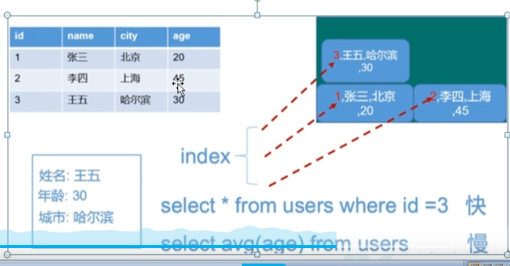
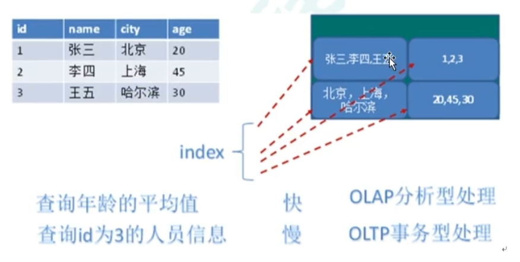

# 一、NoSQL数据库
* 1、NoSQL数据库概述
````
NoSQL = Not Only SQL,翻译为不仅仅是SQL,泛指非关系型数据库,NoSQL不依赖业务逻辑方式存储,而以简单的key-value模式存储,因此大大增加了数据库的扩展能力。

不遵循SQL标准
不支持ACID
远超于SQL的性能
````
* 2、NoSQL适用场景
````
对数据高开发的读写
海量数据的读写
对数据高可拓展性的
````
* 3、NoSQL不适用场景
````
需要事务支持
基于sql的结构化查询存储,处理复杂的关系,需要即席查询
用不着sql和用了sql也不行的情况,考虑NoSQL
````
* 4、Redis
````
几乎覆盖了Memcached的绝大部分功能
数据都在内存中,支持持久化,主要用作备份恢复
除了支持简单的key-value模式,还支持多种数据结构的存储,比如list、set、hash、zset等
一般是中作为缓存数据库辅助持久化的数据库
````
* 5、MongoDB
````
高性能、开源、模式自由的文档型数据库
数据都在内存中,如果内存不足,把不常用的数据库保存到硬盘
虽然是key-value模式,但是对value(尤其是json提供了丰富的查询功能)
支持二进制数据及大型对象
可以根据数据的特点代替RDBMS,成为独立的数据库,或者配合RDBMS,存储特定的数据
````
# 二、行式存储数据库

# 三、列式存储数据库

* 1、HBase
````
HBase是Hadoop项目中的数据库。它用于需要对大量的数据进行随机、实时的读写操作的场景中。
````
* 2、Cassandra
````
Apache Cassandra 是一款免费的开源NoSQL数据库,其设计目的在于管理由大量商用服务器构建起来的庞大集群上的海量数据集(数据量通常达到PB级别)。
Cassandra的长处是对写入及读取操作进行规模调整,而且其不强调主集群的设计思路能够以相对直观的方式间简化各种集群的创建与拓展流程。
````