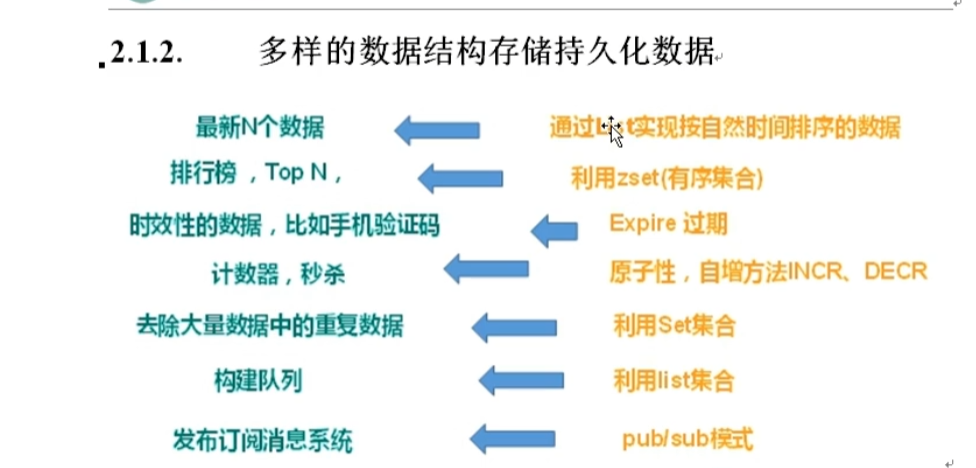

# 一、Redis概述
````
Redis 是一个开源的key-value存储系统
支持存储的value类型更多m包括: string、list、set、zset(有序集合)、hash
这些数据都支持push/pop、add/remove及取交集和差集及更丰富得到操作,而且这些操作都是原子性的。
在此基础上,Redis支持不同方式的排序
为了保证效率,数据都是缓存在内存中
Redis会周期性的把更新的数据写入磁盘或把修改操作写入追加的记录文件。
在此基础上实现了master-slave(主从)同步
````
# 二、应用场景
* 1、配合关系型数据库做高速缓存
````
高频词,热门访问的数据,降低数据库IO
分布式架构,做session共享
````
* 2、多样的数据结构存储持久化数据

# 三、Redis安装和使用
* 1、Redis安装
````
访问 https://redis.io/
点击下载

安装c语言的编译环境
yum install gcc
gcc -version

解压
tar -zxvf redis-6.2.1.tar.gz

解压完进入目录
cd redis-6.2.1

再次执行make(编译命令)
make

如果没有c语言编译环境,make会报错 -Jemalloc/jemalloc.h: 没有那个文件
解决方案
make distclean

跳过make test,继续安装
make install

默认装在 usr/local/bin

redis-benchmark: 性能测试工具
redis-chek-aof: 修复有问题的AOF文件
redis-check-dump: 修复有问题的dump.rdb文件
redis-sentinel: Redus集群使用
redis-server: Redis服务器启动命令
redis-cli: 客户端,操作入口
````
* 2、前台启动(不推荐)
````
redis-server
````
* 3、后台启动
````
cd /opt

复制配置文件
cp redis.conf /etc/redis.conf

修改配置 daemonize yes
vi redis.conf

找到 daemonize no
改为 daemonize yes

保存
wq

通过配置文件启动
cd /usr/local/bin
redis-server /etc/redis.conf

查看进程
ps -ef | grep redis

连接redis
redis-cli

关闭连接

方式1,进入终端后关闭
shutdown

方式2,指定进程号
ps -ef | grep redis
kill -9 上面查出来的进程号
````
# 四、Redis相关知识
````
默认16个数据库, 类似数组下标从0开始, 初始默认使用0号库
使用命令select <dbid>切换数据库。如select 8
统一密码管理, 所有数据库同样的密码
dbsize查看当前数据库key的数量
flushdb清空当前数据库
flushall通杀全部数据库

Redis是单线程+多路IO复用技术
多路复用是指使用一个线程来检查多个文件描述符(Socket)的就绪状态。比如调用select和poll哈哈努, 传入多个文件描述符, 如果有一个文件描述符就绪, 则返回, 否则阻塞直到超时。得到就绪状态后进行真正的操作可以在同一个线程里执行, 也可以启动线程执行(比如线程池)
````