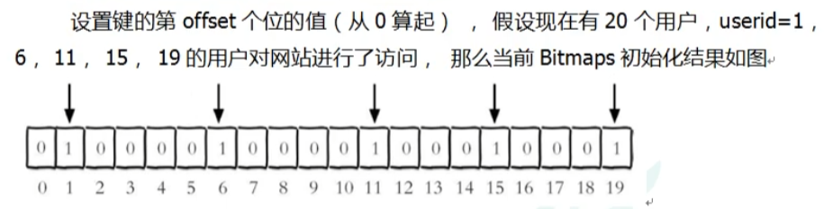

# 一、Bitmaps
* 1、简介
````
现代计算机用二进制（位） 作为信息的基础单位， 1个字节等于8位， 例如“abc”字符串是由3个字节组成， 但实际在计算机存储时将其用二进制表示， “abc”分别对应的ASCII码分别是97、 98、 99， 对应的二进制分别是01100001、 01100010和01100011

合理地使用操作位能够有效地提高内存使用率和开发效率。
Redis提供了Bitmaps这个“数据类型”可以实现对位的操作：
1、Bitmaps本身不是一种数据类型， 实际上它就是字符串（key-value） ， 但是它可以对字符串的位进行操作。
2、Bitmaps单独提供了一套命令， 所以在Redis中使用Bitmaps和使用字符串的方法不太相同。 可以把Bitmaps想象成一个以位为单位的数组， 数组的每个单元只能存储0和1， 数组的下标在Bitmaps中叫做偏移量。
````
* 2、命令
````
1、setbit
setbit key offset value
setbit设置Bitmaps中某个偏移量的值(0或1)
*offset:偏移量从0开始

2.getbit
getbit key offset
获取键的第offset位的值（从0开始算）

3、bitcount
bitcount key [start end] 
统计字符串从start字节到end字节比特值为1的数量

4、bitop
bitop  and(or/not/xor) <destkey> [key…]
bitop是一个复合操作， 它可以做多个Bitmaps的and(交集) 、 or(并集) 、 not(非) 、 xor(异或) 操作并将结果保存在destkey中。
````
* 3、例子
````
每个独立用户是否访问过网站存放在Bitmaps中, 将访问的用户记作1, 没有访问的用户记作0, 用偏移量作为用户的id
````

````
#unique:users:20231004代表2023-10-04这天的独立访问用户的Bitmaps
setbit unique:users:20231004 1 1
setbit unique:users:20231004 6 1
setbit unique:users:20231004 11 1
setbit unique:users:20231004 15 1
setbit unique:users:20231004 19 1

#获取id=1的用户是否在2023-10-04这天访问过， 返回0说明没有访问过：
getbit users:20231004 1

#start和end代表起始和结束字节数， 下面操作计算用户id在第1个字节到第3个字节之间的独立访问用户数， 对应的用户id是11， 15， 19。
bitcount users:20231004 1 3

2020-11-04 日访问网站的userid=1,2,5,9。
setbit unique:users:20201104 1 1
setbit unique:users:20201104 2 1
setbit unique:users:20201104 5 1
setbit unique:users:20201104 9 1

2020-11-03 日访问网站的userid=0,1,4,9。
setbit unique:users:20201103 0 1
setbit unique:users:20201103 1 1
setbit unique:users:20201103 4 1
setbit unique:users:20201103 9 1

计算出两天都访问过网站的用户数量
bitop and unique:users:and:20201104_03
unique:users:20201103unique:users:20201104
````
# 二、HyperLogLog
* 1、简介
````
在工作当中，我们经常会遇到与统计相关的功能需求，比如统计网站PV（PageView页面访问量）,可以使用Redis的incr、incrby轻松实现。
但像UV（UniqueVisitor，独立访客）、独立IP数、搜索记录数等需要去重和计数的问题如何解决？这种求集合中不重复元素个数的问题称为基数问题。
解决基数问题有很多种方案：
1、数据存储在MySQL表中，使用distinct count计算不重复个数
2、使用Redis提供的hash、set、bitmaps等数据结构来处理
以上的方案结果精确，但随着数据不断增加，导致占用空间越来越大，对于非常大的数据集是不切实际的。
能否能够降低一定的精度来平衡存储空间？

Redis推出了HyperLogLog
Redis HyperLogLog 是用来做基数统计的算法
优点是：

在输入元素的数量或者体积非常非常大时，计算基数所需的空间总是固定的、并且是很小的。
在 Redis 里面，每个 HyperLogLog 键只需要花费 12 KB 内存，就可以计算接近 2^64 个不同元素的基数。这和计算基数时，元素越多耗费内存就越多的集合形成鲜明对比。
但是，因为 HyperLogLog 只会根据输入元素来计算基数，而不会储存输入元素本身，所以 HyperLogLog 不能像集合那样，返回输入的各个元素。

什么是基数?
比如数据集 {1, 3, 5, 7, 5, 7, 8}， 那么这个数据集的基数集为 {1, 3, 5 ,7, 8}, 基数(不重复元素)为5。 基数估计就是在误差可接受的范围内，快速计算基数。
````
* 2、命令
````
1、pfadd
pfadd <key>< element> [element ...]   #添加指定元素到HyperLogLog 中
2、pfcount
pfcount [key …] 
3、pfmerge
pfmerge <destkey> <sourcekey> [sourcekey ...]  
#将一个或多个HLL合并后的结果存储在另一个HLL中，比如每月活跃用户可以使用每天的活跃用户来合并计算可得
````
# 三、Geospatial
* 1、简介
````
Redis 3.2 中增加了对GEO类型的支持。GEO，Geographic，地理信息的缩写。该类型，就是元素的2维坐标，在地图上就是经纬度。redis基于该类型，提供了经纬度设置，查询，范围查询，距离查询，经纬度Hash等常见操作。
````
* 2、命令
````
1、geoadd
geoadd <key> <longitude> <latitude> <member> [longitude latitude member...]   #添加地理位置(经度，纬度，名称)

2、geopos
geopos  <key><member> [member...] 
# 获得指定地区的坐标值

3、geodist
geodist<key><member1><member2>  [m|km|ft|mi ]  
#获取两个位置之间的直线距离

4、georadius
georadius<key>< longitude><latitude>radius  m|km|ft|mi   
#以给定的经纬度为中心，找出某一半径内的元素
````