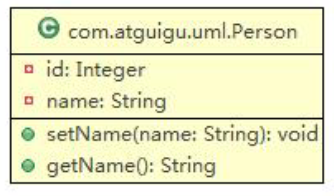
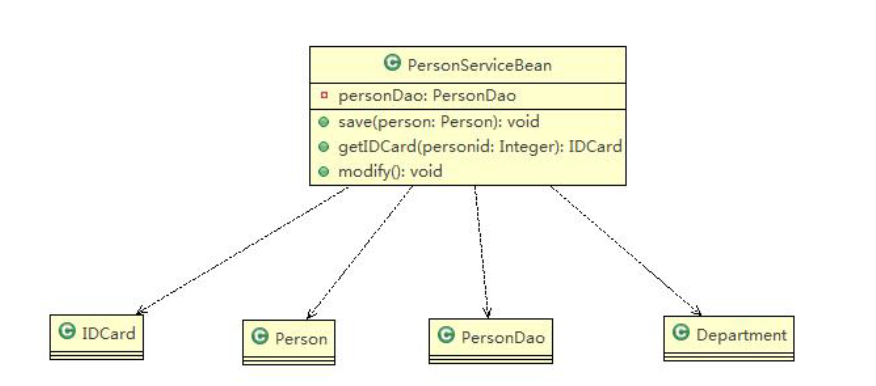
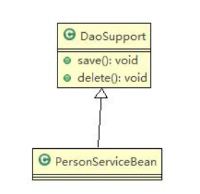
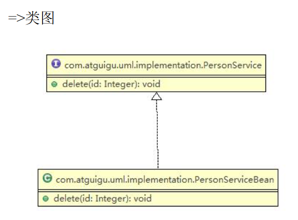
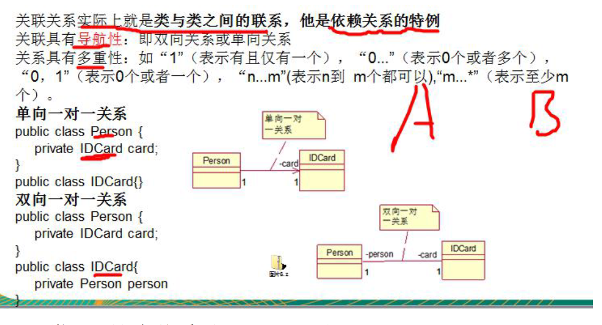
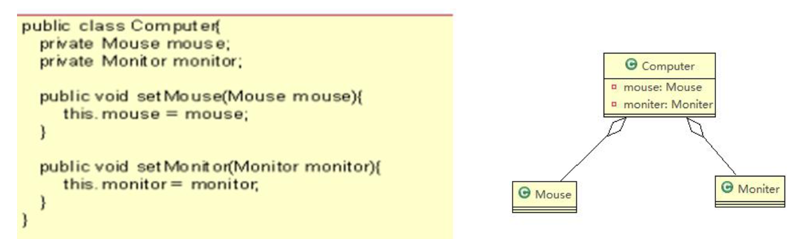
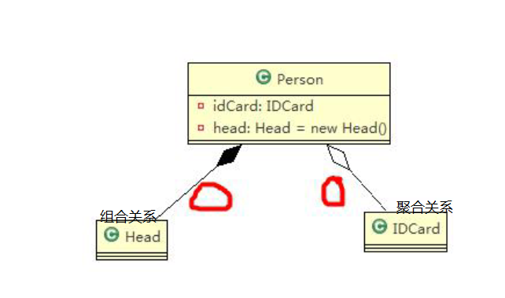
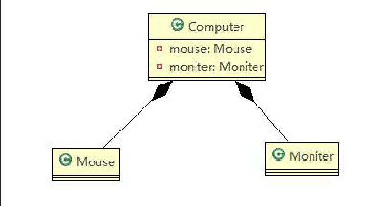

# 一、UML 基本介绍
````
1、UML——Unified modeling language UML (统一建模语言)，是一种用于软件系统分析和设计的语言工具，它用
于帮助软件开发人员进行思考和记录思路的结果
2、UML 本身是一套符号的规定，就像数学符号和化学符号一样，这些符号用于描述软件模型中的各个元素和他
们之间的关系，比如类、接口、实现、泛化、依赖、组合、聚合等
````
# 二、UML 图
````
UML 图分类：
1、用例图(use case)
2、静态结构图：类图、对象图、包图、组件图、部署图
3、动态行为图：交互图（时序图与协作图）、状态图、活动图

说明：
1、类图是描述类与类之间的关系的，是 UML 图中最核心的
2、在讲解设计模式时，我们必然会使用类图，为了让学员们能够把设计模式学到位，需要先给大家讲解类图
3、温馨提示：如果已经掌握 UML 类图的学员，可以直接听设计模式的章节
````
# 三、UML 类图
* 1、用于描述系统中的类(对象)本身的组成和类(对象)之间的各种静态关系。
* 2、类之间的关系：依赖、泛化（继承）、实现、关联、聚合与组合。
* 3、类图简单举例
````
public class Person{ //代码形式->类图
    private Integer id;
    private String name;
    public void setName(String name){
        this.name=name;
    }
    public String getName(){
        return name;
    }
}
````

* 4、类图—依赖关系(Dependence)
````
public class PersonServiceBean {
    private PersonDao personDao;//类
    public void save(Person person){}
    public IDCard getIDCard(Integer personid){}
    public void modify(){
        Department department = new Department();
    }
}
public class PersonDao{}
public class IDCard{}
public class Person{}
public class Department{}
````

````
小结

1、类中用到了对方
2、如果是类的成员属性
3、如果是方法的返回类型
4、是方法接收的参数类型
5、方法中使用到
````
* 5、类图—泛化关系(generalization)
````
泛化关系实际上就是继承关系，他是依赖关系的特例
public abstract class DaoSupport{
    public void save(Object entity){
    }
    public void delete(Object id){
    }
}
public class PersonServiceBean extends Daosupport{
}
````

* 6、类图—实现关系(Implementation)
````
public interface PersonService {
    public void delete(Interger id);
}
public class PersonServiceBean implements PersonService {
    public void delete(Interger id){}
}
````

* 7、类图—关联关系

* 8、类图—聚合关系(Aggregation)
````
聚合关系（Aggregation）表示的是整体和部分的关系，整体与部分可以分开。聚合关系是关联关系的特例，所
以他具有关联的导航性与多重性。

如：一台电脑由键盘(keyboard)、显示器(monitor)，鼠标等组成；组成电脑的各个配件是可以从电脑上分离出来
的，使用带空心菱形的实线来表示：
````

* 9、类图—组合关系(Composition)
````
基本介绍
组合关系：也是整体与部分的关系，但是整体与部分不可以分开。
````
````
public class Person{
    private IDCard card;
    private Head head = new Head();
}
public class IDCard{}
public class Head{}
````

````
public class Computer {
    private Mouse mouse = new Mouse(); //鼠标可以和 computer 不能分离
    private Moniter moniter = new Moniter();//显示器可以和 Computer 不能分离
    public void setMouse(Mouse mouse) {
        this.mouse = mouse;
    }
    public void setMoniter(Moniter moniter) {
        this.moniter = moniter;
    }
}
public class Mouse {}
public class Moniter {}
````

