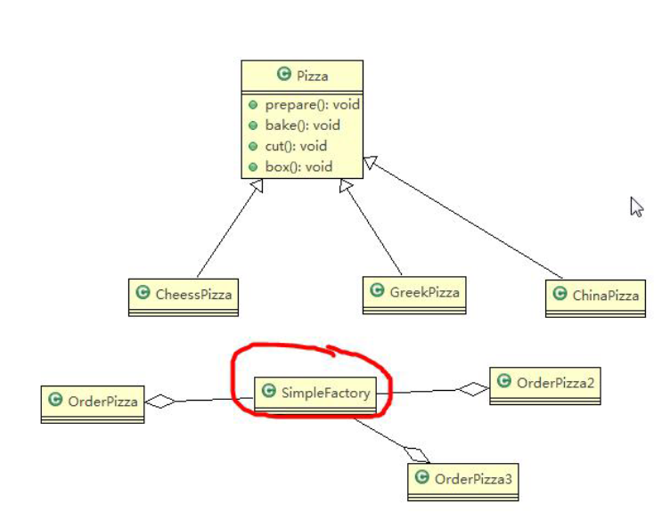

# 一、简单工厂模式(静态工厂模式)
* 1、简单工厂模式的设计方案

* 2、实例
````
//实体类
//将Pizza 类做成抽象
public abstract class Pizza {
	protected String name; //名字

	//准备原材料, 不同的披萨不一样，因此，我们做成抽象方法
	public abstract void prepare();

	
	public void bake() {
		System.out.println(name + " baking;");
	}

	public void cut() {
		System.out.println(name + " cutting;");
	}

	//打包
	public void box() {
		System.out.println(name + " boxing;");
	}

	public void setName(String name) {
		this.name = name;
	}
}

public class CheesePizza extends Pizza {

	@Override
	public void prepare() {
		// TODO Auto-generated method stub
		System.out.println(" 给制作奶酪披萨 准备原材料 ");
	}

}

public class GreekPizza extends Pizza {

	@Override
	public void prepare() {
		// TODO Auto-generated method stub
		System.out.println(" 给希腊披萨 准备原材料 ");
	}

}

public class PepperPizza extends Pizza {

	@Override
	public void prepare() {
		// TODO Auto-generated method stub
		System.out.println(" 给胡椒披萨准备原材料 ");
	}

}
````
````
import com.atguigu.factory.simplefactory.pizzastore.pizza.CheesePizza;
import com.atguigu.factory.simplefactory.pizzastore.pizza.GreekPizza;
import com.atguigu.factory.simplefactory.pizzastore.pizza.PepperPizza;
import com.atguigu.factory.simplefactory.pizzastore.pizza.Pizza;

//简单工厂类
public class SimpleFactory {
    //更加 orderType 返回对应的 Pizza 对象
    public Pizza createPizza(String orderType) {
        Pizza pizza = null;
        System.out.println("使用简单工厂模式");
        if (orderType.equals("greek")) {
            pizza = new GreekPizza();
            pizza.setName("希腊披萨");
        } else if (orderType.equals("cheese")) {
            pizza = new CheesePizza();
            pizza.setName("奶酪披萨");
        } else if (orderType.equals("pepper")) {
            pizza = new PepperPizza();
            pizza.setName("胡椒披萨");
        }
        return pizza;
    }
    //简单工厂模式 也叫 静态工厂模式
        public static Pizza createPizza2(String orderType) {
        Pizza pizza = null;
        System.out.println("使用简单工厂模式 2");
        if (orderType.equals("greek")) {
            pizza = new GreekPizza();
            pizza.setName(" 希腊披萨 ");
        } else if (orderType.equals("cheese")) {
            pizza = new CheesePizza();
            pizza.setName(" 奶酪披萨 ");
        } else if (orderType.equals("pepper")) {
            pizza = new PepperPizza();
            pizza.setName("胡椒披萨");
        }
        return pizza;
    }
}
````
````
//OrderPizza.java

import java.io.BufferedReader;
import java.io.IOException;
import java.io.InputStreamReader;
import com.jch.factory.simplefactory.pizzastore.pizza.Pizza;
public class OrderPizza {
    //定义一个简单工厂对象
    SimpleFactory simpleFactory;
    Pizza pizza = null;
    //构造器
    public OrderPizza(SimpleFactory simpleFactory) {
        setFactory(simpleFactory);
    }
    public void setFactory(SimpleFactory simpleFactory) {
        String orderType = ""; //用户输入的
        this.simpleFactory = simpleFactory; //设置简单工厂对象
        do {
            orderType = getType();
            pizza = this.simpleFactory.createPizza(orderType);

            //输出 pizza
            if(pizza != null) { //订购成功
                pizza.prepare();
                pizza.bake();
                pizza.cut();
                pizza.box();
            } else {
                System.out.println(" 订购披萨失败 ");
                break;
            }
        }while(true);
    }
    // 写一个方法，可以获取客户希望订购的披萨种类
    private String getType() {
        try {
            BufferedReader strin = new BufferedReader(new InputStreamReader(System.in));
            System.out.println("input pizza 种类:");
            String str = strin.readLine();
            return str;
        } catch (IOException e) {
            e.printStackTrace();
            return "";
        }
    }
}
````
````
//相当于一个客户端，发出订购
public class PizzaStore {
	public static void main(String[] args) {
		//使用简单工厂模式
		new OrderPizza(new SimpleFactory());
		System.out.println("~~退出程序~~");
	}
}
````
# 二、工厂方法模式
* 1、工厂方法模式介绍
````
1、工厂方法模式设计方案：将披萨项目的实例化功能抽象成抽象方法，在不同的口味点餐子类中具体实现。
2、工厂方法模式：定义了一个创建对象的抽象方法，由子类决定要实例化的类。工厂方法模式将对象的实例化推迟到子类。
````
* 2、实例
````
实体类

//将Pizza 类做成抽象
public abstract class Pizza {
	protected String name; //名字

	//准备原材料, 不同的披萨不一样，因此，我们做成抽象方法
	public abstract void prepare();

	
	public void bake() {
		System.out.println(name + " baking;");
	}

	public void cut() {
		System.out.println(name + " cutting;");
	}

	//打包
	public void box() {
		System.out.println(name + " boxing;");
	}

	public void setName(String name) {
		this.name = name;
	}
}
BJCheesePizza.java 北京的奶酪pizza
BJPepperPizza.java 北京的胡椒pizza
LDCheesePizza.java 伦敦的奶酪pizza
LDPepperPizza.java 伦敦的胡椒pizza
以上四个类继承Pizza抽象类实现prepare抽象接口
````
````
// 订单工厂类
public abstract class OrderPizza {
	//定义一个抽象方法，createPizza , 让各个工厂子类自己实现
	abstract Pizza createPizza(String orderType);
	
	// 构造器
	public OrderPizza() {
		Pizza pizza = null;
		String orderType; // 订购披萨的类型
		do {
			orderType = getType();
			pizza = createPizza(orderType); //抽象方法，由工厂子类完成
			//输出pizza 制作过程
			pizza.prepare();
			pizza.bake();
			pizza.cut();
			pizza.box();
			
		} while (true);
	}

	// 写一个方法，可以获取客户希望订购的披萨种类
	private String getType() {
		try {
			BufferedReader strin = new BufferedReader(new InputStreamReader(System.in));
			System.out.println("input pizza 种类:");
			String str = strin.readLine();
			return str;
		} catch (IOException e) {
			e.printStackTrace();
			return "";
		}
	}

}

//工厂子类
public class BJOrderPizza extends OrderPizza {
	@Override
	Pizza createPizza(String orderType) {
	
		Pizza pizza = null;
		if(orderType.equals("cheese")) {
			pizza = new BJCheesePizza();
		} else if (orderType.equals("pepper")) {
			pizza = new BJPepperPizza();
		}
		// TODO Auto-generated method stub
		return pizza;
	}
}
public class LDOrderPizza extends OrderPizza {
	@Override
	Pizza createPizza(String orderType) {
	
		Pizza pizza = null;
		if(orderType.equals("cheese")) {
			pizza = new LDCheesePizza();
		} else if (orderType.equals("pepper")) {
			pizza = new LDPepperPizza();
		}
		// TODO Auto-generated method stub
		return pizza;
	}
}
````
````
public class PizzaStore {
	public static void main(String[] args) {
		String loc = "bj";
		if (loc.equals("bj")) {
			//创建北京口味的各种Pizza
			new BJOrderPizza();
		} else {
			//创建伦敦口味的各种Pizza
			new LDOrderPizza();
		}
	}
}
````
# 三、抽象工厂模式
* 1、基本介绍
````
1、抽象工厂模式：定义了一个 interface 用于创建相关或有依赖关系的对象簇，而无需指明具体的类
2、抽象工厂模式可以将简单工厂模式和工厂方法模式进行整合。
3、从设计层面看，抽象工厂模式就是对简单工厂模式的改进(或者称为进一步的抽象)。
4、将工厂抽象成两层，AbsFactory(抽象工厂) 和 具体实现的工厂子类。程序员可以根据创建对象类型使用对应的工厂子类。这样将单个的简单工厂类变成了工厂簇，更利于代码的维护和扩展。
````

* 2、案例
````
//一个抽象工厂模式的抽象层(接口)
public interface AbsFactory {
	//让下面的工厂子类来 具体实现
	public Pizza createPizza(String orderType);
}

//工厂子类
public class BJFactory implements AbsFactory {

	@Override
	public Pizza createPizza(String orderType) {
		System.out.println("~使用的是抽象工厂模式~");
		// TODO Auto-generated method stub
		Pizza pizza = null;
		if(orderType.equals("cheese")) {
			pizza = new BJCheesePizza();
		} else if (orderType.equals("pepper")){
			pizza = new BJPepperPizza();
		}
		return pizza;
	}

}
public class LDFactory implements AbsFactory {

	@Override
	public Pizza createPizza(String orderType) {
		System.out.println("~使用的是抽象工厂模式~");
		Pizza pizza = null;
		if (orderType.equals("cheese")) {
			pizza = new LDCheesePizza();
		} else if (orderType.equals("pepper")) {
			pizza = new LDPepperPizza();
		}
		return pizza;
	}

}

public class OrderPizza {

	AbsFactory factory;

	// 构造器
	public OrderPizza(AbsFactory factory) {
		setFactory(factory);
	}

	private void setFactory(AbsFactory factory) {
		Pizza pizza = null;
		String orderType = ""; // 用户输入
		this.factory = factory;
		do {
			orderType = getType();
			// factory 可能是北京的工厂子类，也可能是伦敦的工厂子类
			pizza = factory.createPizza(orderType);
			if (pizza != null) { // 订购ok
				pizza.prepare();
				pizza.bake();
				pizza.cut();
				pizza.box();
			} else {
				System.out.println("订购失败");
				break;
			}
		} while (true);
	}

	// 写一个方法，可以获取客户希望订购的披萨种类
	private String getType() {
		try {
			BufferedReader strin = new BufferedReader(new InputStreamReader(System.in));
			System.out.println("input pizza 种类:");
			String str = strin.readLine();
			return str;
		} catch (IOException e) {
			e.printStackTrace();
			return "";
		}
	}
}
````
````
public class PizzaStore {

	public static void main(String[] args) {
		// TODO Auto-generated method stub
		//new OrderPizza(new BJFactory());
		new OrderPizza(new LDFactory());
	}

}
````
# 四、工厂模式小结
````
1、工厂模式的意义
将实例化对象的代码提取出来，放到一个类中统一管理和维护，达到和主项目的依赖关系的解耦。从而提高项
目的扩展和维护性。
2、三种工厂模式 (简单工厂模式、工厂方法模式、抽象工厂模式)
3、设计模式的依赖抽象原则
	创建对象实例时，不要直接 new 类, 而是把这个 new 类的动作放在一个工厂的方法中，并返回。有的书上说，变量不要直接持有具体类的引用。
	不要让类继承具体类，而是继承抽象类或者是实现 interface(接口)
	不要覆盖基类中已经实现的方法。
````