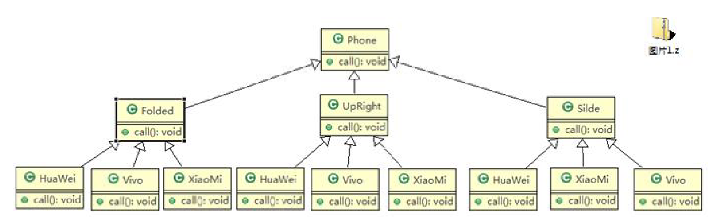
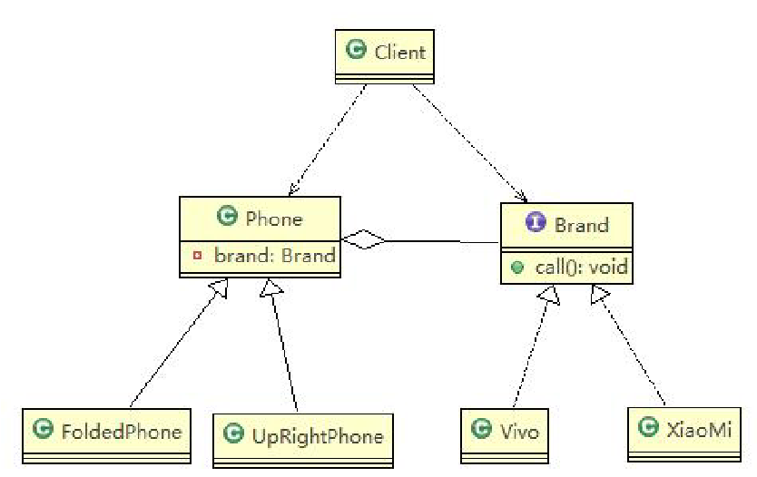

# 一、传统方案解决手机操作问题

# 二、桥接模式解决手机操作问题
* 1、UML类图
!
* 2、案例
````
//接口
public interface Brand {
	void open();
	void close();
	void call();
}
public class Vivo implements Brand {

	@Override
	public void open() {
		// TODO Auto-generated method stub
		System.out.println(" Vivo手机开机 ");
	}

	@Override
	public void close() {
		// TODO Auto-generated method stub
		System.out.println(" Vivo手机关机 ");
	}

	@Override
	public void call() {
		// TODO Auto-generated method stub
		System.out.println(" Vivo手机打电话 ");
	}
}
public class XiaoMi implements Brand {

	@Override
	public void open() {
		// TODO Auto-generated method stub
		System.out.println(" 小米手机开机 ");
	}

	@Override
	public void close() {
		// TODO Auto-generated method stub
		System.out.println(" 小米手机关机 ");
	}

	@Override
	public void call() {
		// TODO Auto-generated method stub
		System.out.println(" 小米手机打电话 ");
	}
}
````
````
public abstract class Phone {
	
	//组合品牌
	private Brand brand;

	//构造器
	public Phone(Brand brand) {
		super();
		this.brand = brand;
	}
	
	protected void open() {
		this.brand.open();
	}
	protected void close() {
		brand.close();
	}
	protected void call() {
		brand.call();
	}
	
}
//折叠式手机类，继承 抽象类 Phone
public class FoldedPhone extends Phone {

	//构造器
	public FoldedPhone(Brand brand) {
		super(brand);
	}
	
	public void open() {
		super.open();
		System.out.println(" 折叠样式手机 ");
	}
	
	public void close() {
		super.close();
		System.out.println(" 折叠样式手机 ");
	}
	
	public void call() {
		super.call();
		System.out.println(" 折叠样式手机 ");
	}
}
public class UpRightPhone extends Phone {
	
    //构造器
    public UpRightPhone(Brand brand) {
        super(brand);
    }
    
    public void open() {
        super.open();
        System.out.println(" 直立样式手机 ");
    }
    
    public void close() {
        super.close();
        System.out.println(" 直立样式手机 ");
    }
    
    public void call() {
        super.call();
        System.out.println(" 直立样式手机 ");
    }
}
````
````
public class Client {

	public static void main(String[] args) {
		
		//获取折叠式手机 (样式 + 品牌 )
		
		Phone phone1 = new FoldedPhone(new XiaoMi());
		
		phone1.open();
		phone1.call();
		phone1.close();
		
		System.out.println("=======================");
		
		Phone phone2 = new FoldedPhone(new Vivo());
		
		phone2.open();
		phone2.call();
		phone2.close();
		
		System.out.println("==============");
		
		UpRightPhone phone3 = new UpRightPhone(new XiaoMi());
		
		phone3.open();
		phone3.call();
		phone3.close();
		
		System.out.println("==============");
		
		UpRightPhone phone4 = new UpRightPhone(new Vivo());
		
		phone4.open();
		phone4.call();
		phone4.close();
	}

}
````
* 3、桥接模式的注意事项和细节
````
1、实现了抽象和实现部分的分离，从而极大的提供了系统的灵活性，让抽象部分和实现部分独立开来，这有助于
系统进行分层设计，从而产生更好的结构化系统。
2、对于系统的高层部分，只需要知道抽象部分和实现部分的接口就可以了，其它的部分由具体业务来完成。
3、桥接模式替代多层继承方案，可以减少子类的个数，降低系统的管理和维护成本。
4、桥接模式的引入增加了系统的理解和设计难度，由于聚合关联关系建立在抽象层，要求开发者针对抽象进行设
计和编程
5、桥接模式要求正确识别出系统中两个独立变化的维度(抽象、和实现)，因此其使用范围有一定的局限性，即需
要有这样的应用场景。
````
# 三、常见的应用场景
````
1、JDBC 驱动程序
2、银行转账系统
转账分类: 网上转账，柜台转账，AMT 转账
转账用户类型：普通用户，银卡用户，金卡用户..
3、消息管理
消息类型：即时消息，延时消息
消息分类：手机短信，邮件消息，QQ 消息
````