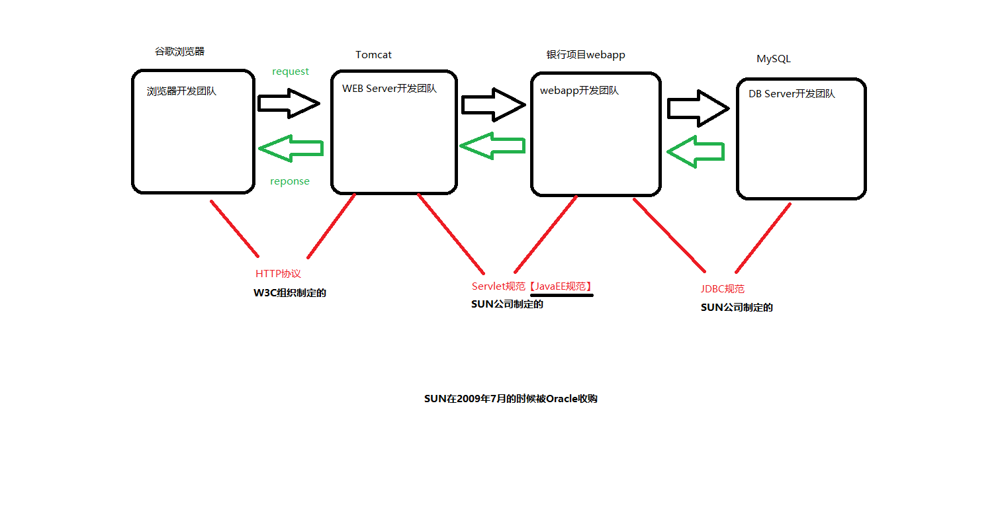
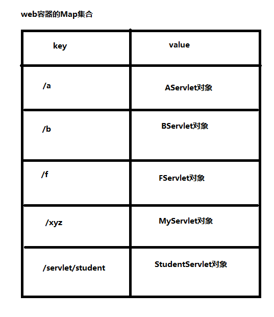

# 一、B/S结构系统的角色与协议
* 1、一个请求路径对应一个Servlet程序
* 2、角色
````
浏览器
WEB Server
DB Server
webapp(javaWeb程序员开发)
````
* 3、角色与角色之间的协议
````
webapp的开发团队 和 WEB Server的开发团队 之间有一套规范: JavaEE规范之一Servlet规范。
    Servlet规范: WEB Server 和 webapp解耦合。
Browser 和 WebServer之间有一套传输协议：HTTP协议。（超文本传输协议。）
webapp开发团队 和 DB Server的开发团队之间有一套规范：JDBC规范。
````

# 二、模拟Servlet本质
* 1、模拟Servlet接口
````
public interface Servlet {

    void service();
}
````
* 2、模拟Webapp的开发者
````
public class UserListServlet implements Servlet{
    @Override
    public void service() {
        System.out.println("UserListServlet service...");
    }
}

public class UserLoginServlet implements Servlet{
    @Override
    public void service() {
        System.out.println("UserLoginServlet service...");
    }
}

public class BankServlet implements Servlet{
    @Override
    public void service() {
        System.out.println("BankServlet service...");
    }
}
````
* 3、配置文件
````
/aaaa=com.jch.servlet.UserListServlet
/bbbb=com.jch.servlet.UserLoginServlet
/cccc=com.jch.servlet.BankServlet
````
* 4、模拟Tomcat服务器
````
import java.io.InputStream;
import java.util.Properties;
import java.util.Scanner;

public class Tomcat {
    public static void main(String[] args){
        System.out.println("Tomcat服务器启动成功, 开始接收用户访问");

        System.out.println("请输入访问路径: ");
        Scanner a = new Scanner(System.in);

        //用户请求路径
        String key = a.nextLine();

        //根据请求路径找servlet
        try {
            InputStream fis = Tomcat.class.getResourceAsStream("web.properties");
            Properties pro = new Properties();
            pro.load(fis);
            fis.close();
            String className = pro.getProperty(key);
            Class clazz = Class.forName(className);
            Object obj = clazz.newInstance();

            Servlet servlet = (Servlet) obj;
            servlet.service();
        } catch (Exception e) {
            e.printStackTrace();
        }
    }
}
````
# 三、开发一个带有Servlet（Java小程序）的webapp（重点）
* 1、开发步骤
````
第一步: 在webapps目录下新建一个目录，起名crm(这个crm就是webapp的名字)
第二步: 在webapp的根下新建一个目录：WEB-INF
第三步: 在WEB-INF目录下新建一个目录：classes (存放的是Java程序编译之后的class文件)
第四步: 在WEB-INF目录下新建一个目录：lib (存放第三方的jar包)
第五步: 在WEB-INF目录下新建一个文件：web.xml (web.xml文件就是一个配置文件，在这个配置文件中描述了请求路径和Servlet类之间的对照关系。)

<!-- 建议复制,不用手写 -->
<?xml version="1.0" encoding="UTF-8"?>

<web-app xmlns="https://jakarta.ee/xml/ns/jakartaee"
  xmlns:xsi="http://www.w3.org/2001/XMLSchema-instance"
  xsi:schemaLocation="https://jakarta.ee/xml/ns/jakartaee
                      https://jakarta.ee/xml/ns/jakartaee/web-app_5_0.xsd"
  version="5.0"
  metadata-complete="true">
</web-app>

第六步：编写一个Java程序，这个小Java程序也不能随意开发，这个小java程序必须实现Servlet接口。
    这个Servlet接口不在JDK当中。(因为Servlet不是JavaSE了。Servlet属于JavaEE，是另外的一套类库。)
    Servlet接口（Servlet.class文件）是Oracle提供的。(最原始的是sun公司提供的。)
    Servlet接口是JavaEE的规范中的一员。
    Tomcat服务器实现了Servlet规范，所以Tomcat服务器也需要使用Servlet接口。Tomcat服务器中应该有这个接口，Tomcat服务器的CATALINA_HOME\lib目录下有一个servlet-api.jar，解压这个servlet-api.jar之后，你会看到里面有一个Servlet.class文件。
第七步：编译我们编写的HelloServlet

import javax.servlet.*;
import java.io.IOException;

public class HelloServlet implements Servlet {
    @Override
    public void init(ServletConfig servletConfig) throws ServletException {

    }

    @Override
    public ServletConfig getServletConfig() {
        return null;
    }

    @Override
    public void service(ServletRequest servletRequest, ServletResponse servletResponse) throws ServletException, IOException {
        System.out.println("My First Servlet, Hello Servlet");
    }

    @Override
    public String getServletInfo() {
        return null;
    }

    @Override
    public void destroy() {

    }
}
第八步: 将以上编译之后的HelloServlet.class文件拷贝到WEB-INF\classes目录下
第九步: 在web.xml文件中编写配置信息，让“请求路径”和“Servlet类名”关联在一起。(在web.xml文件中注册Servlet类)
<?xml version="1.0" encoding="UTF-8"?>
<web-app xmlns="http://xmlns.jcp.org/xml/ns/javaee"
  xmlns:xsi="http://www.w3.org/2001/XMLSchema-instance"
  xsi:schemaLocation="http://xmlns.jcp.org/xml/ns/javaee
                      http://xmlns.jcp.org/xml/ns/javaee/web-app_4_0.xsd"
  version="4.0"
  metadata-complete="true">
	<!-- servlet描述信息 -->
	<servlet>
		<servlet-name>HelloServlet</servlet-name>
		<servlet-class>com.jch.HelloServlet</servlet-class>
	</servlet>
	<!-- servlet映射信息 -->
	<servlet-mapping>
		<servlet-name>HelloServlet</servlet-name>
		<url-pattern>/Hello</url-pattern>
	</servlet-mapping>
</web-app>
第十步: 启动Tomcat,打开浏览器，在浏览器地址栏上输入一个url，
    这个URL必须是http://localhost:8080/crm/Hello
    crm是项目名,/Hello是上面的url-pattern
第十一步: 浏览器上编写的路径太复杂，可以使用超链接。(非常重要：html页面只能放到WEB-INF目录外面。)
<!DOCTYPE html>
<html>
<head>
    <title>index page</title>
</head>
<body>
    <a href="/crm/Hello">Hello</a>
</body>
</html>
````
* 2、webapp目录结构
````
webapproot
     |------WEB-INF
     		  |------classes(存放字节码)
     		  |------lib(第三方jar包)
     		  |------web.xml(注册Servlet)
     |------html
     |------css
     |------javascript
     |------image
     ....
````
* 3、浏览器发送请求，到最终服务器调用Servlet中的过程
````
浏览器发送请求，到最终服务器调用Servlet中的方法，是怎样的一个过程？（以下这个过程描述的很粗糙。其中还有很多步骤我省略了。）

用户输入URL，或者直接点击超链接：http://127.0.0.1:8080/crm/Hello
然后Tomcat服务器接收到请求，截取路径：/crm/Hello
Tomcat服务器找到crm项目
Tomcat服务器在web.xml文件中查找/HelloServlet 对应的Servlet是：com.jch.HelloServlet
Tomcat服务器通过反射机制，创建com.jch.HelloServlet的对象。
Tomcat服务器调用com.jch.HelloServlet对象的service方法。
````
* 4、向客户端相应内容
````
import javax.servlet.*;
import java.io.IOException;
import java.io.PrintWriter;

public class HelloServlet implements Servlet {
    @Override
    public void init(ServletConfig servletConfig) throws ServletException {

    }

    @Override
    public ServletConfig getServletConfig() {
        return null;
    }

    @Override
    public void service(ServletRequest servletRequest, ServletResponse servletResponse) throws ServletException, IOException {
        // 向控制台打印输出
        System.out.println("My First Servlet, Hello Servlet");
        // 设置响应的内容类型是普通文本或html代码
        // 需要在获取流对象之前设置，有效。
        // 响应到浏览器出现中文乱码，可以指定字符集text/html;charset=UTF-8
        servletResponse.setContentType("text/html");
        PrintWriter out = servletResponse.getWriter();
        out.print("Hello Servlet, You are my first servlet!");
        // 浏览器是能够识别html代码
        out.print("<h1>Hello Servlet</h1>");
        /**
         * 刷新和关闭都由Tomcat做
         * out.flush();
         * out.close();
         */
    }

    @Override
    public String getServletInfo() {
        return null;
    }

    @Override
    public void destroy() {

    }
}
````
# 四、在Servlet中连接数据库
* 1、编写Servlet程序
````
import javax.servlet.*;
import java.io.IOException;
import java.io.PrintWriter;
import java.sql.*;

public class StudentServlet implements Servlet {
    @Override
    public void init(ServletConfig servletConfig) throws ServletException {

    }

    @Override
    public ServletConfig getServletConfig() {
        return null;
    }

    @Override
    public void service(ServletRequest servletRequest, ServletResponse servletResponse) throws ServletException, IOException {
        servletResponse.setContentType("text/html");
        PrintWriter out = servletResponse.getWriter();

        Connection connection = null;
        PreparedStatement ps = null;
        ResultSet rs = null;
        try {
            //注册驱动
            Class.forName("com.mysql.jdbc.Driver");
            //获取连接
            String url = "jdbc:mysql://localhost:3306/javaweb";
            String user = "root";
            String password = "root";
            connection = DriverManager.getConnection(url, user, password);
            String sql = "select no,name from t_student";
            ps = connection.prepareStatement(sql);
            rs = ps.executeQuery();
            while (rs.next()) {
                String no = rs.getString("no");
                String name = rs.getString("name");
                //System.out.println("no: " + no + " name: " + name);
                out.print("no: " + no + " name: " + name + "<br>");
            }
            //获取预编译的数据库操作对象
            //执行SQL
            //处理查询结果集
        } catch(Exception e) {
            e.printStackTrace();
        } finally {
            if (rs != null) {
                try {
                    rs.close();
                } catch (SQLException e) {
                    e.printStackTrace();
                }
            }
            if (ps != null) {
                try {
                    ps.close();
                } catch (SQLException e) {
                    e.printStackTrace();
                }
            }
            if (connection != null) {
                try {
                    connection.close();
                } catch (SQLException e) {
                    e.printStackTrace();
                }
            }
        }
    }

    @Override
    public String getServletInfo() {
        return null;
    }

    @Override
    public void destroy() {

    }
}
````
* 2、jar包放到WEB-INF/lib下
mysql-connector-j-8.0.32.jar
* 3、编译生成字节码文件放到classes下
StudentServlet.class
* 4、更改index.html
````
<!DOCTYPE html>
<html>
<head>
    <title>index page</title>
</head>
<body>
    <a href="/crm/Hello">Hello</a>
    <br>
    <a href="/crm/Student">Student</a>
</body>
</html>
````
* 5、修改web.xml
````
<?xml version="1.0" encoding="UTF-8"?>
<web-app xmlns="http://xmlns.jcp.org/xml/ns/javaee"
  xmlns:xsi="http://www.w3.org/2001/XMLSchema-instance"
  xsi:schemaLocation="http://xmlns.jcp.org/xml/ns/javaee
                      http://xmlns.jcp.org/xml/ns/javaee/web-app_4_0.xsd"
  version="4.0"
  metadata-complete="true">
	<!-- servlet描述信息 -->
	<servlet>
		<servlet-name>HelloServlet</servlet-name>
		<servlet-class>com.jch.HelloServlet</servlet-class>
	</servlet>
	<servlet>
		<servlet-name>StudentServlet</servlet-name>
		<servlet-class>com.jch.StudentServlet</servlet-class>
	</servlet>
	<!-- servlet映射信息 -->
	<servlet-mapping>
		<servlet-name>HelloServlet</servlet-name>
		<url-pattern>/Hello</url-pattern>
	</servlet-mapping>
	<servlet-mapping>
		<servlet-name>StudentServlet</servlet-name>
		<url-pattern>/Student</url-pattern>
	</servlet-mapping>
</web-app>
````
# 五、在IDEA中开发Servlet
* 1、新建普通模块
* 2、Add Framework Support

* 3、添加jar包

* 4、编写Servlet(StudentServlet)
````
package com.jch.servlet01;

import javax.servlet.*;
import java.io.IOException;
import java.io.PrintWriter;
import java.sql.*;

public class StudentServlet implements Servlet {

    @Override
    public void init(ServletConfig servletConfig) throws ServletException {

    }

    @Override
    public ServletConfig getServletConfig() {
        return null;
    }

    @Override
    public void service(ServletRequest servletRequest, ServletResponse servletResponse) throws ServletException, IOException {
        // 响应到浏览器出现中文乱码，可以指定字符集text/html;charset=UTF-8
        servletResponse.setContentType("text/html;charset=UTF-8");
        PrintWriter out = servletResponse.getWriter();

        Connection connection = null;
        PreparedStatement ps = null;
        ResultSet rs = null;
        try {
            //注册驱动
            Class.forName("com.mysql.jdbc.Driver");
            //获取连接
            String url = "jdbc:mysql://localhost:3306/javaweb";
            String user = "root";
            String password = "root";
            connection = DriverManager.getConnection(url, user, password);
            String sql = "select no,name from t_student";
            ps = connection.prepareStatement(sql);
            rs = ps.executeQuery();
            while (rs.next()) {
                String no = rs.getString("no");
                String name = rs.getString("name");
                //System.out.println("no: " + no + " name: " + name);
                out.print("no: " + no + " name: " + name + "<br>");
            }
            //获取预编译的数据库操作对象
            //执行SQL
            //处理查询结果集
        } catch(Exception e) {
            e.printStackTrace();
        } finally {
            if (rs != null) {
                try {
                    rs.close();
                } catch (SQLException e) {
                    e.printStackTrace();
                }
            }
            if (ps != null) {
                try {
                    ps.close();
                } catch (SQLException e) {
                    e.printStackTrace();
                }
            }
            if (connection != null) {
                try {
                    connection.close();
                } catch (SQLException e) {
                    e.printStackTrace();
                }
            }
        }
    }

    @Override
    public String getServletInfo() {
        return null;
    }

    @Override
    public void destroy() {

    }
}
````
* 5、在WEB-INF目录下新建了一个子目录：lib（这个目录名可不能随意，必须是全部小写的lib），并且将连接数据库的驱动jar包放到lib目录下。
* 6、在web.xml文件中完成StudentServlet类的注册。(请求路径和Servlet之间对应起来)
````
<?xml version="1.0" encoding="UTF-8"?>
<web-app xmlns="http://xmlns.jcp.org/xml/ns/javaee"
         xmlns:xsi="http://www.w3.org/2001/XMLSchema-instance"
         xsi:schemaLocation="http://xmlns.jcp.org/xml/ns/javaee http://xmlns.jcp.org/xml/ns/javaee/web-app_4_0.xsd"
         version="4.0">
    <servlet>
        <servlet-name>StudentServlet</servlet-name>
        <servlet-class>com.jch.servlet01.StudentServlet</servlet-class>
    </servlet>
    <servlet-mapping>
        <servlet-name>StudentServlet</servlet-name>
        <url-pattern>/StudentList</url-pattern>
    </servlet-mapping>
</web-app>
````
* 7、给一个html页面student.html,这个文件不能放到WEB-INF目录里面,只能放到WEB-INF目录外面。
````
<!DOCTYPE html>
<html lang="en">
<head>
    <meta charset="UTF-8">
    <title>student page</title>
</head>
<body>
    <!-- 无法动态获取项目名 -->
    <a href="/servlet01/StudentList">student list</a>
</body>
</html>
````
* 8、让IDEA工具去关联Tomcat服务器。关联的过程当中将webapp部署到Tomcat服务器当中
````
1、IDEA工具右上角，绿色小锤子右边有一个：Add 
2、左上角加号，点击Tomcat Server --> local
3、在弹出的界面中设置服务器Server的参数
4、在当前窗口中有一个Deployment(点击这个用来部署webapp)
5、修改 Application context为：/servlet01
````
# 六、Servlet对象的生命周期
* 1、Servlet对象的生命周期表示：一个Servlet对象从出生在最后的死亡，整个过程是怎样的。
* 2、Servlet对象维护
````
1、Servlet对象的创建，对象上方法的调用，对象最终的销毁，Javaweb程序员是无权干预的。
2、Servlet对象的生命周期是由Tomcat服务器（WEB Server）全权负责的。
3、Tomcat服务器通常我们又称为：WEB容器。（这个叫法你要知道【WEB Container】）
4、WEB容器来管理Servlet对象的死活。
````
* 3、自己new的Servlet对象
````
我们自己new的Servlet对象是不受WEB容器管理的。
WEB容器创建的Servlet对象，这些Servlet对象都会被放到一个集合当中（HashMap），只有放到这个HashMap集合中的Servlet才能够被WEB容器管理，自己new的Servlet对象不会被WEB容器管理。（自己new的Servlet对象不在容器当中）
web容器底层应该有一个HashMap这样的集合，在这个集合当中存储了Servlet对象和请求路径之间的关系
````

* 4、服务器在启动的Servlet对象有没有被创建出来(默认情况下)
````
在Servlet中提供一个无参数的构造方法，启动服务器的时候看看构造方法是否执行。
经过测试得出结论：默认情况下，服务器在启动的时候Servlet对象并不会被实例化。
这个设计是合理的。用户没有发送请求之前，如果提前创建出来所有的Servlet对象，必然是耗费内存的，并且创建出来的Servlet如果一直没有用户访问，显然这个Servlet对象是一个废物，没必要先创建。
````
* 5、服务器启动的时候创建Servlet对象
````
<load-on-startup>整数</load-on-startup>
数字越小优先级越高

<?xml version="1.0" encoding="UTF-8"?>
<web-app xmlns="http://xmlns.jcp.org/xml/ns/javaee"
         xmlns:xsi="http://www.w3.org/2001/XMLSchema-instance"
         xsi:schemaLocation="http://xmlns.jcp.org/xml/ns/javaee http://xmlns.jcp.org/xml/ns/javaee/web-app_4_0.xsd"
         version="4.0">
    <servlet>
        <servlet-name>aservlet</servlet-name>
        <servlet-class>com.jch.servlet02.AServlet</servlet-class>

        <load-on-startup>1</load-on-startup>
    </servlet>
    <servlet>
        <servlet-name>bservlet</servlet-name>
        <servlet-class>com.jch.servlet02.BServlet</servlet-class>
        <load-on-startup>0</load-on-startup>
    </servlet>
    <servlet-mapping>
        <servlet-name>aservlet</servlet-name>
        <url-pattern>/a</url-pattern>
    </servlet-mapping>
    <servlet-mapping>
        <servlet-name>bservlet</servlet-name>
        <url-pattern>/b</url-pattern>
    </servlet-mapping>
</web-app>
````
* 6、Servlet对象生命周期
````
package com.jch.servlet02;

import javax.servlet.*;
import java.io.IOException;

public class AServlet implements Servlet {
    public AServlet() {
        System.out.println("AServlet 无参数构造方法执行了");
    }

    @Override
    public void init(ServletConfig servletConfig) throws ServletException {
        System.out.println("AServlet init method execute");
    }

    @Override
    public ServletConfig getServletConfig() {
        return null;
    }

    @Override
    public void service(ServletRequest servletRequest, ServletResponse servletResponse) throws ServletException, IOException {
        System.out.println("AServlet service method execute");
    }

    @Override
    public String getServletInfo() {
        return null;
    }

    @Override
    public void destroy() {
        System.out.println("AServlet destroy method execute");
    }
}
````
````
1、默认情况下服务器启动的时候AServlet对象并没有被实例化
2、用户发送第一次请求的时候，控制台输出了以下内容
    AServlet 无参数构造方法执行了
    AServlet init method execute
    AServlet service method execute
3、根据以上输出内容得出结论：
    用户在发送第一次请求的时候Servlet对象被实例化（AServlet的构造方法被执行了。并且执行的是无参数构造方法。）
    AServlet对象被创建出来之后，Tomcat服务器马上调用了AServlet对象的init方法。（init方法在执行的时候，AServlet对象已经存在了。已经被创建出来了。）
    用户发送第一次请求的时候，init方法执行之后，Tomcat服务器马上调用AServlet对象的service方法。
4、用户继续发送第二次请求，控制台输出了以下内容
    AServlet service method execute
5、用户在发送第二次，或者第三次，Servlet对象并没有新建，还是使用之前创建好的Servlet对象，直接调用该Servlet对象的service方法，这说明：
    第一：Servlet对象是单例的（单实例的。但是要注意：Servlet对象是单实例的，但是Servlet类并不符合单例模式。我们称之为假单例。之所以单例是因为Servlet对象的创建我们javaweb程序员管不着，这个对象的创建只能是Tomcat来说了算，Tomcat只创建了一个，所以导致了单例，但是属于假单例。真单例模式，构造方法是私有化的。）
    第二：无参数构造方法、init方法只在第一次用户发送请求的时候执行。也就是说无参数构造方法只执行一次。init方法也只被Tomcat服务器调用一次。
6、关闭服务器的时候，控制台输出了以下内容
    AServlet destroy method execute
7、总结
    Servlet的destroy方法只被Tomcat服务器调用一次。
    destroy方法是在什么时候被调用的？
        在服务器关闭的时候。
        因为服务器关闭的时候要销毁AServlet对象的内存。
        服务器在销毁AServlet对象内存之前，Tomcat服务器会自动调用AServlet对象的destroy方法。
    destroy方法执行的时候AServlet对象还在，没有被销毁。destroy方法执行结束之后，AServlet对象的内存才会被Tomcat释放。
````
````
当我们Servlet类中编写一个有参数的构造方法，如果没有手动编写无参数构造方法会出现什么问题？
    报错了：500错误。
    注意：500是一个HTTP协议的错误状态码。
    500一般情况下是因为服务器端的Java程序出现了异常。（服务器端的错误都是500错误：服务器内部错误。）
    如果没有无参数的构造方法，会导致出现500错误，无法实例化Servlet对象。
    所以，一定要注意：在Servlet开发当中，不建议程序员来定义构造方法，因为定义不当，一不小心就会导致无法实例化Servlet对象。
Servlet的无参数构造方法是在对象第一次创建的时候执行，并且只执行一次。init方法也是在对象第一次创建的时候执行，并且只执行一次。那么这个无参数构造方法可以代替掉init方法吗？
    不能。
    Servlet规范中有要求，作为javaweb程序员，编写Servlet类的时候，不建议手动编写构造方法，因为编写构造方法，很容易让无参数构造方法消失，这个操作可能会导致Servlet对象无法实例化。所以init方法是有存在的必要的。
我们编写一个Servlet类直接实现Servlet接口有什么缺点？
    我们只需要service方法，其他方法大部分情况下是不需要使用的。代码很丑陋。
````
# 七、适配器设计模式Adapter实现Servlet接口
* 1、编写一个GenericServlet类，这个类是一个抽象类，其中有一个抽象方法service。
````
GenericServlet实现Servlet接口。
GenericServlet是一个适配器。
以后编写的所有Servlet类继承GenericServlet，重写service方法即可。不需要每次都要实现所有的抽象方法
````
````
package com.jch.servlet02;

import javax.servlet.*;
import java.io.IOException;

/**
 * 编写一个标准通用的Servlet，起名：GenericServlet
 * 以后所有的Servlet类都不要直接实现Servlet接口了。
 * 以后所有的Servlet类都要继承GenericServlet类。
 * GenericServlet 就是一个适配器。
 */
public abstract class GenericServlet implements Servlet {

    @Override
    public void init(ServletConfig servletConfig) throws ServletException {

    }

    @Override
    public ServletConfig getServletConfig() {
        return null;
    }

    /**
     *  抽象方法，这个方法最常用。所以要求子类必须实现service方法。
     * @param servletRequest
     * @param servletResponse
     * @throws ServletException
     * @throws IOException
     */
    @Override
    public abstract void service(ServletRequest servletRequest, ServletResponse servletResponse) throws ServletException, IOException;

    @Override
    public String getServletInfo() {
        return null;
    }

    @Override
    public void destroy() {

    }
}
````
````
package com.jch.adapter;

public class CustomerService extends CustomerAdapter{

    @Override
    public void m2() {

    }
}
````
* 2、GenericServlet类改造
````
package com.jch.servlet02;

import javax.servlet.*;
import java.io.IOException;

/**
 * 编写一个标准通用的Servlet，起名：GenericServlet
 * 以后所有的Servlet类都不要直接实现Servlet接口了。
 * 以后所有的Servlet类都要继承GenericServlet类。
 * GenericServlet 就是一个适配器。
 */
public abstract class GenericServlet implements Servlet {

    private ServletConfig servletConfig;

    // 防止子类重写该方法，将该方法声明为final，提供一个单独的init方法是供子类重写的，在该方法中调用允许子类重写的init方法
    @Override
    public final void init(ServletConfig servletConfig) throws ServletException {
        this.servletConfig = servletConfig;

        this.init();
    }

    /**
     * 这个init方法是供子类重写的。
     */
    public void init(){

    }

    @Override
    public ServletConfig getServletConfig() {
        return servletConfig;
    }

    /**
     *  抽象方法，这个方法最常用。所以要求子类必须实现service方法。
     * @param servletRequest
     * @param servletResponse
     * @throws ServletException
     * @throws IOException
     */
    @Override
    public abstract void service(ServletRequest servletRequest, ServletResponse servletResponse) throws ServletException, IOException;

    @Override
    public String getServletInfo() {
        return null;
    }

    @Override
    public void destroy() {

    }
}
````
# 八、ServletConfig
````
package com.jch.javaweb;

import javax.servlet.*;
import java.io.IOException;
import java.io.PrintWriter;
import java.util.Enumeration;

/**
 * ServletConfig
 *   1. ServletConfig是什么？
 *      javax.servlet.ServletConfig
 *      显然ServletConfig是Servlet规范中的一员。
 *      ServletConfig是一个接口。（javax.servlet.Servlet是一个接口。）
 *   2. 谁去实现了这个接口呢？ WEB服务器实现了
 *      public class org.apache.catalina.core.StandardWrapperFacade implements ServletConfig {}
 *      结论：Tomcat服务器实现了ServletConfig接口。
 *      思考：如果把Tomcat服务器换成jetty服务器，输出ServletConfig对象的时候，还是这个结果吗？
 *          不一定一样，包名类名可能和Tomcat不一样。但是他们都实现了ServletConfig这个规范。
 *   3. 一个Servlet对象中有一个ServletConfig对象。（Servlet和ServletConfig对象是一对一。）
 *      100个Servlet，就应该有100个ServletConfig对象。
 *   4. ServletConfig对象是谁创建的？在什么时候创建的？
 *      Tomcat服务器（WEB服务器）创建了ServletConfig对象。
 *      在创建Servlet对象的时候，同时创建ServletConfig对象。
 *   5. ServletConfig接口到底是干啥的？有什么用呢？
 *      Config是哪个单词的缩写？
 *          Configuration
 *      ServletConfig对象被翻译为：Servlet对象的配置信息对象。
 *      一个Servlet对象就有一个配置信息对象。
 *      两个Servlet对象就有两个配置信息对象。
 *
 *   6. ServletConfig对象中到底包装了什么信息呢？
 *      <servlet>
 *         <servlet-name>ConfigTestServlet</servlet-name>
 *         <servlet-class>com.jch.javaweb.ConfigTestServlet</servlet-class>
 *     </servlet>
 *     ServletConfig对象中包装的信息是：
 *          web.xml文件中<servlet></servlet>标签的配置信息。
 *
 *     Tomcat解析web.xml文件，将web.xml文件中<servlet></servlet>标签中的配置信息自动包装到ServletConfig对象中。
 *
 *   7. ServletConfig接口中有哪些方法？
 *      <servlet>
 *         <servlet-name>ConfigTestServlet</servlet-name>
 *         <servlet-class>com.jch.javaweb.ConfigTestServlet</servlet-class>
 *         <!--这里是可以配置一个Servlet对象的初始化信息的。-->
 *         <init-param>
 *             <param-name>driver</param-name>
 *             <param-value>com.mysql.jdbc.Driver</param-value>
 *         </init-param>
 *         <init-param>
 *             <param-name>url</param-name>
 *             <param-value>jdbc:mysql://localhost:3306/javaweb</param-value>
 *         </init-param>
 *         <init-param>
 *             <param-name>user</param-name>
 *             <param-value>root</param-value>
 *         </init-param>
 *         <init-param>
 *             <param-name>password</param-name>
 *             <param-value>root</param-value>
 *         </init-param>
 *     </servlet>
 *     以上<servlet></servlet>标签中的<init-param></init-param>是初始化参数。这个初始化参数信息会自动被小猫咪封装到ServletConfig对象当中。
 *  8. ServletConfig接口中有4个方法：
 *      第1个方法：
 *          public String getInitParameter(String name);
 *      第2个方法：
 *          public Enumeration<String> getInitParameterNames();
 *      第3个方法：
 *          public ServletContext getServletContext();
 *      第4个方法：
 *          public String getServletName();
 *
 *      以上的4个方法，在自己编写的Servlet类当中也可以使用this去调用。（这个Servlet继承了GenericServlet）
 */
public class ConfigTestServlet extends GenericServlet {
    @Override
    public void service(ServletRequest servletRequest, ServletResponse servletResponse) throws ServletException, IOException {
        servletResponse.setContentType("text/html; charset=UTF-8");
        PrintWriter out = servletResponse.getWriter();
        //获取ServlettConfig对象
        ServletConfig servletConfig = this.getServletConfig();
        //输出对象
        out.print("ServletConfig对象是: " + servletConfig);
        out.print("<br>");
        //获取ServletName
        out.print(servletConfig.getServletName());
        out.print("<br>");
        // 通过ServletConfig对象的两个方法，可以获取到web.xml文件中的初始化参数配置信息。
        // java.util.Enumeration<java.lang.String>	getInitParameterNames() 获取所有的初始化参数的name
        // java.lang.String	getInitParameter(java.lang.String name) 通过初始化参数的name获取value
        Enumeration<String> initParameterNames = servletConfig.getInitParameterNames();
        //遍历
        while (initParameterNames.hasMoreElements()) {
            String parameterName = initParameterNames.nextElement();
            String initParameter = servletConfig.getInitParameter(parameterName);
            out.print(parameterName + " : " + initParameter);
            out.print("<br>");
        }
        // ServletConfig的四个方法在自己编写的Servlet类当中也可以使用this去调用。
        // （这个Servlet继承了GenericServlet，GenericServlet实现了ServletConfig接口）
        // 实际上获取一个Servlet对象的初始化参数，可以不用获取ServletConfig对象。直接通过this也可以。
        Enumeration<String> names = this.getInitParameterNames();
        while (names.hasMoreElements()) {
            String name = names.nextElement();
            String initParameter = this.getInitParameter(name);
            out.print(name + " : " + initParameter);
            out.print("<br>");
        }
    }
}
````
# 九、ServletContext
* 1、获取ServletContext对象
````
// 第一种方式：通过ServletConfig对象获取ServletContext对象。
ServletContext application = servletConfig.getServletContext();
out.print(application);
out.print("<br>");

// 第二种方式：通过this也可以获取ServletContext对象。
ServletContext application2 = this.getServletContext();
out.print(application2);
out.print("<br>");
````
* 2、ServletContext理解
````
ServletContext
    1. ServletContext是什么？
        ServletContext是接口，是Servlet规范中的一员。
    2. ServletContext是谁实现的？
        Tomcat服务器(WEB服务器)实现了ServletContext接口。
        public class org.apache.catalina.core.ApplicationContextFacade implements ServletContext {}
    3. ServletContext对象是谁创建的？在什么时候创建的？
        ServletContext对象在WEB服务器启动的时候创建。
        ServletContext对象是WEB服务器创建的。
        对于一个webapp来说，ServletContext对象只有一个。
        一个<web-app></web-app>标签对应一个ServletContext对象
        ServletContext对象在服务器关闭的时候销毁。
    4. ServletContext怎么理解？
        context是什么意思？
            Servlet对象的环境对象。(Servlet对象的上下文对象)
        ServletContext对象其实对应的就是整个web.xml文件。
        放在ServletContext对象当中的数据，所有Servlet一定是共享的。
        Tomcat是一个容器，一个容器当中可以放多个webapp，一个webapp对应一个ServletContext对象。
````
* 3、ServletContext接口中有哪些常用的方法
````
web.xml
    <context-param>
        <param-name>pageSize</param-name>
        <param-value>10</param-value>
    </context-param>
    <context-param>
        <param-name>startIndex</param-name>
        <param-value>0</param-value>
    </context-param>
````
````
public Enumeration<String> getInitParameterNames(); // 获取所有的初始化参数的name
public String getInitParameter(String name); // 通过初始化参数的name获取value

public class AServlet extends GenericServlet {
    @Override
    public void service(ServletRequest servletRequest, ServletResponse servletResponse) throws ServletException, IOException {
        servletResponse.setContentType("text/html; charset=UTF-8");
        PrintWriter out = servletResponse.getWriter();
        ServletContext application  = this.getServletContext();

        Enumeration<String> initParameterNames = application.getInitParameterNames();
        while (initParameterNames.hasMoreElements()) {
            String name = initParameterNames.nextElement();
            String value = application.getInitParameter(name);
            out.print(name + " : " + value + "<br>");
        }
    }
}
````
````
public String getContextPath();// 获取应用的根路径

String contextPath = application.getContextPath();
out.print(contextPath + "<br>");
````
````
public String getRealPath(String path);// 获取文件的绝对路径(真实路径)

String realPath = application.getRealPath("/index.html");
out.print(realPath + "<br>");
````
````
// 通过ServletContext对象也是可以记录日志的
public void log(String message);
// 记录日志信息外，还记录异常信息，控制台不会发送异常，只是记录异常信息
public void log(String message, Throwable t);

application.log("test log");
int age = 17; // 17岁
// 当年龄小于18岁的时候，表示非法，记录日志
if(age < 18) {
    application.log("对不起，您未成年，请绕行！", new RuntimeException("小屁孩，快走开，不适合你！"));
}

这个日志会自动记录到 CATALINA_BASE: "C:\Users\28777\AppData\Local\JetBrains\IntelliJIdea2022.1\tomcat\tomcatname\log
Tomcat服务器的logs目录下都有哪些日志文件？
    catalina.2021-11-05.log 服务器端的java程序运行的控制台信息。
    localhost.2021-11-05.log ServletContext对象的log方法记录的日志信息存储到这个文件中。
    localhost_access_log.2021-11-05.txt 访问日志
````
````
// 存（怎么向ServletContext应用域中存数据）
public void setAttribute(String name, Object value); // map.put(k, v)
// 取（怎么从ServletContext应用域中取数据）
public Object getAttribute(String name); // Object v = map.get(k)
// 删（怎么删除ServletContext应用域中的数据）
public void removeAttribute(String name); // map.remove(k)

// 准备数据
User user = new User("jack", "123");
// 向ServletContext应用域当中存储数据
application.setAttribute("userObj", user);
// 取出来
Object userObj = application.getAttribute("userObj");
// 输出到浏览器
out.print(userObj + "<br>");
````