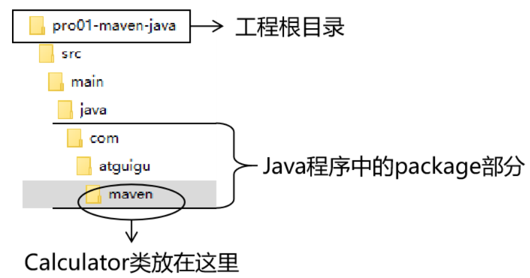
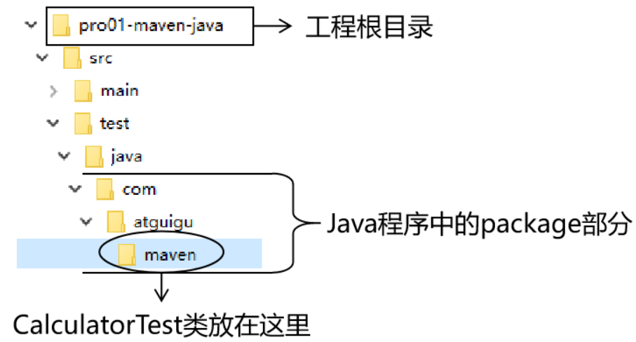
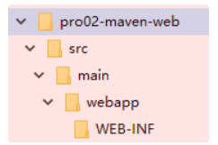

# 一、根据坐标创建 Maven工程
* 1、 Maven中的坐标
````
1、向量说明
使用三个『向量』在『Maven的仓库』中唯一的定位到一个『jar』包。

groupId：公司或组织的 id
artifactId：一个项目或者是项目中的一个模块的 id(更偏向于项目中的一个模块或一个没有进行拆分的项目)
version：版本号

2、三个向量的取值方式
groupId：公司或组织域名的倒序，通常也会加上项目名称(为了区别项目这一层)
例如：com.jch.maven
artifactId：模块的名称，将来作为 Maven 工程的工程名
version：模块的版本号，根据自己的需要设定
例如：SNAPSHOT 表示快照版本，正在迭代过程中，不稳定的版本
例如：RELEASE 表示正式版本
````
* 2、坐标和仓库中 jar 包的存储路径之间的对应关系
````
<groupId>javax.servlet</groupId>
<artifactId>servlet-api</artifactId>
<version>2.5</version>

上面坐标对应的 jar 包在 Maven 本地仓库中的位置：
Maven本地仓库根目录\javax\servlet\servlet-api\2.5\servlet-api-2.5.jar
````
* 3、实例
````
1、创建目录作为后面操作的工作空间
其实就是一个普通的目录，在这个目录下我们要去写代码、开发应用程序
例如：D:\maven-workspace\space

2、在工作空间目录下打开命令行窗口

3、 使用命令生成Maven工程
运行 mvn archetype:generate 命令

下面根据提示操作
Choose a number or apply filter (format: [groupId:]artifactId, case sensitive contains): 7:【直接回车，使用默认值】

Define value for property 'groupId': com.atguigu.maven

Define value for property 'artifactId': pro01-maven-java

Define value for property 'version' 1.0-SNAPSHOT: :【直接回车，使用默认值】

Define value for property 'package' com.atguigu.maven: :【直接回车，使用默认值】

Confirm properties configuration: groupId: com.atguigu.maven artifactId: pro01-maven-java version: 1.0-SNAPSHOT package: com.atguigu.maven Y: :【直接回车，表示确认。如果前面有输入错误，想要重新输入，则输入 N 再回车。】

选择创建项目的模式，默认选择7，快速开始
````
* 4、调整
````
Maven 默认生成的工程，对 junit 依赖的是较低的 3.8.1 版本，我们可以改成较适合的 4.12 版本。

在创建的工程的配置文件pom.xml中进行修改：

<!-- 依赖信息配置 -->
<!-- dependencies复数标签：里面包含dependency单数标签 -->
<dependencies>
  <!-- dependency单数标签：配置一个具体的依赖 -->
  <dependency>
    <!-- 通过坐标来依赖其他jar包 -->
    <groupId>junit</groupId>
    <artifactId>junit</artifactId>
    <version>4.12</version>
    
    <!-- 依赖的范围 -->
    <scope>test</scope>
  </dependency>
</dependencies>

动生成的 App.java 和 AppTest.java 可以删除。
````
* 5、自动生成的 pom.xml 解读
````
<!-- 根标签：project，表示对当前工程进行配置管理 -->
<project xmlns="http://maven.apache.org/POM/4.0.0" xmlns:xsi="http://www.w3.org/2001/XMLSchema-instance"
  xsi:schemaLocation="http://maven.apache.org/POM/4.0.0 http://maven.apache.org/xsd/maven-4.0.0.xsd">
  <!-- modelVersion标签：从Maven2开始固定为4.0.0 -->
  <!-- 表示当前pom.xml所采用的标签结构 -->
  <modelVersion>4.0.0</modelVersion>

  <!-- 当前Maven工程的坐标 -->
  <!-- groupId代表公司或组织开发的某一个项目 -->
  <groupId>com.jch.maven</groupId>
  <!-- artifactId表示项目下的某一个模块 -->
  <artifactId>pro01-maven-java</artifactId>
   <!-- version表示当前模块的版本 -->
  <version>1.0-SNAPSHOT</version>
  <!-- 当前Maven工程的打包方式，可选值有下面三种： -->
  <!-- 默认为jar -->
  <!-- jar：表示这个工程是一个Java工程，生成jar包  -->
  <!-- war：表示这个工程是一个Web工程，生成war包 -->
  <!-- pom：表示这个工程是“管理其他工程”的工程 -->
  <packaging>jar</packaging>

  <name>pro01-maven-java</name>
  <url>http://maven.apache.org</url>

  <!-- 在Maven中定义属性值 -->
  <!-- 标签名为属性名，标签的内容为属性值 -->
  <properties>
    <!-- 工程构建过程中读取源码时使用的字符集 -->
    <project.build.sourceEncoding>UTF-8</project.build.sourceEncoding>
  </properties>

  <!-- dependencies：配置依赖信息 -->
  <!-- 当前工程所依赖的jar包 -->
  <!-- 一个dependencies标签可以包含多个dependency -->
  <dependencies>
    <!-- dependency配置一个具体的依赖信息 -->
    <dependency>
      <!-- 在dependency标签内使用具体的坐标依赖我们需要的一个jar包 -->
      <!-- 导入哪个jar包就配置它的坐标信息即可 -->
      <groupId>junit</groupId>
      <artifactId>junit</artifactId>
      <version>4.12</version>
      <!-- scope标签配置依赖的范围 -->
      <scope>test</scope>
    </dependency>
  </dependencies>
</project>
````
* 6、Maven核心概念：POM
````
1、含义
POM：Project Object Model，项目对象模型。和 POM 类似的是：DOM（Document Object Model），文档对象模型。它们都是模型化思想的具体体现。

2、模型化思想
POM 表示将工程抽象为一个模型，再用程序中的对象来描述这个模型。这样我们就可以用程序来管理项目了。我们在开发过程中，最基本的做法就是将现实生活中的事物抽象为模型，然后封装模型相关的数据作为一个对象，这样就可以在程序中计算与现实事物相关的数据。

3、对应的配置文件
POM 理念集中体现在 Maven 工程根目录下 pom.xml 这个配置文件中。所以这个 pom.xml 配置文件就是 Maven 工程的核心配置文件。其实学习 Maven 就是学这个文件怎么配置，各个配置有什么用。
````
* 7、Maven核心概念：约定的目录结构

````
约定目录结构的意义
Maven 为了让构建过程能够尽可能自动化完成，所以必须约定目录结构的作用。例如：Maven 执行编译操作，必须先去 Java 源程序目录读取 Java 源代码，然后执行编译，最后把编译结果存放在 target 目录。

约定大于配置
Maven 对于目录结构这个问题，没有采用配置的方式，而是基于约定。这样会让我们在开发过程中非常方便。如果每次创建 Maven 工程后，还需要针对各个目录的位置进行详细的配置，那肯定非常麻烦。

目前开发领域的技术发展趋势就是：约定大于配置，配置大于编码。
````
# 二、在 Maven 工程中编写代码
* 1、主体程序

````
主体程序指的是被测试的程序，同时也是将来在项目中真正要使用的程序

package com.jch.maven;
  
public class Calculator {
  
  public int sum(int i, int j){
    return i + j;
  }
}
````
* 2、测试程序

````
package com.jch.maven;
  
import org.junit.Test;
import com.jch.maven.Calculator;
  
// 静态导入的效果是将Assert类中的静态资源导入当前类
// 这样一来，在当前类中就可以直接使用Assert类中的静态资源，不需要写类名
import static org.junit.Assert.*;
  
public class CalculatorTest{
  
  @Test
  public void testSum(){
    
    // 1.创建Calculator对象
    Calculator calculator = new Calculator();
    
    // 2.调用Calculator对象的方法，获取到程序运行实际的结果
    int actualResult = calculator.sum(5, 3);
    
    // 3.声明一个变量，表示程序运行期待的结果
    int expectedResult = 8;
    
    // 4.使用断言来判断实际结果和期待结果是否一致
    // 如果一致：测试通过，不会抛出异常
    // 如果不一致：抛出异常，测试失败
    assertEquals(expectedResult, actualResult);
    
  }
  
}
````
# 三、执行 Maven 的构建命令
* 1、要求
````
运行 Maven 中和构建操作相关的命令时，必须进入到 pom.xml 所在的目录。如果没有在 pom.xml 所在的目录运行 Maven 的构建命令，那么会看到下面的错误信息：

mvn -v 命令和构建操作无关，只要正确配置了 PATH，在任何目录下执行都可以。而构建相关的命令要在 pom.xml 所在目录下运行——操作哪个工程，就进入这个工程的 pom.xml 目录。
````
* 2、清理操作
````
mvn clean

效果：删除 target 目录
````
* 3、编译操作
````
主程序编译：mvn compile
测试程序编译：mvn test-compile

主体程序编译结果存放的目录：target/classes
测试程序编译结果存放的目录：target/test-classes
````
* 4、测试操作
````
mvn test

测试的报告存放的目录：target/surefire-reports
````
* 5、打包操作
````
mvn package

打包的结果——jar 包，存放的目录：target
````
* 6、安装操作
````
mvn install

安装的效果是将本地构建过程中生成的 jar 包存入 Maven 本地仓库。这个 jar 包在 Maven 仓库中的路径是根据它的坐标生成的。
````
# 四、创建Maven版的Web工程
* 1、说明
````
使用 mvn archetype:generate 命令生成 Web 工程时，需要使用一个专门的 archetype。这个专门生成 Web 工程骨架的 archetype 可以参照官网看到它的用法：

参数 archetypeGroupId、archetypeArtifactId、archetypeVersion 用来指定现在使用的 maven-archetype-webapp 的坐标。
````
* 2、操作
````
注意：如果在上一个工程的目录下执行 mvn archetype:generate 命令，那么 Maven 会报错：不能在一个非 pom 的工程下再创建其他工程。所以不要再刚才创建的工程里再创建新的工程，请回到工作空间根目录来操作。

然后运行生成工程的命令
mvn archetype:generate -DarchetypeGroupId=org.apache.maven.archetypes -DarchetypeArtifactId=maven-archetype-webapp -DarchetypeVersion=1.4
````
* 3、生成的pom.xml
````
确认打包的方式是war包形式

<packaging>war</packaging>
````
* 4、生成的Web工程的目录结构

````
webapp 目录下有 index.jsp

WEB-INF 目录下有 web.xml
````
* 5、创建 Servlet
````
1、在 main 目录下创建 java 目录
2、在 java 目录下创建 Servlet 类所在的包的目录
3、在包下创建 Servlet 类

package com.jch.maven;
  
import javax.servlet.http.HttpServlet;
import javax.servlet.http.HttpServletRequest;
import javax.servlet.http.HttpServletResponse;
import javax.servlet.ServletException;
import java.io.IOException;
  
public class HelloServlet extends HttpServlet{
  
  protected void doGet(HttpServletRequest request, HttpServletResponse response) throws ServletException, IOException {
    
    response.getWriter().write("hello maven web");
    
  }
  
}

4、在 web.xml 中注册 Servlet

<servlet>
    <servlet-name>helloServlet</servlet-name>
    <servlet-class>com.jch.maven.HelloServlet</servlet-class>
  </servlet>
  <servlet-mapping>
    <servlet-name>helloServlet</servlet-name>
    <url-pattern>/helloServlet</url-pattern>
  </servlet-mapping>
````
* 6、在 index.jsp 页面编写超链接
````
<html>
<body>
    <h2>Hello World!</h2>
    <a href="helloServlet">Access Servlet</a>
</body>
</html>
````
* 7、编译
````
此时直接执行 mvn compile 命令出错：

程序包 javax.servlet.http 不存在
程序包 javax.servlet 不存在
找不到符号
符号: 类 HttpServlet

上面的错误信息说明：我们的 Web 工程用到了 HttpServlet 这个类，而 HttpServlet 这个类属于 servlet-api.jar 这个 jar 包。此时我们说，Web 工程需要依赖 servlet-api.jar 包。
````
* 8、配置对 servlet-api.jar 包的依赖
````
<!-- https://mvnrepository.com/artifact/javax.servlet/javax.servlet-api -->
<dependency>
    <groupId>javax.servlet</groupId>
    <artifactId>javax.servlet-api</artifactId>
    <version>3.1.0</version>
    <scope>provided</scope>
</dependency>

把上面的信息加入 pom.xml。重新执行 mvn compile 命令。
````
* 9、 将 Web 工程打包为 war 包
````
运行 mvn package 命令
````
* 10、 将 war 包部署到 Tomcat 上运行
````
将 war 包复制到 Tomcat/webapps 目录下

Tomcat会自动解压war包
````
# 五、让Web工程依赖Java工程
* 1、观念
````
明确一个意识：从来只有 Web 工程依赖 Java 工程，没有反过来 Java 工程依赖 Web 工程。本质上来说，Web 工程依赖的 Java 工程其实就是 Web 工程里导入的 jar 包。最终 Java 工程会变成 jar 包，放在 Web 工程的 WEB-INF/lib 目录下。
````
* 2、操作
````
在 pro02-maven-web 工程的 pom.xml 中，找到 dependencies 标签，在 dependencies 标签中做如下配置：

<!-- 配置对Java工程pro01-maven-java的依赖 -->
<!-- 具体的配置方式：在dependency标签内使用坐标实现依赖 -->
<dependency>
  <groupId>com.jch.maven</groupId>
  <artifactId>pro01-maven-java</artifactId>
  <version>1.0-SNAPSHOT</version>
</dependency>

````
* 3、创建测试类
````
测试命令 mvn test

打包命令 mvn package

查看当前 Web 工程所依赖的 jar 包的列表 mvn dependency:list

以树形结构查看当前 Web 工程的依赖信息 mvn dependency:tree
````
# 六、测试依赖范围
````
1、依赖范围
标签的位置：dependencies/dependency/scope
标签的可选值：compile/test/provided/system/runtime/import

2、compile 和 test 对
	      main目录（空间）	test目录（空间）	开发过程（时间）	部署到服务器（时间）
compile	  有效	          有效	            有效	            有效
test	    无效	          有效	            有效	            无效

3、compile 和 provided 对比
	        main目录（空间）	test目录（空间）	开发过程（时间）	部署到服务器（时间）
compile	    有效	            有效	          有效	            有效
provided	  有效	            有效	          有效	            无效
````
# 七、测试依赖的传递性
````
在 A 依赖 B，B 依赖 C 的前提下，C 是否能够传递到 A，取决于 B 依赖 C 时使用的依赖范围。
  B 依赖 C 时使用 compile 范围：可以传递
  B 依赖 C 时使用 test 或 provided 范围：不能传递，所以需要这样的 jar 包时，就必须在需要的地方明确配置依赖才可以。
````
# 八、测试依赖的排除
* 1、概念
````
当 A 依赖 B，B 依赖 C 而且 C 可以传递到 A 的时候，A 不想要 C，需要在 A 里面把 C 排除掉。而往往这种情况都是为了避免 jar 包之间的冲突。
````
* 2、配置方式
````
<dependency>
  <groupId>com.jch.maven</groupId>
  <artifactId>pro01-maven-java</artifactId>
  <version>1.0-SNAPSHOT</version>
  <scope>compile</scope>
  <!-- 使用excludes标签配置依赖的排除  -->
  <!-- 排除com.jch.maven:pro01-maven-java:1.0-SNAPSHOT中不需要的依赖 -->
  <exclusions>
    <!-- 在exclude标签中配置一个具体的排除 -->
    <exclusion>
      <!-- 指定要排除的依赖的坐标（不需要写version） -->
      <!-- 不管哪个版本都会被排除 -->
      <groupId>commons-logging</groupId>
      <artifactId>commons-logging</artifactId>
    </exclusion>
  </exclusions>
</dependency>
````
# 九、继承
* 1、概念
````
Maven工程之间，A 工程继承 B 工程
  B 工程：父工程
  A 工程：子工程
本质上是 A 工程的 pom.xml 中的配置继承了 B 工程中 pom.xml 的配置。
````
* 2、作用
````
在父工程中统一管理项目中的依赖信息，具体来说是管理依赖信息的版本

它的背景是：
  对一个比较大型的项目进行了模块拆分。
  一个 project 下面，创建了很多个 module。
  每一个 module 都需要配置自己的依赖信息。

它背后的需求是:
  在每一个 module 中各自维护各自的依赖信息很容易发生出入，不易统一管理。
  使用同一个框架内的不同 jar 包，它们应该是同一个版本，所以整个项目中使用的框架版本需要统一。
  使用框架时所需要的 jar 包组合（或者说依赖信息组合）需要经过长期摸索和反复调试，最终确定一个可用组合。这个耗费很大精力总结出来的方案不应该在新的项目中重新摸索。

通过在父工程中为整个项目维护依赖信息的组合既保证了整个项目使用规范、准确的 jar 包；又能够将以往的经验沉淀下来，节约时间和精力。
````
* 3、操作
````
1、创建父工程
  <groupId>com.jch.maven</groupId>
  <artifactId>pro03-maven-parent</artifactId>
  <version>1.0-SNAPSHOT</version>

  <!-- 当前工程作为父工程，它要去管理子工程，所以打包方式必须是 pom -->
  <packaging>pom</packaging>

2、创建模块工程(子工程)
pro04-maven-module
pro05-maven-module
pro06-maven-module

3、查看被添加新内容的父工程 pom.xml
<modules>  
  <module>pro04-maven-module</module>
  <module>pro05-maven-module</module>
  <module>pro06-maven-module</module>
</modules>

4、解读子工程的pom.xml
<!-- 使用parent标签指定当前工程的父工程 -->
<parent>
  <!-- 父工程的坐标找到父工程 -->
  <groupId>com.atguigu.maven</groupId>
  <artifactId>pro03-maven-parent</artifactId>
  <version>1.0-SNAPSHOT</version>
</parent>

<!-- 子工程的坐标 -->
<!-- 如果子工程坐标中的groupId和version与父工程一致，那么可以省略 -->
<!-- <groupId>com.jch.maven</groupId> -->
<artifactId>pro04-maven-module</artifactId>
<!-- <version>1.0-SNAPSHOT</version> -->

5、在父工程中配置依赖的统一管理
<!-- 父工程统一管理依赖信息 -->
<!-- 使用dependencyManagement标签配置对依赖的管理 -->
<!-- 被管理的依赖并没有真正被引入到每个子工程 -->
<!-- 在子工程中还要指定依赖 -->
<dependencyManagement>
  <dependencies>
    <dependency>
      <groupId>org.springframework</groupId>
      <artifactId>spring-core</artifactId>
      <version>4.0.0.RELEASE</version>
    </dependency>
    <dependency>
      <groupId>org.springframework</groupId>
      <artifactId>spring-beans</artifactId>
      <version>4.0.0.RELEASE</version>
    </dependency>
    <dependency>
      <groupId>org.springframework</groupId>
      <artifactId>spring-context</artifactId>
      <version>4.0.0.RELEASE</version>
    </dependency>
    <dependency>
      <groupId>org.springframework</groupId>
      <artifactId>spring-expression</artifactId>
      <version>4.0.0.RELEASE</version>
    </dependency>
    <dependency>
      <groupId>org.springframework</groupId>
      <artifactId>spring-aop</artifactId>
      <version>4.0.0.RELEASE</version>
    </dependency>
  </dependencies>
</dependencyManagement>

4、 子工程中引用那些被父工程管理的依赖
<!-- 子工程引用父工程中的依赖信息时，可以把版本号去掉。  -->
<!-- 把版本号去掉就表示子工程中这个依赖的版本由父工程决定。 -->
<!-- 具体来说是由父工程的dependencyManagement来决定。 -->
<!-- 子工程没写版本号，依赖的版本为父工程中管理的依赖版本；子工程写了版本号，与父工程不一致，子工程的版本会覆盖父工程的版本 -->
<dependencies>
  <dependency>
    <groupId>org.springframework</groupId>
    <artifactId>spring-core</artifactId>
  </dependency>
  <dependency>
    <groupId>org.springframework</groupId>
    <artifactId>spring-beans</artifactId>
  </dependency>
  <dependency>
    <groupId>org.springframework</groupId>
    <artifactId>spring-context</artifactId>
  </dependency>
  <dependency>
    <groupId>org.springframework</groupId>
    <artifactId>spring-expression</artifactId>
  </dependency>
  <dependency>
    <groupId>org.springframework</groupId>
    <artifactId>spring-aop</artifactId>
  </dependency>
</dependencies>

5、在父工程中声明自定义属性
<!-- 通过自定义属性，统一指定Spring的版本 -->
<properties>
  <project.build.sourceEncoding>UTF-8</project.build.sourceEncoding>
  
  <!-- 自定义标签，维护Spring版本数据 -->
  <jch.spring.version>4.3.6.RELEASE</atguigu.jch.version>
</properties>

6、使用${}的形式来引用自定义的属性名
<dependency>
  <groupId>org.springframework</groupId>
  <artifactId>spring-core</artifactId>
  <version>${jch.spring.version}</version>
</dependency>
````
# 十、聚合
* 1、Maven 中的聚合
````
使用一个“总工程”将各个“模块工程”汇集起来，作为一个整体对应完整的项目
  项目：整体
  模块：部分

概念的对应关系：
从继承关系角度来看：
  父工程
  子工程
从聚合关系角度来看：
  总工程
  模块工程
````
* 2、聚合的配置
````
在总工程中配置 modules

<modules>  
  <module>pro04-maven-module</module>
  <module>pro05-maven-module</module>
  <module>pro06-maven-module</module>
</modules>
````
* 3、 依赖循环问题
````
如果 A 工程依赖 B 工程，B 工程依赖 C 工程，C 工程又反过来依赖 A 工程，那么在执行构建操作时会报下面的错误：

[ERROR] [ERROR] The projects in the reactor contain a cyclic reference:
````