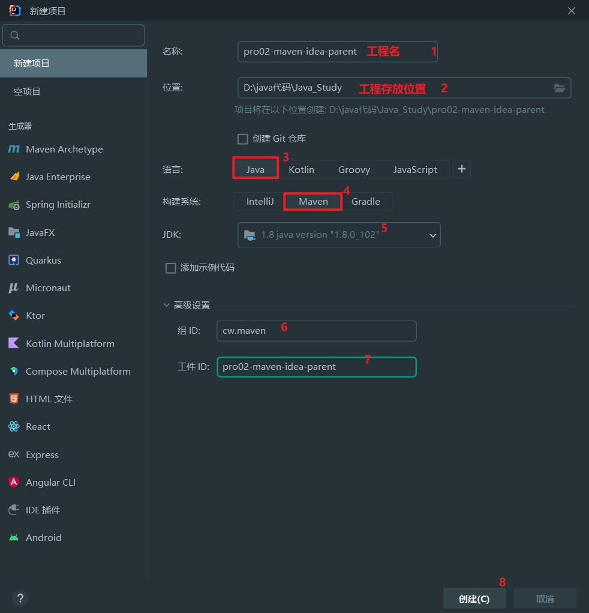
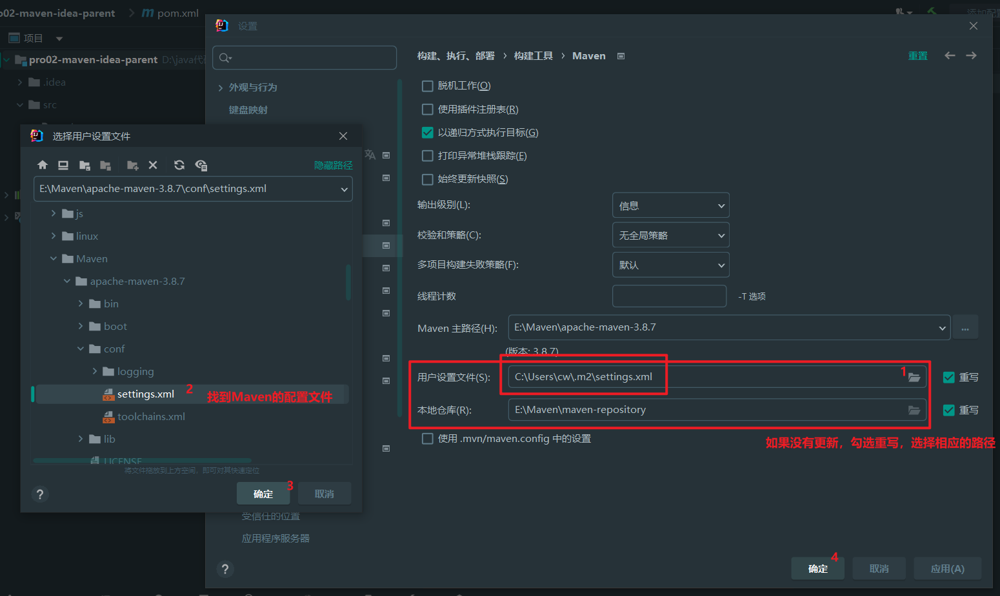
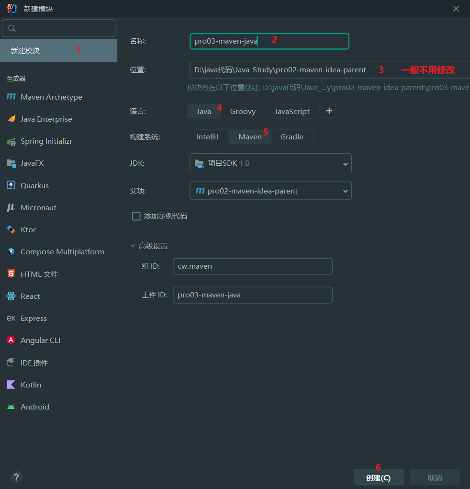
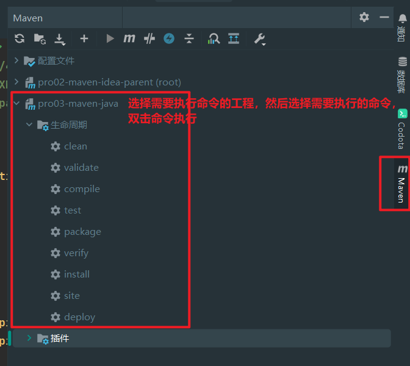

# 一、创建父工程

# 二、开启自动导入
````
创建 Project 后，IDEA 会自动弹出下面提示，我们选择『Enable Auto-Import』，意思是启用自动导入。

另外也可以通过 IDEA 的 Settings 设置来开启：
Settings -> Build, Execution, Deployment -> Build Tools -> Maven -> Importing -> 勾选Import Maven projects automatically
````
# 三、配置Maven信息
````
每次创建 Project 后都需要设置 Maven 家目录位置，否则 IDEA 将使用内置的 Maven 核心程序（不稳定）并使用默认的本地仓库位置。这样一来，我们在命令行操作过程中已下载好的 jar 包就白下载了，默认的本地仓库通常在 C 盘，还影响系统运行。
````

# 四、创建 Java 模块工程

# 五、执行Maven命令
* 1、方式一

* 2、方式二

* 3、方式二

# 六、创建 Web 模块工程
* 1、创建模块
````
new -> module
然后再创建一个Maven工程
````
* 2、修改打包方式
````
Web 模块将来打包当然应该是 war 包
<packaging>war</packaging>
````
* 3、Web 设定
````
File -> Project Structure -> ProjectSettings -> Facets -> ➕
````
* 4、借助IDEA生成web.xml
````
File -> Project Structure -> ProjectSettings -> Facets -> 选中Web -> 选中web.xml部署
````
* 5、设置 Web 资源的根目录
````
结合 Maven 的目录结构，Web 资源的根目录需要设置为 src/main/webapp 目录
````
# 七、工程导入
* 1、来自版本控制系统
````
目前我们通常使用的都是 Git（本地库） + 码云（远程库）的版本控制系统，结合 IDEA 的相关操作方式
http://heavy_code_industry.gitee.io/code_heavy_industry/pro008-Git/lecture/chapter05/verse03.html
查看克隆远程库部分。
````
* 2、来自工程目录
````
直接使用 IDEA 打开工程目录即可

1、工程压缩包
假设别人发给我们一个 Maven 工程的 zip 压缩包：maven-rest-demo.zip。从码云或GitHub上也可以以 ZIP 压缩格式对项目代码打包下载。

2、解压
如果你的所有 IDEA 工程有一个专门的目录来存放，而不是散落各处，那么首先我们就把 ZIP 包解压到这个指定目录中

3、打开
只要我们确认在解压目录下可以直接看到 pom.xml，那就能证明这个解压目录就是我们的工程目录。那么接下来让 IDEA 打开这个目录就可以了。

4、设置 Maven 核心程序位置
需要像新建 Maven 工程那样，指定一下 Maven 核心程序位置
````