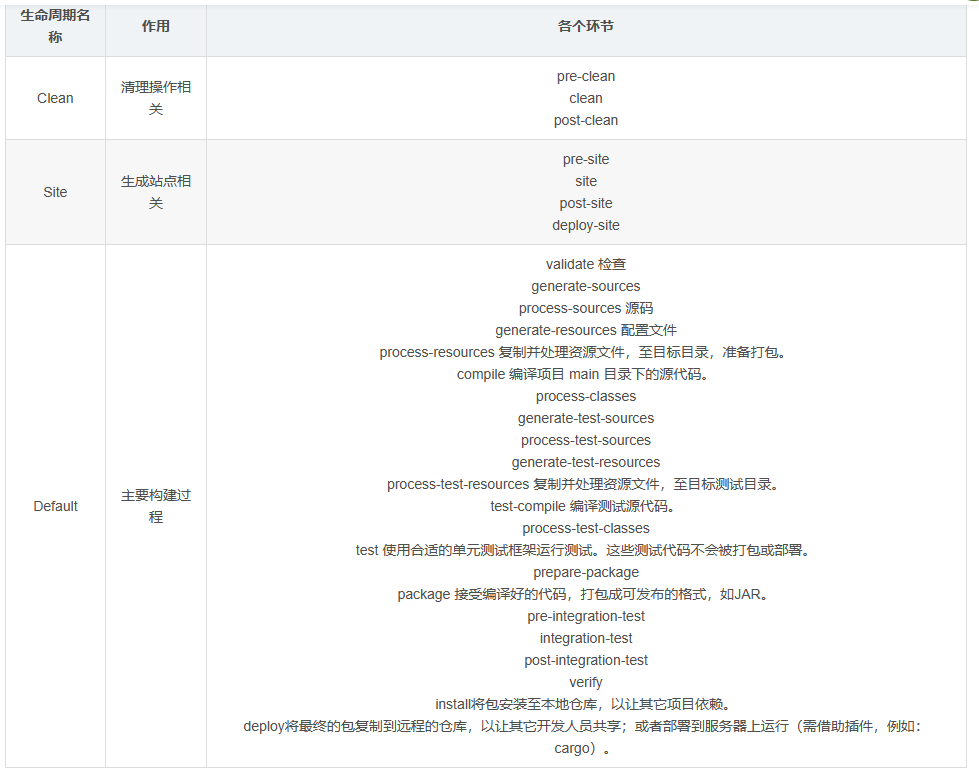

# 一、生命周期
* 1、作用
````
为了让构建过程自动化完成，Maven 设定了三个生命周期，生命周期中的每一个环节对应构建过程中的一个操作。
````
* 2、三个生命周期

* 3、特点
````
前面三个生命周期彼此是独立的。
在任何一个生命周期内部，执行任何一个具体环节的操作，都是从本周期最初的位置开始执行，直到指定的地方
````
# 二、插件和目标
* 1、插件
````
Maven 的核心程序仅仅负责宏观调度，不做具体工作。具体工作都是由 Maven 插件完成的。例如：编译就是由 maven-compiler-plugin-3.1.jar 插件来执行的。
````
* 2、目标
````
一个插件可以对应多个目标，而每一个目标都和生命周期中的某一个环节对应。 (目标其实是插件的功能)

Default 生命周期中有 compile 和 test-compile 两个和编译相关的环节，这两个环节对应 compile 和 test-compile 两个目标，而这两个目标都是由 maven-compiler-plugin-3.1.jar 插件来执行的。
````
# 三、仓库
````
本地仓库
远程仓库

建议：不要中央仓库和阿里云镜像混用，否则 jar 包来源不纯，彼此冲突。

专门搜索 Maven 依赖信息的网站：https://mvnrepository.com/
````