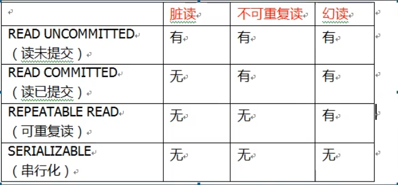

# 一、事务
````
事务是数据库操作最基本单元,一组操作同时成功或失败
四个特性:原子性、一致性、隔离性、持久性
````
# 二、事务步骤
* 1、开启事务
* 2、进行事务操作
* 3、如果没有发生异常,提交事务
* 4、如果出现异常,事务回滚
# 三、Spring事务管理
* 1、事务添加到JavaEE三层结构里面Service层(业务逻辑层)
* 2、Spring进行事务管理两种方式:编程式事务管理和声明式事务管理
* 3、声明式事务管理两种方式:基于注解方式、基于xml配置文件方式
* 4、在Spring进行声明式事务管理,底层使用AOP
* 5、Spring事务管理API:PlatformTransactionManager()
# 四、编程式事务
````
try {
    //第一步，开启事务
    
    //第二步，进行业务操作
    personDao.reduceMoney(); // lucy少100
    
    //可能出现异常
    int a = 1/0;
    
    personDao.addMoney(); // mary多100
    
    //第三步，没有发生异常，提交事务
    
} catch (Exception e) {
    //第四步，出现异常，事务回滚
}
````
# 五、Spring声明式事务注解实现
* 1、在Spring配置文件配置事务管理器
````
<!--创建事务管理器-->
<bean id="transactionManager" class="org.springframework.jdbc.datasource.DataSourceTransactionManager">
    <!--注入数据源-->
    <property name="dataSource" ref="dataSource"></property>
</bean>
````
* 2、在spring配置文件中，开启事务注解
````
<?xml version="1.0" encoding="UTF-8"?>
<beans xmlns="http://www.springframework.org/schema/beans"
       xmlns:xsi="http://www.w3.org/2001/XMLSchema-instance"
       xmlns:context="http://www.springframework.org/schema/context"
       xmlns:tx="http://www.springframework.org/schema/tx" 
       xsi:schemaLocation="http://www.springframework.org/schema/beans http://www.springframework.org/schema/beans/spring-beans.xsd
       http://www.springframework.org/schema/context https://www.springframework.org/schema/context/spring-context.xsd
       http://www.springframework.org/schema/tx https://www.springframework.org/schema/tx/spring-tx.xsd http://www.springframework.org/schema/aop">


<!--开启事务注解-->
<tx:annotation-driven transaction-manager="transactionManager"></tx:annotation-driven>
````
* 3、在service类上面添加事务注解
````
@Transactional，这个注解添加到类上面，也可以添加方法到方法上
如果把这个注解添加在类上，这个类所有的方法都添加事务
如果在方法上添加注解，只是给这个方法添加事务
````
# 六、声明式事务管理参数配置
* 1、事务传播行为(propagation)
````
当一个事务方法被另一个事务方法调用,就是事务的传播行为
1、REQUIRED
如果当前没有事务，就新建一个事务，如果已经存在一个事务中，加入到这个事务中。
2、REQUIRED_NEW
新建事务，如果当前存在事务，把当前事务挂起。
3、SUPPORTS
支持当前事务，如果当前没有事务，就以非事务方式执行。
````
* 2、事务隔离级别(ioslation)
````
事务有特性成为隔离性,多事务操作之间不会产生影响
* 1、三个读问题:
  * 脏读:一个未提交事务读取到另一个未提交事务的数据
  * 不可重复读:一个未提交事务读取到另一提交事务修改数据
  * 虚读:一个未提交事务读取到另一提交事务添加数据
* 2、设置事务隔离性

````
* 3、其他参数
* 1、timeout:超时时间,事务需要在一定时间内提交,如果不提交进行回滚
* 2、readOnly:是否只读
* 3、rollbackFor:回滚,设置哪些异常进行回滚
* 4、noRollbackFor:不回滚，设置哪些异常不进行回滚
# 七、Spring声明式事务XM配置文件实现
````
第一步，配置事务管理器
第二步，配置通知
第三步，配置切入点和切面

<!--1 创建事务管理器-->
<bean id="transactionManager" class="org.springframework.jdbc.datasource.DataSourceTransactionManager">
    <!--注入数据源-->
    <property name="dataSource" ref="dataSource"></property>
</bean>

<!--2 配置通知-->
<tx:advice id="txadvice">
    <!--配置事务参数-->
    <tx:attributes>
        <!--指定哪种规则的方法上面添加事务-->
        <tx:method name="accountMoney" propagation="REQUIRED"/>
    </tx:attributes>
</tx:advice>
<!--3 配置切入点和切面-->
<aop:config>
    <!--配置切入点-->
    <aop:pointcut id="pt" expression="execution(* com.jch.spring5.service.PersonService.*(..))"/>
    <!--配置切面-->
    <aop:advisor advice-ref="txadvice" pointcut-ref="pt"/>
</aop:config>
````
# 八、完全注解配置
````
@Configuration //配置类
@ComponentScan(basePackages = "com.company")  //组件扫描
@EnableTransactionManagement //开启事务
public class TxConfig {

    //创建数据库连接池
    @Bean
    public DruidDataSource getDruidDataSource() {
        DruidDataSource dataSource = new DruidDataSource();
        dataSource.setDriverClassName("com.mysql.jdbc.Driver");
        dataSource.setUrl("jdbc:mysql://localhost:3306/db4?useSSL=false&characterEncoding=utf-8");
        dataSource.setUsername("root");
        dataSource.setPassword("qwer`123");
        return dataSource;
    }

    //创建JdbcTemplate对象
    @Bean
    public JdbcTemplate getJdbcTemplate(DataSource dataSource) {
        //到ioc容器中根据类型找到dataSource
        JdbcTemplate jdbcTemplate = new JdbcTemplate();
        //注入dataSource
        jdbcTemplate.setDataSource(dataSource);
        return jdbcTemplate;
    }

    //创建事务管理器
    @Bean
    public DataSourceTransactionManager getDataSourceTransactionManager(DataSource dataSource) {
        DataSourceTransactionManager transactionManager = new DataSourceTransactionManager();
        transactionManager.setDataSource(dataSource);
        return transactionManager;
    }
}

````