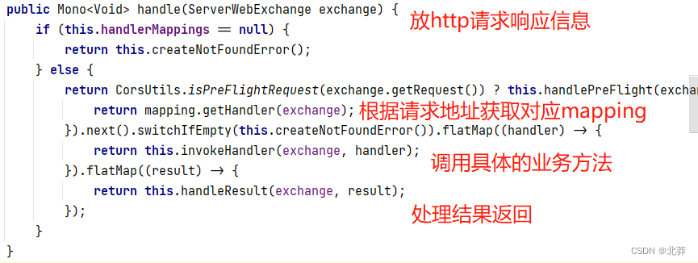

# 一、Webflux介绍
* 1、用于web开发,响应式编程的框架
* 2、是一种异步非阻塞的框架,核心是基于Reactor的相关API实现的
````
异步和同步:针对调用者。调用者发送请求,如果等对方回应之后才去做其他事就是同步;如果不等对方回应就去做其他事就是异步。
非阻塞和阻塞:针对被调用者。被调用者接收请求,做完请求任务之后给反馈就是阻塞;收到请求后马上给出反馈再去做请求任务就是非阻塞。
````
* 3、特点
````
非阻塞式:提高系统吞吐量和伸缩性,以Reactor为基础实现响应式编程
函数式编程:Spring5框架基于java8,Webflux使用java8函数式编程方式实现路由请求
````
* 4、与比较MVC
````
都可以Webflux使用注解,都可以运行在Tomcat容器
SpringMVC采用命令式编程,Webflux采用异步响应式编程
````
# 二、响应式编程
* 1、响应式编程是一种面向数据流和变化传播的编程范式。电子表格就是响应式编程的一个例子,单元格可以为公式"B1+C1",而包含公式的单元格的值会依据其他单元格的值变化而变化。
* 2、java8中提供了观察者模式的两个类Observer和Observable
````
ObserverDemo observer = new OnserverDemo();
observer.addObserver(lambda 表达式);
observer.addObserver(lambda 表达式);
observer.setChanged();//数据变化
observer.notifyObservers();//通知
````
````
public class ObserverDemo extends Observable {
    public static void main(String[] args) {
        ObserverDemo observer = new ObserverDemo();
        observer.addObserver((o, arg) -> {
            System.out.println("数据发送变化");
        });
        observer.addObserver((o, arg) -> {
            System.out.println("手动被观察者通知，准备变化");
        });
        observer.setChanged();  //数据变化
        observer.notifyObservers(); //通知
    }
}
````
# 三、响应式编程(Reactor实现)
* 1、响应式编程操作中,Reactor是满足Reactorive规范框架。
* 2、Reactor有两个核心类,Mono和Flux,这两个类都实现Publisher接口。Flux对象返回N个元素,Mono实现发布者返回0或者1个元素。
* 3、Flux和Mono都是数据流的发布者,使用Flux和Mono都可以发出三种数据信号:元素值、错误信号、完成信号,错误信号和完全信号都代表终止信号,终止信号用于告诉订阅者数据流结束了。
````
<dependency>
    <groupId>io.projectreactor</groupId>
    <artifactId>reactor-core</artifactId>
    <version>3.2.3.RELEASE</version>
</dependency>
````
````
public class TestReactor {
    public static void main(String[] args) {
        //just方法直接声明
        Flux.just(1,2,3,4);
        Mono.just(1);

        //其他方法
        Integer[] array = {1,2,3,4};
        Flux.fromArray(array);

        List<Integer> list = Arrays.asList(array);
        Flux.fromIterable(list);

        Stream<Integer> stream = list.stream();
        Flux.fromStream(stream);
    }
}
````
* 4、三种信号特点
````
错误信号和完成信号都是终止信号,不能共存
如果没有发送任何元素值,而是直接发送终止信号,表示是空的数据流
如果没有终止信号,表示是无限流
````
* 5、声明数据流后,只有进行订阅之后才会触发数据流,不订阅什么都不会发生
* 6、对数据流进行一道道操作,称为操作符,比如工厂流水线
# 四、SpringWebflux执行流程和核心API
* 1、SpringWebflux基于Reactor,默认容器时Netty,Netty是高性能的NIO框架,异步非阻塞的框架。
* 2、SpringWebflux执行过程和SpringMVC相似
````
SpringWebflux核心控制器DispatcherHandler，实现接口WebHandler，接口WebHandler的实现类: DispatcherHandler有一个方法 Mono<Void> handle(ServerWebExchange exchange);
````

* 3、SpringWebflux里面DispatcherHandler:负责请求的处理
````
HandlerMapping:请求和处理映射
HandlerAdapter:真正负责请求处理
HandlerResultHandler:响应结果处理
````
* 4、SpringWebflux（基于注解编程）
````
第一步，引入依赖
<dependency>
    <groupId>org.springframework.boot</groupId>
    <artifactId>spring-boot-starter-webflux</artifactId>
</dependency>

第二步，创建包和实体类
public class User {
  private String name;
  private String gender;
  private Integer age;
}

第三步，编写service接口和实现接口
//用户操作接口
public interface UserService {
    //根据id查询用户
    Mono<User> getUserById(int id);
    
    //查询所有用户
    Flux<User> getAllUser();
    
    //添加用户
    Mono<Void> saveUserInfo(Mono<User> user);
}
@Repository
public class UserServiceImpl implements UserService{

    //创建map集合存储数据
    private final Map<Integer,User> users = new HashMap<>();

    public UserServiceImpl() {
        this.users.put(1, new User("lucy", "nan", 20));
        this.users.put(2, new User("mary", "nv", 30));
        this.users.put(3, new User("jack", "nv", 50));
    }
    //根据id查询
    @Override
    public Mono<User> getUserById(int id) {
        return Mono.justOrEmpty(this.users.get(id));
    }
    //查询多个用户
    @Override
    public Flux<User> getAllUser() {
        return Flux.fromIterable(this.users.values());
    }
    //添加用户
    @Override
    public Mono<Void> saveUserInfo(Mono<User> user) {
        return user.doOnNext(person -> {
            //向集合里面放值
            int id = users.size() + 1;
            users.put(id, person);
        }).thenEmpty(Mono.empty());
    }
}

第四步，编写controller
@RestController
public class UserController {
    @Autowired
    private UserService userService;

    //id查询
    @GetMapping("/user/{id}")
    public Mono<User> getUserId(@PathVariable int id) {
        return userService.getUserById(id);
    }
    //查询所有
    @GetMapping("/user")
    public Flux<User> getUsers() {
        return userService.getAllUser();
    }
    //添加
    @PostMapping("/saveUser")
    public Mono<Void> saveUser(@RequestBody User user) {
        Mono<User> userMono = Mono.just(user);
        return userService.saveUserInfo(userMono);
    }
}
````
````
说明：
SpringMVC：同步阻塞的方式，基于SpringMVC+Servlet+Tomcat
SpringWebflux：异步非阻塞方式，基于SpringWebflux+Reactor+Netty
````
* 5、SpringWebflux（基于函数式编程）
````
1、SpringWebflux（基于函数式编程）
2、有两个核心接口：RouterFunction（实现路由功能，请求转发给对应的handler）和HandlerFunction（处理请求生成响应的函数）。核心任务定义两个函数式接口的实现并且启动需要的服务器。
3、SpringWebflux请求和响应不再是ServletRequest和ServletResponse，而是ServerRequest和ServerResponse。
````
````
第一步，创建Handler（具体实现方法）
public class UserHandler {
    private final UserService userService;

    public UserHandler(UserService userService) {
        this.userService = userService;
    }

    //根据id查询
    public Mono<ServerResponse> getUserById(ServerRequest request) {
        //获取id值
        int userId = Integer.valueOf(request.pathVariable("id"));
        //空值处理
        Mono<ServerResponse> notFound = ServerResponse.notFound().build();
        //调用service方法得到数据
        Mono<User> userMono = this.userService.getUserById(userId);
        //把userMono转换成流返回
        //使用Reactor操作符flatMap
        return userMono.flatMap(person -> ServerResponse.ok().contentType(MediaType.APPLICATION_JSON)
                                .body(fromObject(person)))
                                .switchIfEmpty(notFound);
    }

    //查询所有
    public Mono<ServerResponse> getAllUsers() {
        //调用service得到结果
        Flux<User> users = this.userService.getAllUser();
        return ServerResponse.ok().contentType(MediaType.APPLICATION_JSON).body(users,User.class);
    }

    //添加
    public Mono<ServerResponse> saveUser(ServerRequest request) {
        //得到user对象
        Mono<User> userMono = request.bodyToMono(User.class);
        return ServerResponse.ok().build(this.userService.saveUserInfo(userMono));
    }
}

第二步，初始化服务器，编写Router，创建适配完成服务，完成最终调用
public class Server {

    public static void main(String[] args) throws Exception {
        Server server = new Server();
        //调用
        server.createReactorServer();
        System.out.println("enter to exit");
        System.in.read();
    }

    //1、创建Router路由
    public RouterFunction<ServerResponse> routingFunction() {
        UserService userService = new UserServiceImpl();
        UserHandler handler = new UserHandler(userService);
        return RouterFunctions.route(
                GET("/users/{id}").and(accept(APPLICATION_JSON)), handler::getUserById)
                .andRoute(GET("/users").and(accept(APPLICATION_JSON)), handler::getAllUsers);

    }

    //2、创建服务器完成适配
    public void createReactorServer() {
        //路由和handler适配
        RouterFunction<ServerResponse> route = routingFunction();
        HttpHandler httpHandler = toHttpHandler(route);
        ReactorHttpHandlerAdapter adapter = new ReactorHttpHandlerAdapter(httpHandler);
        //创建服务器
        HttpServer httpServer = HttpServer.create();
        httpServer.handle(adapter).bindNow();
    }
}
public class Client {
    public static void main(String[] args) {
        //调用服务器地址
        WebClient webClient = WebClient.create("http://127.0.0.1:5794");
        //根据id查询
        String id = "1";
        User userResult = webClient.get().uri("/users/{id}", id)
                .accept(MediaType.APPLICATION_JSON).retrieve().bodyToMono(User.class)
                .block();
        System.out.println(userResult.getName());
        
        //查询所有
        Flux<User> results = webClient.get().uri("/users")
                .accept(MediaType.APPLICATION_JSON).retrieve().bodyToFlux(User.class);
        results.map(stu -> stu.getName())
                    .buffer().doOnNext(System.out::println);
    }
}
````