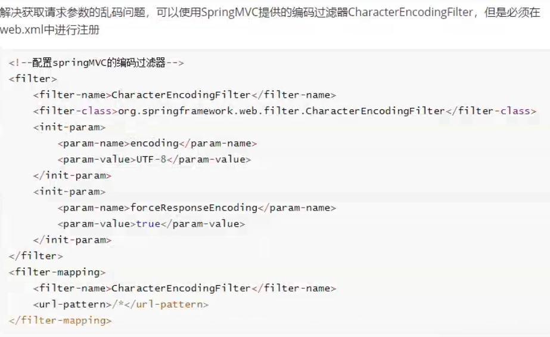

# 一、SpringMVC获取请求参数
* 1、通过servletAPI获取
````
@RequestMapping("/testParam")
//形参位置的request表示当前请求
public String testParam(HttpServletRequest request){
    String username = request.getParameter("username");
    String password = request.getParameter("password");
}
````
* 2、通过控制器方法的形参获取请求参数
````
<a th:href="@{/testParam(username='admin',password=123456)}">测试获取请求参数-->/testParam</a><br>

@RequestMapping("/testParam")
public String testParam(String username, String password){
    System.out.println("username:"+username+",password:"+password);
    return "success";
}

注:
在控制器方法的形参位置,设置和请求参数同名的形参,当浏览器发送请求时,在DispatcherServlet中就会将请求参数赋值给相应的形参
````
* 3、@RequestParam
````
@RequestParam将请求参数和控制器方法的形参创建映射关系
@RequestParam一共有三个参数
1、value：指定为形参赋值的请求参数的参数名
2、required：设置是否必须传输此请求参数，默认值为true
若设置为true时，则当前请求必须传输value所指定的请求参数，若没有传输该请求参数，且没有设置defaultValue属性，则页面报错400：Required String parameter ‘xxx’ is not present；若设置为false，则当前请求不是必须传输value所指定的请求参数，若没有传输，则注解所标识的形参的值为null
3、defaultValue：不管required属性值为true或false，当value所指定的请求参数没有传输或传输的值为""时，则使用默认值为形参赋值
````
* 4、@RequestHeader
````
@RequestHeader将请求头信息和控制器方法的形参创建映射关系
@RequestHeader注解一共有三个属性:value、required、defaultValue。用法同@RequestParam。
````
* 5、@CookieValue
````
@CookieValue将cookie数据和控制器方法的形参创建映射关系
@CookieValue注解一共有三个属性:value、required、defaultValue。用法同@RequestParam。
````
* 6、通过POJO获取请求参数
````
可以在控制器方法的形参位置设置一个实体类类型的形参,此时若浏览器传输的请求参数的参数名和实体类中的属性名一致,那么请求参数就会为次属性赋值。
````
* 7、获取请求参数乱码

