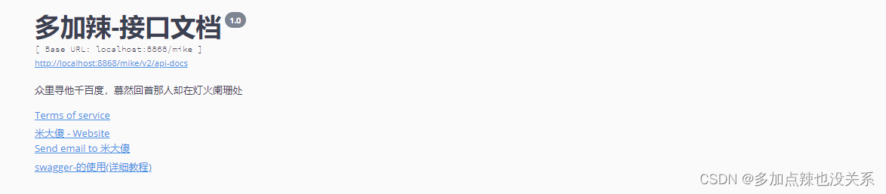
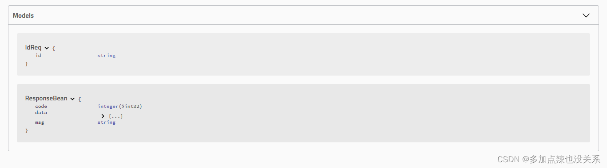
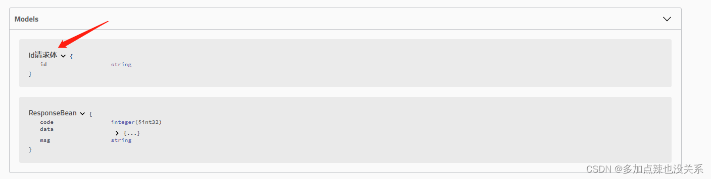
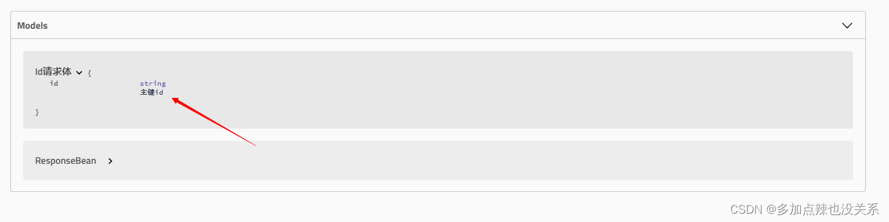
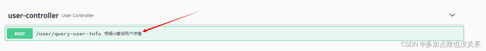
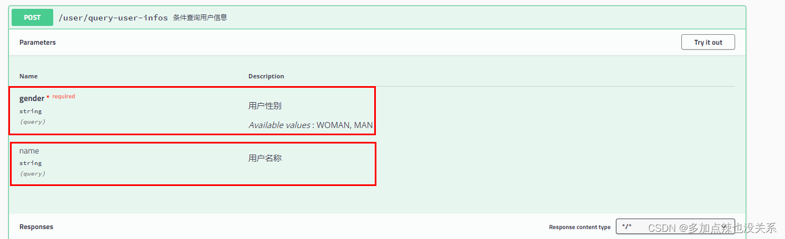

# 一、导入相关依赖
````
<!-- swagger -->
<dependency>
    <groupId>io.springfox</groupId>
    <artifactId>springfox-spring-web</artifactId>
    <version>2.9.2</version>
</dependency>
<dependency>
    <groupId>io.springfox</groupId>
    <artifactId>springfox-swagger2</artifactId>
    <version>2.9.2</version>
</dependency>
<dependency>
    <groupId>io.springfox</groupId>
    <artifactId>springfox-swagger-ui</artifactId>
    <version>2.9.2</version>
</dependency>
````
# 二、编写配置文件
````
在配置文件 config 目录下，添加 swagger 的配置文件 SwaggerConfig.java

@Configuration // 配置类
@EnableSwagger2 // 开启 swagger2 的自动配置
public class SwaggerConfig {
}

这个时候 Swagger 已经算是整合到项目之中了，可以启动下服务，输入：http://localhost:8080/swagger-ui.html# （这里我的项目端口是 8868 ，项目路径是 /mike，所以我打开的文档地址为 http://localhost:8868/mike/swagger-ui.html# ）即可查看 swagger 文档。
````
* 1、配置基本信息
````
    @Bean
    public Docket docket() {
        // 创建一个 swagger 的 bean 实例
        return new Docket(DocumentationType.SWAGGER_2)
                // 配置基本信息
                .apiInfo(apiInfo())
                ;
    }

    // 基本信息设置
    private ApiInfo apiInfo() {
        Contact contact = new Contact(
                "米大傻", // 作者姓名
                "https://blog.csdn.net/xhmico?type=blog", // 作者网址
                "777777777@163.com"); // 作者邮箱
        return new ApiInfoBuilder()
                .title("多加辣-接口文档") // 标题
                .description("众里寻他千百度，慕然回首那人却在灯火阑珊处") // 描述
                .termsOfServiceUrl("https://www.baidu.com") // 跳转连接
                .version("1.0") // 版本
                .license("Swagger-的使用(详细教程)")
                .licenseUrl("https://blog.csdn.net/xhmico/article/details/125353535")
                .contact(contact)
                .build();
    }
````

* 2、配置接口信息
````
    @Bean
    public Docket docket() {
        // 创建一个 swagger 的 bean 实例
        return new Docket(DocumentationType.SWAGGER_2)

                // 配置接口信息
                .select() // 设置扫描接口
                // 配置如何扫描接口
                .apis(RequestHandlerSelectors
                        //.any() // 扫描全部的接口，默认
                        //.none() // 全部不扫描
                        .basePackage("com.duojiala.mikeboot.controller") // 扫描指定包下的接口，最为常用
                        //.withClassAnnotation(RestController.class) // 扫描带有指定注解的类下所有接口
                        //.withMethodAnnotation(PostMapping.class) // 扫描带有只当注解的方法接口

                )
                .paths(PathSelectors
                        .any() // 满足条件的路径，该断言总为true
                        //.none() // 不满足条件的路径，该断言总为false（可用于生成环境屏蔽 swagger）
                        //.ant("/user/**") // 满足字符串表达式路径
                        //.regex("") // 符合正则的路径
                )
                .build();
    }
````
* 3、配置分组信息
````
/**
    * 展示 controller 包下所有的接口
    */
@Bean
public Docket docket1() {
    // 创建一个 swagger 的 bean 实例
    return new Docket(DocumentationType.SWAGGER_2)
            .groupName("mike") // 修改组名为 "mike"
            // 配置接口信息
            .select() // 设置扫描接口
            // 配置如何扫描接口
            .apis(RequestHandlerSelectors
                    .basePackage("com.duojiala.mikeboot.controller") // 扫描指定包下的接口，最为常用
            )
            .paths(PathSelectors
                        .any() // 满足条件的路径，该断言总为true
            )
            .build();
}

/**
    * 展示路径为 /error 的所有接口（基础接口）
    */
@Bean
public Docket docket2() {
    // 创建一个 swagger 的 bean 实例
    return new Docket(DocumentationType.SWAGGER_2)
            .groupName("yank") // 修改组名为 "yank"
            // 配置接口信息
            .select() // 设置扫描接口
            // 配置如何扫描接口
            .apis(RequestHandlerSelectors
                    .any() // 扫描全部的接口，默认
            )
            .paths(PathSelectors
                    .ant("/error") // 满足字符串表达式路径
            )
            .build();
}
````
# 三、控制 Swagger 的开启
````
在开发或者测试环境下，我们开启 swagger 会方便前端和后端的交互，但是如果在生产环境下也开启 swagger 的话，是会将接口暴露出去的，有极大风险，如何让 swagger 根据不同的环境来决定是否开启？

这里我准备了四个项目的配置文件，dev、test、pro 三个环境的配置文件仅是端口上的不同
application.yml -------------------------- 全局配置文件
application-dev.yml -------------------- 开发环境配置文件
application-test.yml -------------------- 测试环境配置文件
application-pro.yml -------------------- 生产环境配置文件
````
````
application.yml 内容如下，用于指定选择的环境：
spring:
  profiles:
    active: dev
````
````
可以通过代码判断此时是在什么环境：dev、test、pro，如果是在 pro 生产环境，则关闭 swagger。

/**
    * swagger 配置
    * @param environment 环境
    */
@Bean
public Docket docket(Environment environment) {

    // 设置环境范围
    Profiles profiles = Profiles.of("dev","test");
    // 如果在该环境返回内则返回：true，反之返回 false
    boolean flag = environment.acceptsProfiles(profiles);

    // 创建一个 swagger 的 bean 实例
    return new Docket(DocumentationType.SWAGGER_2)
            .enable(flag) // 是否开启 swagger：true -> 开启，false -> 关闭
            ;
}
````
# 四、常用注解使用
````
Swagger 会将接口请求或者相应的实体类信息展示在 Models 下的，比如我 UserController.java 下有一个接口如下所示

@PostMapping(value = "/query-user-info")
public ResponseBean queryUserInfo(@RequestBody @Validated IdReq req) {
    return ResponseBean.success(userService.queryUserInfo(req));
}

它的请求体是 IdReq，响应是 ResponseBean，Models 展示这两个实体类信息如下：
````

* 1、@ApiModel
````
该注解是作用于类上面的，是用来描述类的一些基本信息的。

相关属性：
1、value：提供类的一个备用名，如果不设置，默认情况下将使用 class 类的名称
2、description：对于类，提供一个详细的描述信息
3、parent：这个属性用于描述的是类的一些父类信息
4、discriminator：这个属性解释起来比较麻烦，因为这个类主要体现在断言当中
5、subTypes：可以通过这个属性，指定我们想要使用的子类

例:给 IdReq 这个类添加该注解

@Data
@NoArgsConstructor
@AllArgsConstructor
@ApiModel(value = "Id请求体")
public class IdReq {
    private String id;
}
````

* 2、@ApiModelProperty
````
它的作用是添加和操作属性模块的数据

例:IdReq 为该类的属性添加说明
@Data
@NoArgsConstructor
@AllArgsConstructor
@ApiModel(value = "Id请求体")
public class IdReq {
    @ApiModelProperty("主键id")
    private String id;
}
````

* 3、@ApiOperation
````
该注解用来对某个方法/接口进行描述

以 UserController 下的接口为例
@PostMapping(value = "/query-user-info")
@ApiOperation(value = "根据id查询用户详情")
public ResponseBean queryUserInfo(@RequestBody @Validated IdReq req) {
    return ResponseBean.success(userService.queryUserInfo(req));
}
````

* 4、@ApiParam
````
该注解使用在方法上或者参数上，字段说明，表示对参数的添加元数据（说明或者是否必填等）
相关属性：
1、name：参数名
2、value：参数说明
3、required：是否必填

以 UserController 下的接口为例
@PostMapping(value = "/query-user-infos")
@ApiOperation(value = "条件查询用户信息")
public ResponseBean queryUserInfos(
        // name 用户名称 不必填
        @ApiParam(value = "用户名称", required = false) @RequestParam(required = false) String name,
        // gender 用户性别 必填
        @ApiParam(value = "用户性别", required = true) @RequestParam(required = true) GenderEnum gender) {
    return ResponseBean.success(userService.queryUserInfos(name,gender));
}
````

# 五、接口调用
````
Try it out -> 填入参数 -> Execute
````
# 六、请求头
* 1、添加请求头
````
@Bean
public Docket docket() {
    // 设置请求头
    List<Parameter> parameters = new ArrayList<>();
    parameters.add(new ParameterBuilder()
            .name("token") // 字段名
            .description("token") // 描述
            .modelRef(new ModelRef("string")) // 数据类型
            .parameterType("header") // 参数类型
            .defaultValue("default value") // 默认值：可自己设置
            .hidden(true) // 是否隐藏
            .required(false) // 是否必须
            .build());

    // 创建一个 swagger 的 bean 实例
    return new Docket(DocumentationType.SWAGGER_2)
            .groupName("mike") // 修改组名为 "mike"
            // 配置接口信息
            .select() // 设置扫描接口
            // 配置如何扫描接口
            .apis(RequestHandlerSelectors
                    .basePackage("com.duojiala.mikeboot.controller") // 扫描指定包下的接口，最为常用
            )
            .paths(PathSelectors
                    .any() // 满足条件的路径，该断言总为true
            )
            .build()

            // 添加请求头参数
            .globalOperationParameters(parameters);
}
````
* 2、例子
````
@GetMapping(value = "/get-token")
@ApiOperation(value = "获取请求头中的token信息")
public void getToken(
        @RequestHeader(value = "token",required = false) String token
) {
    // 直接获取 token 信息
    System.out.println("token = " + token);

    // 通过代码获取
    ServletRequestAttributes servletRequestAttributes = (ServletRequestAttributes) RequestContextHolder.getRequestAttributes();
    if (servletRequestAttributes != null) {
        HttpServletRequest request = servletRequestAttributes.getRequest();
        String header = request.getHeader("token");
        System.err.println("header = " + header);
    }
}
````
